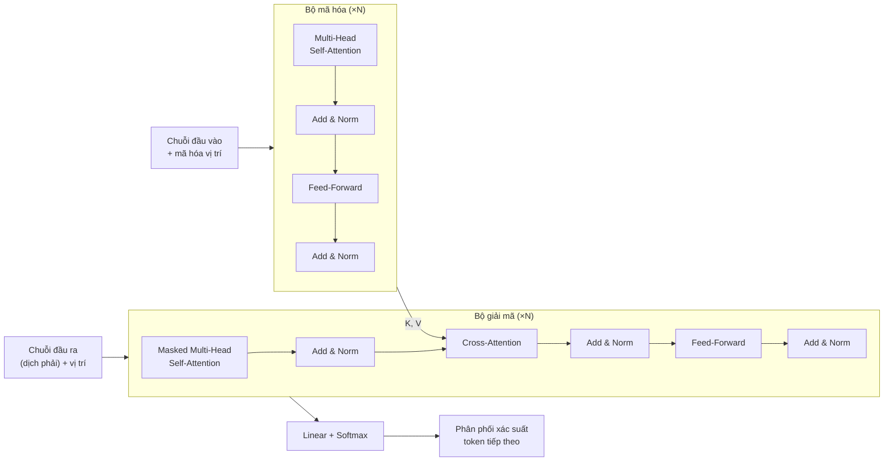
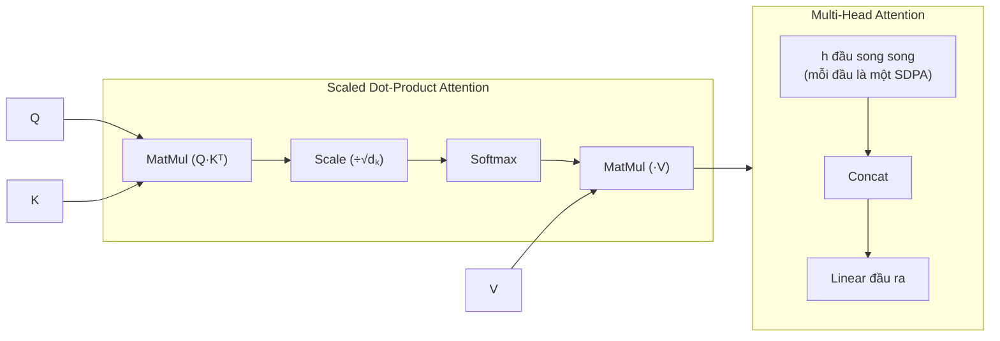
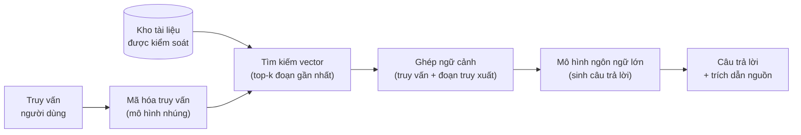
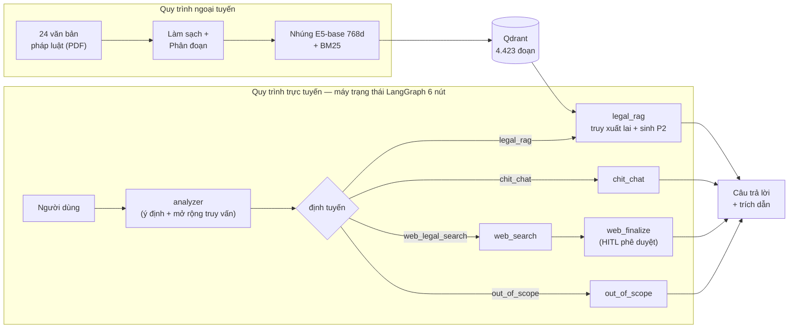

# CHƯƠNG 1. TỔNG QUAN VÀ CƠ SỞ LÝ THUYẾT

## 1.1 Giới thiệu chương

Pháp luật giao thông đường bộ là lĩnh vực pháp lý gần gũi và thiết thực với hầu hết người dân Việt Nam, song cũng là lĩnh vực đòi hỏi tra cứu chính xác đến từng điều khoản khi phát sinh vi phạm. Chương này xây dựng nền tảng lý thuyết và định vị vấn đề nghiên cứu cho toàn bộ đề tài thông qua sáu nội dung chính: xác định bối cảnh và động lực nghiên cứu (mục 1.2); làm rõ mục tiêu, phạm vi và đóng góp (mục 1.3); hệ thống hoá mười hai cơ sở lý thuyết cần thiết cho thiết kế hệ thống (mục 1.4); tổng quan các công trình liên quan trong và ngoài nước (mục 1.5); tổng quan hệ thống Traffic-RAG đề xuất (mục 1.6); và kết luận chương (mục 1.7).

---

## 1.2 Đặt vấn đề và động lực nghiên cứu

Hệ thống pháp luật giao thông đường bộ Việt Nam vừa trải qua đợt cải cách lập pháp quan trọng nhất trong nhiều năm gần đây: năm 2024–2025, hàng loạt văn bản pháp quy mới có hiệu lực gần như đồng thời, bao gồm Luật Trật tự, an toàn giao thông đường bộ (Luật số 36/2024/QH15), Luật Đường bộ (Luật số 35/2024/QH15), đặc biệt là Nghị định 168/2024/NĐ-CP quy định xử phạt vi phạm hành chính với mức phạt tăng mạnh cùng cơ chế trừ điểm giấy phép lái xe hoàn toàn mới. Sự thay đổi đồng loạt này tạo ra thách thức lớn cho người tham gia giao thông, cán bộ thực thi pháp luật và các đơn vị tư vấn pháp lý.

Bài toán đặt ra là: xây dựng một hệ thống trợ lý trí tuệ nhân tạo có khả năng trả lời câu hỏi về pháp luật giao thông đường bộ Việt Nam với độ chính xác pháp lý cao, căn cứ trực tiếp vào văn bản gốc và có khả năng trích dẫn đến cấp điểm/khoản/điều của từng nghị định, thông tư, luật liên quan.

Các giải pháp tra cứu hiện tại đều có hạn chế rõ ràng. Cổng thông tin pháp luật chính thức yêu cầu người dùng tự biết tên văn bản và số điều cần tra, không hỗ trợ câu hỏi dạng ngôn ngữ tự nhiên. Các mô hình ngôn ngữ lớn (MNNL) thương mại không được cập nhật với corpus pháp luật 2024–2026 và có xu hướng sinh ra câu trả lời có vẻ tự tin nhưng trích dẫn sai nguồn hoặc nhầm mức phạt — hiện tượng được gọi là ảo giác (hallucination) [10]. Đây là nguy cơ nghiêm trọng đặc biệt trong lĩnh vực pháp lý.

Sự xuất hiện của kỹ thuật Sinh văn bản tăng cường truy xuất (SVTCTR) mở ra hướng giải quyết: thay vì để MNNL ghi nhớ tất cả kiến thức vào tham số, hệ thống SVTCTR truy xuất các đoạn văn bản liên quan từ kho tài liệu được kiểm soát rồi đưa vào ngữ cảnh trước khi sinh câu trả lời. Cách tiếp cận này cho phép kiểm soát nguồn trích dẫn, hạn chế ảo giác và cập nhật tài liệu mà không cần huấn luyện lại mô hình. Tuy nhiên, áp dụng SVTCTR cho văn bản pháp luật Việt Nam đặt ra những thách thức đặc thù: cấu trúc phân cấp chặt chẽ Điều→Khoản→Điểm đòi hỏi chiến lược phân đoạn phù hợp; truy vấn ngắn hoặc mơ hồ cần được mở rộng ngữ nghĩa; và câu hỏi đa ý định yêu cầu tổng hợp thông tin từ nhiều điều khoản đồng thời.

Đề tài này đề xuất và xây dựng **Traffic-RAG** — một hệ thống hỏi đáp pháp luật giao thông Việt Nam dựa trên kiến trúc SVTCTR hướng tác tử kết hợp LangGraph, với quy trình phân đoạn đặc thù cho văn bản pháp luật, truy xuất lai kết hợp biểu diễn dày đặc và thưa, và vòng phản hồi con người trong vòng lặp (CNTVL) cho trường hợp cần tra cứu web. Toàn bộ quyết định thiết kế được xác lập qua mười thực nghiệm đối chứng có kiểm soát trên bộ đánh giá 40 câu hỏi thuộc 8 danh mục thực tiễn.

---

## 1.3 Mục tiêu, phạm vi và đóng góp của đề tài

### 1.3.1 Mục tiêu

Đề tài đặt ra các mục tiêu cụ thể sau:

1. Xây dựng hệ thống hỏi đáp tự động bằng tiếng Việt cho lĩnh vực pháp luật giao thông đường bộ, trả lời đúng theo văn bản gốc với trích dẫn chính xác tới cấp điểm/khoản/điều.
2. Thiết kế quy trình tiếp nhận và phân đoạn văn bản phù hợp với cấu trúc phân cấp đặc thù của văn bản pháp luật Việt Nam.
3. Xây dựng và đánh giá quy trình truy xuất lai kết hợp truy xuất dày đặc và thưa với các kỹ thuật bổ trợ gồm mở rộng truy vấn, làm giàu ngữ cảnh lân cận và giải tham chiếu chéo.
4. Triển khai kiến trúc luồng công việc hướng tác tử với định tuyến đa ý định (hỏi đáp pháp luật, hội thoại thông thường, tra cứu web, ngoài phạm vi) và cơ chế con người trong vòng lặp.
5. Đánh giá định lượng toàn diện theo mười thực nghiệm đối chứng bao gồm chất lượng truy xuất, độ chính xác trích dẫn, chất lượng câu trả lời, chi phí và hiệu năng vận hành.

### 1.3.2 Phạm vi

**Kho dữ liệu:** 24 văn bản pháp luật còn hiệu lực tính đến tháng 6 năm 2026, bao gồm 2 luật, 5 nghị định và 17 thông tư thuộc lĩnh vực đường bộ Việt Nam (xem Bảng 1.1).

**Ngôn ngữ:** Tiếng Việt (câu hỏi và văn bản pháp luật).

**Nền tảng:** Hệ thống chạy cục bộ với khả năng triển khai đám mây lai, không yêu cầu GPU cho quy trình vận hành (trừ tùy chọn xếp hạng lại).

**Ngoài phạm vi:** Pháp luật đường thủy, hàng không, đường sắt độc lập; tư vấn pháp lý cá nhân hóa; xử lý phụ lục mẫu biểu.

**Bảng 1.1. Kho dữ liệu văn bản pháp luật hệ thống Traffic-RAG**

| Nhóm | Số văn bản | Đại diện tiêu biểu |
|---|---:|---|
| Luật | 2 | Luật Đường bộ 35/2024, Luật TTATGT Đường bộ 36/2024 |
| Nghị định | 5 | NĐ 168/2024 (xử phạt), NĐ 10/2020 (kinh doanh vận tải), NĐ 81/2026 (đường sắt), NĐ 336/2025 |
| Thông tư | 17 | Nhóm bằng lái, đăng ký xe, khí thải an toàn, tuần tra kiểm soát |

### 1.3.3 Đóng góp

Đề tài có các đóng góp sau:

- **Bộ phân đoạn phân cấp pháp luật v6:** Thuật toán 3 cấp Điều→Khoản→Điểm với ngưỡng động và cơ chế bổ sung ngữ cảnh Khoản vào đoạn Điểm, giải quyết vấn đề 77,5% điểm pháp lý không có đoạn độc lập trong phiên bản trước (Recall trích dẫn tăng 2,4 lần so với phân đoạn cố định).
- **Quy trình truy xuất lai với giải tham chiếu chéo:** Kết hợp truy xuất dày đặc E5-base (768 chiều) và truy xuất thưa BM25 qua tổng hợp xếp hạng nghịch đảo, sibling enrichment ±2 khoản và regex cross-reference, tăng Recall@10 từ 0,200 (phân đoạn cố định cơ sở) lên 0,581 (sau mở rộng truy vấn).
- **Luồng công việc hướng tác tử LangGraph với con người trong vòng lặp:** Máy trạng thái 6 nút định tuyến đa ý định với cơ chế tạm dừng đồ thị cho trường hợp cần tra cứu web và phê duyệt của quản trị viên.
- **Bộ đánh giá 40 câu hỏi 8 danh mục:** Bao gồm câu đơn giản, đa ý định, tham chiếu chéo, thủ tục, ngoài phạm vi, mơ hồ ngắn, hành động kép và phân biệt loại phương tiện.
- **Phân tích định lượng mười thực nghiệm đối chứng:** Đưa ra bằng chứng thực nghiệm cho từng quyết định thiết kế với số liệu trên bộ đánh giá chuẩn.

---

## 1.4 Cơ sở lý thuyết

### 1.4.1 Kiến trúc Transformer

Transformer, được giới thiệu bởi Vaswani và cộng sự năm 2017 [1], là nền tảng của hầu hết các mô hình ngôn ngữ hiện đại. Kiến trúc gồm hai thành phần chính: bộ mã hóa xử lý chuỗi đầu vào và bộ giải mã sinh chuỗi đầu ra, kết nối qua cơ chế attention chéo. Cốt lõi là cơ chế **chú ý tự chiếu đa đầu (Multi-Head Self-Attention)**, cho phép mỗi token trong chuỗi chú ý đồng thời đến tất cả token khác với trọng số học được:

$$\text{Attention}(Q, K, V) = \text{softmax}\!\left(\frac{QK^\top}{\sqrt{d_k}}\right)V$$

trong đó $Q$, $K$, $V$ là ma trận truy vấn, khóa và giá trị được chiếu tuyến tính từ chuỗi đầu vào; $d_k$ là chiều của vector khóa dùng để ổn định gradient. Nhiều đầu attention song song cho phép mô hình nắm bắt các mối quan hệ ngữ nghĩa ở các không gian biểu diễn khác nhau.

*Hình 1.1. Kiến trúc tổng quát mô hình Transformer gồm bộ mã hóa (trái) và bộ giải mã (phải), vẽ lại theo Vaswani và cộng sự [1].*

*Hình 1.2. Cơ chế Scaled Dot-Product Attention (trái) và Multi-Head Attention với h đầu chạy song song (phải), vẽ lại theo Vaswani và cộng sự [1].*

Transformer loại bỏ hồi quy của mạng thần kinh hồi quy, cho phép song song hóa hoàn toàn trong huấn luyện. Kết hợp với mã hóa vị trí và lớp feed-forward theo từng vị trí, kiến trúc này trở thành nền tảng cho BERT [4], GPT, RoBERTa, XLM-RoBERTa — các mô hình nền tảng phổ biến cho cả mô hình nhúng và mô hình sinh văn bản.

### 1.4.2 Mô hình ngôn ngữ lớn và học tăng cường từ phản hồi con người

Mô hình ngôn ngữ lớn (MNNL) là các mô hình Transformer quy mô hàng tỷ tham số được huấn luyện trước trên kho văn bản khổng lồ theo mục tiêu dự đoán token tiếp theo hoặc điền token bị che. Sau giai đoạn huấn luyện trước, MNNL được tinh chỉnh để tuân theo hướng dẫn qua hai kỹ thuật chính:

**Tinh chỉnh có giám sát (TCC):** Huấn luyện trên tập dữ liệu cặp (hướng dẫn, phản hồi) do con người tạo hoặc tổng hợp, giúp mô hình học định dạng và phong cách trả lời phù hợp.

**Học tăng cường từ phản hồi con người (HTTCN):** Tín hiệu thưởng đến từ mô hình phần thưởng được học từ xếp hạng của con người giữa các câu trả lời [7]. Thuật toán Proximal Policy Optimization cập nhật chính sách MNNL tối đa hóa phần thưởng kỳ vọng trong khi giữ phân phối đầu ra không quá khác biệt so với mô hình TCC ban đầu (chuẩn hóa KL). Kỹ thuật này giúp mô hình hữu ích, vô hại và trung thực hơn.

Trong hệ thống Traffic-RAG, **Gemini 3.1 Flash Lite Preview** đóng vai trò MNNL chính cho cả phân tích ý định và sinh câu trả lời, trong khi **GPT-4o-mini** được dùng làm mô hình phán xét cho đánh giá RAGAS.

### 1.4.3 Mô hình nhúng văn bản đa ngôn ngữ

Mô hình nhúng (embedding) ánh xạ văn bản vào không gian vector chiều cao sao cho các văn bản ngữ nghĩa tương đồng nằm gần nhau theo khoảng cách cosine. Họ mô hình **E5** của Wang và cộng sự [2] sử dụng XLM-RoBERTa làm kiến trúc nền và huấn luyện qua hai giai đoạn:

Giai đoạn 1 — huấn luyện yếu giám sát trên dữ liệu web đa ngôn ngữ (CC100, Wikipedia, 94 ngôn ngữ).

Giai đoạn 2 — huấn luyện đối chiếu với hàm mất mát InfoNCE trên 1 tỷ cặp truy vấn–đoạn văn (mMARCO, MIRACL, Mr.TyDi):

$$\mathcal{L}_{\text{InfoNCE}} = -\log\frac{\exp(\operatorname{sim}(q, p^+)/\tau)}{\sum_{i=1}^{N}\exp(\operatorname{sim}(q, p_i)/\tau)}$$

trong đó $p^+$ là đoạn văn liên quan, $p_i$ là các đoạn văn trong batch (bao gồm mẫu âm khó từ BM25), $\tau = 0{,}01$ là nhiệt độ, $N = 32$ là kích thước batch. Biểu diễn vector thu được bằng **gộp trung bình có mặt nạ** qua toàn bộ token rồi chuẩn hóa L2:

$$\mathbf{v} = \frac{\sum_{i=1}^{L} m_i\,\mathbf{h}_i}{\sum_{i=1}^{L} m_i},\qquad \mathbf{v}_{\text{norm}} = \mathbf{v}\,/\,\lVert\mathbf{v}\rVert_2$$

Sau chuẩn hóa L2, cosine similarity rút gọn thành tích vô hướng, cho phép tìm kiếm HNSW hiệu quả. Mô hình **multilingual-e5-base** [2] (768 chiều, chuỗi tối đa 512 token, 278 triệu tham số) được chọn trong Traffic-RAG sau thực nghiệm so sánh bốn mô hình nhúng tại mục 3.3.

### 1.4.4 Truy xuất thông tin thưa và thuật toán BM25

Truy xuất thưa (sparse retrieval) dựa trên tần suất từ xuất hiện trong văn bản, không cần biểu diễn học được. Thuật toán **BM25 Okapi** (Robertson và cộng sự, 1994 [9]) là chuẩn công nghiệp cho tìm kiếm từ khóa:

$$\operatorname{score}(D, Q) = \sum_{t \in Q} \operatorname{IDF}(t) \cdot \frac{f(t,D)\,(k_1+1)}{f(t,D)+k_1\!\left(1-b+b\,\dfrac{|D|}{\operatorname{avgDL}}\right)}$$

$$\operatorname{IDF}(t) = \log\!\left(\frac{N - \operatorname{df}(t) + 0{,}5}{\operatorname{df}(t) + 0{,}5} + 1\right)$$

Trong đó $f(t,D)$ là tần suất từ $t$ trong tài liệu $D$; $|D|$ là độ dài tài liệu; $\operatorname{avgDL}$ là độ dài trung bình; $N$ là tổng số tài liệu; $\operatorname{df}(t)$ là số tài liệu chứa $t$. Tham số $k_1$ điều chỉnh độ bão hòa tần suất từ; $b$ điều chỉnh chuẩn hóa theo độ dài tài liệu.

BM25 đặc biệt mạnh khi từ khóa trong truy vấn xuất hiện chính xác trong văn bản — ưu điểm quan trọng cho kho văn bản pháp luật với số điều/khoản cụ thể như "Điều 6", "NĐ 168/2024". Trong Traffic-RAG, BM25 được triển khai bằng thư viện `rank_bm25` với bộ phân tách từ tiếng Việt `pyvi` để xử lý từ ghép.

### 1.4.5 Sinh văn bản tăng cường truy xuất

Sinh văn bản tăng cường truy xuất (SVTCTR), đề xuất bởi Lewis và cộng sự năm 2020 [5], là kỹ thuật tăng cường MNNL bằng ngữ cảnh truy xuất từ bộ nhớ ngoài. Quy trình cơ bản gồm ba bước: mã hóa truy vấn thành vector; tìm kiếm các đoạn văn bản gần nhất từ kho vector; ghép các đoạn văn truy xuất vào lệnh hướng dẫn của MNNL trước khi sinh câu trả lời.

*Hình 1.3. Kiến trúc tổng quan Sinh văn bản tăng cường truy xuất (SVTCTR): truy vấn → mã hóa → tìm kiếm vector → ghép ngữ cảnh → MNNL → câu trả lời, theo Lewis và cộng sự [5].*

SVTCTR giải quyết ba hạn chế cơ bản của MNNL thuần túy: kiến thức bị đóng băng sau huấn luyện, không truy xuất nguồn được và chi phí cập nhật kiến thức cao. Trong lĩnh vực pháp luật, SVTCTR đặc biệt phù hợp vì văn bản pháp luật cập nhật thường xuyên và câu trả lời phải bám sát văn bản gốc với trích dẫn điều khoản cụ thể.

### 1.4.6 Truy xuất lai và tổng hợp xếp hạng

Truy xuất lai (hybrid retrieval) kết hợp hai nhánh bổ sung cho nhau: truy xuất dày đặc dựa trên biểu diễn vector học được và truy xuất thưa dựa trên tần suất từ [17]. Truy xuất dày đặc xử lý tốt bất đối xứng từ vựng — ví dụ "vượt đèn đỏ" và "không chấp hành hiệu lệnh đèn tín hiệu giao thông" [6]. Truy xuất thưa mạnh với truy vấn chứa mã điều khoản chính xác như "Điều 7", "NĐ 168/2024" [9].

**Tổng hợp xếp hạng nghịch đảo** (Reciprocal Rank Fusion — RRF) của Cormack và cộng sự [11] hợp nhất nhiều danh sách xếp hạng mà không cần chuẩn hóa điểm giữa các hệ thống:

$$\operatorname{RRF}(d) = \sum_{\ell \in R} \frac{1}{k + \operatorname{rank}_\ell(d)}$$

trong đó $R$ là tập danh sách xếp hạng, $\operatorname{rank}_\ell(d)$ là vị trí của tài liệu $d$ trong danh sách $\ell$, và $k = 60$ là hằng số mặc định ổn định cho kho văn bản dưới 10.000 tài liệu. Hằng số $k$ điều chỉnh mức độ ảnh hưởng của tài liệu đứng đầu mỗi danh sách lên điểm tổng hợp.

Trong Traffic-RAG, RRF được áp dụng để hợp nhất kết quả từ nhiều truy vấn mở rộng (mỗi truy vấn sinh ra một danh sách từ nhánh dày đặc và một từ nhánh thưa), tạo thành một danh sách duy nhất không cần tinh chỉnh tham số chuẩn hóa.

### 1.4.7 Trí tuệ nhân tạo hướng tác tử và LangGraph

Hệ thống hướng tác tử (Agentic AI) là hệ thống MNNL có khả năng lập kế hoạch, sử dụng công cụ và ra quyết định tự chủ qua nhiều bước, thay vì chỉ trả lời một lần [12]. **LangGraph** là thư viện xây dựng máy trạng thái cho ứng dụng MNNL, là nhánh của hệ sinh thái LangChain.

Trong LangGraph, ứng dụng được mô hình hoá như một đồ thị có hướng với năm khái niệm cốt lõi được tổng hợp trong Bảng 1.2.

**Bảng 1.2. Các khái niệm cốt lõi trong LangGraph**

| Khái niệm | Mô tả |
|---|---|
| Nút (Node) | Đơn vị xử lý nhận trạng thái hiện tại, thực thi logic (gọi MNNL, gọi công cụ hoặc Python), trả về trạng thái cập nhật |
| Cạnh (Edge) | Kết nối giữa các nút; có thể cố định hoặc có điều kiện phụ thuộc vào giá trị trạng thái |
| Trạng thái (State) | Từ điển kiểu hoặc mô hình Pydantic lưu toàn bộ ngữ cảnh của luồng xử lý qua các nút |
| Bộ lưu điểm kiểm tra (Checkpointer) | Lưu ảnh chụp trạng thái tại mỗi nút (SqliteSaver cho phát triển, PostgresSaver cho production), cho phép tiếp tục sau khi tạm dừng |
| interrupt_before | Cơ chế tạm dừng đồ thị trước nút được chỉ định, cho phép hệ thống chờ phê duyệt từ quản trị viên |

LangGraph đặc biệt phù hợp cho Traffic-RAG vì hỗ trợ định tuyến đa ý định, hội thoại nhiều lượt qua bộ lưu điểm kiểm tra, và con người trong vòng lặp (interrupt) cho luồng tra cứu web.

### 1.4.8 Bộ nhớ hội thoại và quản lý ngữ cảnh đa lượt

Trong hệ thống hỏi đáp tương tác, người dùng thường đặt câu hỏi nối tiếp nhau trong một phiên hội thoại, trong đó câu hỏi sau có thể tham chiếu đến ngữ cảnh câu hỏi trước. Để xử lý đúng, hệ thống cần duy trì **bộ nhớ hội thoại** — cơ chế lưu trữ và truy xuất lịch sử tương tác giữa người dùng và trợ lý.

Có hai loại bộ nhớ chính trong hệ thống MNNL:

**Bộ nhớ trong ngữ cảnh (In-context memory):** Lịch sử hội thoại được ghép trực tiếp vào cửa sổ ngữ cảnh của MNNL ở mỗi lượt. Đơn giản để triển khai nhưng bị giới hạn bởi độ dài cửa sổ ngữ cảnh và tăng chi phí theo số lượt.

**Bộ nhớ ngoài (External memory):** Lịch sử được lưu ra ngoài MNNL (cơ sở dữ liệu, tệp, bộ nhớ trong tiến trình) và được truy xuất theo yêu cầu. Cho phép lưu trữ lâu dài và chia sẻ ngữ cảnh giữa các phiên.

Trong LangGraph, cơ chế **bộ lưu điểm kiểm tra (checkpointer)** thực hiện lưu trữ theo phương pháp **điểm kiểm tra (checkpoint)**: sau mỗi bước xử lý tại một nút, toàn bộ trạng thái đồ thị (`AgentState`) được tuần tự hóa và lưu vào bộ lưu gắn với `thread_id` duy nhất của phiên. Traffic-RAG sử dụng `SqliteSaver` cho môi trường phát triển và `AsyncPostgresSaver` (trên Supabase) cho production — cả hai đều lưu bền vào cơ sở dữ liệu, nên trạng thái không bị mất khi tiến trình khởi động lại. Khi người dùng gửi câu hỏi tiếp theo trong cùng phiên, đồ thị nạp lại trạng thái từ điểm kiểm tra và tiếp tục từ điểm dừng.

Cơ chế này có hai lợi ích quan trọng cho Traffic-RAG: (i) **hỗ trợ hội thoại nhiều lượt** — node analyzer có thể giải tham chiếu câu hỏi ngắn như "Còn xe tải thì sao?" dựa trên lịch sử; (ii) **hỗ trợ con người trong vòng lặp** — đồ thị có thể tạm dừng và tiếp tục sau khi quản trị viên phê duyệt mà không mất trạng thái. Mỗi phiên có `thread_id` độc lập đảm bảo cách ly giữa nhiều người dùng đồng thời.

### 1.4.9 Con người trong vòng lặp

Con người trong vòng lặp (CNTVL) là mô hình thiết kế hệ thống trí tuệ nhân tạo trong đó con người tham gia vào một số bước quyết định quan trọng thay vì để hệ thống hoàn toàn tự chủ. Nguyên lý này đặc biệt quan trọng trong các ứng dụng có rủi ro cao như pháp lý, y tế hoặc tài chính, nơi quyết định sai có thể gây hậu quả nghiêm trọng [14].

Trong hệ thống hướng tác tử, CNTVL được triển khai theo hai cách phổ biến:

**Phê duyệt trước (Pre-approval):** Hệ thống tạm dừng trước khi thực hiện hành động tiềm ẩn rủi ro và chờ con người xem xét, phê duyệt hoặc từ chối. Ví dụ: xem xét kết quả tra cứu web trước khi tổng hợp và trả về người dùng.

**Phê duyệt sau (Post-approval):** Hệ thống tự thực hiện nhưng ghi lại nhật ký để con người kiểm tra và can thiệp khi cần. Phù hợp với các tác vụ ít rủi ro hơn.

LangGraph hiện thực CNTVL thông qua tham số `interrupt_before` khi biên dịch đồ thị. Khi luồng thực thi đến trước nút được chỉ định, đồ thị **tạm dừng hoàn toàn** — trạng thái được lưu vào điểm kiểm tra (checkpoint) và hệ thống trả về tín hiệu `pending` cho phía client. Luồng chỉ tiếp tục khi nhận được lệnh `resume` từ giao diện quản trị, mang theo quyết định phê duyệt hoặc từ chối của người dùng.

Trong Traffic-RAG, CNTVL được kích hoạt khi analyzer phân loại truy vấn là `web_legal_search`. Thông tin từ internet — khác với kho văn bản pháp luật kiểm soát nội bộ — cần qua xác minh của quản trị viên trước khi tổng hợp thành câu trả lời pháp lý, tránh nguy cơ cung cấp thông tin không chính thức hoặc lỗi thời cho người dùng.

### 1.4.10 Tìm kiếm lân cận gần nhất theo thứ bậc

Tìm kiếm lân cận gần nhất (Nearest Neighbor Search) là bài toán tìm các vector trong kho dữ liệu gần nhất với vector truy vấn theo một độ đo khoảng cách (cosine similarity hoặc khoảng cách Euclidean). Với kho vector lớn, tìm kiếm chính xác có độ phức tạp O(nd) — không khả thi trong thực tế. Thuật toán tìm kiếm lân cận gần nhất xấp xỉ (Approximate Nearest Neighbor — ANN) đánh đổi một phần độ chính xác để đạt tốc độ nhanh hơn nhiều lần.

**Đồ thị thế giới nhỏ có thể điều hướng phân cấp (HNSW)** là thuật toán ANN phổ biến nhất hiện nay, được Qdrant sử dụng trong Traffic-RAG. HNSW xây dựng một đồ thị phân cấp nhiều lớp: lớp trên cùng chứa ít nút với cạnh nối tầm xa, lớp dưới chứa nhiều nút với cạnh nối tầm gần. Quá trình tìm kiếm bắt đầu từ lớp trên, điều hướng nhanh về vùng gần vector truy vấn, rồi tinh chỉnh ở lớp dưới. Tham số `m` (số cạnh mỗi nút, mặc định 16) và `ef_construct` (kích thước danh sách ứng viên khi xây dựng, mặc định 100) điều chỉnh tradeoff giữa tốc độ, bộ nhớ và độ chính xác.

Trong Traffic-RAG với kho 4.423 vector 768 chiều, HNSW đạt latency p50 = 4,44 ms — không đáng kể so với thời gian gọi MNNL (3–30 giây), cho phép thực hiện nhiều lần truy vấn trong một yêu cầu mà không ảnh hưởng tổng latency.

### 1.4.11 Hệ thống đánh giá tự động RAGAS

RAGAS (Retrieval-Augmented Generation Assessment System) [13] là khung đánh giá tự động hệ thống SVTCTR sử dụng MNNL mạnh đóng vai trò mô hình phán xét độc lập (gọi tắt là judge), thay thế cho việc đánh giá thủ công tốn kém. Trong Traffic-RAG, GPT-4o-mini được dùng làm judge để đo bốn chiều chất lượng sau đây:

**Độ trung thực (Faithfulness):** Tỷ lệ khẳng định trong câu trả lời được hỗ trợ trực tiếp bởi ngữ cảnh truy xuất. Judge phân tích từng khẳng định trong câu trả lời và kiểm tra xem nó có căn cứ trong context hay không. Giá trị cao chứng tỏ hệ thống không ảo giác.

**Độ liên quan câu trả lời (Answer Relevancy):** Đo mức độ câu trả lời bám sát câu hỏi gốc, tránh các câu trả lời dài dòng hoặc lạc đề. Judge sinh các câu hỏi ngược (reverse questions) từ câu trả lời và so sánh với câu hỏi gốc.

**Độ chính xác ngữ cảnh (Context Precision):** Tỷ lệ đoạn văn trong kết quả truy xuất thực sự liên quan đến câu hỏi — đo chất lượng của bộ truy xuất về mặt độ nhiễu. Giá trị cao chứng tỏ retriever trả về ít kết quả nhiễu.

**Độ phủ ngữ cảnh (Context Recall):** Tỷ lệ thông tin cần thiết (từ đáp án chuẩn) được tìm thấy trong ngữ cảnh truy xuất. Đây là chỉ số quan trọng nhất để xác định bottleneck — nếu thấp, chứng tỏ retriever bỏ sót nhiều thông tin cần thiết dù precision cao.

Ưu điểm của RAGAS là tự động hóa đánh giá quy mô lớn. Hạn chế chính là phụ thuộc vào chất lượng judge và đôi khi nhạy cảm với câu trả lời từ chối — điểm answer_relevancy có thể bị ảnh hưởng khi hệ thống từ chối trả lời đúng lúc.

### 1.4.12 Các độ đo đánh giá hệ thống truy xuất tăng cường

Bên cạnh RAGAS, hệ thống Traffic-RAG sử dụng bộ độ đo truyền thống cho đánh giá truy xuất và chất lượng câu trả lời.

**Nhóm độ đo truy xuất:** Recall@k đo tỷ lệ đoạn văn chuẩn nằm trong top-k kết quả:

$$\operatorname{Recall@k}(q) = \frac{|\text{retrieved}_k \cap \text{gold}|}{|\text{gold}|}$$

Trung bình nghịch đảo thứ hạng (MRR) đo trung bình nghịch đảo thứ hạng của kết quả liên quan đầu tiên:

$$\operatorname{MRR} = \frac{1}{|Q|}\sum_{q \in Q}\frac{1}{\operatorname{rank}_q}$$

Điểm DCG chuẩn hóa (nDCG@k) đo chất lượng xếp hạng có trọng số vị trí, phân biệt kết quả đứng đầu quan trọng hơn kết quả cuối.

**Nhóm độ đo câu trả lời:** Điểm F1 token đo độ phủ n-gram đơn; ROUGE-L đo dãy con chung dài nhất; Điểm F1 trích dẫn (Citation-F1) — metric cốt lõi cho hỏi đáp pháp lý — đo tập điều khoản hệ thống trích dẫn có khớp với tập chuẩn không; Tỷ lệ từ chối đo tần suất hệ thống từ chối trả lời khi ngữ cảnh không đủ.

---

## 1.5 Các công trình liên quan

**Hỏi đáp tự động cho văn bản pháp luật.** Fei và cộng sự (2023) đề xuất LawBench [16], bộ đánh giá MNNL trên 20 nhiệm vụ pháp lý tiếng Trung, chỉ ra rằng các MNNL đa năng yếu về trích dẫn nguồn chính xác so với hệ thống SVTCTR chuyên biệt — phù hợp với phát hiện về ảo giác pháp lý của Dahl và cộng sự [10]. Các nghiên cứu trong nước về hỏi đáp pháp luật tiếng Việt chủ yếu xây dựng hệ thống BM25 + mô hình BERT [4] đọc hiểu trên Bộ luật Lao động hoặc Dân sự, chưa xử lý trích dẫn liên văn bản phức tạp. Luan và cộng sự [17] chứng minh rằng kết hợp biểu diễn thưa và dày đặc vượt trội từng phương pháp đơn lẻ, đặc biệt trên kho văn bản có từ khóa chuyên ngành như số điều/khoản — cơ sở để Traffic-RAG áp dụng phân đoạn theo cấu trúc pháp lý, cho phép biên đoạn trùng với biên trích dẫn (Recall trích dẫn tăng 2,4 lần so với phân đoạn cố định).

**Truy xuất lai.** Luan và cộng sự [17] chứng minh kết hợp truy xuất dày đặc và thưa vượt đơn lẻ trên nhiều bộ dữ liệu đặc thù. Cormack và cộng sự [11] đề xuất tổng hợp xếp hạng nghịch đảo và xác nhận $k=60$ là giá trị ổn định cho kho văn bản dưới 10.000 tài liệu. Các phát hiện này là cơ sở lý thuyết cho chiến lược BM25 [9] + truy xuất dày đặc [6] + RRF($k$=60) [11] trong Traffic-RAG.

**Trí tuệ nhân tạo hướng tác tử.** Nakano và cộng sự [14] giới thiệu WebGPT — hệ thống MNNL có khả năng tra cứu web và trích dẫn nguồn, đặt nền tảng cho luồng tra cứu web có con người trong vòng lặp trong Traffic-RAG. Yao và cộng sự [12] đề xuất ReAct (Lý luận và Hành động), tích hợp chuỗi suy luận với hành động gọi công cụ — nguyên lý cốt lõi của vòng lặp hướng tác tử LangGraph. Shinn và cộng sự [15] đề xuất Reflexion, cho phép hệ thống tự đánh giá và sửa lỗi qua nhiều vòng. Traffic-RAG không áp dụng Reflexion vì lĩnh vực pháp luật yêu cầu trả lời bám sát văn bản gốc, không suy luận tự do [10]; thay vào đó áp dụng định tuyến ý định xác định và con người trong vòng lặp cho trường hợp không chắc chắn.

**Đánh giá hệ thống SVTCTR.** Es và cộng sự [13] giới thiệu RAGAS, đề xuất bốn độ đo tự động sử dụng MNNL phán xét (faithfulness, answer_relevancy, context_precision, context_recall). Các thực nghiệm cho thấy context_precision và faithfulness có tương quan cao với đánh giá con người, nhưng answer_relevancy nhạy cảm với câu trả lời từ chối — phù hợp với kết quả Traffic-RAG khi answer_relevancy gặp lỗi thư viện trên tập có tỷ lệ từ chối 20%.

**Khoảng trống nghiên cứu.** Hầu hết công trình SVTCTR pháp luật tiếng Việt tập trung vào Bộ luật Lao động hoặc Dân sự, chưa có nghiên cứu nào xử lý kho văn bản giao thông đường bộ 2024–2026 với cấu trúc Điều→Khoản→Điểm phức tạp, cơ chế trừ điểm giấy phép lái xe mới và yêu cầu phân biệt xử phạt theo loại phương tiện. Traffic-RAG lấp đầy khoảng trống này thông qua bộ phân đoạn đặc thù, quy trình truy xuất lai 5 bước và luồng công việc hướng tác tử với con người trong vòng lặp.

---

## 1.6 Tổng quan hệ thống đề xuất

**Traffic-RAG v7.0** là hệ thống hỏi đáp pháp luật giao thông Việt Nam dựa trên kiến trúc SVTCTR hướng tác tử gồm hai quy trình chính: quy trình ngoại tuyến (tiếp nhận, phân đoạn, đánh chỉ mục) và quy trình trực tuyến (truy xuất lai, sinh văn bản, định tuyến hướng tác tử).

**Quy trình ngoại tuyến** chạy một lần khi bổ sung văn bản mới. Ba script làm sạch riêng biệt theo loại văn bản chuyển đổi 27 file PDF sang Markdown chuẩn hóa. Bộ phân đoạn phân cấp v6 phân chia theo cấu trúc Điều→Khoản→Điểm với ngưỡng động, tạo ra 4.423 đoạn văn được đánh chỉ mục vào Qdrant với vector nhúng E5-base (768 chiều) kết hợp bộ nhớ đệm BM25.

**Quy trình trực tuyến** xử lý mỗi truy vấn người dùng qua đồ thị LangGraph 6 nút: nút phân tích phân tích ý định và mở rộng truy vấn; bộ định tuyến phân loại theo danh mục (hỏi đáp pháp luật, hội thoại thông thường, tra cứu web, ngoài phạm vi); nút hỏi đáp pháp luật thực thi truy xuất lai và sinh câu trả lời với lệnh hướng dẫn P2; nút tra cứu web tích hợp Tavily với con người trong vòng lặp cho phê duyệt của quản trị viên.

**Giao diện** gồm ứng dụng chat Next.js 14 với phát trực tuyến theo sự kiện (3 loại: token/trích dẫn/chờ) và bảng điều khiển quản trị con người trong vòng lặp để phê duyệt kết quả tra cứu web.

*Hình 1.4. Sơ đồ kiến trúc tổng thể hệ thống Traffic-RAG: quy trình ngoại tuyến (trái) và quy trình trực tuyến qua máy trạng thái 6 nút LangGraph (phải).*

Toàn bộ hệ thống được container hóa qua Docker Compose (Qdrant + FastAPI + Next.js) với quy trình CI/CD tự động kiểm tra hồi quy Recall@10 ≥ 0,40 sau mỗi thay đổi kho văn bản. Mười thực nghiệm đối chứng kiểm soát xác lập bằng chứng định lượng cho từng quyết định thiết kế và được trình bày chi tiết trong Chương 3.

---

## 1.7 Kết luận chương 1

Chương 1 đã xác lập ba nền tảng thiết yếu cho toàn bộ đề tài. Về động lực nghiên cứu, đợt cải cách pháp luật giao thông 2024–2026 tạo ra nhu cầu tra cứu lớn nhưng các giải pháp hiện tại — cổng thông tin tìm kiếm từ khóa và MNNL thuần túy — đều không đáp ứng được yêu cầu trích dẫn điều khoản chính xác, dẫn đến nguy cơ ảo giác pháp lý [10]. Về cơ sở lý thuyết, mười hai cơ sở lý thuyết được hệ thống hóa: kiến trúc Transformer [1], MNNL và HTTCN [7], mô hình nhúng E5 [2], BM25 [9], SVTCTR [5], truy xuất lai và RRF [11], hướng tác tử và LangGraph [12], bộ nhớ hội thoại đa lượt, con người trong vòng lặp [14], tìm kiếm lân cận gần nhất HNSW, RAGAS [13] và bộ độ đo đánh giá. Về định vị, khoảng trống nghiên cứu rõ ràng tại giao điểm giữa kho văn bản pháp luật giao thông Việt Nam 2024–2026 và kỹ thuật SVTCTR hướng tác tử đặc thù chưa được khai thác trong nước.

Trên cơ sở các lý thuyết này, **Chương 2** trình bày chi tiết phương pháp thiết kế và xây dựng từng thành phần của hệ thống Traffic-RAG, từ quy trình tiếp nhận và phân đoạn văn bản ngoại tuyến đến luồng công việc hướng tác tử trực tuyến với con người trong vòng lặp.
