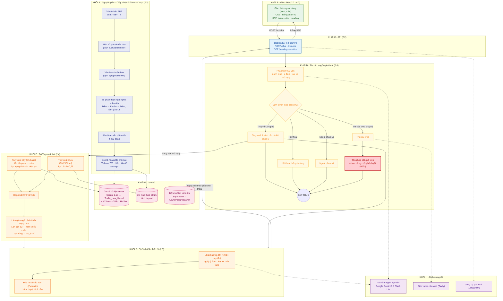
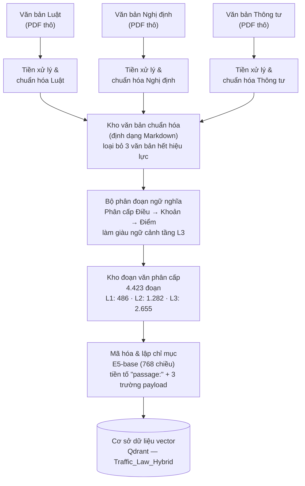
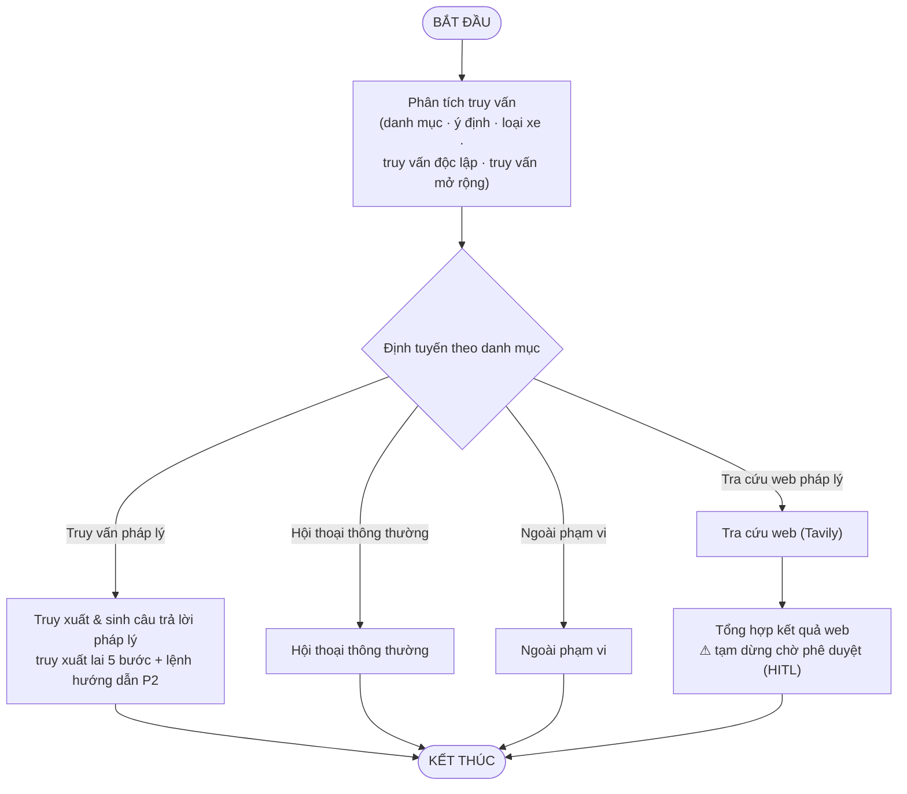
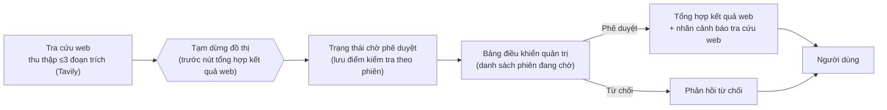

# CHƯƠNG 2. THIẾT KẾ VÀ XÂY DỰNG HỆ THỐNG

## 2.1 Giới thiệu chương

Chương 2 trình bày toàn bộ quá trình thiết kế và xây dựng hệ thống Traffic-RAG, theo trình tự từ kiến trúc tổng thể đến từng thành phần cụ thể. Nội dung được tổ chức theo luồng dữ liệu thực tế: mục 2.2 mô tả kiến trúc tổng thể và công nghệ sử dụng; mục 2.3 trình bày quy trình ngoại tuyến xử lý và đánh chỉ mục văn bản pháp luật; mục 2.4 mô tả quy trình trực tuyến truy xuất lai với năm bước tuần tự; mục 2.5 trình bày thiết kế sinh văn bản và kỹ thuật lệnh hướng dẫn; mục 2.6 mô tả luồng công việc hướng tác tử LangGraph với cơ chế con người trong vòng lặp; mục 2.7 trình bày phương pháp đánh giá và thiết kế thực nghiệm. Mỗi quyết định thiết kế trong chương này đều được xác lập bằng bằng chứng định lượng từ các thực nghiệm đối chứng được trình bày chi tiết trong Chương 3.

---

## 2.2 Kiến trúc tổng thể và công nghệ sử dụng

### 2.2.1 Sơ đồ kiến trúc hệ thống

Hệ thống Traffic-RAG được tổ chức theo hai pipeline tách biệt: **pipeline offline** chạy một lần khi bổ sung văn bản mới và **pipeline online** xử lý mỗi truy vấn người dùng theo thời gian thực. Sự tách biệt này đảm bảo việc cập nhật corpus (thêm văn bản mới, sửa lỗi chunking) không ảnh hưởng đến tính sẵn sàng của hệ thống phục vụ.

**Pipeline offline** đi theo chuỗi: tập PDF thô trong thư mục `Data/raw/` được ba script làm sạch riêng biệt theo loại văn bản chuyển đổi sang Markdown chuẩn hóa trong `Data/cleaned/`. Bộ chunker phân cấp v6 đọc toàn bộ file Markdown và xuất ra tệp `Data/all_chunks.jsonl` gồm 4.423 chunk với metadata đầy đủ. Cuối cùng, script indexing mã hóa mỗi chunk thành vector E5-base 768 chiều và nạp vào collection `Traffic_Law_Hybrid` của Qdrant, đồng thời xây dựng BM25 JSONL cache cho sparse retrieval.

**Pipeline online** điều phối qua đồ thị LangGraph 6 node: truy vấn người dùng cùng lịch sử hội thoại đi vào node analyzer, sau đó router điều hướng đến một trong bốn nhánh xử lý (legal_rag, chit_chat, web_search, out_of_scope). Nhánh legal_rag thực hiện hybrid retrieval 5 bước rồi sinh câu trả lời với Prompt P2. Kết quả được phát trực tuyến về giao diện người dùng qua Server-Sent Events.

**Hình 2.1** minh họa sơ đồ kiến trúc tổng thể chi tiết, chia thành **tám khối chức năng (A–H)** tương ứng với các thành phần thiết kế của chương này; mỗi mục tiếp theo sẽ bóc tách một khối: Khối A (ngoại tuyến) ở mục 2.3, Khối E (truy xuất lai) ở mục 2.4, Khối F (sinh văn bản) ở mục 2.5, Khối D (tác tử LangGraph) ở mục 2.6; các khối B/C (giao diện, API), G (lưu trữ) và H (dịch vụ ngoài) gắn kết toàn hệ thống.

*Hình 2.1. Sơ đồ kiến trúc tổng thể chi tiết hệ thống Traffic-RAG v7.0, chia thành tám khối chức năng A–H: ngoại tuyến (A), giao diện (B), API (C), tác tử LangGraph 6 nút (D), truy xuất lai (E), sinh văn bản (F), lưu trữ (G) và dịch vụ ngoài (H).*

### 2.2.2 Công nghệ sử dụng

Bảng 2.1 liệt kê toàn bộ thư viện và dịch vụ trong hệ thống cùng lý do lựa chọn.

**Bảng 2.1. Tech stack hệ thống Traffic-RAG v7.0**

| Tầng | Thư viện / Dịch vụ | Phiên bản | Lý do chọn |
|---|---|---|---|
| Ngôn ngữ | Python | 3.11 | Type hint đầy đủ, pattern matching |
| Điều phối | LangGraph | 0.2.x | State machine, HITL interrupt_before |
| LLM wrapper | langchain-google-genai | — | Gemini structured output |
| LLM sinh | Gemini 3.1 Flash Lite Preview | — | 1M context, $0,075/$0,30 per 1M token |
| Embedding | intfloat/multilingual-e5-base | — | R@10 0,42 (cao nhất trong so sánh bốn mô hình nhúng) |
| Vector DB | Qdrant | 1.17 | Payload filter, HTTP API, hybrid native |
| Sparse | rank_bm25 (BM25Okapi) | — | Python thuần, đồng bộ Qdrant ID |
| Tra cứu web | tavily-python | — | Free tier, snippet dài |
| Judge RAGAS | OpenAI gpt-4o-mini | — | Judge mạnh, $0,15/$0,60 per 1M token |
| Backend | FastAPI + uvicorn | 0.110 | Async, SSE streaming |
| Frontend | Next.js 14 (App Router, TypeScript, Tailwind) | 14 | Auth gate, scale tốt |
| Tracing | LangSmith | — | Phân tích chi phí node-level |
| Container | Docker Compose | — | Isolation Qdrant + API + UI |

### 2.2.3 Môi trường triển khai

Hệ thống hỗ trợ hai chế độ triển khai:

**Local development:** Ba service chạy qua Docker Compose trên một máy — Qdrant (port 6333), FastAPI backend (port 8000), và Next.js frontend (port 3000). Toàn bộ dữ liệu Qdrant được persistent vào volume `./qdrant_storage` trên máy host. Biến môi trường được truyền qua file `.env` cục bộ.

**Cloud production:** Hệ thống đã được triển khai thực tế trên hạ tầng đám mây miễn phí (tổng chi phí $0/tháng): frontend Next.js trên **Vercel** (traffic-rag.vercel.app), backend FastAPI + LangGraph trên **Hugging Face Spaces** (Docker, 2 vCPU, 16 GB RAM), kho vector trên **Qdrant Cloud Free** (AWS us-east-1, cùng vùng với backend để giảm latency truy vấn), còn xác thực NextAuth và checkpoint LangGraph dùng chung một **Supabase Postgres Free**. Cùng một codebase và Docker image phục vụ cả hai chế độ local và cloud; khác biệt chỉ nằm ở các biến môi trường (`QDRANT_URL`, `CHECKPOINT_DB_URL`, `CORS_ALLOWED_ORIGINS`).

Biến môi trường quan trọng gồm: `GOOGLE_API_KEY` (Gemini), `TAVILY_API_KEY` (tra cứu web), `LANGCHAIN_API_KEY` (LangSmith tracing), `QDRANT_HOST` và `COLLECTION_NAME`, `NEXTAUTH_SECRET` và `ADMIN_EMAILS` (xác thực quản trị viên HITL).

---

## 2.3 Quy trình ngoại tuyến — Tiếp nhận và Đánh chỉ mục

### 2.3.1 Chuẩn hoá văn bản pháp luật

Văn bản pháp luật Việt Nam được phân phối chính thức dưới dạng PDF có cấu trúc layout phức tạp (bảng xử phạt, header/footer cố định mỗi trang, ngắt dòng giữa câu do page break). Ba script làm sạch chuyên biệt xử lý từng nhóm loại văn bản:

**Bảng 2.2. Script làm sạch và đặc điểm xử lý**

| Script | Loại văn bản | Đặc điểm xử lý đặc thù |
|---|---|---|
| `clean_luat_pdfs.py` | Luật (2 file) | Cấu trúc phần/chương/điều; header tên luật mỗi trang |
| `clean_nghidinh_pdfs.py` | Nghị định (7 file) | Bảng mức phạt Markdown; footer "Trang X/Y" |
| `clean_thongtu_pdfs.py` | Thông tư (17 file) | Phụ lục mẫu biểu; nhiều cấp tiêu đề lồng nhau |

Quy trình chung của cả ba script: mở PDF bằng `pdfplumber`, extract text theo từng trang kết hợp detect bảng (`extract_tables`), lọc header và footer cố định theo pattern regex, bảo toàn bảng dưới dạng Markdown (`|...|`), nối câu bị ngắt bởi page break (xóa hyphen cuối dòng, nối dòng tiếp theo), và ghi ra file `.md` trong `Data/cleaned/<loai>/`. Mỗi lần chạy ghi kèm `_processing_stats.json` ghi lại số trang, bảng, ký tự và số block bị lọc.

*Hình 2.2. Pipeline ngoại tuyến: từ tài liệu PDF thô qua ba bộ tiền xử lý riêng biệt thành kho văn bản chuẩn hóa, sau đó qua bộ phân đoạn ngữ nghĩa phân cấp tạo ra 4.423 đoạn và đánh chỉ mục vào Qdrant.*

Bộ lọc văn bản hết hiệu lực dựa trên trường metadata `status` với ba giá trị:

**Bảng 2.3. Giá trị trường status và xử lý**

| Giá trị | Nghĩa | Xử lý khi indexing |
|---|---|---|
| `active` | Còn hiệu lực | Đưa vào index, truy xuất được |
| `repealed` | Bị bãi bỏ hoàn toàn | Bỏ qua, không index |
| `partially_repealed` | Mảng đường bộ bị bãi bỏ, mảng khác còn | Bỏ qua mảng đường bộ |

Ví dụ: `luat23_db_2008` mang `status=repealed` (bãi bỏ bởi Luật 35/2024 và 36/2024); `nd100_2019_xu_phat` mang `status=partially_repealed` (mảng đường bộ bị Nghị định 168/2024 thay thế, trả về file Markdown gần rỗng với `filtered_blocks=102`).

### 2.3.2 Phân đoạn văn bản phân cấp theo Điều/Khoản/Điểm

Sau khi làm sạch, 26 file Markdown được phân đoạn bởi **HierarchicalLegalSplitter v6** — bộ chunker 3 cấp đặc thù cho cấu trúc pháp luật Việt Nam.

Bộ chunker nhận diện cấu trúc văn bản qua bốn mẫu biểu thức chính quy:

**Bảng 2.4. Mẫu regex nhận diện cấu trúc pháp luật**

| Cấp | Tên | Pattern | Ví dụ khớp |
|---|---|---|---|
| L1 | Điều | `^##\s*Điều\s+(\d+)\.` | `## Điều 6. Xử phạt...` |
| L2 | Khoản | `^\s*(\d+)\.\s+` | `1. Phạt tiền từ...` |
| L3 | Điểm | `^\s*([a-zđ])\)` | `a) Không chấp hành...` |
| L3 | Điểm sau chấm phẩy | `(?:^|;\s+)([a-zđ])\)` | `; b) Điều khiển...` |

Thuật toán phân đoạn 3 cấp hoạt động như sau. Cấp L1 (Điều): nếu tổng số token ước tính của Điều không vượt ngưỡng `THRESH_DIEU = 600`, toàn bộ Điều là một chunk. Cấp L2 (Khoản): nếu Điều vượt ngưỡng, tách theo từng Khoản; mỗi Khoản không vượt `THRESH_KHOAN = 500` token là một chunk L2. Cấp L3 (Điểm): nếu Khoản vượt `THRESH_KHOAN` hoặc văn bản thuộc nhóm nghị định và có từ hai Điểm trở lên, mỗi Điểm trở thành một chunk L3 độc lập.

**Năm cải tiến trong v6** so với v5.1:

**Bảng 2.5. Cải tiến HierarchicalLegalSplitter v6**

| # | Cải tiến | Vấn đề giải quyết |
|---|---|---|
| 1 | MIN_CHUNK_DIEM = 5 token (L3), không lọc Điểm ngắn | Điểm ngắn "đ) Không có" bị bỏ trong v5.1 |
| 2 | THRESH_KHOAN_STRICT = 80 cho `doc_type=nghidinh` | Nghị định có Điểm ngắn cần split L3 sớm |
| 3 | has_diem override: NĐ có ≥ 2 Điểm → luôn split L3 | 469/605 Điểm NĐ 168 không có chunk riêng trong v5.1 |
| 4 | Regex enhanced: match cả "đ)" và Điểm sau dấu chấm phẩy | Bỏ sót Điểm đầu dòng sau "; " |
| 5 | Enrich preamble: chunk L3 tự chứa phần mở đầu Khoản | Chunk Điểm thiếu ngữ cảnh "Phạt tiền X–Y đồng đối với..." |

Trước v6, 77,5% điểm pháp lý trong Nghị định 168 (469/605 Điểm) không có chunk độc lập. Sau v6, tỷ lệ này giảm xuống còn 11,7%. Phân bố 4.423 chunks theo cấp:

**Bảng 2.6. Phân bố chunks theo cấp sau HierarchicalLegalSplitter v6**

| Cấp | Số chunks | Tỷ lệ | Ý nghĩa |
|---|---:|---:|---|
| L1 (Điều) | 486 | 11% | Điều ngắn, không cần tách |
| L2 (Khoản) | 1.282 | 29% | Khoản trung bình |
| L3 (Điểm) | 2.655 | 60% | Cải thiện chủ yếu từ chunker v6 |
| **Tổng** | **4.423** | **100%** | 24 văn bản active |

Mỗi chunk được gắn metadata đầy đủ:

**Bảng 2.7. Schema metadata chunk**

| Trường | Kiểu | Ví dụ |
|---|---|---|
| `chunk_id` | string | `168_2024_NĐ_CP_dieu7_khoan4_diem_p` |
| `doc_id` | string | `168/2024/NĐ-CP` |
| `ten_van_ban` | string | `Nghị định 168/2024/NĐ-CP (Xử phạt VPHC đường bộ)` |
| `document_type` | string | `nghidinh` / `luat` / `thongtu` |
| `status` | string | `active` / `repealed` / `partially_repealed` |
| `dieu` | int | 7 |
| `khoan` | string | `"4"` |
| `diem` | string | `"p"` |
| `level` | int | 3 |
| `token_estimate` | int | 187 |

### 2.3.3 Nhúng vector và Đánh chỉ mục vào Qdrant

Mô hình **intfloat/multilingual-e5-base** [2] (XLM-RoBERTa backbone, 12 layer, hidden=768, max_seq=512, 278M tham số) mã hóa toàn bộ 4.423 chunk với prefix bắt buộc `"passage: "` trước nội dung (yêu cầu thiết kế của họ E5, dùng sai giảm ~30% recall [2]). Batch embedding 64 chunk, batch upsert 100 point vào Qdrant.

Collection `Traffic_Law_Hybrid` được tạo với cấu hình: vector 768 chiều, khoảng cách Cosine, HNSW m=16 ef_construct=100 (không cần fine-tune với 4.423 point). Ba payload index được tạo trên các trường `doc_id`, `status`, và `topic` (kiểu KEYWORD) để hỗ trợ filter nhanh tại query time. Tổng dung lượng sau indexing: ~26 MB trên volume Docker.

BM25 cache được xây dựng song song: toàn bộ nội dung chunk được tokenize bằng `pyvi.ViTokenizer` (xử lý từ ghép tiếng Việt như "vượt_đèn_đỏ") và lưu vào JSONL cache để tái sử dụng giữa các lần khởi động service mà không cần rebuild từ đầu.

---

## 2.4 Quy trình trực tuyến — Truy xuất lai

### 2.4.1 Mở rộng truy vấn

Thay vì truy xuất trực tiếp từ truy vấn gốc của người dùng, node analyzer của LangGraph phân tích truy vấn và trả về cấu trúc `AnalyzerOutput` gồm:
- `standalone_query` — truy vấn được giải tham chiếu (decontextualized) dựa trên lịch sử hội thoại.
- `expanded_queries` — danh sách 1–5 biến thể mở rộng cho retrieval (ví dụ: từ "vượt đèn đỏ xe máy" mở rộng thành "vi phạm tín hiệu đèn giao thông mô tô", "Điều 7 Nghị định 168 xe máy vượt đèn đỏ").
- `category` — nhãn định tuyến: legal_rag / chit_chat / web_legal_search / out_of_scope.
- `intent` — loại ý định: penalty / fault / procedure / definition / list / mixed.
- `vehicle_type` — loại phương tiện: o_to / mo_to / chuyen_dung / xe_dap / any.

Thực nghiệm mở rộng truy vấn (mục 3.6) chứng minh mở rộng truy vấn tăng Recall@10 từ 0,324 lên 0,581 (+26 điểm phần trăm), đây là đóng góp lớn nhất trong pipeline truy xuất.

### 2.4.2 Truy xuất dày đặc và thưa

**Nhúng tài liệu giả định (HyDE — Hypothetical Document Embeddings)** được áp dụng trước khi gửi truy vấn lên dense retriever. Thay vì mã hóa trực tiếp câu hỏi ngắn của người dùng, LLM được yêu cầu sinh ra một đoạn văn bản pháp luật giả định có thể chứa câu trả lời cho câu hỏi đó. Vector nhúng của đoạn giả định này được dùng để tìm kiếm trong Qdrant thay vì vector của câu hỏi gốc. Kỹ thuật này thu hẹp khoảng cách phân phối giữa câu hỏi ngắn và đoạn văn pháp luật dài, cải thiện chất lượng truy xuất dày đặc trên văn bản pháp lý [1].

**Dense leg** gửi vector mã hóa của tài liệu giả định HyDE (với prefix `"passage: "`) đến Qdrant, kết hợp với payload filter `status = "active"` để loại bỏ chunk từ văn bản hết hiệu lực ngay tại tầng cơ sở dữ liệu [6]. Qdrant trả về top-`2k` kết quả theo khoảng cách cosine qua HNSW.

**Sparse leg** tính điểm BM25 Okapi [9] cho toàn bộ corpus với tham số $k_1 = 1{,}5$ và $b = 0{,}75$, trả về top-`2k` chunk theo điểm BM25. Công thức đầy đủ:

$$\operatorname{score}(D,Q) = \sum_{t \in Q} \operatorname{IDF}(t) \cdot \frac{f(t,D)\,(k_1+1)}{f(t,D)+k_1\!\left(1-b+b\,\dfrac{|D|}{\operatorname{avgDL}}\right)}$$

$$\operatorname{IDF}(t) = \log\!\left(\frac{N - \operatorname{df}(t) + 0{,}5}{\operatorname{df}(t) + 0{,}5} + 1\right)$$

với $N = 4.423$ (tổng chunk), $k_1 = 1{,}5$ (thưởng từ lặp), $b = 0{,}75$ (phạt chunk dài).

Khi sử dụng mở rộng truy vấn (RQ9 bật), dense leg và sparse leg được chạy $n$ lần tương ứng với $n$ biến thể trong `expanded_queries`, thu về $n$ ranked list từ mỗi leg.

### 2.4.3 Tổng hợp xếp hạng, làm giàu ngữ cảnh và giải tham chiếu chéo

**RRF Fusion** hợp nhất tất cả ranked list từ cả dense và sparse mà không cần normalize điểm giữa hai hệ thống [11]:

$$\operatorname{RRF}(d) = \sum_{\ell \in \{\text{dense}, \text{sparse}\}} \frac{1}{k + \operatorname{rank}_\ell(d)}$$

Hằng số $k = 60$ là giá trị mặc định theo Cormack và cộng sự [11], ổn định cho corpus dưới 10.000 tài liệu. Kết quả sau RRF là danh sách top-30 chunk duy nhất, không trùng lặp, kết hợp tín hiệu từ cả khớp ngữ nghĩa lẫn khớp từ khóa chính xác.

**Sibling Enrichment** bổ sung ngữ cảnh xung quanh mỗi chunk trong top-K. Với mỗi chunk có `khoan = N` trong một Điều, hệ thống kéo thêm tất cả chunk cùng Điều với `khoan ∈ {N-2, N-1, N+1, N+2}`. Cơ chế này đặc biệt quan trọng cho câu hỏi đa ý định — ví dụ, Khoản 4 Điều 6 quy định mức phạt tiền, còn Khoản 13–16 quy định tước giấy phép và trừ điểm; Sibling Enrichment đảm bảo cả hai đều có mặt trong context.

**Cross-Reference Resolution** quét nội dung các chunk trong top-K bằng biểu thức chính quy tìm kiếm tham chiếu chéo theo các mẫu "Điều X Khoản Y", "điểm Z khoản W Điều V", sau đó kéo thêm các chunk được tham chiếu vào context. Cơ chế này xử lý đặc trưng của Nghị định 168/2024 — mức phạt tiền và mức trừ điểm nằm ở hai khoản khác nhau nhưng được liên kết qua "theo quy định tại Khoản X".

Sau khi bổ sung sibling và cross-ref, hệ thống áp dụng diversity cap — giới hạn tối đa 3 chunk từ cùng một tổ hợp (doc_id, Điều, Khoản) để tránh context tập trung quá hẹp — rồi cắt lấy top_k chunk cuối cùng — mặc định `LEGAL_RAG_TOP_K_DEFAULT = 15`; tăng lên `LEGAL_RAG_TOP_K_BROAD = 25` khi phân tích phát hiện câu hỏi thuộc loại ý định `list` hoặc `mixed`.

### 2.4.4 Xếp hạng lại

Hệ thống tích hợp tùy chọn cross-encoder reranker **BAAI/bge-reranker-v2-m3** (568M tham số, đa ngôn ngữ, max_length=8.192). Khi bật, reranker nhận top-30 chunk từ RRF, tính điểm liên quan của từng cặp (truy vấn, chunk) qua mô hình cross-encoder, rồi sắp xếp lại và giữ top-10.

Thực nghiệm xếp hạng lại (mục 3.6) đo được mức tăng R@10 +48,5% (từ 0,324 lên 0,481) nhưng kèm theo tăng latency ×156 trên CPU (708 ms lên 110.468 ms). Do đó reranker được **tắt mặc định** trong production, bật thông qua biến môi trường `ENABLE_RERANKER=true` khi có GPU hoặc cho mục đích nghiên cứu.

---

## 2.5 Thiết kế Sinh văn bản và Kỹ thuật Lệnh hướng dẫn

### 2.5.1 Kiến trúc Lệnh hướng dẫn P2

Ablation RQ5 so sánh ba biến thể prompt: P0 (zero-shot), P1 (role-only), và P2 (role + 14 quy tắc). P2 cho Citation-F1 cao nhất (0,279) — gấp 8,7 lần P0 (0,032) — trong khi latency P2 thấp nhất (7,1 giây) vì các quy tắc ép LLM trả lời ngắn gọn và có cấu trúc. Thiết kế prompt chặt chẽ là biện pháp phòng thủ chống hallucination pháp lý được khuyến nghị bởi Dahl và cộng sự [10].

Prompt P2 được tổ chức thành hai phần chính: phần khai báo vai trò và phần 14 quy tắc bắt buộc. Phần vai trò xác định LLM là "Trợ lý Pháp lý Giao thông Việt Nam — chuyên gia tư vấn các văn bản quy phạm pháp luật mới nhất (2024–2026)."

**Bảng 2.8. 14 quy tắc trong Prompt P2**

| # | Quy tắc | Mục đích |
|---|---|---|
| 1 | Chỉ dùng NGỮ CẢNH được cung cấp, không suy luận ngoài | Chống hallucination |
| 2 | Mọi mức phạt/số điểm phải kèm `[doc_id, Điều X, Khoản Y, Điểm z]` | Buộc trích dẫn |
| 3 | Nếu không đủ thông tin, trả lời "Thông tin không có trong tài liệu được cung cấp" | Từ chối an toàn |
| 4 | Không tự nghĩ số tiền; copy nguyên văn "từ X đến Y đồng" | Độ chính xác số liệu |
| 5 | Ưu tiên văn bản mới nhất; NĐ 168/2024 thay NĐ 100/2019 đường bộ | Hiệu lực pháp luật |
| 6 | Câu hỏi đa ý: tách thành bullet Markdown, bold số tiền/điểm/thời gian | Định dạng đầu ra |
| 7 | Phân biệt xe kinh doanh vận tải (ưu tiên NĐ 10/2020) và xe cá nhân | Phân loại phương tiện KD |
| 8 | Phân biệt loại phương tiện trong NĐ 168: Đ6 ô tô, Đ7 mô tô, Đ8 chuyên dùng, Đ9 thô sơ | Đúng điều khoản |
| 9 | Chunk gắn nhãn [Ngữ cảnh bổ sung — cùng Điều] được phép dùng | Sibling chunks |
| 10 | Cross-reference 3 bước: phạt tiền (Đ6/7.K1–K12) ghép với trừ điểm (Đ6.K13–K16, Đ7.K11–K13) | Tham chiếu chéo NĐ 168 |
| 11 | Không từ chối nếu có một phần thông tin; trả phần có + ghi chú phần thiếu | Không từ chối thừa |
| 12 | Câu hỏi dạng liệt kê: rà soát toàn bộ context trước khi trả lời | Đầy đủ liệt kê |
| 13 | Giải thích hành vi tự nhiên trước khi trích điều khoản | Dễ hiểu |
| 14 | Lỗi do ai trong va chạm: 4 bước (liệt kê hành vi → đối chiếu → kết luận → lưu ý TT 72/2024) | Tư duy phân định lỗi |

### 2.5.2 Đầu ra có cấu trúc và Lọc trích dẫn

Generator sử dụng `ChatGoogleGenerativeAI.with_structured_output()` với lược đồ Pydantic `GeneratedAnswer` gồm hai trường: `answer` (chuỗi câu trả lời) và `sources` (danh sách `Citation` gồm `doc_id`, `dieu`, `khoan`, `diem`). Gemini trả về JSON đã validate theo lược đồ này, không cần parse chuỗi thủ công.

**Citation Sanitation** là lớp hậu xử lý: so khớp từng phần tử trong `sources` với metadata của các chunk context thực sự đã đưa vào prompt. Nếu một citation không khớp với bất kỳ chunk nào (ví dụ LLM tự nghĩ ra Điều 99 không tồn tại trong context), citation đó bị loại bỏ trước khi trả về UI. Đây là lớp phòng thủ cuối ngăn ảo giác trích dẫn [10] đến tay người dùng.

---

## 2.6 Luồng công việc hướng tác tử — Máy trạng thái LangGraph

### 2.6.1 Sáu nút và Định tuyến ý định

Đồ thị LangGraph [12] gồm 6 node với điểm vào cố định là `analyzer`:

**Node analyzer** — Gemini structured output `AnalyzerOutput` phân tích truy vấn, giải tham chiếu chat_history, tạo expanded_queries, phân loại category và intent/vehicle_type.

**Node legal_rag** — pipeline retrieval và generation theo trình tự: (1) chạy retriever $n$ lần với các expanded_queries, (2) RRF fuse $n$ ranked list, (3) sibling + cross-ref enrichment, (4) diversity cap, (5) generator P2 với context top_k chunk + hint intent và vehicle_type. Kết thúc qua router `legal_fallback_router`: nếu LLM từ chối trả lời (`refused=True`) hoặc không có chunk nào truy xuất được, chuyển sang node `web_search`; các trường hợp còn lại kết thúc tại END.

**Node chit_chat** — gọi LLM với lệnh hướng dẫn `CHIT_CHAT_SYSTEM_PROMPT` để tạo câu trả lời hội thoại ngắn gọn và tự nhiên, kết thúc bằng cạnh đến END.

**Node web_search** — gọi Tavily API với `standalone_query`, lấy tối đa 3 snippet. Cạnh cố định đến `web_finalize`.

**Node web_finalize** — tổng hợp câu trả lời từ snippet web, gắn nhãn cảnh báo "⚠ Tra cứu từ internet". Trong v7.0, đồ thị cấu hình `interrupt_before=["web_finalize"]` — đồ thị tạm dừng tại đây và chờ phê duyệt HITL trước khi tiếp tục. Sau phê duyệt, node chạy rồi kết thúc ở END.

**Node out_of_scope** — template từ chối tĩnh, kết thúc ở END.

Cạnh có điều kiện từ `analyzer` định tuyến dựa trên `category` trong state:

**Bảng 2.9. Bảng định tuyến conditional edge**

| Giá trị category | Node đích |
|---|---|
| `legal_rag` | legal_rag |
| `chit_chat` | chit_chat |
| `web_legal_search` | web_search |
| `out_of_scope` | out_of_scope |

### 2.6.2 Luồng xử lý đầu-cuối

`AgentState` lưu toàn bộ ngữ cảnh xuyên suốt đồ thị:

**Bảng 2.10. Các trường trong AgentState**

| Trường | Kiểu | Mô tả |
|---|---|---|
| `chat_history` | list[dict] | Lịch sử hội thoại dạng dict `{"role": ..., "content": ...}` |
| `category` | str | Kết quả routing từ analyzer |
| `intent` | str | Loại ý định pháp lý |
| `vehicle_type` | str | Loại phương tiện |
| `standalone_query` | str | Truy vấn được decontextualized |
| `expanded_queries` | list[str] | Danh sách mở rộng cho retrieval |
| `chunks` | list[dict] | Kết quả truy xuất cuối sau enrichment |
| `answer` | str | Câu trả lời được sinh |
| `sources` | list[Citation] | Danh sách trích dẫn sau sanitation |
| `web_results` | list[dict] | Kết quả Tavily (chỉ khi web_search) |

SSE streaming phát về frontend ba loại sự kiện: `token` (mỗi token sinh ra), `cite` (danh sách citations cuối), và `pending` (khi đồ thị tạm dừng chờ HITL). Frontend phân biệt ba loại để hiển thị trạng thái "đang chờ phê duyệt" khi nhận `pending`.

*Hình 2.3. Đồ thị trạng thái LangGraph 6 nút: Phân tích truy vấn → Định tuyến → (Truy xuất pháp lý | Hội thoại thông thường | Tra cứu web | Ngoài phạm vi); nhánh Tra cứu web tạm dừng tại nút Tổng hợp kết quả web để chờ phê duyệt HITL trước khi kết thúc. Nhánh Truy xuất pháp lý đi thẳng tới KẾT THÚC.*

Bộ lưu điểm kiểm tra (checkpointer — `SqliteSaver` cho phát triển, `AsyncPostgresSaver` cho production) lưu snapshot state vào cơ sở dữ liệu tại mỗi bước, cho phép resume sau HITL interrupt mà không mất trạng thái. Thread ID duy nhất mỗi cuộc hội thoại đảm bảo cách ly multi-user.

### 2.6.3 Con người trong vòng lặp

Luồng HITL được kích hoạt khi analyzer phân loại truy vấn là `web_legal_search`. Node web_search thu thập snippet Tavily, đồ thị tạm dừng tại `interrupt_before=["web_finalize"]`, và FastAPI API endpoint `/pending` trả về danh sách thread đang chờ phê duyệt.

Quản trị viên truy cập bảng điều khiển `/admin`, xem snippet và draft answer, rồi bấm **Approve** (tiếp tục web_finalize) hoặc **Reject** (xóa thread, trả về thông báo từ chối). Timeout phía client là 10 phút — nếu admin không phản hồi trong thời gian này, client tự hủy polling và hiển thị thông báo "Yêu cầu tra cứu web hết thời gian chờ." Cơ chế HITL dựa trên nguyên lý human-in-the-loop của WebGPT [14], đảm bảo thông tin từ internet được kiểm soát trước khi trả về người dùng.

*Hình 2.4. Luồng con người trong vòng lặp (HITL): Tra cứu web thu thập đoạn trích → đồ thị tạm dừng chờ phê duyệt → Bảng quản trị phê duyệt hoặc từ chối → tiếp tục tổng hợp câu trả lời hoặc trả thông báo từ chối.*

---

## 2.7 Phương pháp đánh giá và thiết kế thực nghiệm

Để trả lời mười câu hỏi nghiên cứu (RQ1–RQ10), đề tài thiết kế bộ đánh giá chuẩn gồm 40 câu hỏi thuộc 8 danh mục thực tiễn, mỗi danh mục 5 câu:

| Danh mục | Đặc điểm |
|---|---|
| simple_penalty | Câu phạt đơn nghĩa, một loại phương tiện, một hành vi |
| multi_intent | Một câu hỏi chứa 3–4 ý: phạt tiền + trừ điểm + tước bằng + tạm giữ xe |
| cross_reference | Trả lời đúng cần kéo Điều tham chiếu vào context |
| procedure | Thủ tục hành chính: đăng ký xe, cấp GPLX, đổi bằng |
| out_of_scope | Ngoài phạm vi pháp luật giao thông đường bộ |
| ambiguous_short | Câu 3–5 từ, đa nghĩa, cần mở rộng truy vấn |
| compound_action | 2–3 hành vi vi phạm cùng lúc trong một câu |
| vehicle_binding | Cần trích đúng Điều theo loại xe (Đ6 ô tô, Đ7 mô tô, v.v.) |

Mỗi câu có `gold_answer` (câu trả lời chuẩn) và `gold_citations` (tập điều khoản cần trích dẫn ở cấp Khoản). Năm câu out_of_scope có `gold_citations` rỗng nên bị lọc ra khỏi các RQ đo retrieval/citation (giữ 35 câu legal); RQ1 giữ đủ 40 câu để đo Category Accuracy của router.

Các metric đánh giá được chia theo mục tiêu:

**Chất lượng truy xuất:** Recall@k (k=1,3,5,10,20), MRR, nDCG@10 — đo tại cấp Khoản (khoan-level: match khi (doc_id, dieu, khoan) đều trùng) và cấp tài liệu (doc-level: chỉ so doc_id).

**Chất lượng trích dẫn:** Citation Precision, Recall, F1 — so sánh tập citations LLM trả về với gold_citations.

**Chất lượng câu trả lời:** Token F1, ROUGE-L — đo overlap n-gram giữa câu trả lời và gold answer.

**Hành vi từ chối:** Refusal Rate — tỷ lệ câu có cụm từ "không đủ thông tin" hoặc tương đương.

**Kiến trúc hệ thống:** Category Accuracy (RQ1) — tỷ lệ câu router phân loại đúng category.

**Đánh giá RAGAS:** faithfulness, context_precision, context_recall đo bằng GPT-4o-mini judge.

**Chi phí và hiệu năng:** cost/câu (USD), latency (mean, p95 theo node), error rate — từ LangSmith trace (RQ8).

**CI Regression Gate:** test `test_retrieval_regression.py` assert mean Recall@10 ≥ 0,40 trên 35 câu legal, chạy tự động sau mỗi thay đổi corpus trên GitHub Actions với Qdrant Docker service.

---

## 2.8 Kết luận chương 2

Chương 2 đã trình bày đầy đủ phương pháp thiết kế và xây dựng hệ thống Traffic-RAG v7.0 theo hai pipeline tách biệt. **Pipeline offline** xây dựng trên ba quyết định then chốt: (i) ba script làm sạch chuyên biệt theo loại văn bản bảo toàn cấu trúc Điều/Khoản/Điểm qua pdfplumber; (ii) HierarchicalLegalSplitter v6 với năm cải tiến, tạo ra 4.423 chunk có metadata đầy đủ và biên chunk trùng với biên trích dẫn pháp lý; (iii) E5-base [2] với prefix `"passage: "`/`"query: "` bắt buộc và indexing HNSW vào Qdrant.

**Pipeline online** kết hợp năm kỹ thuật có cơ sở lý thuyết vững: dense retrieval [6], BM25 sparse [9], RRF fusion [11], mở rộng truy vấn, và sibling/cross-reference enrichment đặc thù cho văn bản pháp luật phân cấp. Prompt P2 với 14 quy tắc là lớp phòng thủ chống hallucination [10] trực tiếp trong generation. LangGraph [12] state machine 6 node với interrupt_before HITL hoàn thiện kiến trúc agentic.

Bộ đánh giá 40 câu/8 danh mục và hệ thống metric đa chiều (retrieval, citation, generation, cost) được thiết kế trong mục 2.6 là cơ sở để **Chương 3** kiểm chứng từng quyết định thiết kế bằng thực nghiệm có kiểm soát.

