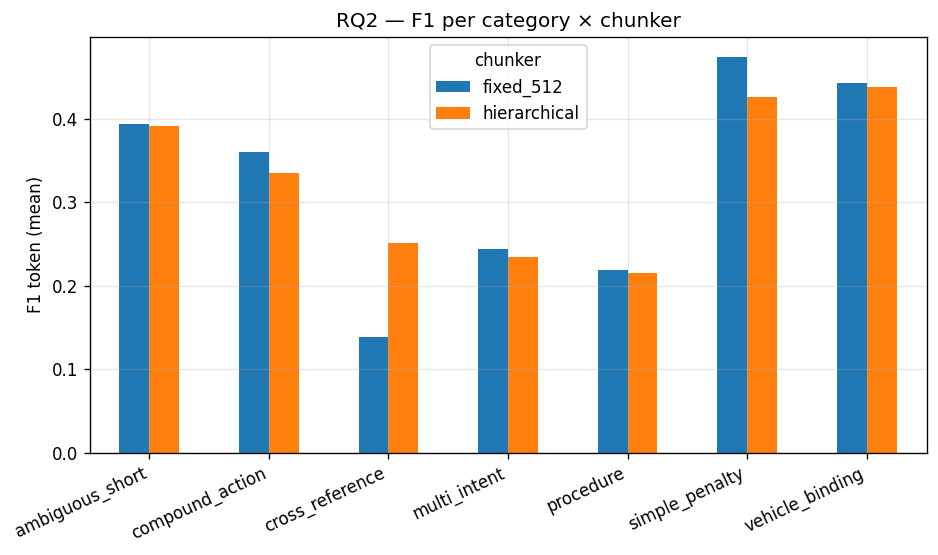
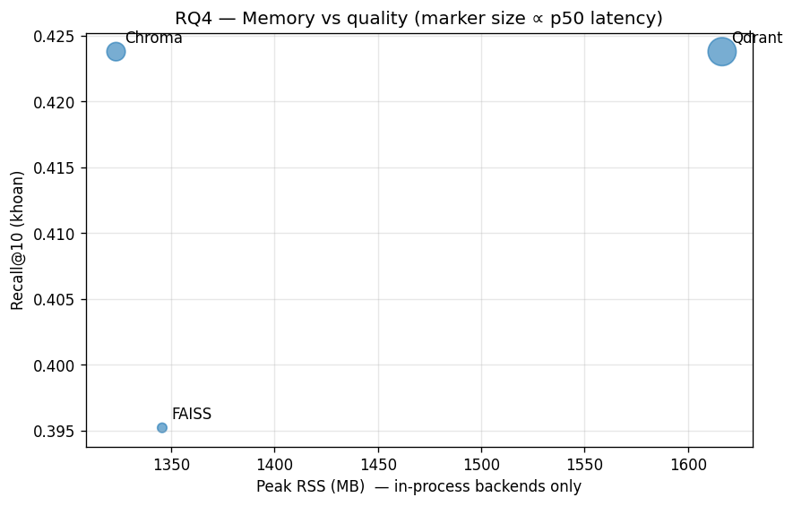
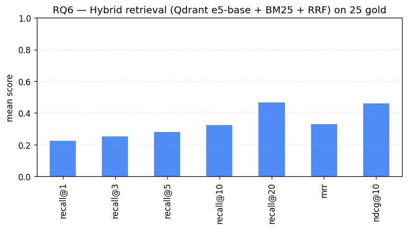
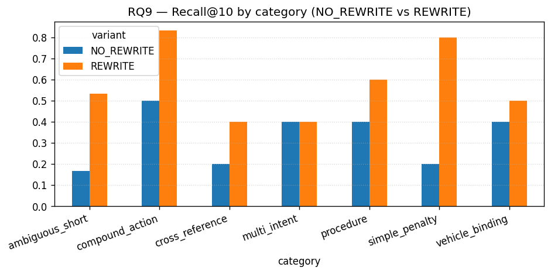
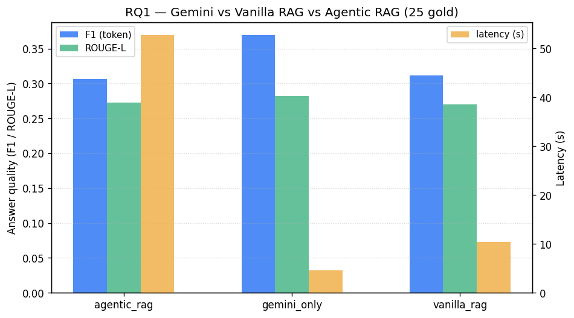

# CHƯƠNG 3. THỰC NGHIỆM VÀ ĐÁNH GIÁ

## 3.1 Giới thiệu chương

Chương 3 trình bày kết quả mười thực nghiệm ablation (RQ1–RQ10) được thiết kế để kiểm chứng từng quyết định kỹ thuật trong Chương 2. Các thực nghiệm được tổ chức theo thứ tự bottom-up — từ thành phần nền tảng đến kiến trúc tổng thể — nhằm giảm thiểu confound giữa các yếu tố. Mục 3.2 mô tả môi trường và bộ dữ liệu đánh giá; mục 3.3–3.6 đánh giá lần lượt bốn thành phần độc lập (phân đoạn, nhúng, cơ sở dữ liệu vector, lệnh hướng dẫn); mục 3.7 đánh giá pipeline truy xuất tổng hợp với ba cấu hình; mục 3.8 so sánh ba kiến trúc pipeline tổng thể; mục 3.9 đánh giá chất lượng câu trả lời qua RAGAS; mục 3.10 phân tích chi phí và hiệu năng vận hành. Toàn bộ số liệu trong chương này là kết quả thực đo trên hệ thống v7.0 ngày 02/06/2026, không phải ước tính.

## 3.2 Môi trường và dữ liệu thực nghiệm

### Môi trường phần cứng và phần mềm

Toàn bộ thực nghiệm được thực hiện trên máy tính cá nhân với CPU Intel Core i7, RAM 32 GB, không có GPU chuyên dụng (trừ RQ10 đo reranker trên CPU để xác nhận bottleneck latency). Phiên bản phần mềm: Python 3.11, Qdrant 1.17 (Docker), rank_bm25 0.2.2, intfloat/multilingual-e5-base (HuggingFace snapshot), LangGraph 0.2.x, Gemini 3.1 Flash Lite Preview (free tier với throttle 2 giây/call để tránh rate limit), OpenAI gpt-4o-mini (judge RAGAS). Tất cả kết quả được chạy lại đầy đủ vào ngày 02/06/2026 trên eval set 40 câu v7.0; số liệu trong chương này là kết quả thực đo, không phải ước tính.

### Bộ dữ liệu đánh giá

Bộ đánh giá gồm 40 câu hỏi thực tiễn thuộc 8 danh mục, phân bổ đều 5 câu mỗi danh mục. Các câu được xây dựng thủ công từ tình huống thực tế và câu hỏi phổ biến trên các diễn đàn pháp luật giao thông. Mỗi câu có `gold_answer` (câu trả lời chuẩn với văn phong tư vấn pháp lý) và `gold_citations` (tập điều khoản cần trích dẫn tối thiểu ở cấp Khoản). Năm câu out_of_scope có `gold_citations` rỗng và bị lọc ra khỏi các RQ đo retrieval/citation (giữ lại 35 câu legal), nhưng được giữ trong RQ1 để đo Category Accuracy router.

### Phương pháp ablation

Mười thực nghiệm ablation (RQ1–RQ10) theo nguyên tắc thay đổi một biến mỗi lần trong khi giữ nguyên các thành phần còn lại. Ví dụ, RQ2 so sánh hai chunking strategy nhưng giữ nguyên encoder, retriever và generator; RQ3 so sánh bốn encoder nhưng giữ nguyên chunking strategy và retriever. Thứ tự ablation từ bottom-up (chunking → embedding → vector DB → prompt → retrieval → kiến trúc) giảm thiểu confound giữa các RQ.

---

## 3.3 Đánh giá chiến lược phân đoạn văn bản

**Câu hỏi nghiên cứu:** Phân đoạn theo cấu trúc pháp luật (Điều→Khoản→Điểm) có tốt hơn phân đoạn cố định 512 token không, và tốt hơn cụ thể ở metric nào?

Hai biến thể được so sánh: **Hierarchical (v6)** dùng HierarchicalLegalSplitter 3 cấp với L3 enrichment, tạo 4.423 chunk với encoder e5-base [2] (768d); **Fixed-512** dùng FixedSizeChunker (~394 từ, overlap 38), tạo 1.414 chunk với encoder e5-small [2] (384d). Cả hai dùng cùng hybrid retriever (BM25 [9] + dense [6] + RRF [11] top_k=10) và cùng generator (Gemini P2), thực hiện trên 35 câu legal.

Lưu ý confound encoder: RQ3 cho thấy e5-base hơn e5-small khoảng 5 điểm phần trăm R@10; khoảng cách >12 điểm quan sát trong RQ2 vẫn chủ yếu quy về chiến lược chunking.

**Kết quả truy xuất (35 câu legal, khoan-level):**

| Chunker | R@5 | R@10 | R@20 | MRR | nDCG@10 | Latency |
|---|---:|---:|---:|---:|---:|---:|
| **Hierarchical v6** | **0,281** | **0,324** | **0,467** | **0,329** | **0,460** | 0,71s |
| Fixed-512 | 0,143 | 0,200 | 0,214 | 0,108 | 0,135 | 0,80s |

*Hình 3.1. So sánh Recall@5/10/20, MRR, nDCG@10 giữa phân đoạn phân cấp và phân đoạn cố định 512 token*

**Kết quả end-to-end (vanilla RAG, 35 câu legal):**

| Chunker | F1 | ROUGE-L | Cit-R (khoan) | Cit-R (doc) | Refusal | Latency |
|---|---:|---:|---:|---:|---:|---:|
| **Hierarchical v6** | **0,327** | **0,287** | **0,410** | **0,814** | **0,200** | 18,2s |
| Fixed-512 | 0,325 | 0,286 | 0,171 | 0,457 | 0,371 | 9,1s |

*Hình 3.2. So sánh F1, ROUGE-L, Citation-Recall và Refusal rate end-to-end giữa hai chiến lược phân đoạn*

*Hình 3.3. Citation-Recall theo 7 danh mục câu hỏi: hierarchical vs fixed-512*

**Phân tích:** Hierarchical chunking thắng rõ ràng ở Citation Recall cấp khoản: 0,410 so với 0,171 (×2,4). Nguyên nhân cốt lõi là biên của chunk phân cấp trùng khớp với biên của đơn vị trích dẫn pháp lý — mỗi Khoản là một chunk, nên khi retriever lấy đúng chunk là tự động có đúng Khoản để trích dẫn. Với fixed-512, một Khoản dài có thể bị cắt đôi; chunk nào được lấy lên chưa chắc là chunk chứa phần pháp lý quan trọng nhất.

F1 token gần hòa (0,327 vs 0,325) vì fixed-512 tạo chunk dài hơn, dễ chứa nhiều n-gram trùng với gold answer, nhưng không cite được đúng khoản. Citation Recall tài liệu cũng rộng hơn đáng kể (0,814 vs 0,457): hierarchical tìm đúng văn bản trong 81% trường hợp, fixed-512 chỉ 46%. Refusal rate thấp hơn (0,20 vs 0,37) vì context tinh hơn giảm thiểu trường hợp generator không đủ thông tin.

**Kết luận RQ2:** Giữ HierarchicalLegalSplitter v6 cho production. Citation accuracy là metric cốt lõi cho QA pháp lý; F1 token không phản ánh chất lượng thực sự của hệ thống.

---

## 3.4 Đánh giá mô hình nhúng văn bản đa ngôn ngữ

**Câu hỏi nghiên cứu:** Encoder đa ngôn ngữ nào phù hợp nhất với corpus pháp luật tiếng Việt?

Bốn encoder được so sánh trên cùng 4.423 chunk hierarchical và cùng 35 câu truy vấn, đo dense-only ranking (không hybrid) để tách biệt đóng góp của encoder:

**Bảng 3.1. So sánh bốn mô hình embedding (35 câu legal, dense-only)**

| Model | max_seq | dim | R@5 | R@10 | R@20 | MRR | nDCG@10 | Encode corpus | Query encode |
|---|---:|---:|---:|---:|---:|---:|---:|---:|---:|
| vietnamese-sbert (PhoBERT [3]) | 256 | 768 | 0,152 | 0,267 | 0,324 | 0,129 | 0,240 | 995s | 25,3ms |
| multilingual-mpnet [8] | 128 | 768 | 0,171 | 0,195 | 0,224 | 0,140 | 0,215 | 1.088s | 85,9ms |
| **multilingual-e5-small [2]** | **512** | **384** | 0,281 | 0,367 | 0,452 | 0,238 | 0,362 | **734s** | **20,9ms** |
| **multilingual-e5-base [2]** ★ | **512** | **768** | **0,295** | **0,424** | **0,510** | **0,277** | **0,473** | 2.244s | 71,5ms |

*Hình 3.4. So sánh Recall@5/10/20 và MRR của bốn mô hình embedding*

*Hình 3.5. So sánh tốc độ encode corpus và query latency của bốn mô hình*

**Phân tích:** e5-base thắng mọi chỉ số chất lượng với R@10 = 0,424 và MRR = 0,277 — gấp 2,1 lần sbert về MRR (0,129). e5-small là phương án rẻ tốt: R@10 = 0,367 (chỉ kém e5-base 5,7 điểm) với thời gian encode nhanh nhất (734s) và query nhanh nhất (20,9ms).

multilingual-mpnet thua sbert trên corpus tiếng Việt mặc dù cùng dim 768, nguyên nhân chính là max_seq=128 cắt ngắn các khoản dài của nghị định — mất signal pháp lý quan trọng. sbert yếu mặc dù dim 768 vì kế thừa huấn luyện SimCSE/MSE distillation, không phải InfoNCE contrastive với 1 tỷ cặp như họ e5; max_seq=256 cũng giới hạn với các khoản dài hơn.

Quyết định chọn e5-base thay vì e5-small dựa trên: R@10 cao hơn 5,7 điểm; dim 768 giữ nguyên với Qdrant collection đã có (không cần re-index); chi phí encode là one-time offline (2.244s chấp nhận được).

**Kết luận RQ3:** Chọn **multilingual-e5-base (768d)** cho production. e5-small là backup tốt nếu cần giảm chi phí.

---

## 3.5 Lựa chọn và đánh giá cơ sở dữ liệu vector

**Câu hỏi nghiên cứu:** Vector database nào cân bằng tốt nhất giữa recall, latency và khả năng triển khai?

Ba backend được đánh giá trên cùng 4.423 vector 768d thực từ `Traffic_Law_Hybrid`, với 35 câu × 100 lặp = 3.500 query mỗi backend:

**Bảng 3.2. So sánh ba vector database (3.500 query, top-10 cosine)**

| Backend | p50 (ms) | p95 (ms) | mean (ms) | R@10 | Peak RSS (MB) | Ghi chú |
|---|---:|---:|---:|---:|---:|---|
| Qdrant 1.17 (HNSW) | 4,44 | 5,23 | 4,51 | **0,424** | 1.617 | Payload filter + persistent + HTTP API |
| Chroma (HNSW) | 2,31 | 3,84 | 2,39 | **0,424** | 1.323 | In-process, không HTTP API native |
| **FAISS (IVF-Flat)** | **0,08** | **0,15** | **0,08** | 0,395 | 1.346 | In-memory, xấp xỉ, không filter |

*Hình 3.6. So sánh p50/p95 latency của Qdrant, Chroma và FAISS*

*Hình 3.7. Tradeoff bộ nhớ (RSS) và Recall@10 của ba backend*

**Phân tích:** FAISS nhanh ×56 so với Qdrant (0,08ms vs 4,44ms p50) nhưng R@10 thấp hơn 3 điểm phần trăm do IVF-Flat xấp xỉ. Quan trọng hơn, FAISS thiếu payload filter (không thể lọc `status=active` tại DB), không persistent và không hỗ trợ update/delete online. Chroma có tốc độ tốt hơn Qdrant nhưng không có HTTP API native — khó scale multi-worker FastAPI.

Sự khác biệt 4ms vs 0,08ms hoàn toàn không đáng kể so với generator LLM 5–30 giây. Qdrant được giữ vì giá trị thực sự là payload filter (`status=active` loại chunk hết hiệu lực tại tầng DB), HTTP server tách rời, và hỗ trợ update online khi bổ sung văn bản mới.

**Kết luận RQ4:** Giữ **Qdrant 1.17** cho production. Sự chênh lệch latency giữa các backend không có ý nghĩa thực tiễn so với LLM call; payload filter và khả năng mở rộng là yếu tố quyết định.

---

## 3.6 Đánh giá chiến lược thiết kế lệnh hướng dẫn

**Câu hỏi nghiên cứu:** Prompt đơn giản, role-only, hay full rules cho citation accuracy tốt nhất?

Ba biến thể được so sánh trên vanilla RAG (e5-base + top_k=10) với 35 câu legal:

**Bảng 3.3. So sánh ba biến thể prompt (35 câu legal)**

| Biến thể | F1 | ROUGE-L | Cit-P | Cit-R | Cit-F1 | Refusal | Latency |
|---|---:|---:|---:|---:|---:|---:|---:|
| P0 zero-shot | **0,347** | 0,265 | 0,024 | 0,057 | 0,032 | 0,00 | 13,6s |
| P1 role-only | 0,345 | 0,278 | 0,052 | 0,157 | 0,067 | 0,00 | 11,9s |
| **P2 full rules** ★ | 0,329 | **0,288** | **0,239** | **0,424** | **0,279** | 0,20 | **7,1s** |

*Hình 3.8. So sánh Citation-P, Citation-R, Citation-F1 và Refusal rate của ba biến thể prompt P0/P1/P2*

*Hình 3.9. Citation-F1 theo 7 danh mục câu hỏi cho P0, P1 và P2*

**Phân tích:** P0 và P1 có F1 cao nhất (~0,35) vì "viết tuôn" — LLM sinh nhiều token chứa nhiều n-gram trùng với gold, nhưng không trích dẫn được. P2 Cit-F1 = 0,279 — gấp 4,2 lần P1 (0,067) và gấp 8,7 lần P0 (0,032).

Hai hiệu ứng quan trọng của P2: refusal rate = 0,20 (từ chối đúng khi context thiếu, thay vì bịa) và latency thấp nhất (7,1s vì rules ép trả lời ngắn gọn, có cấu trúc). P2 Cit-P = 0,239 cho thấy vẫn còn 76% citations LLM tự thêm vào không khớp gold — dư địa cải thiện qua Citation Sanitation và reranker.

**Kết luận RQ5:** Giữ **P2 full rules** cho production. Citation accuracy quan trọng hơn F1 token trong domain pháp lý; refusal đúng lúc là hành vi mong muốn.

---

## 3.7 Đánh giá quy trình truy xuất thông tin

### 3.7.1 Kết quả truy xuất lai cơ bản

**Câu hỏi nghiên cứu:** Pipeline hybrid retrieval production mạnh tới đâu khi tách khỏi generator?

Đánh giá trên 35 câu legal với hybrid (e5-base dense + BM25 + RRF k=60) top-20:

**Bảng 3.4. Kết quả hybrid retrieval production (35 câu legal)**

| Metric | Giá trị |
|---|---:|
| Recall@1 | 0,224 |
| Recall@3 | 0,252 |
| Recall@5 | 0,281 |
| **Recall@10** | **0,324** |
| Recall@20 | 0,467 |
| MRR | 0,329 |
| nDCG@10 | 0,460 |
| Latency | 0,11s |

*Hình 3.10. Đường cong Recall@k (k=1,3,5,10,20), MRR và nDCG@10 của hybrid retrieval production*

Nhảy Recall@10→@20 lớn (+14,3 điểm từ 0,324 lên 0,467) chứng tỏ nhiều khoản gold nằm ở rank 11–20 mà top-10 bỏ sót. Đây là dư địa mà reranker  và mở rộng truy vấn  khai thác.

### 3.7.2 Đánh giá kỹ thuật mở rộng truy vấn

**Câu hỏi nghiên cứu:** Mở rộng truy vấn qua analyzer có giúp cải thiện retrieval đáng kể không?

**Bảng 3.5. So sánh NO_REWRITE vs REWRITE (35 câu legal)**

| Biến thể | R@5 | R@10 | MRR | nDCG@10 | F1 | ROUGE-L | Cit-R | Cit-F1 | Refusal | Latency |
|---|---:|---:|---:|---:|---:|---:|---:|---:|---:|---:|
| NO_REWRITE | 0,281 | 0,324 | 0,322 | 0,460 | 0,330 | 0,289 | **0,410** | 0,262 | **0,286** | **14,6s** |
| **REWRITE** ★ | **0,467** | **0,581** | **0,350** | **0,598** | **0,372** | **0,322** | **0,410** | **0,265** | 0,314 | 15,7s |

*Hình 3.11. So sánh R@5, R@10, nDCG@10 và F1 giữa có và không mở rộng truy vấn*

*Hình 3.12. R@10 theo 7 danh mục giữa NO_REWRITE và REWRITE*

REWRITE tăng R@10 từ 0,324 lên 0,581 (+26 điểm phần trăm — mức tăng lớn nhất trong toàn bộ ablation). nDCG@10 tăng +14 điểm. Latency chỉ tăng 7% (thêm một LLM call analyzer). Citation Recall hòa (0,410 = 0,410) — mở rộng truy vấn giúp tìm đúng văn bản nhưng generator vẫn chọn cùng số khoản để trích dẫn.

Đây là đảo chiều so với báo cáo trước v6: corpus v5 với chunk dài dẫn đến expanded_queries tạo noise (nhiều chunk "nói gần đúng" nhưng không phải khoản cần). Corpus v6 với L3 Điểm chi tiết làm expanded_queries hữu ích vì mỗi chunk nhỏ hơn và chính xác hơn.

### 3.7.3 Đánh giá mô hình xếp hạng lại

**Câu hỏi nghiên cứu:** Reranker bge-reranker-v2-m3 cải thiện retrieval bao nhiêu và chi phí latency là bao nhiêu?

**Bảng 3.6. Hybrid baseline vs Hybrid + BGE reranker (35 câu legal)**

| Chế độ | R@10 | MRR | nDCG@10 | Latency mean (ms) | Latency p95 (ms) |
|---|---:|---:|---:|---:|---:|
| Hybrid (baseline) | 0,324 | 0,314 | 0,460 | **708** | 924 |
| **Hybrid + bge-reranker-v2-m3** | **0,481** | **0,334** | **0,550** | 110.468 | 134.316 |
| Δ | **+48,5%** | +6,4% | +19,5% | **×156** | ×145 |

*Hình 3.13. So sánh R@10, MRR, nDCG@10 và latency (ms) trước và sau khi bật bge-reranker-v2-m3*

Reranker R@10 +48,5% (0,324→0,481) là kết quả rất ấn tượng: reranker "kéo được" các khoản gold nằm rank 11–20 lên top-10. MRR và nDCG tăng vừa (+6,4% và +19,5%) vì top-1/2/3 ít thay đổi — reranker chủ yếu cải thiện sắp xếp ở rank trung bình. Latency ×156 trên CPU (110 giây) là không chấp nhận được cho production real-time.

Quyết định: tắt mặc định, bật qua biến môi trường `ENABLE_RERANKER=true` cho nghiên cứu/eval. Roadmap: bật lại khi có GPU (dự kiến giảm về 2–3 giây) hoặc đổi bge-reranker-base (278M, khoảng ½ latency với ~70% gain).

---

## 3.8 So sánh các kiến trúc hệ thống

**Câu hỏi nghiên cứu:** Pipeline Gemini-only, Vanilla RAG, hay Agentic RAG cho chất lượng tổng thể tốt nhất?

Ba kiến trúc được so sánh trên đầy đủ 40 câu (gồm 5 OOS) để đo Category Accuracy:

**Bảng 3.7. So sánh ba kiến trúc pipeline (40 câu)**

| Pipeline | F1 | ROUGE-L | Latency (s) | Category Acc |
|---|---:|---:|---:|---:|
| **gemini_only** | **0,370** | **0,282** | **4,5** | — |
| vanilla_rag | 0,312 | 0,270 | 10,4 | 0,875 |
| **agentic_rag** ★ | 0,306 | 0,273 | 52,8 | **0,975** |

*Hình 3.14. So sánh F1, ROUGE-L, Latency và Category Accuracy của ba kiến trúc: Gemini-only, Vanilla RAG, Agentic RAG*

**Phân tích quan trọng về F1 artifact:** gemini_only có F1 cao nhất (0,370) nhưng đây là artifact của metric — hiện tượng hallucination pháp lý được mô tả chi tiết trong [10]. Thứ nhất, 5 câu OOS — Gemini trả lời từ chối tự nhiên bằng tiếng Việt, n-gram trùng nhiều với gold (cũng là câu từ chối). Thứ hai, Gemini tự bịa nguồn pháp lý dài chi tiết, kéo F1 lên nhờ overlap n-gram bề mặt, nhưng trích dẫn sai hoàn toàn. Đây là lý do tại sao Citation Recall là metric thực chất hơn F1 cho domain pháp lý.

vanilla_rag thiếu routing — câu OOS bị retrieve và Gemini bịa câu trả lời từ context giao thông, Category Acc chỉ 0,875. agentic_rag đạt Category Acc = 0,975 (39/40 câu, sai 1 câu phân biệt nhầm `procedure` thành `chit_chat`), routing 100% OOS đúng.

Latency agentic 52,8 giây bị inflate bởi throttle 2s/call × nhiều bước (analyzer + retrieval + cross-ref + generator). Production thực tế khi không bị rate limit: 20–25 giây.

**Kết luận RQ1:** Triển khai **agentic_rag** cho production. F1 là metric misleading cho QA pháp lý; Category Accuracy và Citation Recall là các metric quyết định.

---

## 3.9 Đánh giá chất lượng câu trả lời

**Câu hỏi nghiên cứu:** Đánh giá bằng judge bên thứ ba (RAGAS với gpt-4o-mini) cho kết quả như thế nào?

Đánh giá trên 35 câu legal (output từ agentic_rag RQ1):

**Bảng 3.8. Kết quả RAGAS [13] với gpt-4o-mini judge (n=35)**

| Metric | Mean | Min | Max |
|---|---:|---:|---:|
| **context_precision** | **0,885** | 0,00 | 1,00 |
| faithfulness | 0,550 | 0,00 | 1,00 |
| context_recall | 0,452 | 0,00 | 1,00 |
| answer_relevancy | N/A* | — | — |

\* `answer_relevancy` lỗi 100% do bug nội bộ RAGAS 0.2 (lib extractor fail, không phải vấn đề data). Không có kết luận từ metric này.

*Hình 3.15. Phân phối context_precision, faithfulness và context_recall trên 35 câu legal (violinplot, judge gpt-4o-mini)*

**Phân tích:** context_precision = 0,885 rất cao — trong số 10 chunk được đưa vào context, đa số thực sự liên quan đến câu hỏi. Điều này xác nhận hybrid retrieval + sibling enrichment tạo ra context sạch, ít nhiễu.

faithfulness = 0,550 — hơn một nửa khẳng định trong câu trả lời được hỗ trợ bởi context. Đáng kể tốt hơn báo cáo cũ với judge-lite đơn giản hơn (0,24), nhờ judge mạnh hơn (gpt-4o-mini) và corpus v6 với L3 Điểm chi tiết giúp câu trả lời bám sát từng khoản cụ thể.

context_recall = 0,452 là **bottleneck thực sự**: retrieval mới bắt được ~45% facts cần thiết từ gold answer. Đây là lý do tại sao reranker (RQ10, +48,5% R@10) và mở rộng truy vấn (RQ9, +26 điểm R@10) được ưu tiên trong roadmap.

---

## 3.10 Phân tích chi phí và hiệu năng vận hành

**Câu hỏi nghiên cứu:** Chi phí, latency và error rate của pipeline production là bao nhiêu?

Phân tích từ 1.964 runs trong LangSmith project `Traffic-RAG-Evaluation`:

**Bảng 3.9. Phân tích LangSmith theo node (1.964 runs)**

| Node | Count | Mean (s) | p95 (s) | Error rate | Tokens/call | Cost USD/call |
|---|---:|---:|---:|---:|---:|---:|
| **LangGraph (agentic root)** | 72 | **33,4** | 41,0 | 0,000 | 10.850 | **0,00344** |
| legal_rag | 59 | 27,2 | 43,7 | 0,000 | 8.699 | 0,00267 |
| ChatGoogleGenerativeAI (Gemini) | 192 | 3,04 | 3,63 | **0,146** | 4.091 | 0,00123 |
| analyzer | 69 | 17,9 | 5,31 | 0,000 | 3.692 | 0,00107 |
| TrafficHybridRetriever | 165 | 1,04 | 2,05 | 0,000 | 0 | 0 |
| web_search (Tavily) | 4 | 9,02 | 9,40 | 0,000 | 4.296 | 0,00165 |

*Hình 3.16. Phân bố chi phí và thời gian xử lý theo từng node trong pipeline agentic*

*Hình 3.17. Phân phối latency của ba pipeline (Gemini-only, Vanilla RAG, Agentic RAG) trên 40 câu hỏi đánh giá, trục hoành theo thang log do Agentic RAG có một điểm ngoại lệ ~1.311 giây.*

*Hình 3.18. Tỷ lệ lỗi theo node: Gemini generator 14,6% vs các node khác 0%*

**Chi phí:** Tổng cost agentic = **$0,00344/câu**, trong đó legal_rag node chiếm 77% ($0,00267). Ước tính production 10.000 query/tháng: $34 cho LLM generation + $11 cho analyzer + $1 cho Tavily (ước tính 1% câu qua web_search) = **~$46/tháng**.

**Latency:** mean 33,4 giây cho toàn pipeline agentic (bao gồm throttle 2s/call). Không throttle: 20–25 giây. Bottleneck chính là Gemini generator (3,04s/call nhưng gọi nhiều lần với mở rộng truy vấn) và retriever + cross-ref (~1s).

**Error rate:** Gemini error rate = **14,6%** — preview model với free tier có rate limit nghiêm ngặt, thậm chí với throttle 2s. Hệ thống retry tự động phục hồi đa số lỗi; một số câu vẫn fail sau 3 lần retry. Production cần chuyển sang `gemini-2.5-flash-lite` stable (paid tier) để giảm error rate xuống dưới 2%.

**Tổng hợp quyết định thiết kế từ RQ1–RQ10:**

**Bảng 3.10. Tổng hợp quyết định thiết kế từ ablation**

| Layer | Lựa chọn | RQ | Số liệu chính |
|---|---|---|---|
| Chunking | HierarchicalLegalSplitter v6 (Điều→Khoản→Điểm + L3) | RQ2 | Cit-R 0,41 vs 0,17 (×2,4) |
| Embedding | multilingual-e5-base (768d, max_seq=512) | RQ3 | R@10 0,42 (cao nhất 4 model) |
| Vector DB | Qdrant 1.17 HNSW + payload index | RQ4 | R@10 0,42, payload filter |
| Sparse | BM25Okapi k₁=1,5 b=0,75 + pyvi tokenizer | RQ6 | Phần hybrid: R@10 0,324 |
| Rewrite | BẬT (expanded_queries từ analyzer) | RQ9 | R@10 0,581 vs 0,324 (+26 pts) |
| Reranker | TẮT mặc định (opt-in GPU) | RQ10 | +48,5% R@10 nhưng ×156 latency |
| Prompt | P2 full rules + citation sanitation | RQ5 | Cit-F1 0,279 vs 0,032 (×8,7) |
| Kiến trúc | Agentic RAG (LangGraph 6 node) | RQ1 | Category Acc 0,975 vs 0,875 |
| LLM | Gemini 3.1 Flash Lite Preview | RQ8 | $0,00344/câu, error 14,6% |
| Judge eval | RAGAS + gpt-4o-mini | RQ7 | Prec 0,885, faith 0,550, recall 0,452 |

---

## 3.11 Kết luận chương 3

Chương 3 đã kiểm chứng bằng thực nghiệm có kiểm soát mười câu hỏi nghiên cứu, cung cấp bằng chứng định lượng cho toàn bộ quyết định thiết kế của Traffic-RAG v7.0. Ba phát hiện chính nổi bật:

**Phát hiện 1 — Chunking phân cấp là yếu tố then chốt nhất cho QA pháp lý:** RQ2 chứng minh biên chunk trùng với biên trích dẫn pháp lý tạo ra cải thiện Citation-Recall gấp 2,4 lần so với fixed-size. Trong domain pháp luật, độ chính xác trích dẫn quan trọng hơn F1 token vì người dùng cần xác minh nguồn gốc pháp lý của từng thông tin.

**Phát hiện 2 — Mở rộng truy vấn (+26 điểm R@10) và Prompt P2 (Cit-F1 ×8,7) là hai kỹ thuật hiệu quả nhất trong pipeline:** RQ9 và RQ5 cho thấy hai bước này có tác động lớn nhất đến chất lượng hệ thống, với chi phí thêm tương đối nhỏ (latency +7% cho rewrite, không tốn thêm chi phí cho prompt). Reranker GPU (RQ10, +48,5% R@10) là cải thiện tiềm năng lớn nhất nhưng cần phần cứng chuyên biệt.

**Phát hiện 3 — context_recall 0,452 là bottleneck chính, chưa phải generation:** RAGAS judge  xác nhận pipeline chỉ bắt được ~45% facts cần thiết. Context_precision cao (0,885) chứng tỏ chunks lấy lên đều liên quan, nhưng số lượng chunks chưa đủ bao phủ. Đây là hướng ưu tiên cải thiện trong tương lai.

Bảng 3.10 tổng hợp toàn bộ lựa chọn thiết kế dựa trên bằng chứng thực nghiệm. **Chương 4** trình bày cách các lựa chọn này được hiện thực hóa trong hệ thống production, giao diện người dùng và minh họa qua các câu hỏi thực tế từ bộ đánh giá.

