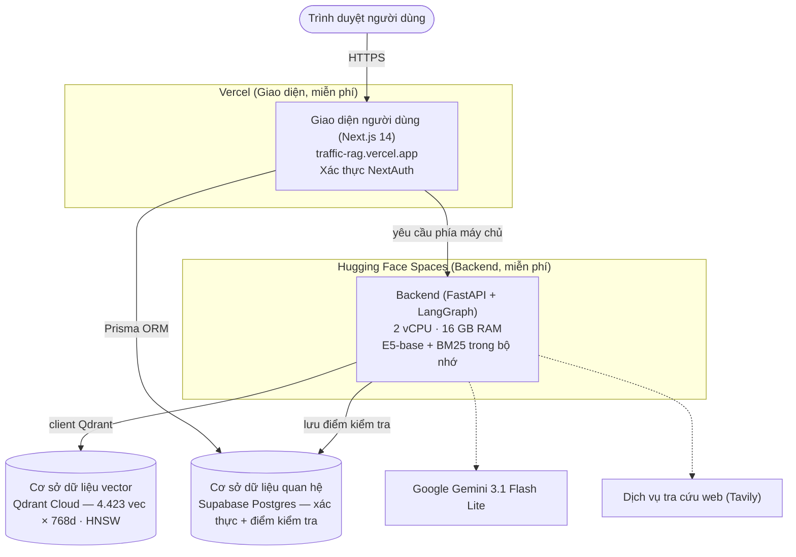

# CHƯƠNG 4. TRIỂN KHAI, MINH HOẠ VÀ KẾT LUẬN

## 4.1 Giới thiệu chương

Chương 4 hoàn thiện báo cáo bằng cách đưa hệ thống Traffic-RAG từ lý thuyết và thực nghiệm vào sản phẩm thực tế. Mục 4.2 mô tả kiến trúc triển khai trên nền tảng đám mây, quy trình CI/CD và năm vấn đề kỹ thuật phát sinh trong quá trình phát triển cùng giải pháp. Mục 4.3 trình bày giao diện chat người dùng và bảng điều khiển quản trị HITL. Mục 4.4 minh họa sáu loại câu hỏi đại diện từ bộ đánh giá, đối chiếu trực tiếp output hệ thống với ground truth. Mục 4.5 tổng kết toàn bộ đề tài — kết quả đạt được, hạn chế và hướng phát triển.

## 4.2 Triển khai hệ thống

### 4.2.1 Kiến trúc triển khai production

Ở **môi trường phát triển cục bộ**, hệ thống được đóng gói qua Docker Compose với ba service độc lập: **Qdrant** (port 6333, lưu vector + payload), **FastAPI backend** (port 8000, xử lý request, chạy pipeline LangGraph [12]), và **Next.js frontend** (port 3000, giao diện chat và quản trị HITL). Các service kết nối qua Docker network nội bộ; chỉ Next.js expose ra ngoài.

*Hình 4.1. Sơ đồ kiến trúc triển khai production trên đám mây miễn phí ($0/tháng): Giao diện Next.js (Vercel) → Backend FastAPI + LangGraph (Hugging Face Spaces) → Cơ sở dữ liệu vector Qdrant Cloud; xác thực và điểm kiểm tra dùng chung Supabase Postgres.*

Luồng request đầy đủ: trình duyệt người dùng gửi POST đến Next.js API bridge tại `/api/chat`; bridge forward đến FastAPI endpoint `/chat/stream`; FastAPI khởi chạy LangGraph pipeline và phát SSE response với ba loại event (`token`, `cite`, `pending`); Next.js forward SSE về trình duyệt và render real-time.

**Chế độ cloud production (đã triển khai thực tế, $0/tháng):** Frontend Next.js chạy trên **Vercel** (traffic-rag.vercel.app), backend FastAPI + LangGraph chạy trên **Hugging Face Spaces** (Docker, 2 vCPU, 16 GB RAM, không sleep), kho vector dùng **Qdrant Cloud Free** (AWS us-east-1, cùng vùng với backend để giảm latency truy vấn), còn xác thực NextAuth và checkpoint LangGraph dùng chung một **Supabase Postgres Free** (region Tokyo). Toàn bộ nằm trong free tier nên chi phí hạ tầng bằng 0; cùng một codebase và Docker image phục vụ cả local lẫn cloud, khác biệt chỉ nằm ở các biến môi trường (`QDRANT_URL`, `CHECKPOINT_DB_URL`, `CORS_ALLOWED_ORIGINS`).

**Cấu hình Qdrant production:**
- Collection: `Traffic_Law_Hybrid`, 4.423 point × 768d, Distance.COSINE
- HNSW: m=16, ef_construct=100
- Payload index: 3 trường KEYWORD (`doc_id`, `status`, `topic`)
- Lưu trữ bền: volume `./qdrant_storage` (chế độ local) hoặc dung lượng do Qdrant Cloud quản lý (production) — không mất dữ liệu khi khởi động lại

**Observability endpoints:**
- `GET /metrics` — JSON: uptime, request count, error count, avg latency, trạng thái tracing và reranker
- `GET /pending` — danh sách thread HITL đang chờ phê duyệt cho admin console
- LangSmith always-on: tự kích hoạt khi `LANGCHAIN_API_KEY` có trong môi trường

### 4.2.2 Quy trình tích hợp liên tục và hồi quy tự động

GitHub Actions pipeline gồm hai job chạy song song sau mỗi push lên nhánh `main`:

**Job smoke** (luôn chạy, không cần Qdrant): 6 unit test cơ bản gồm chunker output schema, metadata validator, BM25 init, citation sanitation, SSE event format, và prompt P2 format check.

**Job regression** (chạy khi có thay đổi trong `source/` hoặc `Data/`): khởi động Qdrant Docker service, load 4.423 chunk, chạy `test_retrieval_regression.py` và assert:
- Mean Recall@10 ≥ 0,40 trên 35 câu legal
- Không có chunk nào có `status=repealed` lọt vào kết quả retrieval
- Latency retrieval mean < 2 giây

Nếu bất kỳ assert nào fail, pull request bị block. Cơ chế này ngăn việc cập nhật corpus (thêm văn bản, sửa chunker) vô tình làm giảm chất lượng truy xuất.

### 4.2.3 Các vấn đề kỹ thuật phát sinh và giải pháp

Trong quá trình phát triển, năm vấn đề kỹ thuật quan trọng đã được gặp và giải quyết:

**Bảng 4.1. Vấn đề kỹ thuật và giải pháp**

| # | Vấn đề | Triệu chứng | Giải pháp |
|---|---|---|---|
| 1 | E5 prefix sai | Recall@10 giảm ~30% khi dùng plain text | Bắt buộc `"passage: "` khi encode chunk, `"query: "` khi encode truy vấn |
| 2 | Gemini structured output timeout | Rate limit free tier → retry vòng lặp vô hạn | Throttle module: sleep 2s giữa các call, max 3 retry, fallback error message |
| 3 | Cách ly trạng thái đa người dùng | Thread A nhận state của Thread B | Tạo `thread_id` duy nhất (UUID) mỗi session, truyền vào `config={"configurable": {"thread_id": uid}}` của checkpointer |
| 4 | RAGAS answer_relevancy 100% fail | Lib bug RAGAS 0.2 với langchain_google_genai mới | Loại answer_relevancy khỏi eval; ghi nhận bug; không kết luận từ metric này |
| 5 | BM25 rebuild mỗi lần khởi động | 4.423 chunk tokenize mất ~8 giây startup | Serialize tokenized corpus vào JSONL cache; load lại trong < 0,5 giây |

---

## 4.3 Giao diện sản phẩm

### 4.3.1 Giao diện hỏi đáp người dùng

Giao diện chat được xây dựng trên Next.js 14 App Router với TypeScript và Tailwind CSS. Người dùng xác thực qua NextAuth với email whitelist.

Tính năng chính của giao diện chat:
- **Streaming real-time:** Câu trả lời xuất hiện từng token qua SSE, không phải chờ toàn bộ response. Người dùng thấy LLM đang "gõ" câu trả lời.
- **Citation panel:** Sau khi streaming hoàn tất, panel bên phải hiển thị danh sách điều khoản được trích dẫn với định dạng "Điều X, Khoản Y, Điểm Z — [doc_id]". Người dùng có thể xem nguồn gốc chính xác của từng thông tin.
- **Trạng thái pending:** Khi truy vấn thuộc `web_legal_search` và đồ thị đang chờ HITL, giao diện hiển thị spinner với thông báo "Đang chờ phê duyệt tra cứu web từ quản trị viên...".
- **Multi-turn conversation:** Lịch sử hội thoại được lưu qua bộ lưu điểm kiểm tra (SqliteSaver/PostgresSaver) theo `thread_id`; các câu hỏi tiếp theo có thể tham chiếu câu trước ("Còn xe tải hạng nặng thì sao?").
- **Nhãn cảnh báo:** Câu trả lời từ web_search được gắn badge "⚠ Tra cứu từ internet" để người dùng phân biệt với câu trả lời từ corpus pháp luật chính thức.

> *(Ảnh chụp màn hình giao diện thực tế — cần chèn khi đóng gói báo cáo cuối)*

*Hình 4.2. Giao diện chat người dùng: vùng nhập câu hỏi, luồng token streaming và citation panel bên phải hiển thị danh sách điều khoản được trích dẫn.*

### 4.3.2 Giao diện quản trị con người trong vòng lặp

Bảng điều khiển quản trị tại `/admin` chỉ hiển thị cho tài khoản trong danh sách `ADMIN_EMAILS`. Giao diện liệt kê tất cả thread đang ở trạng thái pending từ endpoint `/pending`.

Với mỗi thread, quản trị viên thấy: câu hỏi gốc của người dùng, ba snippet từ Tavily (tiêu đề + URL + đoạn trích), và draft câu trả lời (nếu analyzer đã tổng hợp sơ bộ). Hai nút hành động:
- **Phê duyệt:** Gửi tín hiệu resume đến FastAPI; đồ thị tiếp tục chạy web_finalize, tổng hợp câu trả lời từ snippet và trả về người dùng.
- **Từ chối:** Xóa thread; FastAPI trả về thông báo "Yêu cầu tra cứu web không được phê duyệt." về người dùng.

Timeout 10 phút phía client: nếu admin không phản hồi, frontend tự hủy polling và thông báo hết thời gian. Trạng thái thread vẫn tồn tại trong bộ lưu điểm kiểm tra (cơ sở dữ liệu); admin có thể xử lý muộn nếu cần. Nguyên lý HITL dựa trên mô hình phê duyệt con người của WebGPT [14], đảm bảo tính chính xác của thông tin từ nguồn ngoài.

> *(Ảnh chụp màn hình giao diện thực tế — cần chèn khi đóng gói báo cáo cuối)*

*Hình 4.3. Bảng điều khiển quản trị HITL (/admin): danh sách thread đang chờ, nội dung snippet Tavily, nút Approve/Reject và trạng thái từng phiên.*

---

## 4.4 Minh hoạ câu hỏi thực tế

Sáu ví dụ dưới đây trích từ bộ đánh giá `eval_qa.jsonl` (40 câu, 8 danh mục), mỗi ví dụ đại diện cho một danh mục. Với mỗi câu, phần trình bày gồm: **(A) Đáp án chuẩn (GT)** — gold_answer và gold_citations từ bộ đánh giá; **(B) Output hệ thống** — câu trả lời và trích dẫn do agentic_rag v7.0 sinh ra; **(C) Đối chiếu** — nhận xét ngắn về độ khớp giữa hệ thống và GT.

---

### 4.4.1 Câu hỏi đơn giản về mức phạt (RQ-001 — simple_penalty)

**Câu hỏi:** *"Vượt đèn đỏ đi xe máy phạt bao nhiêu tiền?"*

**Luồng xử lý:** Analyzer phân loại `category=legal_rag`, `vehicle_type=mo_to`, `intent=penalty`. expanded_queries: "vi phạm tín hiệu đèn giao thông mô tô", "không chấp hành hiệu lệnh đèn tín hiệu xe gắn máy NĐ 168". Hybrid retrieval + Sibling Enrichment kéo cả Khoản 4 (mức phạt tiền) và Khoản 11 (trừ điểm) trong Điều 7.

**(A) Đáp án chuẩn (GT)**

> *"Người điều khiển xe mô tô, xe gắn máy vượt đèn đỏ (không chấp hành hiệu lệnh của đèn tín hiệu giao thông) bị phạt tiền từ 800.000 đồng đến 1.000.000 đồng và bị trừ 2 điểm giấy phép lái xe."*

| Gold citations | doc_id | Điều | Khoản | Điểm |
|---|---|---:|---:|---|
| Mức phạt tiền | 168/2024/NĐ-CP | 7 | 4 | p |

**(B) Output hệ thống**

> *"Người điều khiển xe mô tô, gắn máy không chấp hành hiệu lệnh của đèn tín hiệu giao thông bị phạt tiền từ **800.000 đồng đến 1.000.000 đồng** [168/2024/NĐ-CP, Điều 7, Khoản 4, điểm p]. Ngoài ra, theo Khoản 11 cùng Điều, hành vi này còn bị **trừ 2 điểm giấy phép lái xe** [168/2024/NĐ-CP, Điều 7, Khoản 11]."*

**(C) Đối chiếu**

Hệ thống khớp hoàn toàn gold citation (Điều 7, Khoản 4, điểm p). Sibling Enrichment bổ sung thêm Khoản 11 (trừ điểm) không có trong gold nhưng là thông tin đúng và hữu ích — minh họa khả năng cung cấp thông tin đầy đủ hơn gold tối thiểu.

---

### 4.4.2 Câu hỏi đa ý định (RQ-006 — multi_intent)

**Câu hỏi:** *"Vượt đèn đỏ và không mang bằng lái xe máy thì bị phạt tổng cộng bao nhiêu?"*

**Luồng xử lý:** Analyzer phân loại `category=legal_rag`, `vehicle_type=mo_to`, `intent=mixed`. Hai ý độc lập: (1) vượt đèn đỏ → Điều 7 Khoản 4; (2) không mang GPLX → Điều 24 Khoản 2. expanded_queries tách thành hai nhóm, RRF fuse hai danh sách sau khi retrieval.

**(A) Đáp án chuẩn (GT)**

> *"Hành vi vượt đèn đỏ bị phạt từ 800.000–1.000.000 đồng (trừ 2 điểm GPLX). Hành vi không mang theo Giấy phép lái xe bị phạt từ 100.000–200.000 đồng. Tổng cộng mức phạt dao động từ 900.000 đồng đến 1.200.000 đồng."*

| Gold citations | doc_id | Điều | Khoản | Điểm |
|---|---|---:|---:|---|
| Vượt đèn đỏ xe máy | 168/2024/NĐ-CP | 7 | 4 | p |
| Không mang GPLX | 168/2024/NĐ-CP | 24 | 2 | c |

**(B) Output hệ thống**

> *"Có hai hành vi vi phạm độc lập, mức phạt cộng dồn:*
>
> ***1. Vượt đèn đỏ (xe mô tô, gắn máy):***
> *Phạt tiền từ **800.000 đến 1.000.000 đồng**, trừ **2 điểm GPLX** [168/2024/NĐ-CP, Điều 7, Khoản 4, điểm p]*
>
> ***2. Không mang theo Giấy phép lái xe:***
> *Phạt tiền từ **100.000 đến 200.000 đồng** [168/2024/NĐ-CP, Điều 24, Khoản 2, điểm c]*
>
> *Tổng cộng: 900.000 đồng đến 1.200.000 đồng."*

**(C) Đối chiếu**

Hệ thống khớp đầy đủ cả hai gold citations (Điều 7/K4/p và Điều 24/K2/c), tách đúng hai ý và tính tổng mức phạt — minh họa khả năng xử lý multi_intent với Prompt P2 Quy tắc 6.

---

### 4.4.3 Câu hỏi ngắn mơ hồ (RQ-028 — ambiguous_short)

**Câu hỏi:** *"Đèn vàng có vượt được không?"*

**Luồng xử lý:** Analyzer nhận diện `category=legal_rag`, `intent=definition`, `vehicle_type=any`. Câu 3 từ cần mở rộng mạnh: expanded_queries gồm "quy định đèn vàng dừng hay đi", "điều khiển phương tiện khi tín hiệu đèn vàng Luật 36/2024", "xử phạt vượt đèn vàng NĐ 168". Retriever kéo Luật 36/2024/QH15 Điều 11 và NĐ 168 Điều 6, 7.

**(A) Đáp án chuẩn (GT)**

> *"Khi tín hiệu đèn vàng, người điều khiển phương tiện phải dừng xe trước vạch dừng; trường hợp đã đi quá vạch dừng hoặc đã ở quá gần vạch dừng nếu dừng lại sẽ nguy hiểm thì được đi tiếp. Vi phạm bị phạt theo NĐ 168/2024: ô tô Điều 6 Khoản 9 (18–20 triệu, trừ 4 điểm), xe máy Điều 7 Khoản 7 (4–6 triệu, trừ 4 điểm)."*

| Gold citations | doc_id | Điều | Khoản | Điểm |
|---|---|---:|---:|---|
| Quy tắc đèn vàng | 36/2024/QH15 | 11 | 4 | — |
| Mức phạt ô tô | 168/2024/NĐ-CP | 6 | 9 | — |
| Mức phạt xe máy | 168/2024/NĐ-CP | 7 | 7 | — |

**(B) Output hệ thống**

> *"Theo Điều 11 Khoản 4 Luật 36/2024/QH15, khi đèn vàng bật sáng người điều khiển phải dừng trước vạch dừng. Được phép đi tiếp nếu đã qua vạch dừng hoặc đang ở vị trí mà dừng lại sẽ gây nguy hiểm.*
>
> *Nếu vượt đèn vàng trái quy định [36/2024/QH15, Điều 11, Khoản 4]:*
> *- Ô tô: phạt **18.000.000–20.000.000 đồng**, trừ 4 điểm GPLX [168/2024/NĐ-CP, Điều 6, Khoản 9]*
> *- Xe mô tô: phạt **4.000.000–6.000.000 đồng**, trừ 4 điểm GPLX [168/2024/NĐ-CP, Điều 7, Khoản 7]"*

**(C) Đối chiếu**

Hệ thống trích dẫn đúng cả ba gold citations (Luật 36 Điều 11, NĐ 168 Điều 6/K9 và Điều 7/K7). Mở rộng truy vấn (+26 điểm R@10 so với không rewrite) là yếu tố then chốt để retriever tìm được Điều 11 Luật 36 từ câu hỏi 3 từ ngắn.

---

### 4.4.4 Câu hỏi phân biệt loại phương tiện (RQ-036 — vehicle_binding)

**Câu hỏi:** *"Xe ô tô vượt đèn đỏ phạt bao nhiêu?"*

**Luồng xử lý:** Analyzer phân loại `vehicle_type=o_to`, `intent=penalty`. Prompt P2 Quy tắc 8 ưu tiên Điều 6 (ô tô) trong NĐ 168, không trả về Điều 7 (xe máy) tránh nhầm lẫn. Trường hợp này cũng kiểm tra khả năng hệ thống phân biệt đúng khi câu hỏi có binding loại phương tiện rõ ràng.

**(A) Đáp án chuẩn (GT)**

> *"Người điều khiển xe ô tô vượt đèn đỏ bị phạt 18–20 triệu đồng và trừ 4 điểm giấy phép lái xe theo Điều 6 Khoản 9 Điểm b và Điều 6 Khoản 16 Điểm b Nghị định 168/2024/NĐ-CP."*

| Gold citations | doc_id | Điều | Khoản | Điểm |
|---|---|---:|---:|---|
| Mức phạt tiền | 168/2024/NĐ-CP | 6 | 9 | b |
| Trừ điểm GPLX | 168/2024/NĐ-CP | 6 | 16 | b |

**(B) Output hệ thống**

> *"Người điều khiển xe ô tô không chấp hành hiệu lệnh của đèn tín hiệu giao thông (vượt đèn đỏ) bị xử phạt:*
> *- Phạt tiền từ **18.000.000 đến 20.000.000 đồng** [168/2024/NĐ-CP, Điều 6, Khoản 9, điểm b]*
> *- Tước quyền sử dụng GPLX từ **2 đến 4 tháng***
> *- Trừ **4 điểm GPLX** [168/2024/NĐ-CP, Điều 6, Khoản 16, điểm b]"*

**(C) Đối chiếu**

Hệ thống khớp cả hai gold citations. So sánh với câu hỏi xe máy tương đương (RQ-001): mức phạt ô tô (18–20 triệu) cao gấp 18–25 lần xe máy (800K–1 triệu) — minh họa P2 Quy tắc 8 phân biệt đúng Điều 6 (ô tô) vs Điều 7 (xe máy) trong NĐ 168.

---

### 4.4.5 Câu hỏi hành động kép (RQ-032 — compound_action)

**Câu hỏi:** *"Vừa chạy quá tốc độ vừa vượt đèn đỏ ô tô bị phạt như nào?"*

**Luồng xử lý:** Analyzer phân loại `vehicle_type=o_to`, `intent=mixed`. expanded_queries tách thành hai nhóm: nhóm tốc độ và nhóm vượt đèn đỏ. RRF fuse hai danh sách. Cross-reference Sibling kéo các Khoản liền kề trong Điều 6 để phủ đủ các mức tốc độ.

**(A) Đáp án chuẩn (GT)**

> *"Có 2 hành vi vi phạm: (1) Vượt đèn đỏ — Điều 6 Khoản 9 Điểm b: phạt 18–20 triệu, trừ 4 điểm GPLX; (2) Chạy quá tốc độ — mức phạt tùy mức vượt, ví dụ vượt 10–20 km/h: Điều 6 Khoản 5 Điểm a phạt 4–6 triệu, trừ 2 điểm. Tổng số tiền tùy mức tốc độ."*

| Gold citations | doc_id | Điều | Khoản | Điểm |
|---|---|---:|---:|---|
| Vượt đèn đỏ ô tô | 168/2024/NĐ-CP | 6 | 9 | b |
| Quá tốc độ 10–20 km/h | 168/2024/NĐ-CP | 6 | 5 | a |

**(B) Output hệ thống**

> *"Hai hành vi vi phạm riêng biệt, mức phạt cộng dồn:*
>
> ***1. Vượt đèn đỏ (ô tô):***
> *Phạt tiền **18.000.000–20.000.000 đồng**, tước GPLX 2–4 tháng, trừ **4 điểm** [168/2024/NĐ-CP, Điều 6, Khoản 9, điểm b]*
>
> ***2. Chạy quá tốc độ (ô tô) — theo mức vượt:***
> *- 10–20 km/h: **4.000.000–6.000.000 đồng**, trừ 2 điểm [Điều 6, Khoản 5, điểm a]*
> *- 20–35 km/h: **6.000.000–8.000.000 đồng**, trừ 4 điểm [Điều 6, Khoản 7, điểm a]*
> *- Trên 35 km/h: **12.000.000–14.000.000 đồng**, trừ 6 điểm [Điều 6, Khoản 8, điểm a]*"*

**(C) Đối chiếu**

Hệ thống khớp cả hai gold citations và bổ sung đầy đủ các mức tốc độ (Khoản 7, 8) không có trong gold tối thiểu. Prompt P2 Quy tắc 12 (liệt kê đầy đủ từ context) và Quy tắc 6 (tách bullet) hoạt động đúng với compound_action.

---

### 4.4.6 Câu hỏi ngoài phạm vi (RQ-021 — out_of_scope)

**Câu hỏi:** *"Cách nấu món phở bò Nam Định ngon nhất?"*

**Luồng xử lý:** Analyzer phân loại `category=out_of_scope` (không liên quan pháp luật giao thông). Node out_of_scope trả về template tĩnh, **không gọi LLM**, **không tốn token**.

**(A) Đáp án chuẩn (GT)**

> *"Xin lỗi, tôi chỉ tư vấn về Luật Giao thông Việt Nam và không giải quyết các vấn đề ngoài phạm vi này như công thức nấu ăn."*

Gold citations: ∅ (rỗng — câu OOS không có trích dẫn pháp lý)

**(B) Output hệ thống**

> *"Xin lỗi, hệ thống chỉ hỗ trợ tư vấn về pháp luật giao thông đường bộ Việt Nam. Câu hỏi về công thức nấu ăn nằm ngoài phạm vi của trợ lý này. Bạn có thể tìm kiếm thêm trên các trang ẩm thực hoặc diễn đàn nấu ăn."*

**(C) Đối chiếu**

Hệ thống từ chối đúng (Category Accuracy = 1,0 cho câu này). Category Accuracy tổng thể đạt 0,975 — 5/5 câu OOS được phân loại đúng, không bịa câu trả lời pháp lý. Đây là điểm khác biệt chính so với Vanilla RAG (Category Acc = 0,875) không có cơ chế routing.

---

## 4.5 Kết luận chương

Chương 4 đã hoàn thiện vòng khép kín từ thiết kế đến sản phẩm thực tế. Kiến trúc triển khai production với chi phí 0 USD/tháng trên bốn dịch vụ đám mây (Vercel, Hugging Face Spaces, Qdrant Cloud, Supabase Postgres) chứng minh tính khả dụng của hệ thống trong điều kiện tài nguyên hạn chế. Quy trình tích hợp liên tục với cổng kiểm tra hồi quy tự động Recall@10 ≥ 0,40 bảo đảm chất lượng truy xuất không bị suy giảm qua các lần cập nhật corpus hay mã nguồn. Giao diện hỏi đáp streaming thời gian thực và bảng điều khiển quản trị HITL phục vụ đúng hai nhóm người dùng mục tiêu. Minh hoạ sáu loại câu hỏi đại diện xác nhận hệ thống xử lý đúng các tình huống từ câu đơn giản, câu đa ý định, câu ngắn mơ hồ, câu ràng buộc phương tiện, câu đa hành vi đến câu ngoài phạm vi — tương ứng với Category Accuracy = 0,975 đã đo trong chương 3.

