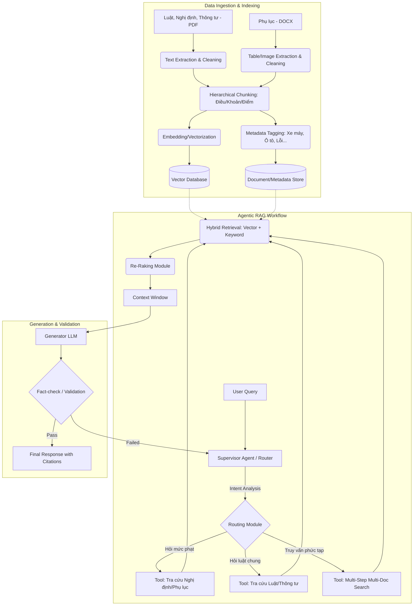

# Thiết kế Pipeline Agentic RAG (Phiên bản mới)

Tài liệu này trình bày chi tiết cấu trúc và luồng xử lý của hệ thống Agentic RAG mới, được tùy chỉnh để xử lý bộ dữ liệu pháp luật giao thông chuyên sâu bao gồm: **Luật**, **Nghị định**, **Thông tư** (định dạng PDF) và **Phụ lục** (định dạng DOCX).

---

## 1. Sơ đồ Kiến trúc Hệ thống (System Architecture)

Sơ đồ dưới đây biểu diễn luồng hoạt động tổng thể từ khi nhập dữ liệu đến khi người dùng nhận được câu trả lời.

---

## 2. Chi tiết Từng Bước trong Pipeline

### Bước 1: Data Ingestion & Preprocessing (Tiền xử lý dữ liệu)

Với bộ dữ liệu chuyên ngành luật giao thông, bước này là tối quan trọng để đảm bảo RAG không bị sai ngữ cảnh.

- **Đối với PDF (Luật, Nghị định, Thông tư):**
  - Làm sạch text (bỏ header/footer dư thừa).
  - Sử dụng logic gom cụm theo cấp bậc pháp lý: `Chương -> Điều -> Khoản -> Điểm`. Điều này giúp LLM biết chính xác đoạn text thuộc cấp bậc nào, tránh mất bối cảnh.
- **Đối với DOCX (Phụ lục):**
  - Phụ lục thường chứa hình ảnh biển báo, thông số kỹ thuật và các bảng biểu mức phạt phức tạp.
  - Việc tách bảng (table extraction) phải duy trì cấu trúc (Row/Column) hoặc chuyển sang dạng Markdown / JSON trước khi chunking để bảo tồn ý nghĩa.

### Bước 2: Indexing & Storage (Lưu trữ và Đánh chỉ mục)

Thay vì sử dụng chunking cố định (ví dụ 500 tokens), hệ thống sử dụng **Semantic Chunking kết hợp Metadata**:

- **Vector DB:** Lưu trữ các sentence/paragraph embeddings (Sử dụng model tiếng Việt tốt hoặc model Multilingual).
- **Metadata Store:** Gắn thẻ cho mỗi chunk:
  - `Loại văn bản`: Luật / Nghị định / Thông tư / Phụ lục
  - `Nhóm đối tượng`: Người điều khiển ô tô, xe máy, xe đạp...
  - `Loại hành vi`: Vượt đèn đỏ, nồng độ cồn, không bằng lái...

### Bước 3: Query Routing & Planning (Tư duy của Agent)

Khi nhận `User Query`, hệ thống sử dụng bộ định tuyến (Router/Supervisor Agent) có khả năng `Tool Calling`.

1. **Phân tích truy vấn (Query Understanding):**
   - _Ví dụ:_ "Đi xe máy vượt đèn đỏ bị phạt bao nhiêu tiền và có bị tước bằng không?"
   - Agent phân tích: `Đối tượng = Xe máy`, `Hành vi = Vượt đèn đỏ`.
2. **Chọn Tool (Tool Selection):**
   - Agent gọi tool `search_penalty_nghidinh(vehicle="xe máy", violation="vượt đèn đỏ")` thay vì tìm kiếm vector mù quáng vào toàn bộ CSDL.

### Bước 4: Advanced Retrieval (Truy xuất nâng cao)

Đây là bước kết hợp nhiều công nghệ lấy dữ liệu:

- **Hybrid Search:** Kết hợp Dense Retrieval (tìm theo ngữ nghĩa bằng Vector) và Sparse Retrieval (tìm theo từ khóa BM25) để đảm bảo các từ khóa luật (như "tước quyền sử dụng", "biển số 123") phải khớp chính xác.
- **Re-ranking:** Đưa các chunk thô qua một model Reranker để chấm điểm lại, chỉ chọn top 3 - 5 chunks liên quan nhất đưa lên LLM.

### Bước 5: Generation & Citation (Sinh phản hồi & Trích dẫn)

- **Sinh văn bản:** LLM nhận ngữ cảnh và viết lại câu trả lời dễ hiểu cho người dùng nhưng vẫn đảm bảo tính nghiêm minh của pháp luật.
- **Quy chuẩn trích dẫn:** Yêu cầu LLM bắt buộc đưa ra base của luật.
  - _Ví dụ:_ "Theo Điểm a, Khoản 4, Điều 6 Nghị định 100/2019/NĐ-CP (sửa đổi bổ sung bởi Nghị định 123/2021/NĐ-CP), mức phạt cho ô tô vượt đèn đỏ là..."
- **Fact-checking Loop:** Nếu LLM nhận ra context trả về không đủ để kết luận, nó có thể từ chối trả lời (fallback) thay vì bịa ra mức phạt (hallucination), hoặc yêu cầu Agent lặp lại quá trình tìm kiếm với keyword khác.

---

## 3. Tương tác với Workflow (Human-in-the-Loop - Tùy chọn)

Trong các truy vấn phức tạp hoặc yêu cầu độ chính xác 100% (ví dụ: tư vấn khiếu nại luật), hệ thống có thể cấu hình **Human-in-the-loop (HITL)**:

- Agent đưa ra kế hoạch truy xuất/tra cứu.
- Dừng lại đợi con người (chuyên gia pháp lý) phê duyệt tool calls.
- Nếu được duyệt, Agent tự động chạy tool và tổng hợp.
