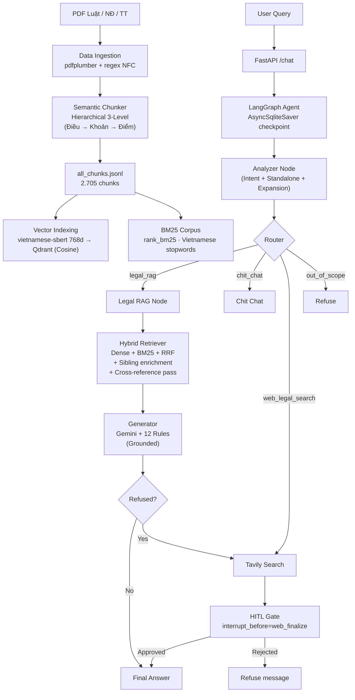
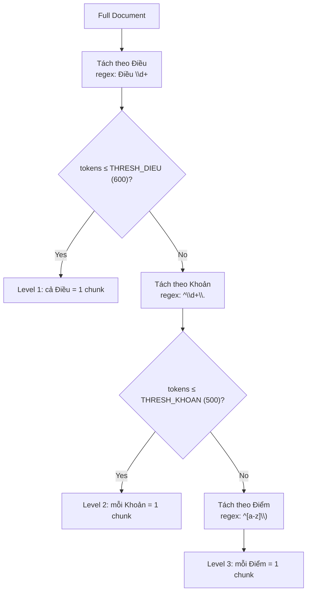
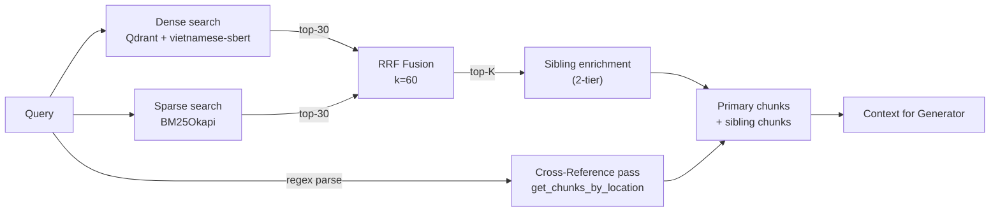

# BÁO CÁO KỸ THUẬT HỆ THỐNG

# Agentic RAG — Trợ lý Pháp lý Giao thông Việt Nam

> **Phiên bản:** v5.8.1 Final · **Ngày:** 23/04/2026
> **Công nghệ lõi:** LangGraph · Qdrant · Sentence-BERT (PhoBERT) · Google Gemini · FastAPI · Streamlit
> **Repository:** [MacPhuPhong/TRAFFIC_LAW_LLM_RAG_AGENTIC](https://github.com/MacPhuPhong/TRAFFIC_LAW_LLM_RAG_AGENTIC)

---

## Mục lục

1. [Tổng quan kiến trúc hệ thống](#1-tổng-quan-kiến-trúc-hệ-thống)
2. [Giai đoạn 1 — Xử lý dữ liệu (Data Ingestion)](#2-giai-đoạn-1--xử-lý-dữ-liệu-data-ingestion)
3. [Giai đoạn 2 — Phân đoạn ngữ nghĩa (Semantic Chunking)](#3-giai-đoạn-2--phân-đoạn-ngữ-nghĩa-semantic-chunking)
4. [Giai đoạn 3 — Vector Embedding & Indexing (toán học chuyên sâu)](#4-giai-đoạn-3--vector-embedding--indexing-toán-học-chuyên-sâu)
5. [Giai đoạn 4 — Hybrid Retrieval (Dense + BM25 + RRF + Cross-Reference)](#5-giai-đoạn-4--hybrid-retrieval-dense--bm25--rrf--cross-reference)
6. [Giai đoạn 5 — Grounded Generation](#6-giai-đoạn-5--grounded-generation)
7. [Giai đoạn 6 — Agentic Workflow (LangGraph)](#7-giai-đoạn-6--agentic-workflow-langgraph)
8. [Giai đoạn 7 — Deployment & API](#8-giai-đoạn-7--deployment--api)
9. [Phụ lục A — Tổng kết kỹ thuật](#phụ-lục-a--tổng-kết-kỹ-thuật)
10. [Phụ lục B — Changelog v5.5 → v5.6](#phụ-lục-b--changelog-v55--v56)
11. [Phụ lục C — Changelog v5.6 → v5.8.1](#phụ-lục-c--changelog-v56--v581)

---

## 1. Tổng quan kiến trúc hệ thống

### 1.1 Mermaid architecture diagram



> [!NOTE]
> **Thay đổi ở v5.6:** node `risk_tag` đã bị **loại bỏ hoàn toàn** (node, state field, API field, UI banner). Câu trả lời RAG phát hành nguyên văn vì nội dung đã trích từ NĐ 168/2024 pháp điển. HITL **chỉ** chặn trên nhánh web-search. Xem [Phụ lục B](#phụ-lục-b--changelog-v55--v56).

### 1.2 Bảng công nghệ sử dụng

| Lớp                  | Thành phần           | Công nghệ / Thư viện                                                          | Vai trò                                     |
| -------------------- | -------------------- | ----------------------------------------------------------------------------- | ------------------------------------------- |
| Ingestion            | PDF extraction       | `pdfplumber`                                                                  | Trích text + bảng (bbox-aware)              |
| Ingestion            | Cleaning             | `regex` + `unicodedata` (NFC)                                                 | Khử nhiễu, chuẩn hoá                        |
| Chunking             | Splitter             | [HierarchicalLegalSplitter](traffic_rag/source/ingestion/semantic_chunker.py) | 3-tier: Điều → Khoản → Điểm                 |
| Embedding            | Encoder              | `KeepItReal/vietnamese-sbert` (PhoBERT-based SBERT)                           | 768-d sentence embedding                    |
| Vector DB            | Storage              | `Qdrant` (Docker, gRPC :6334)                                                 | Cosine search + payload filter              |
| Lexical              | Sparse               | `rank_bm25.BM25Okapi`                                                         | In-memory BM25 index                        |
| Fusion               | Ranker               | Reciprocal Rank Fusion (RRF, k=60)                                            | Kết hợp dense + sparse                      |
| Reference resolution | Structural pass      | Regex `_REF_DIEU/_REF_KHOAN/_REF_DIEM`                                        | Lookup Điều/Khoản/Điểm đích danh            |
| LLM                  | Analyzer + Generator | Google **Gemini 3.1 Flash Lite Preview** (via `langchain-google-genai`)       | Phân loại, chuẩn hoá, mở rộng, sinh trả lời |
| Agent                | Orchestration        | `LangGraph` `StateGraph`                                                      | Đồ thị trạng thái có điều kiện              |
| Checkpoint           | Memory               | `AsyncSqliteSaver`                                                            | Lưu chat_history + HITL resume              |
| Fallback             | Web search           | `Tavily API` (hạn chế domain VN)                                              | Tra cứu khi corpus không có                 |
| API                  | Backend              | `FastAPI` + `uvicorn`                                                         | REST async, 4 endpoint                      |
| UI                   | Frontend             | `Streamlit`                                                                   | Chat + HITL review form                     |
| Container            | Packaging            | `docker-compose`                                                              | Qdrant + app                                |

### 1.3 Các chỉ số cốt lõi

| Chỉ số                     | Giá trị                             | Nguồn                                                                          |
| -------------------------- | ----------------------------------- | ------------------------------------------------------------------------------ |
| Tổng văn bản pháp luật     | 20+ (Luật/NĐ/TT)                    | Thủ công curate                                                                |
| Tổng chunks sau xử lý      | **2.705**                           | Log uvicorn `BM25 corpus built: 2705 docs`                                     |
| Tổng token corpus          | 424.677                             | `BM25 corpus built: ... 424677 tokens`                                         |
| Embedding dim              | 768                                 | vietnamese-sbert                                                               |
| Qdrant collection          | `traffic_law_v2`                    | [retriever.py:32](traffic_rag/source/rag_core/retriever.py#L32)                |
| `top_k` default            | **10**                              | [nodes.py:176](traffic_rag/source/agent/nodes.py#L176)                         |
| `top_k` broad queries      | **20**                              | [nodes.py:177](traffic_rag/source/agent/nodes.py#L177)                         |
| `candidates_per_retriever` | 30                                  | [retriever.py:72](traffic_rag/source/rag_core/retriever.py#L72)                |
| RRF constant `k`           | 60                                  | [retriever.py:71](traffic_rag/source/rag_core/retriever.py#L71)                |
| Sibling `max_neighbors`    | 2 (±2 Khoản)                        | [retriever.py:164](traffic_rag/source/rag_core/retriever.py#L164)              |
| Generator temperature      | 0.1                                 | [retriever & generator default](traffic_rag/source/rag_core/generator.py#L101) |
| HITL gate                  | `interrupt_before=["web_finalize"]` | [graph.py:115](traffic_rag/source/agent/graph.py#L115)                         |

---

## 2. Giai đoạn 1 — Xử lý dữ liệu (Data Ingestion)

### 2.1 Sơ đồ pipeline

```
Data/raw/{luat,nghidinh,thongtu}/*.pdf
       │
       ▼  pdfplumber + clean_*.py
Data/cleaned/{luat,nghidinh,thongtu}/*.md
```

Ba script làm sạch chuyên biệt cho 3 loại văn bản:

| Script                                                                        | Đối tượng                | Quy ước đặt tên        |
| ----------------------------------------------------------------------------- | ------------------------ | ---------------------- |
| [clean_luat_pdfs.py](traffic_rag/source/ingestion/clean_luat_pdfs.py)         | Luật (QH)                | Luật 35, 36, 23…       |
| [clean_nghidinh_pdfs.py](traffic_rag/source/ingestion/clean_nghidinh_pdfs.py) | Nghị định (CP)           | NĐ 168, 336, 100, 123… |
| [clean_thongtu_pdfs.py](traffic_rag/source/ingestion/clean_thongtu_pdfs.py)   | Thông tư (BCA/BGTVT/BTC) | TT 79, 51, 30, 46…     |

### 2.2 Năm bước xử lý chi tiết

**Bước 1 — Trích xuất (Extraction) với bbox-based exclusion**

```python
with pdfplumber.open(pdf_path) as pdf:
    for page in pdf.pages:
        bboxes = [t.bbox for t in page.find_tables()]
        if bboxes:
            filtered_page = page.filter(
                lambda o: not any(inside(o, b) for b in bboxes)
            )
            page_text = filtered_page.extract_text()

        for table in page.extract_tables(table_settings=strict):
            md = table_to_markdown(table)
```

> [!IMPORTANT]
> Loại trừ text nằm **bên trong bounding box của bảng** khi trích text thô, sau đó trích bảng riêng sang Markdown. Nếu không làm, mỗi dòng bảng sẽ xuất hiện **hai lần** (một lần dạng text thuần, một lần trong Markdown bảng) và phá hỏng BM25 + embedding.

**Bước 2 — Chuẩn hoá Unicode + khử nhiễu**

```python
text = unicodedata.normalize("NFC", raw_text)

RE_HEADER_NOISE = r"^\d{1,2}/\d{1,2}/\d{2,4},.*about:blank$"
RE_FOOTER_NOISE = r"about:blank\s+\d+/\d+|Thư viện pháp luật"
RE_PAGE_NUM     = r"^(Trang\s+)?\d+(\s*/\s*\d+)?$"

# Đánh dấu heading Markdown để splitter regex phát hiện
"Chương I…"   → "# Chương I…"
"Điều 5: …"   → "## Điều 5: …"

# Bold ngày tháng quan trọng
"ngày 15 tháng 3 năm 2024" → "**ngày 15 tháng 3 năm 2024**"
```

**Bước 3 — Nối dòng thông minh (line merging)**

Chỉ nối khi đồng thời thoả 3 điều kiện:

1. Dòng trước kết thúc bằng chữ cái / dấu phẩy / chấm phẩy (regex `RE_MERGE_END`).
2. Dòng sau bắt đầu bằng chữ thường.
3. Dòng sau **không** phải heading (Điều/Khoản/Chương).

Tránh sự cố nối nhầm giữa 2 khoản độc lập — hay xảy ra khi PDF xuất ra text ngắt dòng không nhất quán.

**Bước 4 — Per-file strategy (chiến lược riêng cho từng văn bản)**

Một số Nghị định bị bãi bỏ một phần; mỗi file có config riêng:

```python
FILE_STRATEGIES = {
    "nd168_2024_…": {"keep_all": True},                 # Giữ toàn bộ
    "nd100_2019_…": {                                    # Chỉ giữ mảng đường sắt
        "keep_all": False,
        "include_section_keywords": ["đường sắt", "tàu hỏa"],
        "exclude_section_keywords": ["đường bộ", "xe ô tô"],
        "prepend_warning": "⚠️ Mảng đường bộ đã bị thay thế bởi NĐ 168/2024…",
    },
}
```

**Bước 5 — Bảng → Markdown**

```python
def table_to_markdown(table, annotate_diem_tru=False):
    # Fill merged cells (bảng PDF hay có ô trống do merge cell)
    last_seen = [""] * max_cols
    for row in table:
        for j, cell in enumerate(row):
            if not cell and last_seen[j]:
                cell = last_seen[j]          # kế thừa từ ô trên
            last_seen[j] = cell or last_seen[j]
    # Render pipe table:  | H1 | H2 |\n|---|---|\n| D1 | D2 |
```

Kèm tuỳ chọn `annotate_diem_tru=True` bôi đậm số điểm trừ GPLX trong cột cuối (hữu ích cho NĐ 168 — bảng trừ điểm là căn cứ pháp lý duy nhất).

### 2.3 Danh sách văn bản pháp luật đã thu thập

| STT | Văn bản                                      | Mã số              | Trạng thái                    |
| --- | -------------------------------------------- | ------------------ | ----------------------------- |
| 1   | Luật Đường bộ 2024                           | 35/2024/QH15       | ✅ Hiệu lực                   |
| 2   | Luật Trật tự ATGT 2024                       | 36/2024/QH15       | ✅ Hiệu lực                   |
| 3   | NĐ Xử phạt VPHC đường bộ                     | **168/2024/NĐ-CP** | ✅ Hiệu lực (văn bản trụ cột) |
| 4   | NĐ Xử phạt vận tải                           | 336/2025/NĐ-CP     | ✅ Hiệu lực                   |
| 5   | NĐ Kinh doanh vận tải                        | 10/2020/NĐ-CP      | ✅ Hiệu lực                   |
| 6   | TT Đăng ký xe                                | 79/2024/TT-BCA     | ✅ Hiệu lực                   |
| 7   | TT Sửa đổi đăng ký xe                        | 51/2025/TT-BCA     | ✅ Hiệu lực                   |
| 8   | TT Đăng kiểm ô tô                            | 30/2024/TT-BGTVT   | ✅ Hiệu lực                   |
| 9   | TT Đào tạo sát hạch GPLX                     | 35/2024/TT-BGTVT   | ✅ Hiệu lực                   |
| 10+ | …và 10+ văn bản khác (NĐ 123, TT 46, TT 47…) |                    |                               |

---

## 3. Giai đoạn 2 — Phân đoạn ngữ nghĩa (Semantic Chunking)

### 3.1 Kiến trúc HierarchicalLegalSplitter

File: [source/ingestion/semantic_chunker.py](traffic_rag/source/ingestion/semantic_chunker.py)

Văn bản pháp luật Việt Nam có cấu trúc phân cấp:

```
Chương → Điều → Khoản → Điểm
```

Splitter chia text theo **3 tầng** dựa trên ngưỡng token:



### 3.2 Regex phát hiện cấu trúc

```python
RE_DIEU  = re.compile(r"(?:##\s*)?Điều\s+(\d+)[.:]\s*(.*)")
RE_KHOAN = re.compile(r"^(\d+)\.(?=\s+[A-ZÀ-Ỹ])", re.MULTILINE)
RE_DIEM  = re.compile(r"^([a-z])\)(?=\s+)",       re.MULTILINE)
```

Lookahead `(?=\s+[A-ZÀ-Ỹ])` tránh false-positive với số ngẫu nhiên trong nội dung (ví dụ "1. 500.000 đồng" không phải mở khoản mới).

### 3.3 Ngưỡng split (thresholds)

| Tham số        | Giá trị   | Ý nghĩa                                                       |
| -------------- | --------- | ------------------------------------------------------------- |
| `THRESH_DIEU`  | 600 token | Điều > 600 token → split xuống Khoản                          |
| `THRESH_KHOAN` | 500 token | Khoản > 500 token → split xuống Điểm                          |
| `MIN_CHUNK`    | 30 token  | Chunk < 30 token → drop (quá ngắn, vô nghĩa về mặt retrieval) |

### 3.4 Ước lượng token tiếng Việt

```python
def count_tokens(text: str) -> int:
    words = len(text.split())
    return int(words * 1.3)
```

> [!NOTE]
> Hệ số 1.3× là ước lượng empirical cho tiếng Việt với BPE/WordPiece subword. Đủ tốt cho logic cutoff — không cần gọi tokenizer thực (tránh dependency nặng & chi phí CPU trong vòng lặp chunker).

### 3.5 Post-processing

**Regex Refinement — sửa lỗi ngắt dòng từ PDF:**

```python
def refine_content(text):
    text = re.sub(r'(\s*-\s*)\n\s*', r'\1', text)              # từ bị gạch nối ngắt dòng
    text = re.sub(r'(?<=[a-zà-ỹ])\n(?=[a-zà-ỹ])', ' ', text)   # giữa câu
    text = re.sub(r'^-{3,}$', '', text, flags=re.M)            # đường kẻ trang trí
    text = re.sub(r'\n{3,}', '\n\n', text)                     # gộp dòng trống dư thừa
```

**Legal Styling — bold thông tin quan trọng:**

```python
"phạt tiền từ 18.000.000 đồng đến 20.000.000 đồng"
  → "**phạt tiền từ 18.000.000 đồng đến 20.000.000 đồng**"

"tước quyền sử dụng GPLX từ 02 tháng đến 04 tháng"
  → "**tước quyền sử dụng GPLX từ 02 tháng đến 04 tháng**"
```

Bold không ảnh hưởng đến BM25 (tokenizer lọc dấu câu/markdown), nhưng giúp LLM đọc dễ hơn và trích dẫn chính xác hơn trong prompt context.

**Context Enrichment — chèn ngữ cảnh vào đầu chunk:**

```python
content = f"Văn bản: {ten_van_ban} | Điều {dieu}: {dieu_title}\n{content}"

# Nếu chunk thuộc văn bản đã bãi bỏ một phần:
content = f"> ⚠️ {warning}\n\n{content}"
```

### 3.6 Deduplication & noise filter

```python
FORM_NOISE_KEYWORDS = ['sổ theo dõi', 'biên bản phân công', 'phiếu đăng ký', …]

# MD5 hash toàn bộ content → drop duplicate
h = hashlib.md5(chunk['content'].encode()).hexdigest()
if h not in seen_hashes:
    seen_hashes.add(h); unique_chunks.append(chunk)
```

### 3.7 Metadata schema

Mỗi chunk gắn metadata đầy đủ — được Qdrant dùng làm payload filter và retriever dùng cho sibling enrichment + cross-reference lookup:

```yaml
chunk_id: "168_2024_ND_CP_dieu6_khoan9_diemc"
doc_id: "168/2024/NĐ-CP"
ten_van_ban: "Nghị định 168/2024/NĐ-CP (Xử phạt VPHC đường bộ)"
issuer: "Chính phủ"
document_type: "nghidinh"
status: "active"
effective_date: "2025-01-01"
topic: "Xử phạt vi phạm giao thông"
dieu: 6
dieu_title: "Xử phạt ô tô"
khoan: 9
diem: "c"
level: 3
token_estimate: 245
```

### 3.8 Output

- **Markdown files**: mỗi chunk → 1 file `.md` với YAML frontmatter.
- **JSONL export**: toàn bộ → [all_chunks.jsonl](traffic_rag/Data/all_chunks.jsonl) (đầu vào cho Qdrant indexer và BM25 corpus).

---

## 4. Giai đoạn 3 — Vector Embedding & Indexing (toán học chuyên sâu)

### 4.1 Mô hình Embedding: vietnamese-sbert

- **Model HF:** `KeepItReal/vietnamese-sbert`
- **Kiến trúc nền:** Sentence-BERT (SBERT) trên PhoBERT-base
- **Dim:** 768 · **Ngôn ngữ:** tiếng Việt

#### 4.1.1 SBERT — sentence embedding từ BERT

```
Input Text → [CLS] t₁ t₂ … tₙ [SEP]
                     ↓
       BERT Encoder (12 layers, 768 hidden)
                     ↓
            Hidden states: h₁, h₂, …, hₙ ∈ ℝ⁷⁶⁸
                     ↓
                 Mean Pooling
                     ↓
              Sentence embedding e ∈ ℝ⁷⁶⁸
```

**Mean Pooling:**

$$\mathbf{e} = \frac{1}{n}\sum_{i=1}^{n}\mathbf{h}_i,\quad \mathbf{h}_i\in\mathbb{R}^{768}$$

#### 4.1.2 Siamese Network — cách SBERT được train

```
Sentence A → BERT → e_A ─┐
                          ├─ cos(e_A, e_B) → contrastive loss
Sentence B → BERT → e_B ─┘
  (shared weights)
```

**Contrastive Loss** cho cặp $(A,B)$ với nhãn $y\in\{0,1\}$ (1 = cùng nghĩa):

$$\mathcal{L} = y\cdot\max(0, \epsilon^{+} - \cos(\mathbf{e}_A, \mathbf{e}_B)) + (1-y)\cdot\max(0, \cos(\mathbf{e}_A, \mathbf{e}_B) - \epsilon^{-})$$

#### 4.1.3 Vietnamese-SBERT ghép 2 tầng

1. **PhoBERT** (VinAI, 2020): BERT pre-train trên 20 GB corpus tiếng Việt.
2. **Fine-tune SBERT**: huấn luyện thêm trên cặp câu VI tương đồng/khác biệt (NLI, STS).
3. **Output**: câu/đoạn → vector 768-d trong không gian ngữ nghĩa.

### 4.2 Cosine Similarity — thước đo tương đồng

$$\text{sim}(\mathbf{q},\mathbf{d}) = \cos\theta = \frac{\mathbf{q}\cdot\mathbf{d}}{\|\mathbf{q}\|\cdot\|\mathbf{d}\|} = \frac{\sum_{i=1}^{768} q_i d_i}{\sqrt{\sum q_i^2}\cdot\sqrt{\sum d_i^2}}\in[-1,1]$$

> [!TIP]
> **Tại sao Cosine thay vì Euclidean?** Cosine đo **hướng** vector, không đo **độ lớn**. Hai câu cùng nghĩa nhưng khác độ dài sẽ cùng hướng vector → cosine cao. Euclidean bị chi phối bởi độ lớn — không phù hợp cho text embedding.

**Normalized Embedding** (hệ thống bật `normalize_embeddings=True`):

$$\hat{\mathbf{e}} = \frac{\mathbf{e}}{\|\mathbf{e}\|_2},\quad \|\hat{\mathbf{e}}\|_2 = 1$$

Khi đã chuẩn hoá, cosine đơn giản thành **dot product**:

$$\text{sim}(\hat{\mathbf{q}},\hat{\mathbf{d}}) = \hat{\mathbf{q}}\cdot\hat{\mathbf{d}} = \sum_{i=1}^{768}\hat{q}_i\hat{d}_i$$

→ Giảm chi phí từ $O(3d)$ (tính 2 norm + dot) xuống $O(d)$ tại thời điểm query — nhân lên với hàng nghìn document là tối ưu đáng kể.

### 4.3 Qdrant Collection

File: [source/indexing/indexer.py](traffic_rag/source/indexing/indexer.py)

```python
client.create_collection(
    collection_name="traffic_law_v2",
    vectors_config=VectorParams(size=768, distance=Distance.COSINE),
)

# Payload index cho metadata filtering (O(1) lookup trên keyword field)
for field in ["doc_id", "status", "effective_date", "topic"]:
    client.create_payload_index(
        collection_name="traffic_law_v2",
        field_name=field,
        field_schema=PayloadSchemaType.KEYWORD,
    )
```

### 4.4 Quy trình indexing (batch)

```python
# 1. Đọc JSONL
chunks = [json.loads(line) for line in open(JSONL_PATH)]

# 2. Batch embed (64 texts/batch trên CPU)
for i in range(0, total, BATCH_EMBED):           # BATCH_EMBED = 64
    vecs = model.encode(texts[i:i+BATCH_EMBED], normalize_embeddings=True)
    all_vectors.extend(vecs.tolist())

# 3. Batch upsert (100 points/batch)
for i in range(0, total, BATCH_UPSERT):          # BATCH_UPSERT = 100
    points = [
        PointStruct(id=j, vector=all_vectors[j], payload={**metadata, "content": …})
        for j in range(i, min(i + BATCH_UPSERT, total))
    ]
    client.upsert(collection_name="traffic_law_v2", points=points)
```

> [!NOTE]
> **Tại sao lưu `content` trong payload?** Qdrant hỗ trợ stored payload. Lưu content trực tiếp giúp **tiết kiệm 1 round-trip** — không phải đọc lại JSONL sau khi có top-k ID. BM25 path cũng đọc từ cùng một `_payloads` list → không có hai nguồn sự thật.

---

## 5. Giai đoạn 4 — Hybrid Retrieval (Dense + BM25 + RRF + Cross-Reference)

File: [source/rag_core/retriever.py](traffic_rag/source/rag_core/retriever.py)

### 5.1 Kiến trúc tổng



### 5.2 Dense retrieval

```python
query_vector = model.encode(query, normalize_embeddings=True).tolist()
dense_hits = client.search(
    collection_name="traffic_law_v2",
    query_vector=query_vector,
    query_filter=qdrant_filter,           # lọc theo status/topic/doc_id
    limit=30,                             # candidates_per_retriever
    with_payload=True,
)
```

### 5.3 Sparse retrieval — BM25

#### 5.3.1 Công thức BM25

$$\text{BM25}(D,Q) = \sum_{i=1}^{n}\text{IDF}(q_i)\cdot\frac{f(q_i,D)(k_1+1)}{f(q_i,D) + k_1\left(1 - b + b\cdot\frac{|D|}{\text{avgdl}}\right)}$$

với:

- $f(q_i,D)$: tần suất term $q_i$ trong document $D$
- $|D|$: số token trong $D$; $\text{avgdl}$: độ dài trung bình toàn corpus
- $k_1 = 1.5$, $b = 0.75$ (mặc định của `rank_bm25`)

$$\text{IDF}(q_i) = \ln\!\left(\frac{N - n(q_i) + 0.5}{n(q_i) + 0.5} + 1\right)$$

> [!TIP]
> **Tại sao cần BM25 bên cạnh Dense?** Dense (SBERT) giỏi bắt **ngữ nghĩa** ("vượt đèn đỏ" ↔ "không chấp hành tín hiệu đèn giao thông"). BM25 giỏi bắt **token hiếm chính xác** ("168/2024/NĐ-CP", "Điều 6 Khoản 9"). Kết hợp cả hai cho **recall + precision** tối ưu trên truy vấn luật — nơi cả cụm từ pháp lý chính xác lẫn diễn đạt dân dã đều phổ biến.

#### 5.3.2 Tokenization tiếng Việt

```python
VI_STOPWORDS = {"là","và","của","cho","các","có","được","trong","theo",
                "với","một","khi","hoặc","từ","này","đó","tại","do",
                "để","sẽ","đã","nếu","bị","bởi"}

def _tokenize_vi(text: str) -> list[str]:
    text = text.lower()
    text = re.sub(r"[^\w\s]", " ", text, flags=re.UNICODE)   # bỏ dấu câu
    return [t for t in text.split() if t not in VI_STOPWORDS and len(t) > 1]
```

### 5.4 Reciprocal Rank Fusion (RRF)

RRF ghép 2 ranking không cùng thang điểm:

$$\text{RRF}(d) = \sum_{r\in\{\text{dense},\text{bm25}\}} \frac{1}{k + \text{rank}_r(d)},\quad k = 60$$

```python
def _rrf_fuse(self, dense_hits, bm25_hits, top_k):
    k = self.rrf_k                  # 60
    scores = {}
    for rank, h in enumerate(dense_hits, start=1):
        scores[h.id] = scores.get(h.id, 0.0) + 1.0 / (k + rank)
    for rank, (pid, _) in enumerate(bm25_hits, start=1):
        scores[pid] = scores.get(pid, 0.0) + 1.0 / (k + rank)
    return sorted(scores.items(), key=lambda kv: kv[1], reverse=True)[:top_k]
```

**Ví dụ tính toán:**

| Doc     | Dense rank | BM25 rank | RRF score             |
| ------- | ---------- | --------- | --------------------- |
| Chunk A | 1          | 3         | 1/61 + 1/63 ≈ 0.03226 |
| Chunk B | 5          | 1         | 1/65 + 1/61 ≈ 0.03177 |
| Chunk C | 2          | —         | 1/62 ≈ 0.01613        |

→ Chunk A xếp đầu vì xuất hiện ở **cả hai** retriever với rank tốt.

### 5.5 Sibling Enrichment — cơ chế đặc thù cho luật VN

Vấn đề: trong NĐ 168/2024, **mức phạt tiền** nằm ở Khoản K (vd. K9), còn **số điểm trừ GPLX** nằm ở Khoản K+N (vd. K16) cùng Điều. Nếu chỉ giữ top-k theo RRF, câu trả lời sẽ thiếu một vế. `_attach_siblings` giải quyết bằng cách **tự động kèm** các chunk liên quan.

**Tier (a) — Completion clauses (priority 0, always attach):**

```python
_SIBLING_PRIORITY_PATTERNS = (
    "còn bị trừ điểm giấy phép",        # header bảng trừ điểm
    "bị trừ điểm giấy phép lái xe",     # row trong bảng
    "hình thức xử phạt bổ sung",
    "tước quyền sử dụng giấy phép",
    "tịch thu phương tiện",
)
```

Với mỗi `(doc_id, dieu)` có mặt trong primaries, attach **mọi** chunk priority-0 cùng Điều. Thông thường NĐ 168 có 2–3 chunk loại này mỗi Điều 6/7/8/9.

**Tier (b) — Adjacent Khoản (priority 1):**

```python
for rid in self._dieu_to_ids.get((doc_id, dieu_int), []):
    # attach K-1, K+1 (max_neighbors=2)
    if 0 < abs(khoan_of(rid) - khoan_of(primary)) <= max_neighbors:
        _emit(rid)
```

Phủ các trường hợp như: retriever trả K8 (0.25–0.4 mg/l BAC) → tự động kèm K9 (>0.4 mg/l) để phủ đầy khoảng.

### 5.6 Cross-Reference Pass — **mới ở v5.6**

Ngay cả RRF + sibling vẫn bỏ lỡ khi user gõ thẳng **"điểm h khoản 14 Điều 32"** — similarity dilute trên các chunk cùng từ khoá. Giải pháp: parse regex + lookup metadata trực tiếp.

#### 5.6.1 Regex trong `nodes.py`

```python
_REF_DIEM  = r"(?:điểm|diem)\s+([a-zđ])"
_REF_KHOAN = r"(?:khoản|khoan)\s+(\d+)"
_REF_DIEU  = r"(?:điều|dieu)\s+(\d+)"
DEFAULT_REF_DOC_ID = "168/2024/NĐ-CP"

def _extract_legal_references(*texts):
    blob = " ".join(t for t in texts if t).lower()
    refs, seen = [], set()
    # Pattern 1: "điểm X khoản Y [Điều Z]"
    for m in re.finditer(
        rf"{_REF_DIEM}\s+{_REF_KHOAN}(?:[^.]{{0,40}}?{_REF_DIEU})?", blob
    ):
        diem, khoan, dieu = m.groups()
        if not dieu:
            nearby = re.search(_REF_DIEU, blob)
            dieu = nearby.group(1) if nearby else None
        if not dieu: continue
        refs.append({"doc_id": DEFAULT_REF_DOC_ID, "dieu": int(dieu),
                     "khoan": khoan, "diem": diem})
    # Pattern 2: "khoản Y Điều Z" không điểm (kéo cả Khoản)
    for m in re.finditer(rf"{_REF_KHOAN}[^.]{{0,40}}?{_REF_DIEU}", blob):
        khoan, dieu = m.groups()
        refs.append({"doc_id": DEFAULT_REF_DOC_ID, "dieu": int(dieu),
                     "khoan": khoan, "diem": None})
    return refs
```

#### 5.6.2 Direct metadata lookup trong `retriever.py`

```python
def get_chunks_by_location(self, doc_id, dieu, khoan=None, diem=None):
    """Direct metadata lookup — KHÔNG qua similarity search."""
    dieu_int = int(dieu)
    row_ids = self._dieu_to_ids.get((doc_id, dieu_int), [])
    if not row_ids: return []
    results = []
    for rid in row_ids:
        pl = self._payloads[rid]
        if khoan and str(pl.get("khoan")) != str(khoan):       continue
        if diem  and str(pl.get("diem", "")).lower() != str(diem).lower(): continue
        results.append(RetrievedChunk(id=rid, score=0.0,
                                      content=pl["content"],
                                      metadata={k:v for k,v in pl.items() if k!="content"}))
    return results
```

Index `_dieu_to_ids: dict[(doc_id, dieu), list[row_idx]]` được dựng **một lần** khi load JSONL — lookup O(1). Sau đó lọc Khoản/Điểm tuyến tính trên danh sách rất ngắn (vài chục dòng mỗi Điều).

#### 5.6.3 Tích hợp vào `legal_rag_node`

Ngay sau `get_relevant_chunks`, nếu query chứa tham chiếu tường minh → merge non-duplicate vào chunks list trước khi gửi cho generator:

```python
refs = _extract_legal_references(state.get("raw_query",""), query, retrieval_query)
if refs:
    seen_ids = {c.id for c in chunks}
    added = 0
    for ref in refs:
        for c in retriever.get_chunks_by_location(**ref):
            if c.id not in seen_ids:
                chunks.append(c); seen_ids.add(c.id); added += 1
    logger.info("Reference-pass added %d chunks (refs=%s)", added, refs)
```

**Ví dụ quan sát trên production log:**

```
INFO:source.agent.nodes:Reference-pass added 9 chunks
(refs=[{'doc_id':'168/2024/NĐ-CP','dieu':32,'khoan':'14','diem':'h'},
       {'doc_id':'168/2024/NĐ-CP','dieu':32,'khoan':'14','diem':None}])
```

→ Query "điểm h khoản 14 Điều 32" giờ trả lời chính xác hành vi (đưa xe tải kích thước thùng sai đăng kiểm vào giao thông). Trước v5.6, tương tự query này bị generator refuse vì RRF không kéo đúng chunk lên top-k.

### 5.7 Auto-exclude — query-side rewriter

```python
def _auto_exclude_from_query(query):
    q = query.lower()
    if "không kinh doanh vận tải" in q or "không kinh doanh" in q:
        return ["Kinh doanh vận tải"], ["10/2020/NĐ-CP"]
    return [], []
```

Khi user khẳng định **không** kinh doanh vận tải, tự động loại NĐ 10/2020 khỏi filter → tránh retriever trả chunk không liên quan áp đảo.

---

## 6. Giai đoạn 5 — Grounded Generation

File: [source/rag_core/generator.py](traffic_rag/source/rag_core/generator.py)

### 6.1 Pipeline

```
RetrievedChunks → _format_chunk → _build_context → [SystemPrompt + UserPrompt] → Gemini
                                                                                    ↓
                                                                     answer + sources + refused
```

### 6.2 System prompt — 12 quy tắc bắt buộc (tóm tắt)

1. Trả lời **hoàn toàn** bằng tiếng Việt.
2. Chỉ dùng thông tin trong `NGỮ CẢNH`; **không** kiến thức ngoài, **không** suy đoán.
3. Trích dẫn `[Điều X, Khoản Y — {ten_van_ban} ({doc_id})]` sau mỗi khẳng định.
4. Không đủ ngữ cảnh → trả lời đúng 1 câu: _"Thông tin này không có trong tài liệu được cung cấp."_
5. Không lời dẫn ("Dựa trên tài liệu…") — đi thẳng câu trả lời.
6. **[Cập nhật v5.6]** ĐỊNH DẠNG LIỆT KÊ Markdown nghiêm ngặt:
   - Mỗi mục chính một dòng `1. … 2. … 3. …`.
   - Sub-điểm `a) b) c)` **xuống dòng từng cái**, thụt lề 3 khoảng trắng — **tuyệt đối không** viết `a) … b) … c) …` trên cùng một dòng.
   - Mỗi dòng đúng một trích dẫn ở cuối.
   - Giữa các mục chính có dòng trống.
7. Xe **kinh doanh vận tải** vs. cá nhân → ưu tiên chunk khớp đối tượng.
8. Phân biệt loại phương tiện trong NĐ 168: **Điều 6** (ô tô), **Điều 7** (mô tô), **Điều 8** (chuyên dùng), **Điều 9** (xe đạp/thô sơ).
9. Chunk `[Ngữ cảnh bổ sung — cùng Điều]` (sibling) được phép dùng để hoàn chỉnh trả lời.
10. **CROSS-REFERENCE** trong NĐ 168 (quy trình 3 bước khi câu hỏi cần cả phạt tiền + trừ điểm):
    1. Tìm chunk có **mức phạt tiền** khớp hành vi → ghi (K, điểm).
    2. Tìm chunk có _"trừ điểm giấy phép lái xe"_ → tra bảng xem (K, điểm) có được liệt kê, đọc số điểm trừ.
    3. Ghép: _"Phạt tiền … + trừ N điểm GPLX"_.
11. **Không từ chối** nếu có ÍT NHẤT một phần thông tin liên quan. Chỉ dùng câu từ chối của Quy tắc 4 khi ngữ cảnh hoàn toàn không có chunk nào liên quan.
12. **Tổng hợp**: với câu hỏi liệt kê (_"Khi nào…"_, _"Các hành vi…"_), rà soát TOÀN BỘ ngữ cảnh để tổng hợp đầy đủ nhất.

> [!NOTE]
> Quy tắc 10 và sibling tier (a) phối hợp khép kín: retriever đảm bảo bảng trừ điểm luôn có trong context cùng Điều, prompt hướng dẫn LLM 3 bước ghép.

### 6.3 Context formatting

```python
def _format_chunk(i, chunk):
    # Chunk thường: "[Nguồn 1] NĐ 168/2024 (168/2024/NĐ-CP) · Điều 6 · Khoản 9 · Điểm c\n{dieu_title}\n{content}"
    # Chunk sibling: "[Ngữ cảnh bổ sung — cùng Điều] …"
    ...
```

Distinction này cho LLM biết **thứ tự ưu tiên** — chunks có "Nguồn N" là trực tiếp trả lời câu hỏi, "Ngữ cảnh bổ sung" là hỗ trợ ghép.

### 6.4 Source extraction (regex)

Sau khi LLM trả lời, parse lại `doc_id` từ các trích dẫn trong answer để xây list nguồn cho UI/API:

```python
# Nhận 3 dạng trích dẫn phổ biến:
#   (168/2024/NĐ-CP)    - ngoặc tròn
#   [168/2024/NĐ-CP]    - ngoặc vuông
#   168/2024/NĐ-CP      - plain text
bracketed = re.findall(r"[\(\[]\s*([^()\[\]]+?/[^()\[\]]+?)\s*[\)\]]", answer)
naked     = re.finditer(r"\b(\d+/\d{4}/[A-ZÀ-Ỹ\-]+)\b", answer)
```

Sources được đối chiếu ngược với chunk metadata để bổ sung `Điều/Khoản/Điểm` → UI hiển thị _"Điều 6 · Khoản 9 — NĐ 168/2024"_.

---

## 7. Giai đoạn 6 — Agentic Workflow (LangGraph)

### 7.1 Graph (v5.6)

```mermaid
graph TD
    START["START"] --> AN["analyzer"]
    AN --> R{"route_by_category"}
    R -->|legal_rag|  LR["legal_rag<br>(retrieve + generate)"]
    R -->|chit_chat|  CC["chit_chat"]
    R -->|web_legal_search| WS["web_search"]
    R -->|out_of_scope| OOS["out_of_scope"]

    LR --> FB{"legal_fallback_router"}
    FB -->|refused / empty| WS
    FB -->|error| END1["END"]
    FB -->|ok| END1

    WS --> WF["web_finalize<br>⏸️ interrupt_before"]
    WF --> END2["END"]
    CC --> END3["END"]
    OOS --> END4["END"]
```

Thay đổi so với v5.5: **node `risk_tag` bị xoá**. Edge `analyzer --legal_rag--> risk_tag --> legal_rag` giờ rút gọn thành `analyzer --legal_rag--> legal_rag`.

### 7.2 AgentState schema

```python
class AgentState(TypedDict, total=False):
    query: str              # Câu hỏi chuẩn hoá (standalone)
    raw_query: str          # Câu gốc (dùng cho chat_history + cross-reference parsing)
    expanded_query: str     # Mở rộng thuật ngữ pháp lý (dùng cho retrieval)
    chat_history: list      # Lịch sử hội thoại (checkpointed)
    category: Category      # legal_rag | chit_chat | web_legal_search | out_of_scope
    chunks: list            # Chunks đã truy xuất (kèm sibling + cross-reference)
    answer: str             # Câu trả lời cuối
    draft_answer: str       # Bản nháp (chờ duyệt — chỉ nhánh web)
    sources: list           # Nguồn trích dẫn
    refused: bool           # Generator từ chối vì thiếu ngữ cảnh?
    web_results: list       # Kết quả thô từ Tavily
    warning_prefix: str     # Prefix ⚠️ cho câu trả lời web
    requires_approval: bool # Cần HITL duyệt?
    model_info: str         # Model đã dùng
    error: str              # Lỗi hạ tầng (nếu có)
```

> [!NOTE]
> Field `risk_flag` đã bị xoá. Xem [Phụ lục B](#phụ-lục-b--changelog-v55--v56).

### 7.3 Node-by-node

#### Node 1 — Analyzer (consolidated: Category + Standalone + Expansion)

File: [nodes.py](traffic_rag/source/agent/nodes.py)

Một LLM call duy nhất trả về Pydantic `AnalyzerOutput(category, standalone_query, expanded_query)` — trước đây là 3 call tuần tự, giờ gộp để tránh timeout.

**System prompt tóm tắt:**

- **Phân loại** 4 lớp: `legal_rag` / `chit_chat` / `web_legal_search` / `out_of_scope`. Bắt buộc `out_of_scope` nếu không có từ khoá giao thông.
- **Chuẩn hoá** thành câu độc lập dựa trên history (giải quyết tham chiếu: _"Còn ô tô thì sao?"_ → _"Mức phạt vượt đèn đỏ đối với xe ô tô là bao nhiêu?"_).
- **Mở rộng** ngôn ngữ dân dã → thuật ngữ chuyên môn. Chiến lược:
  - _"Mức phạt/Bị gì"_ → `{hành vi} + mức xử phạt + Nghị định 168/2024`
  - _"Khi nào/Trường hợp nào"_ → `{chủ đề} + các hành vi + xử phạt bổ sung + biện pháp khắc phục hậu quả`
  - _"Thủ tục/Đâu"_ → `{thủ tục} + trình tự + thẩm quyền + hồ sơ`

Lịch sử được format kèm **sources đã trích dẫn ở turn trước** → LLM giải được tham chiếu kiểu _"Nguồn số 3 nói gì?"_:

```python
lines.append(f"    (Nguồn đã trích dẫn: [1] Điều 32 · Khoản 14 · NĐ 168/2024, [2] …)")
```

#### Node 2 — Router

```python
def route_by_category(state):
    return state.get("category", "out_of_scope")
```

#### Node 3 — Legal RAG

Ba bước:

1. `top_k = 20 if _is_broad_query() else 10` — câu hỏi _"Khi nào / Các trường hợp / Liệt kê…"_ cần recall rộng hơn.
2. `retriever.get_relevant_chunks(retrieval_query, top_k)` → hybrid + sibling.
3. **Cross-reference pass** — parse `raw_query + query + retrieval_query` cho pattern Điều/Khoản/Điểm, `retriever.get_chunks_by_location(...)`, merge non-duplicate.
4. `generator.generate(query, chunks)` → `{answer, sources, refused}`.

Nếu retriever/generator raise exception → set `error`, `legal_fallback_router` route về `END` (không rơi sang web).

#### Node 4 — Legal fallback router

```python
def legal_fallback_router(state):
    if state.get("error"):       return "end"         # lỗi infra → không che đậy
    if state.get("refused") or not state.get("chunks"):
        return "web_search"                           # corpus không có → tra web
    return "end"
```

#### Node 5 — Web search (Tavily)

File: [tools.py](traffic_rag/source/agent/tools.py)

- Prefix query: `"Luật giao thông Việt Nam: {expanded_query}"` → neo domain pháp luật VN.
- Whitelist domain: `thuvienphapluat.vn`, `luatvietnam.vn`, `chinhphu.vn`, `csgt.vn`, `quochoi.vn`, …
- Linear backoff cho transient error (connection reset, timeout).
- Output: `draft_answer` (chưa phát hành), không chạm `answer`.

#### Node 6 — Web finalize (HITL gate)

```python
# compile(interrupt_before=["web_finalize"])
# Graph DỪNG tại đây, chờ /resume/{thread_id}

def web_finalize_node(state):
    return {"answer": state.get("draft_answer", ""), "requires_approval": False}
```

> [!CAUTION]
> **Tại sao HITL CHỈ đặt ở đây?** RAG path trích từ corpus chính thống (NĐ 168 pháp điển) — chấp nhận published as-is. Web path lấy từ Internet mở, có khả năng nhiễu/sai lệch. Reviewer xem `draft_answer` + URLs, bấm Duyệt/Sửa/Từ chối trước khi câu trả lời tới end-user.

#### Node 7 — Chit-chat & Out-of-scope

- `chit_chat_node`: LLM trả lời ngắn 1-2 câu, tuyệt đối không trích dẫn luật → tránh hallucination trên xã giao.
- `out_of_scope_node`: trả text mẫu từ chối.

### 7.4 Graph compilation

```python
workflow = StateGraph(AgentState)
workflow.add_node("analyzer",     make_analyzer_node(llm))
workflow.add_node("legal_rag",    make_legal_rag_node(retriever, generator))
workflow.add_node("chit_chat",    make_chit_chat_node(llm))
workflow.add_node("out_of_scope", out_of_scope_node)
workflow.add_node("web_search",   make_web_search_node(tavily, llm))
workflow.add_node("web_finalize", web_finalize_node)

workflow.add_edge(START, "analyzer")
workflow.add_conditional_edges("analyzer", route_by_category, {
    "legal_rag":        "legal_rag",
    "chit_chat":        "chit_chat",
    "web_legal_search": "web_search",
    "out_of_scope":     "out_of_scope",
})
workflow.add_conditional_edges("legal_rag", legal_fallback_router,
                               {"web_search": "web_search", "end": END})
workflow.add_edge("web_search", "web_finalize")
workflow.add_edge("web_finalize", END)
workflow.add_edge("chit_chat",    END)
workflow.add_edge("out_of_scope", END)

graph = workflow.compile(
    checkpointer=AsyncSqliteSaver(conn),
    interrupt_before=["web_finalize"],
)
```

---

## 8. Giai đoạn 7 — Deployment & API

### 8.1 FastAPI endpoints

File: [api/main.py](traffic_rag/api/main.py)

| Method | Path                   | Chức năng                                      |
| ------ | ---------------------- | ---------------------------------------------- |
| `POST` | `/chat`                | Gửi câu hỏi mới (tự tạo `thread_id` nếu thiếu) |
| `POST` | `/resume/{thread_id}`  | Duyệt / Từ chối / Sửa bản nháp web             |
| `GET`  | `/pending/{thread_id}` | Inspect snapshot của thread (debug)            |
| `GET`  | `/health`              | Liveness probe                                 |

**`ChatResponse` (Pydantic):**

```python
class ChatResponse(BaseModel):
    thread_id: str
    status: Literal["completed", "pending_web_review", "rejected"]
    answer: str | None = None
    draft_answer: str | None = None      # chỉ set khi status=pending_web_review
    sources: list[dict] = []
    category: str | None = None
    requires_approval: bool = False
    model_info: str | None = None
    expanded_query: str | None = None
    error: str | None = None
```

> [!NOTE]
> Field `risk_flag` đã được **xoá** khỏi `ChatResponse` ở v5.6.

**Checkpointing chat_history:**

```python
MAX_HISTORY_MESSAGES = 20   # ~10 turns

async def _append_chat_history(graph, config, user_text, assistant_text, sources):
    snap = await graph.aget_state(config)
    history = list(snap.values.get("chat_history") or [])
    history.append({"role": "user",      "content": user_text})
    history.append({"role": "assistant", "content": assistant_text, "sources": sources})
    history = history[-MAX_HISTORY_MESSAGES:]
    await graph.aupdate_state(config, {"chat_history": history})
```

Sources được lưu vào history → analyzer ở turn sau resolve được tham chiếu _"Nguồn số 3 nói gì?"_.

### 8.2 Lifespan

```python
@asynccontextmanager
async def lifespan(app):
    _load_dotenv_if_present()                               # .env (GOOGLE_API_KEY, TAVILY_API_KEY)
    _validate_env()                                         # fail fast nếu thiếu key
    retriever = TrafficHybridRetriever()                    # load SBERT + BM25 corpus (~15s)
    generator = LegalAnswerGenerator(provider="google", model="gemini-3.1-flash-lite-preview")
    llm       = ChatGoogleGenerativeAI(model=..., temperature=0.1)
    tavily    = TavilySearchTool()
    conn = await aiosqlite.connect(str(ckpt_db))
    checkpointer = AsyncSqliteSaver(conn); await checkpointer.setup()
    app.state.graph = build_graph(retriever, generator, llm, tavily, checkpointer=checkpointer)
    yield
    await conn.close()
```

### 8.3 Docker Compose

```yaml
services:
  qdrant:
    image: qdrant/qdrant:latest
    ports:
      - "6334:6333" # map gRPC :6333 container → :6334 host
    volumes:
      - ./qdrant_storage:/qdrant/storage

  traffic_rag_app:
    build: .
    ports:
      - "8003:8000"
    env_file: ../.env
    depends_on: [qdrant]
```

### 8.4 Streamlit frontend

File: [ui/app.py](traffic_rag/ui/app.py)

- Chat interface (`st.chat_message`) + nhãn category (📘 Luật VN · 💬 Chit-chat · 🌐 Web · 🚫 Out-of-scope).
- HITL review form khi `status=pending_web_review`: hiển thị `draft_answer` trong `st.text_area` → 3 nút **Duyệt / Từ chối / Sửa-rồi-Duyệt**.
- Nguồn trích dẫn gom trong `st.expander` cuối message.
- Thread id quản lý qua sidebar (nút _"Bắt đầu cuộc hội thoại mới"_ sinh UUID4 mới).

### 8.5 Quy trình triển khai đầy đủ

```bash
# 1. Khởi động Qdrant
docker compose up -d qdrant

# 2. Cài Python deps (venv: /home/pphong/venv/LLM_Agentic)
source /home/pphong/venv/LLM_Agentic/bin/activate
pip install -r requirements.txt

# 3. Data ingestion (chỉ lần đầu)
python -m source.ingestion.clean_luat_pdfs
python -m source.ingestion.clean_nghidinh_pdfs
python -m source.ingestion.clean_thongtu_pdfs

# 4. Semantic chunking (chỉ lần đầu)
python -m source.ingestion.semantic_chunker

# 5. Indexing → Qdrant (chỉ lần đầu)
python -m source.indexing.indexer --recreate

# 6. FastAPI backend
python -m uvicorn traffic_rag.api.main:app --host 0.0.0.0 --port 8000

# 7. Streamlit frontend (cửa sổ terminal khác)
streamlit run traffic_rag/ui/app.py --server.port 8501
```

### 8.6 Biến môi trường

```env
GOOGLE_API_KEY=...                                      # Google Gemini
TAVILY_API_KEY=...                                      # Tavily web search
GENERATOR_MODEL=gemini-3.1-flash-lite-preview           # optional override
CHECKPOINT_DB=traffic_rag/checkpoints/graph.db          # optional override
API_KEY=...                                             # alias cũ, auto-map → GOOGLE_API_KEY nếu thiếu
```

---

## Phụ lục A — Tổng kết kỹ thuật

| Chỉ số                           | Giá trị                                  |
| -------------------------------- | ---------------------------------------- |
| Tổng văn bản pháp luật           | 20+ (Luật/NĐ/TT)                         |
| Tổng chunks sau xử lý            | **2.705**                                |
| Tổng token corpus (BM25)         | 424.677                                  |
| Embedding dimension              | 768                                      |
| Retrieval top-k                  | 10 (default) / 20 (broad query)          |
| Candidates per retriever         | 30                                       |
| RRF `k`                          | 60                                       |
| Sibling `max_neighbors`          | 2 (±2 Khoản)                             |
| Cross-reference doc_id mặc định  | `168/2024/NĐ-CP`                         |
| Generator temperature            | 0.1                                      |
| Generator max tokens             | 1024                                     |
| Chat history cap                 | 20 messages (~10 turns)                  |
| HITL gate                        | `interrupt_before=["web_finalize"]`      |
| Checkpointer                     | `AsyncSqliteSaver`                       |
| Whitelisted Tavily domains       | 12 trang luật VN uy tín                  |
| Hierarchical chunking thresholds | Điều ≤ 600 / Khoản ≤ 500 / min 30 tokens |

### Pipeline so sánh thời gian (tham khảo, CPU-only)

| Giai đoạn                                       | Thời gian điển hình |
| ----------------------------------------------- | ------------------- |
| Retriever init (SBERT load + BM25 corpus build) | ~10–15 s cold start |
| `_tokenize_vi` + BM25 score (2705 docs)         | ~50 ms              |
| Qdrant dense search (top-30)                    | ~30 ms              |
| RRF fuse + sibling enrich                       | ~5 ms               |
| Cross-reference pass (regex + dict lookup)      | < 1 ms              |
| Analyzer LLM call (Gemini Flash Lite)           | ~1.5–2.5 s          |
| Generator LLM call                              | ~2–4 s              |
| **Tổng round-trip `/chat`**                     | **~4–7 s**          |

---

## Phụ lục B — Changelog v5.5 → v5.6

### B.1 Bỏ hoàn toàn cơ chế `risk_flag` (breaking)

**Lý do:** sau khi HITL được đặt đúng chỗ (chỉ chặn `web_finalize`), câu trả lời RAG từ corpus đã pháp điển hoá (NĐ 168/2024) là **đáng tin mặc định** — banner đỏ _"🛑 Câu hỏi liên quan chế tài nặng…"_ vừa gây cảm giác câu trả lời kém tin cậy, vừa noise UX cho từ khoá tra cứu phổ biến (tịch thu, tước GPLX, tạm giữ…). Risk-tag không có giá trị analytics (không ghi metric riêng) → xoá hẳn thay vì soft-hide.

**Scope đã rip end-to-end:**

| File                                                       | Thay đổi                                                          |
| ---------------------------------------------------------- | ----------------------------------------------------------------- |
| [source/agent/nodes.py](traffic_rag/source/agent/nodes.py) | Xoá `RISK_PATTERNS`, `risk_tag_node`                              |
| [source/agent/graph.py](traffic_rag/source/agent/graph.py) | Xoá node `risk_tag`, xoá edge tương ứng; rút gọn flow             |
| [source/agent/state.py](traffic_rag/source/agent/state.py) | Xoá field `risk_flag: bool`                                       |
| [api/schemas.py](traffic_rag/api/schemas.py)               | Xoá `risk_flag` khỏi `ChatResponse`                               |
| [api/main.py](traffic_rag/api/main.py)                     | Xoá `risk_flag=bool(...)` trong 3 chỗ tạo `ChatResponse`          |
| [ui/app.py](traffic_rag/ui/app.py)                         | Xoá `st.warning("🛑 …")` + 3 lần ghi `risk_flag` vào history dict |

### B.2 Thêm Cross-Reference Retrieval (feature)

**Vấn đề:** câu hỏi dạng _"điểm h khoản 14 Điều 32 NĐ 168 là gì"_ bị generator refuse vì similarity search (RRF) dilute trên token có mặt ở nhiều chunk, chunk đích không lọt top-k.

**Giải pháp (Option A — precise structural retrieval):**

1. Retriever thêm method public [`get_chunks_by_location(doc_id, dieu, khoan, diem)`](traffic_rag/source/rag_core/retriever.py#L166-L207) — direct O(1) metadata lookup qua `_dieu_to_ids`, không qua similarity.
2. Nodes thêm `_REF_DIEU/_REF_KHOAN/_REF_DIEM` regex + [`_extract_legal_references(*texts)`](traffic_rag/source/agent/nodes.py#L194-L228) parse 2 pattern:
   - _"điểm X khoản Y [Điều Z]"_
   - _"khoản Y Điều Z"_ (pull cả Khoản)
3. Structural pass chèn vào [`legal_rag_node`](traffic_rag/source/agent/nodes.py#L254-L278) ngay sau `get_relevant_chunks` — merge non-duplicate vào chunks list trước khi generator chạy.

**Smoke test (production log):**

```
Query: "điểm h khoản 14 Điều 32 Nghị định 168 quy định gì?"
Log:   Reference-pass added 9 chunks
       (refs=[{'doc_id':'168/2024/NĐ-CP','dieu':32,'khoan':'14','diem':'h'}, ...])
Answer: "Điểm h khoản 14 Điều 32 NĐ 168/2024/NĐ-CP quy định về hành vi:
         Đưa xe ô tô tải (kể cả rơ moóc và sơ mi rơ moóc) có kích thước
         thùng xe không đúng với thông số kỹ thuật được ghi trong giấy
         chứng nhận kiểm định ... [Điều 32, Khoản 14, Điểm h — NĐ 168/2024/NĐ-CP]"
```

**Giới hạn đã biết:** regex hiện chỉ mặc định doc_id `168/2024/NĐ-CP`. Nếu query không chỉ định nghị định mà hệ thống có nhiều NĐ cùng cấu trúc Điều/Khoản/Điểm → cần mở rộng regex phát hiện doc_id. Hoãn cho v5.7.

### B.3 Cải thiện quy tắc 6 — Markdown nested list (UX)

**Trước v5.6:** Rule 6 mô tả chung chung _"liệt kê 1., 2., 3."_ → LLM thường gộp sub-điểm `a) … b) … c) …` trên cùng một dòng, khó đọc.

**Sau v5.6:** Rule 6 rewrite để buộc **xuống dòng từng sub-điểm** với thụt lề 3 space + dòng trống giữa các mục chính. Generator giờ trả về Markdown nested list đúng chuẩn, Streamlit render sạch.

### B.4 Fix minor

- `legal_rag_node` dùng đúng biến `top_k` đã tính thay vì hardcoded `top_k=20` (lỗi do IDE linter auto-fix trước đó).
- Logging `Reference-pass added %d chunks` dùng counter `added` chính xác thay vì công thức `len(chunks) - len(seen_ids) + len(refs)` sai.

---

## Phụ lục C — Changelog v5.6 → v5.8.1

### C.1 Generator: Plain Language Enforcement (v5.7)

**Vấn đề:** Các câu trả lời của LLM thường lặp lại nguyên văn văn bản luật, dẫn đến việc người dùng bình thường khó hiểu (đặc biệt khi mô tả hành vi).

**Giải pháp:** Thêm **Rule 13** vào `SYSTEM_PROMPT` của `LegalAnswerGenerator`, buộc LLM phải sử dụng "ngôn ngữ dân dã, dễ hiểu" để mô tả vi phạm, trước khi đưa ra mức phạt. Rule 13 sư dụng ví dụ ❌ SAI và ✅ ĐÚNG rõ ràng để zero-shot prompt Gemini Flash Lite.
Từ đó, thay vì "Điều khiển xe đi không đúng chiều đường của chiều đi", AI sẽ trả lời "Đi ngược chiều" một cách thân thiện, tăng cường trải nghiệm người dùng.

### C.2 Retriever: Superseded Document Filtering (v5.8)

**Vấn đề:** Luật Trật tự ATGT 2024 (Luật 36/2024) và Thông tư 35/2024 thay đổi hạng GPLX (B1, B2 gộp thành B; hạng A, C1...), tuy nhiên BM25 và Dense Search vẫn bị thu hút bởi các keyword có trong Thông tư 12/2017 (luật cũ), đẩy luật cũ lên Top-k và buộc Generator từ chối trả lời vì thiếu luật mới.

**Giải pháp:**

- Cập nhật payload trực tiếp trong Qdrant bằng `client.set_payload()`, đổi thuộc tính `status` của 134 chunk thuộc TT 12/2017 thành `"superseded"`.
- BM25 cũng áp dụng bộ lọc `status="active"` ngay lúc khởi chạy `TrafficHybridRetriever._build_bm25_corpus`.
  Nhờ cơ chế này, hệ thống RAG miễn nhiễm với nhiễu từ các văn bản đã hết hiệu lực mà không cần phải xóa chúng ra khỏi CSDL, đảm bảo câu trả lời luôn cập nhật nhất (theo GPLX 2024 mới).

### C.3 Analyzer: Intent Retention & Broad Query Expansion (v5.8.1)

**Vấn đề:** Khi người dùng hỏi gộp nhiều ý (ví dụ: "khi nào áp dụng và có những hạng nào"), Analyzer thường bị miss ý thứ hai trong quá trình sinh `expanded_query`. Retriever thiếu các query liên quan đến liệt kê (ví dụ: "gồm những hạng nào", "có mấy loại").

**Giải pháp:**

1. Thêm chỉ thị **GIỮ NGUYÊN MỌI INTENT** trực tiếp vào `ANALYZER_SYSTEM_PROMPT` trong `nodes.py`, ép LLM không được lược bỏ bất kỳ ý phụ nào của User khi dịch sang thuật ngữ tra cứu.
2. Mở rộng bộ regex `BROAD_QUERY_PATTERNS` để detect nhiều trường hợp hỏi liệt kê danh sách: `r"\bhạng nào\b", r"\bcác hạng\b", r"\bbao gồm\b"...`
3. Nâng `LEGAL_RAG_TOP_K_DEFAULT` lên 15 và `LEGAL_RAG_TOP_K_BROAD` lên 25 để tăng Window Context khi xử lý các câu hỏi đa ý đồ và phạm vi rộng (Broad).

---

_Báo cáo được cập nhật từ mã nguồn hiện hành. Mọi chỉ số kỹ thuật (2.705 chunks, 424.677 tokens, top-k 10/20. RRF k=60…) được đọc trực tiếp từ log uvicorn lifespan + nguồn code tại `traffic_rag/source/`._
