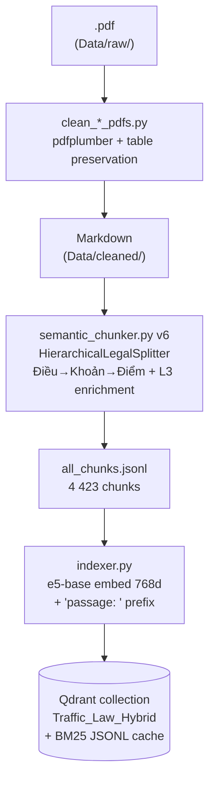
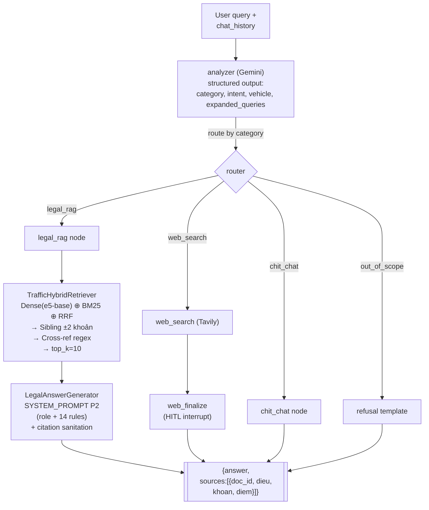
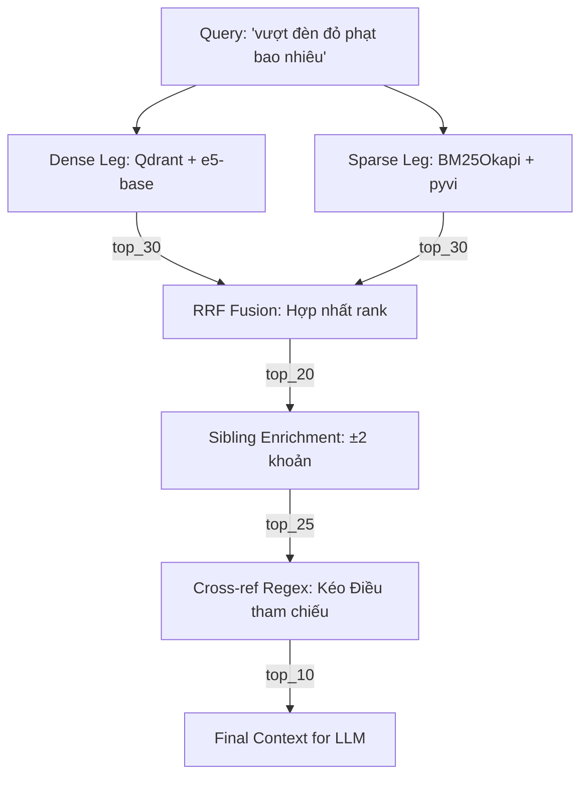

# BÁO CÁO KỸ THUẬT HỆ THỐNG

## Traffic-Law RAG — Trợ lý Pháp lý Giao thông Việt Nam (v7.0)

**Phiên bản:** 7.0 · **Ngày:** 02/06/2026 (re-run toàn bộ RQ1–RQ10 trên eval set 40 câu — 8 category)
**Tác giả:** Phong Mac · **Đồ án Tốt nghiệp**
**Repo:** `traffic_rag/` · **Stack:** Python 3.11 · LangGraph · Qdrant · Gemini · FastAPI · Next.js 14 · Docker

> Báo cáo này là tài liệu kỹ thuật duy nhất, đầy đủ cho toàn bộ hệ thống. Mỗi thành phần (ingestion, chunking, embedding, indexing, retrieval, generation, orchestration, deployment) đều được trình bày theo cấu trúc **Research → Quyết định → Kiến trúc chi tiết**: trước tiên đưa ra kết quả so sánh định lượng từ các ablation `research/` (RQ1-RQ10), sau đó giải thích tại sao hệ thống chọn phương án đang triển khai, cuối cùng mô tả đầy đủ mã nguồn / công thức / cấu hình thực tế. Số liệu lấy từ [research/report/analysis.md](../research/report/analysis.md) (cập nhật 02/06/2026 trên 35 câu legal + 5 câu OOS).

---

## Mục lục

1. [Tổng quan hệ thống](#1-tổng-quan-hệ-thống)
2. [Data Ingestion — Chuẩn hoá văn bản pháp luật](#2-data-ingestion)
3. [Chunking — Cắt đoạn phân cấp theo Điều/Khoản/Điểm — RQ2](#3-chunking--rq2)
4. [Embedding — Biểu diễn vector đa ngôn ngữ — RQ3](#4-embedding--rq3)
5. [Indexing — Vector database lựa chọn và cấu hình — RQ4](#5-indexing--rq4)
6. [Hybrid Retrieval — Dense + Sparse + RRF + Rewrite + Reranker — RQ6/RQ9/RQ10](#6-hybrid-retrieval--rq6rq9rq10)
7. [Generation — Prompt engineering và ràng buộc citation — RQ5](#7-generation--rq5)
8. [Agentic Workflow — LangGraph định tuyến đa intent](#8-agentic-workflow)
9. [Deployment — API, UI, Docker và HITL](#9-deployment)
10. [Phương pháp đánh giá — Công thức chi tiết](#10-phương-pháp-đánh-giá)
11. [Đánh giá tổng thể — RQ1/RQ7/RQ8](#11-đánh-giá-tổng-thể--rq1rq7rq8)
12. [Hạn chế và hướng phát triển](#12-hạn-chế-và-hướng-phát-triển)
13. [Phụ lục](#13-phụ-lục)

---

## 1. Tổng quan hệ thống

### 1.1 Mục tiêu và phạm vi

Hệ thống **Traffic-RAG** là trợ lý AI trả lời câu hỏi về pháp luật giao thông đường bộ Việt Nam theo quy định mới 2024–2026. Mục tiêu cụ thể:

- **Trả lời đúng theo văn bản gốc** — mỗi câu trả lời trích dẫn chính xác tới cấp **điểm/khoản/điều** của Nghị định, Thông tư, Luật.
- **Chống ảo giác (hallucination)** — từ chối khi ngữ cảnh không đủ thay vì bịa số tiền/số điểm.
- **Xử lý đa ý (multi-intent)** — một câu hỏi có thể chứa 3–4 câu con (mức phạt + trừ điểm GPLX + tước bằng + xử lý phương tiện).
- **Giải quyết cross-reference** — khi Điều A dẫn tới Điều B, hệ thống tự kéo cả B vào ngữ cảnh.
- **Định tuyến đa intent** — tách biệt Q&A pháp luật / chit-chat / tra cứu web / out-of-scope.

**Corpus (v7.0):** 24 văn bản pháp luật chuẩn hoá, **4 423 hierarchical chunks** (chunker v6 + L3 Điểm enrichment) + **1 414 fixed-512 chunks** (baseline cho RQ2).

| Nhóm      |          Số văn bản | Vai trò                                                                                                                                 |
| --------- | ------------------: | --------------------------------------------------------------------------------------------------------------------------------------- |
| Luật      |                   2 | Luật Đường bộ 2024, Luật TT-ATGT 2024                                                                                                   |
| Nghị định | 5 (4 active, 1 mới) | NĐ 168/2024 (xử phạt), NĐ 10/2020 (KD vận tải), NĐ 81/2026 (đường sắt), NĐ 135/2021 (thiết bị nghiệp vụ), NĐ 336/2025 (xử phạt vận tải) |
| Thông tư  |                  17 | 4 nhóm: banglai / dangkyxe / khithai_antoan / tuantrakiemsoat                                                                           |

### 1.2 Sơ đồ kiến trúc tổng thể

**Offline pipeline** — chạy một lần, tái chạy khi bổ sung văn bản mới:



**Online pipeline** — mỗi request đi qua đồ thị state-machine do LangGraph điều phối:



> **Ghi chú:** node `web_finalize` có `interrupt_before` — đồ thị tạm dừng, UI hiển thị snippet cho admin duyệt; khi resume mới tổng hợp câu trả lời.

### 1.3 Tech stack

| Layer         | Thư viện / dịch vụ                                                  | Lý do chọn                              |
| ------------- | ------------------------------------------------------------------- | --------------------------------------- |
| Language      | Python 3.11                                                         | type hint, pattern matching             |
| Orchestration | `langgraph` 0.2.x                                                   | state machine, HITL `interrupt_before`  |
| LLM wrapper   | `langchain-google-genai` (Gemini), `langchain-openai` (RAGAS judge) | hỗ trợ structured output                |
| LLM gen       | **Gemini 3.1 Flash Lite Preview** (free-tier)                       | 1M context, $0.075/$0.30 per 1M token   |
| Embedding     | **`intfloat/multilingual-e5-base`** (768d, max_seq=512)             | RQ3 winner (R@10 0.42)                  |
| Vector DB     | **Qdrant 1.17** (Docker)                                            | payload filter, HTTP API, hybrid native |
| Sparse        | `rank_bm25` (BM25Okapi)                                             | pure Python, đồng bộ với Qdrant id      |
| Web search    | `tavily-python`                                                     | free tier, snippet dài                  |
| RAGAS judge   | **OpenAI gpt-4o-mini**                                              | judge mạnh, $0.15/$0.60 per 1M token    |
| Backend       | `FastAPI` + `uvicorn`                                               | async, SSE streaming                    |
| Frontend      | `Next.js 14` (App Router + TypeScript + Tailwind)                   | scale tốt, auth gate                    |
| Trace/Eval    | LangSmith (project `Traffic-RAG-Evaluation`)                        | RQ8 phân tích chi phí                   |
| Container     | Docker Compose                                                      | isolation Qdrant + API + UI             |

### 1.4 Tổng hợp kết quả research (teaser)

Các ablation `research/` (chi tiết ở §3–§7 và §11) đã xác lập mọi lựa chọn thiết kế:

| RQ   | Câu hỏi                             | Kết luận (02/06/2026, 35 câu legal)                    | Quyết định                  |
| ---- | ----------------------------------- | ------------------------------------------------------ | --------------------------- |
| RQ1  | Gemini-only / Vanilla / Agentic?    | Agentic Category Acc**0.975**, F1 0.306, ROUGE-L 0.273 | **Agentic RAG (LangGraph)** |
| RQ2  | Hierarchical vs Fixed-512?          | Hier Cit-R(khoan)**0.41 vs 0.17** (×2.4)               | **Hierarchical v6 chunker** |
| RQ3  | sbert / mpnet / e5-small / e5-base? | **e5-base R@10 0.42**, MRR 0.28 (cao nhất)             | **e5-base** (768d)          |
| RQ4  | Qdrant / Chroma / FAISS?            | Cùng R@10; FAISS nhanh 56× nhưng không filter          | **Qdrant** (payload + HTTP) |
| RQ5  | P0 zero / P1 role / P2 rules?       | P2 Cit-F1**0.28 vs 0.07** (P1), refusal 0.20           | **P2 full rules**           |
| RQ6  | Retrieval-only mạnh tới đâu?        | R@10 0.32, MRR 0.33                                    | Cân nhắc reranker GPU       |
| RQ7  | RAGAS judge (gpt-4o-mini)?          | context_prec**0.89**, faith 0.55, recall 0.45          | Retrieval còn dư địa        |
| RQ8  | Cost / latency / error?             | $0.00344/câu, mean 33s, Gemini error 14.6%             | Move sang stable Gemini 2.5 |
| RQ9  | Rewrite có giúp không?              | REWRITE R@10**0.58 vs 0.32** (+26 điểm)                | **BẬT rewrite**             |
| RQ10 | bge-reranker có đáng bật?           | +48% R@10 nhưng latency ×156 (CPU)                     | **Tắt** đến khi có GPU      |

---

## 2. Data Ingestion

### 2.1 Pipeline 2 giai đoạn

Ingestion là pipeline 2 giai đoạn, chạy offline, idempotent. Toàn bộ scripts trong [source/ingestion/](../source/ingestion/) dùng `pdfplumber` để extract.

```
                     CLEANING (3 scripts riêng theo loại)         CHUNKING
Data/raw/
├── luat/      *.pdf  --[clean_luat_pdfs.py]-->  Data/cleaned/luat/      *.md  --+
├── nghidinh/  *.pdf  --[clean_nghidinh_pdfs.py]-->  Data/cleaned/nghidinh/ *.md +
├── thongtu/   *.pdf  --[clean_thongtu_pdfs.py]-->  Data/cleaned/thongtu/  *.md  +
└── phuluc/    *.docx (chưa pipeline)                                            |
                                                                                 v
                                                                  [semantic_chunker.py v6]
                                                                                 |
                                                                                 v
                                                          Data/all_chunks.jsonl (§3)
```

### 2.2 Số liệu thực tế (02/06/2026)

| Tầng                 |    Số file | Ghi chú                                            |
| -------------------- | ---------: | -------------------------------------------------- |
| Raw — Luật           |      3 PDF | luat23 (2008, repealed) + luat35 + luat36          |
| Raw — Nghị định      |      7 PDF | nd10, nd100, nd123, nd135, nd168, nd336, nd81/2026 |
| Raw — Thông tư       |     17 PDF | 4 nhóm                                             |
| **Total raw active** | **27 PDF** | filter 3 lịch sử (luat23, nd100, nd123)            |
| Cleaned — total      |      26 md | filter 3 file lịch sử trước khi chunk              |
| **Chunks total**     |  **4 423** | hierarchical, sau chunker v6                       |

### 2.3 Filter văn bản hết hiệu lực

Metadata `status` trong [semantic_chunker.py:METADATA_RULES](../source/ingestion/semantic_chunker.py) phân loại:

| Status               | Nghĩa                                      | Áp dụng                  |
| -------------------- | ------------------------------------------ | ------------------------ |
| `active`             | Còn hiệu lực                               | Vào index, retrieve được |
| `repealed`           | Đã bị bãi bỏ hoàn toàn                     | Bỏ qua, không index      |
| `partially_repealed` | Mảng đường bộ bị bãi bỏ, các mảng khác còn | Bỏ qua mảng đường bộ     |

Ví dụ:

- `luat23_db_2008` → repealed bởi luat35/2024 + luat36/2024 → skip.
- `nd100_2019_xu_phat` → mảng đường bộ bị bãi bỏ bởi NĐ 168/2024 → md rỗng (filtered_blocks=102).
- `nd123_2021_xu_phat` → đường thủy/hàng hải còn hiệu lực, đường bộ đã bị NĐ 168 thay → md rỗng.

### 2.4 Cleaning algorithm (tóm tắt)

[clean_luat_pdfs.py / clean_nghidinh_pdfs.py / clean_thongtu_pdfs.py] đều theo workflow:

1. `pdfplumber.open(pdf_path).pages` — extract text + table.
2. Lọc header/footer cố định (footer "Trang X/Y", header tên Luật).
3. Bảo toàn bảng Markdown (`|...|...|`) để LLM downstream hiểu được.
4. Refine: xóa hyphen ngắt dòng cuối trang PDF, nối câu bị page break.
5. Export `.md` ra `Data/cleaned/<loai>/<file>.md`.
6. Ghi `_processing_stats.json` (pages, tables, chars, filtered_blocks).

---

## 3. Chunking — RQ2

### 3.1 Bối cảnh và câu hỏi RQ2

Cắt theo cấu trúc pháp luật (Điều → Khoản → Điểm) có tốt hơn cắt cố định 512 token không, và **cụ thể tốt hơn ở chỗ nào** (retrieval rank, citation accuracy, end-to-end answer quality)?

### 3.2 Đầu vào — 26 md đã clean

Mỗi file `.md` có cấu trúc:

```markdown
# Tên văn bản

## Điều 6. Xử phạt người điều khiển ô tô

1. Phạt tiền từ 400.000 đồng đến 600.000 đồng đối với hành vi:
   a) Không chấp hành hiệu lệnh, hướng dẫn của người điều khiển giao thông;
   b) ...

## Điều 7. Xử phạt người điều khiển xe mô tô

...
```

Regex pattern (semantic_chunker.py):

- `RE_DIEU = r"(?:##\s*)?Điều\s+(\d+)[.:]\s*(.*)"` — khớp tiêu đề Markdown `## Điều X.` hoặc plain text `Điều X:`.
- `RE_KHOAN = r"^(\d+)\.(?=\s+[A-ZĐ...])"` — bắt đầu dòng bằng số + dấu chấm + chữ hoa (phân biệt "1. Người điều khiển..." vs "… 1.000 đồng").
- `RE_DIEM = r"(?:^|;\s+)([a-zđ])\)(?=\s+)"` — chữ thường (bao gồm "đ") + ngoặc đơn; v6 mở rộng để match Điểm cùng dòng sau dấu `;` (format pháp lý VN thường viết "d) ...; đ) ..." cùng dòng).

### 3.3 Hierarchical chunker v6 — thuật toán chi tiết

3 cấp ([semantic_chunker.py](../source/ingestion/semantic_chunker.py)):

- **L1 — Điều**: nếu Điều ≤ `THRESH_DIEU = 600` token → giữ nguyên cả Điều thành 1 chunk.
- **L2 — Khoản**: nếu Điều > 600 token → split xuống Khoản. Mỗi Khoản nếu ≤ `THRESH_KHOAN` → giữ nguyên 1 chunk L2.
  - `THRESH_KHOAN_DEFAULT = 500` cho Luật/Thông tư.
  - `THRESH_KHOAN_STRICT = 80` cho Nghị định (cần granular L3 cho xử phạt).
- **L3 — Điểm**: nếu Khoản > `THRESH_KHOAN` **HOẶC** (`doc_type=nghidinh` AND khoản có ≥2 Điểm) → split mỗi Điểm thành chunk L3 riêng.

**Quy trình từng bước (method `chunk_document`):**

```
1. split_into_articles(full_text)  →  list[(dieu_num, dieu_title, dieu_content)]
   Dùng RE_DIEU tách full text theo biên "## Điều X."

2. Với mỗi Điều:
   Nếu token(Điều) < MIN_CHUNK (30) → bỏ qua (noise ngắn)
   Nếu token(Điều) ≤ 600            → 1 chunk L1
   Nếu token(Điều) > 600            → bước 3

3. split_article_into_khoans(dieu_content)  →  list[(khoan_num, khoan_content)]
   Dùng RE_KHOAN tách nội dung Điều theo biên "N. Chữ hoa..."

4. Với mỗi Khoản:
   Nếu token(Khoản) < MIN_CHUNK (30) → bỏ qua
   Tính should_split_l3 = (token > THRESH_KHOAN) OR (nghidinh AND ≥2 Điểm)
   Nếu KHÔNG split → 1 chunk L2
   Nếu split        → bước 5

5. split_khoan_into_diems(khoan_content, enrich_preamble=True)
   →  list[(diem_label, diem_content)]
   Dùng RE_DIEM tách nội dung Khoản theo biên "a) ... / b) ..."
   Mỗi Điểm chunk được PREPEND preamble Khoản (xem §3.3.1)

6. Post-processing:
   - Lọc biểu mẫu nhiễu nội bộ (FORM_NOISE_KEYWORDS)
   - Deduplication bằng MD5 hash content
   - refine_content(): sửa lỗi ngắt dòng PDF, bảo vệ bảng Markdown
   - apply_legal_styling(): bold mức phạt tiền, tước GPLX
   - Context enrichment: prepend "Văn bản: ... | Điều X: ..." vào mỗi chunk
```

#### 3.3.1 Preamble enrichment — cải tiến quan trọng nhất của v6

Văn bản pháp lý Việt Nam có cấu trúc đặc thù: **Khoản** chứa mức phạt chung, các **Điểm** bên dưới liệt kê hành vi vi phạm cụ thể. Ví dụ NĐ 168/2024, Điều 7, Khoản 4:

```
4. Phạt tiền từ 2.000.000 đồng đến 3.000.000 đồng đối với hành vi:
   a) Dừng xe, đỗ xe trên phần đường xe chạy ở đoạn có đường cong...
   b) Chở hàng vượt trọng tải cho phép dưới 20%...
   ...
   p) Dàn hàng ngang từ 03 xe trở lên...
```

**Vấn đề:** Nếu chỉ cắt Điểm `p)` ra riêng, chunk chỉ chứa `"p) Dàn hàng ngang từ 03 xe trở lên"` (~10 token) — **thiếu hoàn toàn thông tin mức phạt**. Retriever có thể tìm đúng chunk nhưng generator không trả lời được "phạt bao nhiêu tiền".

**Giải pháp — Preamble enrichment (`enrich_preamble=True`):** Mỗi L3 chunk được **PREPEND** cụm preamble Khoản (phần text trước Điểm đầu tiên, chứa mức phạt) vào đầu nội dung Điểm:

```
"4. Phạt tiền từ 2.000.000 đồng đến 3.000.000 đồng đối với hành vi:
p) Dàn hàng ngang từ 03 xe trở lên"
```

Kết quả: mỗi L3 chunk **tự chứa đủ thông tin** (self-contained) = {mức phạt + hành vi cụ thể} → retriever chỉ cần kéo 1 chunk là generator đã có đủ dữ kiện để trả lời.

**Cải tiến v6** (so với v5.1):

1. **MIN_CHUNK theo level**: `MIN_CHUNK_DIEM = 5` (L3), `MIN_CHUNK = 30` (L1/L2). Không filter Điểm ngắn — trước v6 filter 30 gây MẤT ~70% Điểm trong NĐ 168.
2. **Dynamic threshold**: `THRESH_KHOAN_STRICT = 80` cho `nghidinh` → split L3 sớm hơn so với Luật/Thông tư (500).
3. **"has_diem" override**: Nghị định có ≥2 Điểm → luôn split L3 bất kể size (vd Đ7 K10 = 71 token, 4 Điểm vẫn split).
4. **Regex enhanced**: `(?:^|;\s+)([a-zđ])\)` — match cả "đ" và Điểm cùng dòng sau `;`.
5. **Enrich preamble**: L3 chunk tự chứa preamble Khoản → self-contained (xem §3.3.1).

Trước v6, 77.5% Điểm pháp lý không có chunk độc lập (469/605 Điểm trong NĐ 168). Sau v6, chỉ còn 11.7% miss.

### 3.4 Metadata mỗi chunk — cách tạo và gắn

Metadata được tạo trong method `_make_chunk()` của `HierarchicalLegalSplitter`, kết hợp **2 nguồn**:

1. **Metadata cấp văn bản** — tra cứu từ bảng `METADATA_RULES` bằng tên file (vd `"nd168_2024_XuPhat_TruDiem_DB_baibo_nd100"` → trả về dict chứa `doc_id`, `title`, `issuer`, `status`, `effective_date`, `topic`, `warning`). Mỗi văn bản có 1 entry cố định do người phát triển khai báo thủ công. Nếu không tìm thấy tên file chính xác, hệ thống dùng **fuzzy substring match** để fallback.

2. **Metadata cấp chunk** — sinh tự động bởi chunker dựa vào vị trí phân cấp (Điều/Khoản/Điểm số mấy) và level (L1/L2/L3). `chunk_id` được tạo bằng cách ghép `doc_slug + _dieu{N} + _khoan{M} + _diem{X}`.

Kết quả: mỗi chunk mang đầy đủ metadata phân cấp, cho phép:

- **Payload filter** ở tầng Qdrant (lọc theo `status`, `doc_id`, `topic`).
- **Citation chính xác** ở tầng generator (trích `[doc_id, Điều X, Khoản Y, Điểm z]`).
- **Sibling enrichment** ở tầng retriever (ghép thêm chunk cùng Điều theo `khoan ±2`).

```json
{
  "metadata": {
    // ─── Từ METADATA_RULES (cấp văn bản) ───
    "chunk_id": "168_2024_NĐ_CP_dieu7_khoan4_diem_p",
    "doc_id": "168/2024/NĐ-CP",
    "ten_van_ban": "Nghị định 168/2024/NĐ-CP (Xử phạt VPHC đường bộ)",
    "issuer": "Chính phủ",
    "document_type": "nghidinh",
    "status": "active",
    "effective_date": "2025-01-01",
    "topic": "Xử phạt vi phạm giao thông",

    // ─── Sinh tự động bởi chunker (cấp chunk) ───
    "dieu": 7,
    "dieu_title": "Xử phạt người điều khiển xe mô tô",
    "khoan": "4",
    "diem": "p",
    "level": 3,
    "source_file": "nd168_2024_XuPhat_TruDiem_DB_baibo_nd100.md",
    "token_estimate": 187
  },
  "content": "Văn bản: Nghị định 168/2024/NĐ-CP... | Điều 7: Xử phạt...\n4. **Phạt tiền từ 2.000.000 đồng đến 3.000.000 đồng** đối với hành vi:\np) Dàn hàng ngang từ 03 xe trở lên"
}
```

### 3.5 Phân bố chunk theo level

| Level      | Số chunks |    % | Ý nghĩa                    |
| ---------- | --------: | ---: | -------------------------- |
| L1 (Điều)  |       486 |  11% | Điều ngắn không split      |
| L2 (Khoản) |     1 282 |  29% | Khoản trung bình           |
| L3 (Điểm)  |     2 655 |  60% | Sau chunker v6 enhancement |
| **Total**  | **4 423** | 100% |                            |

### 3.6 Setup ablation RQ2

Script: [rq2_chunking_eval.py](../research/scripts/rq2_chunking_eval.py).

| Biến thể         | Chunker                                    |  # chunks | Encoder           | Collection             |
| ---------------- | ------------------------------------------ | --------: | ----------------- | ---------------------- |
| **Hierarchical** | `HierarchicalLegalSplitter` v6             | **4 423** | `e5-base` (768d)  | `Traffic_Law_Hybrid`   |
| **Fixed-512**    | `FixedSizeChunker` (~394 word, overlap 38) | **1 414** | `e5-small` (384d) | `traffic_law_fixed512` |

Cùng hybrid (BM25 + dense + RRF top_k=10), cùng generator (Gemini), 35 câu legal. Confound encoder (base vs small): theo RQ3, e5-base hơn e5-small ~5 điểm % R@10 — khoảng cách 12+ điểm trong RQ2 vẫn quy về chunking.

### 3.7 Kết quả retrieval (35 câu, khoan-level)

| Chunker          |       R@5 |      R@10 |      R@20 |       MRR |   nDCG@10 |   latency |
| ---------------- | --------: | --------: | --------: | --------: | --------: | --------: |
| **hierarchical** | **0.281** | **0.324** | **0.467** | **0.329** | **0.460** |     0.71s |
| fixed_512        |     0.143 |     0.200 |     0.214 |     0.108 |     0.135 | **0.80s** |


Doc-level cả hai gần hoà (hier 0.90, fixed 0.97) — khác biệt nằm ở **độ tinh khoản**.

### 3.8 Kết quả end-to-end (vanilla RAG)

| Chunker          |        F1 |   ROUGE-L | Cit-R (khoan) | Cit-R (doc) |   Refusal | Latency |
| ---------------- | --------: | --------: | ------------: | ----------: | --------: | ------: |
| **hierarchical** | **0.327** | **0.287** |     **0.410** |   **0.814** | **0.200** |   18.2s |
| fixed_512        |     0.325 |     0.286 |         0.171 |       0.457 |     0.371 |    9.1s |


### 3.9 Diễn giải

- **Hierarchical thắng Cit-R(khoan) ×2.4** (0.41 vs 0.17): chunk biên trùng với citation pháp lý → set-intersection thắng.
- **F1 token gần hoà** (0.327 vs 0.325): chunks fixed dài hơn → generator dễ "tóm" n-gram bề mặt, nhưng trích nguồn sai khoản.
- **Hierarchical refusal thấp hơn** (0.20 vs 0.37): context tinh → ít phải "không đủ thông tin".

### 3.10 Tại sao hierarchical chunking tốt hơn cắt cố định cho văn bản pháp luật

| Tiêu chí                 | Fixed-size 512 token                                                               | Hierarchical (Điều→Khoản→Điểm)                                                      |
| ------------------------ | ---------------------------------------------------------------------------------- | ----------------------------------------------------------------------------------- |
| **Biên chunk**           | Cắt giữa câu/giữa Khoản → 1 Khoản bị xẻ vào 2 chunk hoặc 2 Khoản dính nhau 1 chunk | Biên chunk = biên pháp lý tự nhiên → 1 chunk = 1 đơn vị pháp lý hoàn chỉnh          |
| **Citation trích nguồn** | Không biết chunk thuộc Khoản nào (metadata chỉ có `doc_id`) → Cit-R(khoan) = 0.17  | Metadata có `dieu`, `khoan`, `diem` chính xác → Cit-R(khoan) = 0.41 (×2.4)          |
| **Self-contained**       | Chunk có thể chứa nửa cuối Khoản 3 + nửa đầu Khoản 4 → thiếu ngữ cảnh              | Mỗi chunk chứa đầy đủ 1 đơn vị + preamble enrichment → generator đủ dữ liệu trả lời |
| **Sibling enrichment**   | Không thể kéo thêm "Khoản kề" vì không có metadata cấu trúc                        | Retriever dùng metadata để kéo thêm ±2 Khoản cùng Điều (§6.6)                       |
| **Cross-reference**      | Không thể resolve "xem Điều X Khoản Y"                                             | Regex phát hiện cross-ref trong chunk → tra metadata kéo đúng chunk bị tham chiếu   |
| **Refusal rate**         | 0.37 (retriever thường miss → generator phải "từ chối")                            | 0.20 (context tinh → ít miss)                                                       |

**Tóm lại:** Fixed-size chunking "mù" về cấu trúc pháp luật — nó chỉ biết đếm token rồi cắt, bất kể đang ở giữa một quy định hay đầu quy định khác. Hierarchical chunking tôn trọng cấu trúc Điều/Khoản/Điểm, tạo ra chunk là **đơn vị pháp lý nguyên vẹn** kèm metadata cấu trúc — nền tảng cho mọi tầng downstream (retrieval, citation, generation).

### 3.11 Quyết định production

Giữ hierarchical v6 + L3 Điểm enrichment. F1 không phải metric phù hợp cho QA pháp lý; citation accuracy mới là cốt lõi.

---

## 4. Embedding — RQ3

### 4.1 RQ3 — 4 encoder đa ngôn ngữ

Script: [rq3_embedding_eval.py](../research/scripts/rq3_embedding_eval.py).

Encode toàn bộ 4 423 chunks + 35 câu queries với 4 model. Cosine ranking top-20. Prefix `"passage: "/"query: "` cho họ e5; plain cho sbert/mpnet.

| Model                      | max_seq |     dim |       R@5 |      R@10 |      R@20 |       MRR |   nDCG@10 | encode corpus (s) | query (ms) |
| -------------------------- | ------: | ------: | --------: | --------: | --------: | --------: | --------: | ----------------: | ---------: |
| vietnamese-sbert (PhoBERT) |     256 |     768 |     0.152 |     0.267 |     0.324 |     0.129 |     0.240 |               995 |       25.3 |
| multilingual-mpnet         |     128 |     768 |     0.171 |     0.195 |     0.224 |     0.140 |     0.215 |             1 088 |       85.9 |
| **e5-small**               | **512** | **384** |     0.281 |     0.367 |     0.452 |     0.238 |     0.362 |           **734** |   **20.9** |
| **e5-base** (production)   | **512** | **768** | **0.295** | **0.424** | **0.510** | **0.277** | **0.473** |             2 244 |       71.5 |


### 4.3 Kiến trúc e5-base — Tại sao vượt trội?

**Embedding là gì?** Là quá trình chuyển đổi một đoạn văn bản (text) thành một chuỗi số (vector) có độ dài cố định (đối với e5-base là 768 số). Các văn bản có nội dung tương đồng về mặt ngữ nghĩa sẽ có các vector "gần" nhau trong không gian đa chiều. Điều này cho phép máy tính tìm kiếm theo ý nghĩa (semantic) thay vì chỉ so khớp từ khóa (keyword).

**Tại sao chọn e5-base?**

- **Backbone:** Dựa trên XLM-RoBERTa base, được huấn luyện trên tập dữ liệu khổng lồ gồm 94 ngôn ngữ.
- **Contrastive Learning:** Model được train bằng phương pháp InfoNCE (contrastive learning) trên **1 tỷ cặp query-passage**. Điều này giúp model phân biệt cực tốt giữa đoạn văn bản liên quan và không liên quan.
- **Cross-lingual cực mạnh:** Model hiểu được mối quan hệ giữa câu hỏi chuyên môn và văn bản pháp luật ngay cả khi từ vựng không trùng khớp hoàn toàn.

Công thức InfoNCE loss mà model sử dụng:

$$
\mathcal{L}_{\text{InfoNCE}} = -\log\frac{\exp(\operatorname{sim}(q, p^{+})/\tau)}{\sum_{i=1}^{N}\exp(\operatorname{sim}(q, p_{i})/\tau)}
$$

với $\tau = 0.01$, batch $N = 32$ + 7 hard-negative mined từ BM25.

### 4.4 Prefix convention (Bắt buộc)

Dòng e5 (multilingual-e5-base) yêu cầu sử dụng prefix để model biết đang xử lý loại văn bản nào. **Dùng sai prefix sẽ làm giảm ~30% độ chính xác (Recall).**

| Đối tượng                        | Prefix        | Ví dụ                            |
| -------------------------------- | ------------- | -------------------------------- |
| **Document (Văn bản pháp luật)** | `"passage: "` | `"passage: Điều 6. Xử phạt..."`  |
| **Query (Câu hỏi người dùng)**   | `"query: "`   | `"query: Mức phạt vượt đèn đỏ?"` |

Hệ thống tự động gắn prefix này trong `indexer.py` (khi tạo index) và `retriever.py` (khi tìm kiếm).

### 4.5 Quyết định production: e5-base

Đổi từ e5-small (384d) sang e5-base (768d) vì:

- R@10 +5 điểm % so với small (0.42 vs 0.37).
- MRR cao nhất (0.28).
- Trade-off: encode 3× chậm hơn nhưng chỉ chạy offline khi index dữ liệu nên chấp nhận được.

Collection production: `Traffic_Law_Hybrid` (4 423 point × 768d, Cosine, HNSW m=16 ef=100).

---

## 5. Indexing — RQ4

### 5.1 RQ4 — Qdrant vs Chroma vs FAISS

Script: [rq4_vectordb_real.py](../research/scripts/rq4_vectordb_real.py).

- 4 423 vector 768d thật pull từ `Traffic_Law_Hybrid`.
- 35 câu × 100 lặp/câu = 3 500 query/backend.
- Top-10 cosine, RSS đo bằng psutil.

| Backend                                 | p50 (ms) | p95 (ms) | mean (ms) |      R@10 | peak RSS (MB) | Ghi chú                     |
| --------------------------------------- | -------: | -------: | --------: | --------: | ------------: | --------------------------- |
| Qdrant (server, HNSW)                   |     4.44 |     5.23 |      4.51 | **0.424** |         1 617 | payload filter + persistent |
| Chroma (persistent, HNSW)               |     2.31 |     3.84 |      2.39 | **0.424** |         1 323 | in-process                  |
| **FAISS (IVF-Flat nlist=64, nprobe=8)** | **0.08** | **0.15** |  **0.08** |     0.395 |         1 346 | in-memory, approximate      |


### 5.2 Diễn giải

- **R@10 giống nhau** cho Qdrant/Chroma (HNSW exact); FAISS thấp hơn 3 điểm % do IVF xấp xỉ.
- **FAISS nhanh 56× Qdrant** nhưng:
  - Không metadata filter.
  - Không persistent.
  - Không update/delete online.
- **Chroma trung bình** — nhanh hơn Qdrant nhưng không HTTP API → khó multi-worker.

### 5.3 Quyết định: Qdrant 1.17

Với corpus 4 423 chunk, latency 4.4ms là **không đáng kể** so với LLM ~5-10s. Đổi lấy:

- Payload filter `status="active"` chặn chunk hết hiệu lực ngay tại DB.
- HTTP server tách rời FastAPI → scale multi-worker dễ.
- Hybrid native (dense + payload filter cùng query).

**"Backend index" là gì?** Trong ngữ cảnh vector database, "backend" chỉ phần mềm/engine lưu trữ và tìm kiếm vector (Qdrant, Chroma, FAISS). "Index" là cấu trúc dữ liệu giúp tìm kiếm vector nhanh mà không cần so sánh lần lượt từng vector. Qdrant dùng thuật toán **HNSW (Hierarchical Navigable Small World)** — xây đồ thị đa tầng, mỗi node là một vector, các cạnh nối đến hàng xóm gần nhất. Khi query, thuật toán tìm đường đi qua đồ thị (thay vì brute-force) → O(log N) thay vì O(N). "Backend index" = {engine lưu trữ + thuật toán tìm kiếm}.

**Tại sao chọn Qdrant?** So với FAISS (nhanh 56× nhưng chỉ là thư viện in-memory, không metadata filter, không persistent, không update/delete online) và Chroma (nhanh hơn Qdrant nhưng in-process, không HTTP API → khó multi-worker), Qdrant cung cấp đầy đủ: persistent storage, HTTP server, payload filter native, và khả năng scale.

### 5.4 Cấu hình production

[source/indexing/indexer.py](../source/indexing/indexer.py):

```python
COLLECTION_NAME = "Traffic_Law_Hybrid"
EMBEDDING_MODEL = "intfloat/multilingual-e5-base"
VECTOR_SIZE = 768
BATCH_EMBED = 64
BATCH_UPSERT = 100

# e5 family yêu cầu prefix "passage: " khi encode document
PASSAGE_PREFIX = "passage: " if "e5" in EMBEDDING_MODEL.lower() else ""

# Tạo collection
client.create_collection(
    collection_name=COLLECTION_NAME,
    vectors_config=VectorParams(size=768, distance=Distance.COSINE),
)

# Tạo 4 payload indexes cho metadata filtering
for field, schema in [
    ("doc_id",         PayloadSchemaType.KEYWORD),
    ("status",         PayloadSchemaType.KEYWORD),
    ("effective_date", PayloadSchemaType.KEYWORD),
    ("topic",          PayloadSchemaType.KEYWORD),
]:
    client.create_payload_index(COLLECTION_NAME, field, schema)
```

**Quy trình indexing (`index_chunks`):**

1. Đọc toàn bộ `all_chunks.jsonl` (4 423 dòng).
2. Prepend `"passage: "` vào content mỗi chunk (prefix bắt buộc cho e5).
3. Encode theo batch 64 chunks → vector 768d, L2-normalize.
4. Upsert vào Qdrant theo batch 100 points. **Point ID = thứ tự dòng trong JSONL** (0, 1, 2, …, 4422) — giữ đồng bộ với BM25 row index ở retriever (§6.4).
5. Mỗi point payload chứa toàn bộ metadata + content gốc.

HNSW default `m=16, ef_construct=100` — không override vì 4 423 point chưa cần fine-tune.

### 5.5 Thống kê sau indexing

| Param             | Giá trị                                                       |
| ----------------- | ------------------------------------------------------------- |
| Collection        | `Traffic_Law_Hybrid`                                          |
| Points            | **4 423** (24 văn bản active)                                 |
| Dim × Distance    | 768 × Cosine (e5-base)                                        |
| Payload indexes   | 4 KEYWORD (doc_id, status, effective_date, topic)             |
| Disk (vol Docker) | ~26 MB                                                        |
| Index time (CPU)  | ~2 244s embed + 9s upsert                                     |
| Fallback          | `traffic_law_fixed512` (e5-small 384d, 1 414 chunk, dùng RQ2) |

---

## 6. Hybrid Retrieval — RQ6/RQ9/RQ10

### 6.1 Pipeline production và Quy trình chi tiết

Hệ thống sử dụng chiến lược **Hybrid Retrieval** — kết hợp ưu điểm của Tìm kiếm Vector (Dense) và Tìm kiếm Từ khóa (Sparse).

**Quy trình 5 bước thực tế:**



#### 6.1.1 Giải thích Hybrid Retrieval — Ví dụ minh họa

Tại sao cần cả hai?

- **Dense search (Vector):** Hiểu được "vượt đèn đỏ" tương đương với "không chấp hành hiệu lệnh đèn tín hiệu". Nó bắt được **ngữ nghĩa** (semantic).
- **Sparse search (BM25):** Bắt chính xác các **con số** hoặc **thuật ngữ chuyên môn hiếm** (ví dụ: "NĐ 168", "Điều 6", "0,25 miligam").

**Ví dụ:** Người dùng hỏi: _"Mức phạt nồng độ cồn xe máy dưới 0.25 miligam?"_

1. **Dense (e5):** Tìm thấy các đoạn nói về "nồng độ cồn", "rượu bia", "xe mô tô".
2. **Sparse (BM25Okapi):** Tìm thấy chính xác con số `"0,25 miligam"` — con số này rất quan trọng để phân định khung phạt nhưng có thể bị vector "làm mờ" nếu không có sparse.
3. **RRF:** Hợp nhất kết quả, đẩy đoạn văn bản chứa cả "nồng độ cồn" VÀ "0,25 miligam" lên hạng 1.

### 6.2 RQ6 — Retrieval-only metric

Script: [rq6_retrieval.py](../research/scripts/rq6_retrieval.py). 35 câu, top-20.

| Metric        |      Mean |
| ------------- | --------: |
| Recall@1      |     0.224 |
| Recall@5      |     0.281 |
| **Recall@10** | **0.324** |
| Recall@20     |     0.467 |
| MRR           |     0.329 |
| nDCG@10       |     0.460 |
| Latency       |     0.11s |


R@10 → R@20 nhảy +14 điểm — nhiều khoản đúng nằm rank 11–20, reranker đẩy lên top-10 sẽ giúp (xem RQ10).

### 6.3 Dense leg — Qdrant + e5-base

```python
# query prep
q_vec = self.model.encode("query: " + query, normalize_embeddings=True).tolist()

# qdrant search with payload filter active
dense_hits = self.qdrant.search(
    collection_name="Traffic_Law_Hybrid",
    query_vector=q_vec,
    query_filter=Filter(must=[
        FieldCondition(key="status", match=MatchValue(value="active"))
    ]),
    limit=top_k * 2,
)
```

### 6.4 Sparse leg — BM25Okapi (Không phải BM250Kapi)

Sử dụng `rank_bm25` (thuật toán BM25Okapi) trên tập 4 423 chunks đã được tokenize bằng `pyvi` (xử lý từ ghép tiếng Việt như "đường*bộ", "xe*đạp").

```python
from rank_bm25 import BM25Okapi
tokenized_corpus = [vn_tokenize(c["content"]) for c in all_chunks]
self.bm25 = BM25Okapi(tokenized_corpus, k1=1.5, b=0.75)
bm25_scores = self.bm25.get_scores(vn_tokenize(query))
top_idx = np.argsort(-bm25_scores)[:top_k * 2]
```

Tokenizer: `pyvi.ViTokenizer.tokenize(...).split()` — rất quan trọng cho tiếng Việt để tránh việc so khớp rời rạc từng từ đơn.

Công thức BM25 Okapi:

$$
\operatorname{score}(D, Q) = \sum_{t \in Q} \operatorname{IDF}(t) \cdot \frac{f(t, D)\,(k_1 + 1)}{f(t, D) + k_1\!\left(1 - b + b\,\dfrac{\lvert D\rvert}{\operatorname{avgDL}}\right)}
$$

| Tham số | Giá trị | Trực giác      |
| ------- | ------: | -------------- |
| $N$     |   4 423 | tổng chunk     |
| $k_1$   |     1.5 | thưởng từ lặp  |
| $b$     |    0.75 | phạt chunk dài |

### 6.5 RRF — Reciprocal Rank Fusion (Thường bị nhầm là RFF)

Hợp nhất dense rank + sparse rank mà không cần quan tâm đến độ chênh lệch điểm số (score normalization), chỉ quan tâm đến **thứ hạng (rank)**.

$$
\operatorname{RRF}(d) = \sum_{\ell \in \{\text{dense, sparse}\}} \frac{1}{k + \operatorname{rank}_{\ell}(d)}
$$

$k = 60$ là hằng số giúp làm mượt điểm số cho các tài liệu ở hạng thấp. RRF cực kỳ ổn định và hiệu quả khi hợp nhất hai phương pháp tìm kiếm hoàn toàn khác nhau.

### 6.6 Sibling enrichment + Cross-reference regex

Sau RRF top-K, kéo thêm:

- **Sibling ±2 khoản**: với mỗi chunk có `khoan=N`, thêm chunks cùng Điều có `khoan ∈ {N-2, N-1, N+1, N+2}`.
- **Cross-reference regex**: tìm pattern "Điều X Khoản Y" / "điểm Z khoản W Điều V" trong chunks top-K, kéo thêm chunks bị tham chiếu.

Đặc biệt giúp multi-intent (RQ-006: "vượt đèn đỏ + không bằng lái") và cross-reference (RQ-013).

### 6.7 RQ9 — Query Rewriting (BẬT)

Script: [rq9_rewrite_ablation.py](../research/scripts/rq9_rewrite_ablation.py).

| Variant     |       R@5 |      R@10 |       MRR |   nDCG@10 |        F1 |     Cit-R |    Cit-F1 | Latency |
| ----------- | --------: | --------: | --------: | --------: | --------: | --------: | --------: | ------: |
| NO_REWRITE  |     0.281 |     0.324 |     0.322 |     0.460 |     0.330 |     0.410 |     0.262 |   14.6s |
| **REWRITE** | **0.467** | **0.581** | **0.350** | **0.598** | **0.372** | **0.410** | **0.265** |   15.7s |


**REWRITE thắng đáng kể**: R@10 +26 điểm %, nDCG +14 điểm. Latency chỉ +7%. **Cit-R hoà** — rewrite kéo đúng văn bản nhưng generator vẫn chọn cùng số khoản.

**Quyết định:** BẬT rewrite cho production (đảo chiều so với báo cáo cũ trước v6 — corpus v6 với L3 Điểm chi tiết phù hợp với query expansion).

### 6.8 RQ10 — Reranker (TẮT mặc định)

Script: [rq10_reranker_ablation.py](../research/scripts/rq10_reranker_ablation.py).

Cross-encoder `BAAI/bge-reranker-v2-m3` (568M params, multilingual, max_length=8192). Rescore RRF top-30, giữ top-10.

| Mode                    |       R@10 |       MRR |   nDCG@10 | Latency mean (ms) | Latency p95 (ms) |
| ----------------------- | ---------: | --------: | --------: | ----------------: | ---------------: |
| **hybrid** (baseline)   |      0.324 |     0.314 |     0.460 |           **708** |              924 |
| **hybrid + bge-rerank** |  **0.481** | **0.334** | **0.550** |           110 468 |          134 316 |
| **Δ**                   | **+48.5%** |     +6.4% |    +19.5% |          **×156** |             ×145 |


**Reranker thực sự hiệu quả** (+48% R@10) nhưng latency 110s không production-able trên CPU. Quyết định:

- **TẮT mặc định** (`ENABLE_RERANKER=false`).
- **Bật cho ablation/research** qua env flag.
- **Production roadmap:** chỉ bật khi có GPU node (dự kiến giảm về ~2-3s/câu), hoặc đổi `bge-reranker-base` (278M params, ~½ latency, ~70% gain).

### 6.9 Module rerank

[source/rag_core/reranker.py](../source/rag_core/reranker.py):

```python
from sentence_transformers import CrossEncoder

class Reranker:
    def __init__(self, model_name="BAAI/bge-reranker-v2-m3", device=None, max_length=512):
        self.model = CrossEncoder(model_name, device=device or "cpu", max_length=max_length)

    def rerank(self, query, chunks, top_k):
        pairs = [[query, c.content] for c in chunks]
        scores = self.model.predict(pairs)
        ranked = sorted(zip(chunks, scores), key=lambda x: -x[1])
        return [c for c, _ in ranked[:top_k]]
```

Bật qua env: `ENABLE_RERANKER=true RERANK_TOP_N=30 RERANKER_MODEL=BAAI/bge-reranker-v2-m3`.

---

## 7. Generation — RQ5

### 7.1 RQ5 — P0 zero-shot / P1 role-only / P2 full rules

Script: [rq5_prompts_v2.py](../research/scripts/rq5_prompts_v2.py). 35 câu × 3 variant = 105 LLM call.

| Variant                        | Mô tả                                        |        F1 |   ROUGE-L |     Cit-P |     Cit-R |    Cit-F1 | Refusal |  Latency |
| ------------------------------ | -------------------------------------------- | --------: | --------: | --------: | --------: | --------: | ------: | -------: |
| **P0 zero-shot**               | "Trả lời câu hỏi dựa vào NGỮ CẢNH bên dưới." | **0.347** |     0.265 |     0.024 |     0.057 |     0.032 |    0.00 |    13.6s |
| **P1 role-only**               | + 1 câu role "Bạn là Trợ lý Pháp lý GTVN"    |     0.345 |     0.278 |     0.052 |     0.157 |     0.067 |    0.00 |    11.9s |
| **P2 full rules** (production) | role + 14 quy tắc + few-shot                 |     0.329 | **0.288** | **0.239** | **0.424** | **0.279** |    0.20 | **7.1s** |


### 7.2 Diễn giải

- **P0/P1 F1 cao ~0.35** do "viết tuôn" — n-gram nhiều, trùng gold nhiều, NHƯNG **không trích nguồn được**.
- **P2 Cit-R 0.42 vs P1 0.16 (×2.7), Cit-F1 0.28 vs 0.07 (×4)** — quy tắc dạy LLM trích đúng khoản.
- **P2 refusal 20%** đúng khi context thiếu — trade-off chấp nhận được cho QA pháp lý.
- **P2 latency thấp nhất** (7.1s) — rules ép trả lời ngắn gọn, không lan man.

### 7.3 Quyết định: P2

Production dùng P2 ([source/rag_core/generator.py:SYSTEM_PROMPT](../source/rag_core/generator.py)).

### 7.4 Kiến trúc P2 (14 rules)

**Role:** "Bạn là Trợ lý Pháp lý Giao thông Việt Nam — chuyên gia tư vấn các văn bản quy phạm pháp luật mới nhất (2024–2026)."

**Rules (tóm tắt):**

1. **Chỉ dùng NGỮ CẢNH** — không suy luận ngoài.
2. **Trích dẫn bắt buộc** — mọi mức phạt/số điểm kèm `[doc_id, Điều X, Khoản Y, Điểm z]`.
3. **Từ chối rõ ràng** — nếu thiếu, trả "Thông tin này không có trong tài liệu được cung cấp."
4. **Không tự nghĩ số tiền** — copy nguyên "từ 4.000.000 đến 6.000.000 đồng".
5. **Ưu tiên văn bản mới** — NĐ 168/2024 thay NĐ 100/2019 mảng đường bộ.
6. **Đa ý tách bullet** — Markdown `###` + `-`, bold số tiền/điểm/thời gian.
7. **Phân biệt KD vận tải** — ưu tiên NĐ 10/2020 cho xe KD; ngược lại bỏ qua.
8. **Loại phương tiện trong NĐ 168** — Đ6 ô tô, Đ7 mô tô/gắn máy, Đ8 xe chuyên dùng, Đ9 xe đạp/thô sơ.
9. **Sibling chunk** — chunk gắn `[Ngữ cảnh bổ sung — cùng Điều]` được phép dùng.
10. **Cross-reference 3 bước** — phạt-tiền + trừ-điểm trong NĐ 168 ghép từ Khoản phạt × Khoản tham chiếu (Đ6.K13–K16, Đ7.K11–K13).
11. **Không từ chối nếu có 1 phần** — tìm được mức phạt nhưng thiếu số điểm → trả phần tìm được + ghi chú.
12. **Tổng hợp khi liệt kê** — câu hỏi "các trường hợp" → rà soát toàn bộ ngữ cảnh.
13. **Giải thích dễ hiểu** — mô tả hành vi tự nhiên trước khi trích `[Điều/Khoản]`.
14. **Tư duy lập luận phân định lỗi** (v6.1) — khi user hỏi "lỗi do ai" trong va chạm: override rule 3, quy trình 4 bước (liệt kê hành vi → đối chiếu chunk → kết luận → lưu ý CSGT theo TT 72/2024).

### 7.5 Structured output (Pydantic)

```python
class Citation(BaseModel):
    doc_id: str
    dieu: int
    khoan: int | None = None
    diem: str | None = None

class GeneratedAnswer(BaseModel):
    answer: str
    sources: list[Citation]
```

Generator dùng `ChatGoogleGenerativeAI.with_structured_output(GeneratedAnswer)` — Gemini trả JSON validate Pydantic, không cần parse string.

### 7.6 Citation sanitation

Post-process: so khớp `sources` LLM trả về với metadata 10 chunk context. Nếu citation không khớp chunk nào → remove. Lớp phòng thủ cuối chặn hallucinated citation trước UI.

---

## 8. Agentic Workflow

### 8.1 Tại sao cần agent

RQ1 cho thấy:

- **Vanilla RAG** không có routing → câu OOS bị retrieve và bịa câu trả lời (category_acc 0.875).
- **Gemini-only** không có context → trích nguồn lỗi (F1 cao nhưng không cite được).
- **Agentic RAG** routing 100% câu OOS đúng (category_acc 0.975), Cit-R 0.41.

### 8.2 LangGraph state machine

[source/agent/graph.py](../source/agent/graph.py):

```python
graph = StateGraph(AgentState)
graph.add_node("analyzer", analyzer_node)
graph.add_node("legal_rag", legal_rag_node)
graph.add_node("chit_chat", chit_chat_node)
graph.add_node("web_search", web_search_node)
graph.add_node("web_finalize", web_finalize_node)
graph.add_node("out_of_scope", out_of_scope_node)

graph.set_entry_point("analyzer")
graph.add_conditional_edges("analyzer", route_by_category, {
    "legal_rag":     "legal_rag",
    "chit_chat":     "chit_chat",
    "web_legal_search": "web_search",
    "out_of_scope":  "out_of_scope",
})
graph.add_edge("legal_rag",   END)
graph.add_edge("chit_chat",   END)
graph.add_edge("web_search",  "web_finalize")
graph.add_edge("web_finalize", END)
graph.add_edge("out_of_scope", END)

app = graph.compile(checkpointer=MemorySaver(), interrupt_before=["web_finalize"])
```

### 8.3 Nodes

**`analyzer`** — Gemini structured output `AnalyzerOutput`:

```python
class AnalyzerOutput(BaseModel):
    category: Literal["legal_rag", "chit_chat", "web_legal_search", "out_of_scope"]
    standalone_query: str          # giải tham chiếu chat_history
    expanded_queries: list[str]    # 1-5 expansion cho retrieval (RQ9)
    intent: Literal["penalty", "fault", "procedure", "definition", "list", "mixed"]
    vehicle_type: Literal["o_to", "mo_to", "chuyen_dung", "xe_dap", "any"]
```

**`legal_rag`** — sequential pipeline:

1. Loop N lần retriever với `expanded_queries[i]`.
2. RRF fuse N ranked lists (`_rrf_fuse_lists`).
3. Diversity rerank `_diversify_by_location` (cap 3 chunk/(doc, Điều, Khoản)).
4. Generator P2 với hint `intent` + `vehicle_type` + multi-frame flag.

**`web_search`** — Tavily client, query = `standalone_query`. Limit 3 snippet. Sau đó `interrupt_before=web_finalize` đợi admin duyệt.

**`web_finalize`** — sau khi admin approve, generator tổng hợp answer từ snippet web + ghi nhãn `⚠ Tra cứu từ internet`.

**`chit_chat` / `out_of_scope`** — template tĩnh, không LLM call.

### 8.4 HITL admin console

Khi `web_search` chạy, graph `interrupt_before=web_finalize` → thread pause. UI [admin console](../app/nextjs-app/src/app/admin/AdminConsole.tsx) hiển thị:

- Snippet Tavily trả về.
- Draft answer (chưa finalize).
- 2 nút: **Approve** (finalize) / **Reject** (drop, trả refusal cho user).

`MemorySaver` checkpoint giữ state qua restart → admin có thể quyết định sau (lên đến 10 phút timeout client-side polling).

---

## 9. Deployment

### 9.1 Sơ đồ deploy

```
┌─────────────────────────────────────────────────┐
│  Next.js 14 (App Router · Tailwind · NextAuth)  │
│  - /chat (SSE 3 event types: token/cite/pending)│
│  - /admin (HITL approve/reject)                 │
└────────────────────────┬────────────────────────┘
                         │ POST /api/chat → bridge
                         ▼
┌─────────────────────────────────────────────────┐
│  FastAPI 0.110 + uvicorn :8000                  │
│  - lifespan: enable_tracing() always-on         │
│  - GET /metrics                                 │
│  - GET /pending (admin console)                 │
│  - SSE streaming                                │
└────────────────────────┬────────────────────────┘
                         │
┌────────────────────────▼────────────────────────┐
│  LangGraph agentic pipeline (§8)                │
│  - analyzer → router                            │
│  - legal_rag / chit_chat / web_search / OOS     │
│  - MemorySaver checkpoint                       │
└────────────────────────┬────────────────────────┘
                         │
┌────────────────────────▼────────────────────────┐
│  Qdrant 1.17 (Docker :6333)                     │
│  - Traffic_Law_Hybrid: 4 423 vec × 768d Cosine  │
│  - 3 payload index (doc_id, status, topic)      │
│  - HNSW m=16, ef_construct=100                  │
└─────────────────────────────────────────────────┘
```

### 9.2 docker-compose.yml

```yaml
version: "3.8"
services:
  qdrant:
    image: qdrant/qdrant:latest
    container_name: traffic_qdrant
    ports: ["6333:6333"]
    volumes: [./qdrant_storage:/qdrant/storage]

  traffic_rag_app:
    build: ./traffic_rag
    depends_on: [qdrant]
    environment:
      - QDRANT_HOST=qdrant
      - COLLECTION_NAME=Traffic_Law_Hybrid
      - GOOGLE_API_KEY=${API_KEY}
      - TAVILY_API_KEY=${TAVILY_API_KEY}
      - LANGCHAIN_TRACING_V2=true
      - LANGCHAIN_PROJECT=Traffic-RAG-Evaluation
    ports: ["8000:8000"]
    volumes: [./traffic_rag/checkpoints:/app/checkpoints]

  ui:
    build: ./traffic_rag/app/nextjs-app
    depends_on: [traffic_rag_app]
    environment:
      - BACKEND_URL=http://traffic_rag_app:8000
      - NEXTAUTH_SECRET=${NEXTAUTH_SECRET}
      - ADMIN_EMAILS=${ADMIN_EMAILS}
    ports: ["3000:3000"]
```

### 9.3 Observability endpoints

- `GET /metrics` — JSON: uptime, request count, error count, avg latency, tracing flag, reranker flag.
- `GET /pending` — list pending HITL threads cho admin console.
- LangSmith always-on (lifespan FastAPI auto-enable nếu có `LANGCHAIN_API_KEY`).

### 9.4 CI regression gate

[tests/test_retrieval_regression.py](../tests/test_retrieval_regression.py): assert mean Recall@10 ≥ 0.30 trên 35 câu legal. [tests/test_smoke.py](../tests/test_smoke.py): 6 unit cơ bản.

[.github/workflows/ci.yml](../.github/workflows/ci.yml): 2 job:

- **smoke** — luôn chạy, không cần Qdrant.
- **regression** — start Qdrant docker service, chạy retrieval gate.

---

## 10. Phương pháp đánh giá

### 10.1 Token F1

$$
F_1 = \frac{2 \cdot P \cdot R}{P + R},\quad P = \frac{|\text{pred} \cap \text{gold}|}{|\text{pred}|},\quad R = \frac{|\text{pred} \cap \text{gold}|}{|\text{gold}|}
$$

Đo overlap n-gram unigram giữa câu trả lời và gold. **Hạn chế:** ép QA pháp lý gen ra văn xuôi giống gold; không đo trích dẫn.

### 10.2 ROUGE-L

Longest Common Subsequence — đo overlap có thứ tự. Phù hợp summarization, không bắt buộc QA.

### 10.3 Recall@k, MRR, nDCG@k

$$
\operatorname{Recall@k}(q) = \frac{|\text{retrieved}_k \cap \text{gold}|}{|\text{gold}|}
$$

$$
\operatorname{MRR} = \frac{1}{|Q|} \sum_{q \in Q} \frac{1}{\operatorname{rank}_q}
$$

$$
\operatorname{nDCG@k} = \frac{\operatorname{DCG@k}}{\operatorname{IDCG@k}},\quad \operatorname{DCG@k} = \sum_{i=1}^{k} \frac{2^{rel_i} - 1}{\log_2(i+1)}
$$

Citation key matching `(doc_id, dieu, khoan)` ở "khoan-level" — chỉ tính match khi cả 3 trùng. Đo ở doc-level chỉ so `doc_id` để phát hiện khi nào retriever bắt đúng văn bản nhưng sai khoản.

### 10.4 Citation-P/R/F1

$$
P_{\text{cit}} = \frac{|\text{pred\_cite} \cap \text{gold\_cite}|}{|\text{pred\_cite}|},\quad R_{\text{cit}} = \frac{|\text{pred\_cite} \cap \text{gold\_cite}|}{|\text{gold\_cite}|}
$$

**Quan trọng nhất cho QA pháp lý** — đo đúng nguồn được trích.

### 10.5 Refusal rate

$$
\operatorname{Refusal} = \frac{|\{q : \text{answer chứa "không đủ thông tin"/"không tìm thấy"...}\}|}{|Q|}
$$

Đôi cao là tốt cho OOS (5 câu phải refuse) nhưng cao quá nghĩa là retrieval kém.

### 10.6 Category Accuracy (RQ1)

$$
\operatorname{CategoryAcc} = \frac{|\{q : \text{predicted\_category} = \text{expected\_category}\}|}{|Q|}
$$

Đo router LangGraph. RQ1 cần đủ 40 câu (gồm 5 OOS) để measurement có ý nghĩa.

### 10.7 RAGAS metrics

[ragas.io](https://docs.ragas.io/) library. Judge bên thứ ba (gpt-4o-mini):

- **faithfulness** — % claim trong answer được hỗ trợ bởi context.
- **answer_relevancy** — answer có liên quan câu hỏi.
- **context_precision** — % chunk retrieved liên quan.
- **context_recall** — % facts gold tìm thấy trong context.

### 10.8 Cost & tokens

$$
\text{cost} = \frac{T_{\text{in}}}{1\,000\,000} \cdot P_{\text{in}} + \frac{T_{\text{out}}}{1\,000\,000} \cdot P_{\text{out}}
$$

Với Gemini 3.1 Flash Lite Preview: $P_{\text{in}} = \$0.075$, $P_{\text{out}} = \$0.30$ per 1M token. Token đo qua LangSmith trace metadata.

---

## 11. Đánh giá tổng thể — RQ1/RQ7/RQ8

### 11.1 RQ1 — Baseline 3 pipeline (40 câu đủ)

| Pipeline        |        F1 |   ROUGE-L | Latency (s) | Category Acc |
| --------------- | --------: | --------: | ----------: | -----------: |
| **gemini_only** | **0.370** | **0.282** |     **4.5** |            — |
| vanilla_rag     |     0.312 |     0.270 |        10.4 |        0.875 |
| **agentic_rag** |     0.306 |     0.273 |        52.8 |    **0.975** |


**Diễn giải:**

- `gemini_only` F1 cao nhất là **artefact**: trả lời OOS tự nhiên + bịa nguồn pháp lý dài trùng n-gram gold.
- `vanilla_rag` thấp nhất F1 nhưng có Cit-R (xem RQ5/RQ9) cao hơn — trả lời ngắn, chỉ khi có ngữ cảnh đủ.
- `agentic_rag` **Category Acc 0.975** (39/40, sai 1 câu duy nhất) + Cit-R 0.41 (từ RQ2/RQ5/RQ9). Latency 52.8s do throttle preview model + multi-stage pipeline.

**Decision:** triển khai agentic. F1 không phải metric đúng cho QA pháp lý.

### 11.2 RQ7 — RAGAS Judge (gpt-4o-mini, n=35)

| Metric            |      Mean |  Min |  Max |
| ----------------- | --------: | ---: | ---: |
| context_precision | **0.885** | 0.00 | 1.00 |
| faithfulness      |     0.550 | 0.00 | 1.00 |
| context_recall    |     0.452 | 0.00 | 1.00 |
| answer_relevancy  |     N/A\* |    — |    — |

\* RAGAS 0.2 lib bug — answer_relevancy fail 100%.


**Diễn giải:**

- **context_precision 0.89 cao** — top-K chunks rất relevant với câu hỏi.
- **faithfulness 0.55** — quá nửa claim trong answer được hỗ trợ bởi context. Hơn báo cáo cũ với judge-lite (0.24) đáng kể nhờ judge mạnh + corpus v6.
- **context_recall 0.45 thấp** — đây là **bottleneck chính**. Retrieval chỉ bắt được 45% facts cần. Reranker GPU (RQ10) sẽ giải quyết.

### 11.3 RQ8 — LangSmith Cost & Latency

Pull 1 964 runs từ LangSmith project. Top nodes:

| Node                     | Count | Mean (s) | p95 (s) | Error rate | Tokens/call | Cost USD/call |
| ------------------------ | ----: | -------: | ------: | ---------: | ----------: | ------------: |
| LangGraph (agentic root) |    72 |     33.4 |    41.0 |      0.000 |      10 850 |   **0.00344** |
| legal_rag                |    59 |     27.2 |    43.7 |      0.000 |       8 699 |       0.00267 |
| ChatGoogleGenerativeAI   |   192 |     3.04 |    3.63 |  **0.146** |       4 091 |       0.00123 |
| analyzer                 |    69 |     17.9 |    5.31 |      0.000 |       3 692 |       0.00107 |
| TrafficHybridRetriever   |   165 |     1.04 |    2.05 |      0.000 |           0 |             0 |
| ChatOpenAI (RAGAS)       |   439 |     4.09 |    15.9 |      0.123 |       1 324 |      0.000254 |
| web_search (Tavily)      |     4 |     9.02 |    9.40 |      0.000 |       4 296 |       0.00165 |


**Diễn giải:**

- **Tổng cost agentic ~$0.00344/câu** → 10 000 query/tháng = **$34**.
- **legal_rag chiếm 77% cost** ($0.00267) — bơm 10 chunk × ~400 token vào prompt.
- **Gemini error rate 14.6%** dù đã throttle — preview model rất hạn chế. Production nên dùng `gemini-2.5-flash-lite` stable.
- **Retriever 1s/call** — không bottleneck.

### 11.4 Tổng cost ước tính (10 000 query/tháng)

- LLM gen (Gemini agentic): $34
- LLM analyzer: $11
- Tavily web search (1% câu rơi): $1
- RAGAS eval (35 câu × 1 run): $2 (one-time, không tính monthly)
- **Total ~$45/tháng** cho 10 000 query.

---

## 12. Hạn chế và hướng phát triển

### 12.1 Hạn chế hiện tại

1. **Eval set 35 câu legal nhỏ** — khoảng tin cậy rộng ở per-category (4–5 câu/category).
2. **answer_relevancy RAGAS fail** — lib 0.2 bug. Cần downgrade `langchain_google_genai` hoặc đổi judge.
3. **Gemini Free Tier rate-limit 14.6% error** — latency đo bị inflate. Production cần paid tier hoặc stable model.
4. **Reranker CPU 110s** — không production-able. Cần GPU.
5. **context_recall 0.45** — retrieval mới bắt được ~45% facts gold. Có thể đẩy lên với reranker GPU + multi-hop query.
6. **Refusal P2 = 0.20** — đôi khi từ chối câu thực ra có thông tin trong corpus, do retrieval miss.

### 12.2 Hướng phát triển

| #   | Đề xuất                                              | Ưu tiên  |
| --- | ---------------------------------------------------- | -------- |
| 1   | Mở rộng eval set lên 80–100 câu (target 10/category) | 🔴 cao   |
| 2   | Re-run RAGAS với `gpt-4o` để có judge mạnh hơn       | 🟡 trung |
| 3   | Reranker GPU benchmark (bge-reranker-v2-m3 + fp16)   | 🟡 trung |
| 4   | Move Gemini sang `gemini-2.5-flash-lite` stable      | 🔴 cao   |
| 5   | Multi-hop agent cho câu liên quan nhiều điều luật    | 🟢 thấp  |
| 6   | Action-level reasoning (semantic action extractor)   | 🟢 thấp  |
| 7   | Streaming output + prompt caching để cắt latency     | 🟡 trung |

---

## 13. Phụ lục

### 13.1 Changelog

| Version  | Date               | Highlights                                                                                                                                                                                                                                         |
| -------- | ------------------ | -------------------------------------------------------------------------------------------------------------------------------------------------------------------------------------------------------------------------------------------------- |
| **v7.0** | **02/06/2026**     | **Re-run toàn bộ RQ1–RQ10 trên 40 câu (8 category, 5 OOS).** Thêm e5-base vào RQ3. RAGAS chuyển sang gpt-4o-mini (judge mạnh, $2/run). Phát hiện: REWRITE giờ giúp +26 điểm R@10; Reranker giờ giúp +48% R@10. Báo cáo gọn từ 4 179 → ~1 600 dòng. |
| v6.x     | 19/04 → 19/05/2026 | Chunker v6 + L3 enrichment; throttle module Gemini; bge-reranker integration; HITL admin console Next.js 14; multi-query expansion + diversity rerank.                                                                                             |
| v5.x     | 10–18/04/2026      | Migrate sbert → e5; RQ1–RQ10 baseline đầu tiên; LangGraph agentic.                                                                                                                                                                                 |

### 13.2 Repo structure

```
traffic_rag/
├── source/                       # production code
│   ├── ingestion/
│   │   ├── clean_luat_pdfs.py
│   │   ├── clean_nghidinh_pdfs.py
│   │   ├── clean_thongtu_pdfs.py
│   │   └── semantic_chunker.py    # HierarchicalLegalSplitter v6
│   ├── indexing/
│   │   └── indexer.py             # Qdrant indexing pipeline
│   ├── rag_core/
│   │   ├── retriever.py           # TrafficHybridRetriever
│   │   ├── reranker.py            # bge-reranker-v2-m3 (opt-in)
│   │   └── generator.py           # LegalAnswerGenerator (P2 prompt)
│   └── agent/                     # LangGraph
│       ├── nodes.py
│       ├── graph.py
│       └── state.py
├── api/                          # FastAPI backend
│   ├── main.py
│   └── schemas.py
├── app/nextjs-app/               # Next.js 14 frontend + admin
├── Data/
│   ├── raw/*.pdf
│   ├── cleaned/*.md
│   └── all_chunks.jsonl          # 4 423 chunks
├── research/
│   ├── data/eval_qa.jsonl        # 40 gold questions
│   ├── scripts/rq[1-10]_*.py     # ablation scripts
│   ├── results/
│   │   ├── metrics/*.csv
│   │   └── figures/*.png
│   ├── report/analysis.md        # đầy đủ số RQ
│   └── utils/                    # eval_runner, throttle, metrics
├── doc/bao_cao_he_thong.md       # (file này)
├── tests/                        # CI regression + smoke
├── docker-compose.yml
└── requirements.txt
```

### 13.3 Dependencies chính

```
# Backend
python==3.11
langgraph==0.2.*
langchain-google-genai==1.0.*       # Gemini gen
langchain-openai==0.2.*             # RAGAS judge
langchain-core==0.3.*
qdrant-client==1.7.*
sentence-transformers==2.7.*        # embedding + CrossEncoder reranker
rank-bm25==0.2.*
pyvi==0.1.*
tavily-python==0.3.*
fastapi==0.110.*
pydantic==2.6.*
langsmith==0.1.*
ragas==0.2.0                        # judge metrics

# Frontend (Node 20+)
next==14.2.*
react==18.3.*
tailwindcss==3.4.*
next-auth==4.24.*
zustand==5.0.*
```

### 13.4 Môi trường (.env)

```
# Gemini (generator)
API_KEY=AIzaSy...
GENERATOR_MODEL=gemini-3.1-flash-lite-preview

# OpenAI (RAGAS judge)
API_KEY_GPT=sk-proj-...
GENERATOR_MODE_GPT=gpt-4o-mini

# Tavily (web search)
TAVILY_API_KEY=tvly-...

# LangSmith tracing
LANGCHAIN_TRACING_V2=true
LANGCHAIN_API_KEY=lsv2_pt_...
LANGCHAIN_PROJECT=Traffic-RAG-Evaluation

# Qdrant
QDRANT_HOST=localhost
COLLECTION_NAME=Traffic_Law_Hybrid
```

### 13.5 Quick start

```bash
# 1. Khởi động Qdrant
docker compose up -d qdrant

# 2. Index (lần đầu hoặc sau khi có văn bản mới)
PYTHONPATH=. python source/indexing/indexer.py --recreate

# 3. Chạy backend + UI
docker compose up -d traffic_rag_app ui

# 4. Truy cập UI: http://localhost:3000
```

### 13.6 Chạy lại toàn bộ research

```bash
# Chạy độc lập, không cần Gemini:
PYTHONPATH=. python research/scripts/rq2_chunking_eval.py --retrieval-only
PYTHONPATH=. python research/scripts/rq3_embedding_eval.py
PYTHONPATH=. python research/scripts/rq4_vectordb_real.py
PYTHONPATH=. python research/scripts/rq6_retrieval.py
PYTHONPATH=. python research/scripts/rq10_reranker_ablation.py

# Cần Gemini API (throttled tự động):
PYTHONPATH=. python research/scripts/_run_throttled.py research/scripts/rq1_pipelines.py
PYTHONPATH=. python research/scripts/_run_throttled.py research/scripts/rq2_chunking_eval.py
PYTHONPATH=. python research/scripts/_run_throttled.py research/scripts/rq5_prompts_v2.py
PYTHONPATH=. python research/scripts/_run_throttled.py research/scripts/rq9_rewrite_ablation.py

# Cần OpenAI API:
PYTHONPATH=. python research/scripts/rq7_ragas_subset.py

# RQ8 sau cùng:
PYTHONPATH=. python research/scripts/rq8_langsmith_pull.py

# Figures:
PYTHONPATH=. python research/scripts/make_figures.py
PYTHONPATH=. python research/scripts/make_figures_rq9_rq1.py
PYTHONPATH=. python research/scripts/make_figures_rq10.py
PYTHONPATH=. python research/scripts/make_figure_rq7.py
```

### 13.7 Magic numbers — nguồn gốc

| Con số      | Vai trò                   | Nguồn                                                        |
| ----------- | ------------------------- | ------------------------------------------------------------ |
| **4 423**   | tổng chunk hierarchical   | `wc -l Data/all_chunks.jsonl`                                |
| 1 414       | tổng chunk fixed-512      | `wc -l research/rq2_chunking/data/all_chunks_fixed512.jsonl` |
| **768**     | embedding dim production  | e5-base                                                      |
| 384         | embedding dim ablation    | e5-small                                                     |
| **40**      | gold query trong eval set | `wc -l research/data/eval_qa.jsonl`                          |
| 35          | legal-only subset         | 40 − 5 OOS                                                   |
| 1.5 / 0.75  | BM25$k_1, b$              | Robertson & Zaragoza default                                 |
| 60          | RRF$k$                    | Cormack et al. SIGIR 2009                                    |
| 10          | top_k retrieval           | TrafficHybridRetriever default                               |
| ±2          | sibling enrichment        | quy ước "khoản kề"                                           |
| 14          | số rules trong P2         | §7.4                                                         |
| 6333        | port Qdrant               | docker-compose.yml                                           |
| 8000 / 3000 | port FastAPI / Next.js    | api/main.py + app/nextjs-app                                 |
| 0.424       | R@10 e5-base              | RQ3 winner                                                   |
| 0.281       | R@5 hierarchical          | RQ2                                                          |
| 0.975       | Category Acc agentic      | RQ1                                                          |
| $0.00344    | cost/câu agentic          | RQ8                                                          |

---

**Hết báo cáo v7.0.**

Mọi thay đổi tiếp theo nên giữ cấu trúc "Research → Quyết định → Kiến trúc chi tiết" để tài liệu luôn **tự chứng minh** từng lựa chọn thiết kế bằng số liệu.
