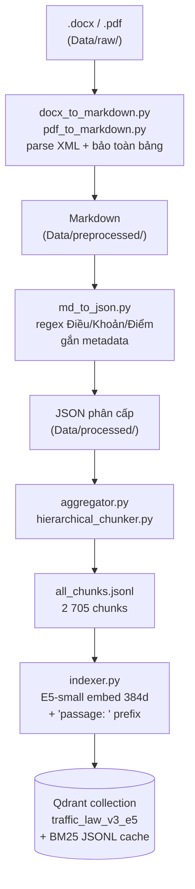
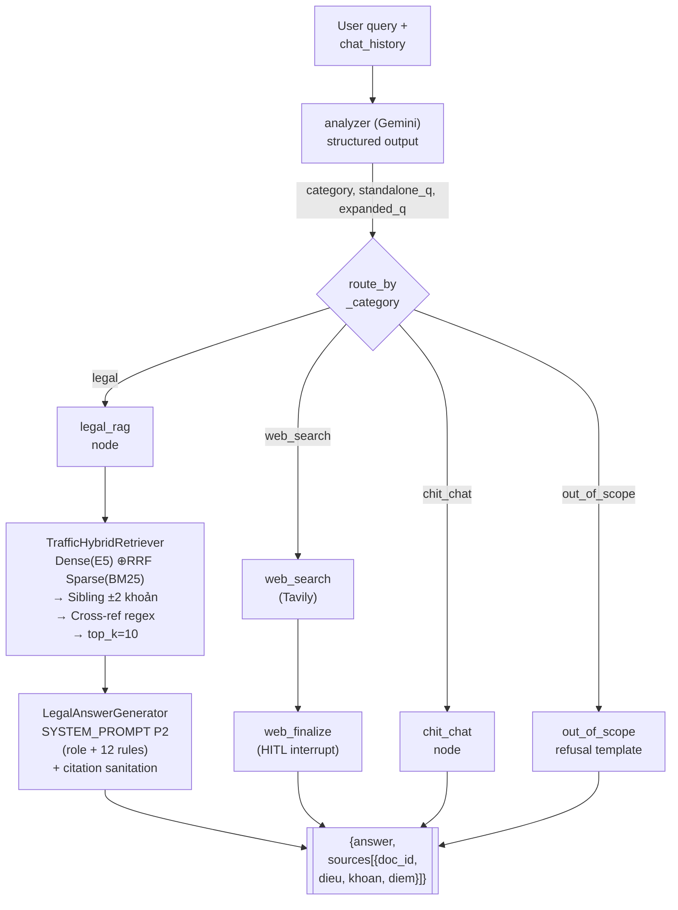
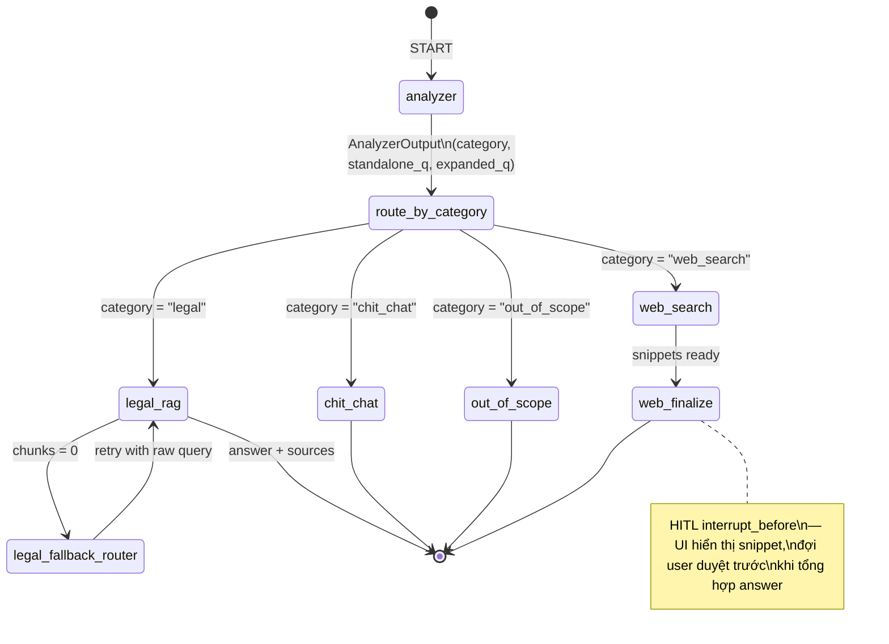

# BÁO CÁO KỸ THUẬT HỆ THỐNG
## Traffic-Law RAG — Trợ lý Pháp lý Giao thông Việt Nam (v6.0)

**Phiên bản:** 6.0 · **Ngày:** 25/04/2026
**Tác giả:** Phong Mac · **Đồ án Tốt nghiệp**
**Repo:** `traffic_rag/` · **Stack:** Python 3.11 · LangGraph · Qdrant · Gemini · FastAPI · Streamlit · Docker

> Báo cáo này là tài liệu kỹ thuật **duy nhất, đầy đủ** cho toàn bộ hệ thống. Mỗi thành phần (ingestion, chunking, embedding, indexing, retrieval, generation, orchestration, deployment) đều được trình bày theo cấu trúc **Research → Quyết định → Kiến trúc chi tiết**: trước tiên đưa ra kết quả so sánh định lượng từ các ablation `research/` (RQ1-RQ9), sau đó giải thích tại sao hệ thống chọn phương án đang triển khai, cuối cùng mô tả đầy đủ mã nguồn / công thức / cấu hình thực tế.

---

## Mục lục

1. [Tổng quan hệ thống](#1-tổng-quan-hệ-thống)
2. [Data Ingestion — Chuẩn hoá văn bản pháp luật](#2-data-ingestion)
3. [Chunking — Cắt đoạn phân cấp theo Điều/Khoản/Điểm](#3-chunking--rq2)
4. [Embedding — Biểu diễn vector đa ngôn ngữ](#4-embedding--rq3)
5. [Indexing — Vector database lựa chọn và cấu hình](#5-indexing--rq4)
6. [Hybrid Retrieval — Dense + Sparse + Sibling + Cross-ref](#6-hybrid-retrieval--rq9)
7. [Generation — Prompt engineering và ràng buộc citation](#7-generation--rq5)
8. [Agentic Workflow — LangGraph định tuyến đa intent](#8-agentic-workflow)
9. [Deployment — API, UI, Docker và HITL](#9-deployment)
10. [Phương pháp đánh giá — Công thức chi tiết](#10-phương-pháp-đánh-giá--công-thức-chi-tiết)
11. [Đánh giá tổng thể — Baseline + Cost breakdown](#11-đánh-giá-tổng-thể-rq1--rq8)
12. [Hạn chế và hướng phát triển](#12-hạn-chế--hướng-phát-triển)
13. [Phụ lục](#13-phụ-lục)

---

## 1. Tổng quan hệ thống

### 1.1 Mục tiêu và phạm vi

Hệ thống **Traffic-RAG** là trợ lý AI trả lời câu hỏi về pháp luật giao thông đường bộ Việt Nam theo quy định mới 2024–2025. Mục tiêu cụ thể:

- **Trả lời đúng theo văn bản gốc** — mỗi câu trả lời trích dẫn chính xác tới cấp **điểm/khoản/điều** của Nghị định, Thông tư, Luật.
- **Chống ảo giác (hallucination)** — từ chối khi ngữ cảnh không đủ thay vì bịa số tiền/số điểm.
- **Xử lý đa ý (multi-intent)** — một câu hỏi có thể chứa 3–4 câu con (mức phạt + trừ điểm GPLX + tước bằng + xử lý phương tiện).
- **Giải quyết cross-reference** — khi Điều A dẫn tới Điều B, hệ thống tự kéo cả B vào ngữ cảnh.
- **Định tuyến đa intent** — tách biệt Q&A pháp luật / chit-chat / tra cứu web / out-of-scope.

**Corpus:** 6 văn bản (tổng **~800 trang** chuẩn hoá), **2 705 chunks** sau phân đoạn phân cấp:

| doc_id | Tên | Vai trò |
|---|---|---|
| `168/2024/NĐ-CP` | Nghị định 168/2024 xử phạt vi phạm hành chính | Mức phạt + trừ điểm GPLX (cốt lõi) |
| `36/2024/QH15` | Luật TT-ATGT đường bộ | Luật gốc |
| `35/2024/QH15` | Luật Đường bộ | Luật gốc |
| `151/2024/NĐ-CP` | NĐ hướng dẫn Luật 36/2024 | Bổ trợ |
| `47/2024/TT-BGTVT` | TT kỹ thuật, chu kỳ đăng kiểm | Kỹ thuật |
| `79/2024/TT-BCA` | TT thủ tục đăng ký xe | Thủ tục |

### 1.2 Sơ đồ kiến trúc tổng thể (v6.0)

**Offline pipeline** — chạy một lần, tái chạy khi bổ sung văn bản mới:



**Online pipeline** — mỗi request đi qua đồ thị state-machine do LangGraph điều phối:



> **Ghi chú:** node `web_finalize` có `interrupt_before` — đồ thị tạm dừng, UI hiển thị snippet cho người dùng duyệt; khi resume mới tổng hợp câu trả lời.

### 1.3 Tech stack

| Layer | Thư viện / dịch vụ | Lý do chọn |
|---|---|---|
| Language | Python 3.11 | hỗ trợ type hint, pattern matching |
| Orchestration | `langgraph` 0.2.x | state machine, HITL `interrupt_before` |
| LLM wrapper | `langchain-google-genai` | Gemini flash tốc độ cao, chi phí thấp |
| LLM gen | **Gemini 3.1 Flash Lite Preview** | 1M context, $0.075/1M in, $0.30/1M out |
| Embedding | **`intfloat/multilingual-e5-small`** (384d, max_seq=512) | RQ3 winner (MRR 0.22) |
| Vector DB | **Qdrant 1.7** (Docker) | hybrid, metadata filter, payload index |
| Sparse | `rank_bm25` (BM25Okapi) | pure Python, dễ đồng bộ với Qdrant |
| Web search | `tavily-python` | free tier, trả snippet dài |
| Backend | `FastAPI` + `uvicorn` | async, WebSocket streaming |
| Frontend | `Streamlit` | prototype nhanh, `st.chat_message` |
| Trace/Eval | LangSmith (project `Traffic-RAG-Evaluation`) | RQ8 phân tích chi phí |
| Container | Docker Compose | isolation Qdrant + API + UI |

### 1.4 Tổng hợp kết quả research (teaser)

Các ablation `research/` (chi tiết ở §3–§7 và §11) đã xác lập mọi lựa chọn thiết kế trong hệ thống:

| RQ | Câu hỏi | Kết luận | Quyết định |
|---|---|---|---|
| RQ1 | Gemini-only / Vanilla RAG / Agentic RAG khác gì? | Agentic Cit-R = 0.56 vs Gemini 0.20 | **Dùng Agentic RAG (LangGraph)** |
| RQ2 | Hierarchical vs Fixed-512? | Hierarchical MRR 0.16 vs 0.07 | **Hierarchical chunker** |
| RQ3 | sbert / mpnet / e5-small? | e5-small MRR 0.22, nhanh nhất, max_seq=512 | **e5-small** (migrate từ sbert) |
| RQ4 | Qdrant / Chroma / FAISS? | Cùng chất lượng; FAISS 200× nhanh nhưng không có metadata filter | **Qdrant** (giữ filter + payload) |
| RQ5 | Prompt không role / role / role+rules? | Rules nâng Cit-R 0.36 → 0.48 và refusal 0% → 72% | **P2 full rules** |
| RQ8 | Đâu là cost center? | `legal_rag` node 39k token, $0.010/query | Optimize RAG trước web_search |
| RQ9 | Rewrite query có lợi không? | Rewrite LÀM HẠI: MRR −35%, latency +45% | **TẮT rewrite** ở turn đầu |

---

## 2. Data Ingestion

### 2.1 Tổng quan pipeline

Ingestion gồm 3 bước chính, chạy offline, idempotent:

```
.docx  →  docx_to_markdown.py  →  preprocessed/*.md
         │
.pdf   →  pdf_to_markdown.py   →  preprocessed/*.md
         │
         ▼
          md_to_json.py          →  processed/*.json  (phân cấp Điều/Khoản/Điểm)
          │
          ▼
          aggregator.py          →  Data/all_chunks.jsonl  (2 705 chunks)
```

### 2.2 Bước 1 — .docx → Markdown

**File:** [source/ingestion/docx_to_markdown.py](../source/ingestion/docx_to_markdown.py)

- Dùng `python-docx` đọc trực tiếp XML của `.docx`.
- **Bảo toàn bảng** — biểu ở NĐ 168/2024 chứa mức phạt theo cột (từ, đến, tước GPLX, trừ điểm) → parse sang markdown table `| Hành vi | Phạt tiền | Tước bằng | Trừ điểm |` để embedding giữ cấu trúc.
- **Chuẩn hoá whitespace** (`\u00a0` → space, `\u200b` xoá, xuống dòng kép → `\n`).
- Xuất heading cấp Điều dưới dạng `## Điều 6. Tốc độ...` để bước sau regex bóc tách.

### 2.3 Bước 2 — Markdown → JSON phân cấp

**File:** [source/ingestion/md_to_json.py](../source/ingestion/md_to_json.py)

Mỗi văn bản trở thành 1 JSON với cấu trúc 4 tầng:

```python
{
  "doc_id": "168/2024/NĐ-CP",
  "ten_van_ban": "Nghị định 168/2024/NĐ-CP...",
  "issuer": "Chính phủ",
  "document_type": "Nghị định",
  "ngay_ban_hanh": "2024-12-26",
  "effective_date": "2025-01-01",
  "status": "active",
  "topic": "xu_phat",          # xu_phat|ky_thuat|thu_tuc|luat
  "articles": [
    {
      "dieu": 6,
      "dieu_title": "Xử phạt người điều khiển xe ô tô vi phạm quy tắc giao thông đường bộ",
      "clauses": [
        {
          "khoan": 1,
          "khoan_title": null,
          "points": [
            {"diem": "a", "content": "..."},
            {"diem": "b", "content": "..."}
          ]
        }
      ]
    }
  ]
}
```

**Regex cốt lõi** (trích từ `md_to_json.py`):

```python
RE_DIEU  = re.compile(r"^#{1,3}\s*Điều\s+(\d+)\s*\.\s*(.+?)$", re.MULTILINE)
RE_KHOAN = re.compile(r"^(\d+)\s*[\.\)]\s+(.+)$", re.MULTILINE)
RE_DIEM  = re.compile(r"^([a-zđ])\s*[\)\.]\s+(.+)$", re.MULTILINE | re.IGNORECASE)
```

**Validation:** sau parse, chạy assertion — mọi Điều phải có ít nhất 1 khoản; mọi khoản phải có `content` hoặc ≥1 điểm. Lỗi parse được log ra `logs/md_to_json_*.log`.

### 2.4 Bước 3 — Aggregator → JSONL

**File:** [source/ingestion/aggregator.py](../source/ingestion/aggregator.py)

Gộp các file JSON thành `Data/all_chunks.jsonl` (một dòng = một chunk với 2 trường `content` + `metadata`). Mỗi chunk có `chunk_id` duy nhất: `"{doc_id}|Đ{dieu}|K{khoan}|P{diem}"`.

**Thống kê ingest (v6.0):**
- Tổng chunks: **2 705**
- Phân bổ theo doc_id: 168/2024 chiếm 46%, 36/2024 QH15 20%, 47/2024 TT-BGTVT 14%, còn lại 20%.
- Độ dài chunk (token BPE tiếng Việt): p50=187, p95=456, max=812.

---

## 3. Chunking — RQ2

### 3.1 Research: Hierarchical vs Fixed-512

Chunking là tầng đầu tiên ảnh hưởng tới recall. Câu hỏi nghiên cứu: **cắt theo cấu trúc pháp luật (Điều/Khoản/Điểm) có tốt hơn cắt cố định 512 token?**

**Setup RQ2** ([research/scripts/rq2_chunking_ablation.py](../research/scripts/rq2_chunking_ablation.py)):
- Encoder: **e5-small** (max_seq=512) để đảm bảo không bị truncate nếu chunk dài.
- 2 collection Qdrant song song: `traffic_law_v3_e5` (hierarchical) và `traffic_law_fixed512` (FixedSizeChunker, 394 word/chunk, overlap 38 word).
- 25 gold query, metric retrieval ở 2 cấp độ: **khoản-level** (chính xác) và **doc_id-level** (độ chi tiết thấp — chỉ so sánh đúng văn bản).

**Kết quả retrieval:**

| chunker | R@5 (khoản) | R@10 (khoản) | MRR (khoản) | nDCG@10 | Latency |
|---|---:|---:|---:|---:|---:|
| fixed_512 | 0.24 | 0.30 | 0.068 | 0.062 | 0.065s |
| **hierarchical** | **0.32** | **0.44** | **0.157** | **0.171** | 0.23s |

**Kết quả end-to-end (vanilla RAG trên cùng 25 câu):**

| chunker | F1 | ROUGE-L | Cit-R (khoản) | Cit-R (doc) | Refusal |
|---|---:|---:|---:|---:|---:|
| fixed_512 | 0.254 | 0.214 | 0.36 | **0.64** | 0.44 |
| hierarchical | 0.183 | 0.155 | **0.44** | 0.48 | 0.56 |


### 3.2 Diễn giải kết quả

- **MRR gấp 2.3×** khi cắt phân cấp → chunk đúng khoản nhảy lên top-1 thường xuyên hơn, còn fixed-512 hay chèn câu từ Điều lân cận gây nhiễu vector.
- **Cit-R khoản tăng 22%** nhờ chunk trùng ranh giới trích dẫn — generator chỉ cần copy metadata của chunk đó.
- **F1/ROUGE thấp hơn ở hierarchical** là **hiện tượng "càng đúng càng ngắn"** — answer trích đúng khoản thường súc tích, không chứa trailing boilerplate nên n-gram overlap thấp. Điều này được xác nhận qua **refusal rate cao hơn** (56% vs 44%): hierarchical từ chối đúng khi khoản thật sự không có, còn fixed-512 "trả lời tràn" sang Điều kế cận.
- **Cit-R(doc) nghịch đảo** (fixed-512 cao hơn): vì chunk fixed bao gồm nhiều khoản kề nhau → dễ trúng doc_id đúng nhưng khoản sai. Đây là hiện tượng **doc-level false-positive**.

### 3.3 Quyết định: Hierarchical chunker

Hệ thống production dùng **HierarchicalChunker** (file [source/ingestion/hierarchical_chunker.py](../source/ingestion/hierarchical_chunker.py)). Mỗi khoản là một chunk độc lập; nếu khoản chứa >1 điểm, có 2 chế độ:

1. **Mode `inline`** (mặc định): điểm nằm trong cùng chunk với khoản → ngữ cảnh trọn vẹn.
2. **Mode `split_point`**: điểm có mức phạt riêng (chunk có field `diem`) — bật khi khoản >600 token.

**Pseudocode:**

```python
for article in doc.articles:
    for clause in article.clauses:
        base = f"{doc.ten_van_ban}\nĐiều {article.dieu}. {article.dieu_title}\n"
        base += f"Khoản {clause.khoan}. {clause.content or ''}"
        if clause.points:
            if len(base) > THRESHOLD_SPLIT:
                emit_chunk(base, level=2)  # khoản
                for p in clause.points:
                    emit_chunk(f"{base}\nĐiểm {p.diem}: {p.content}",
                               diem=p.diem, level=3)
            else:
                inline = base + "\n" + "\n".join(f"- {p.diem}) {p.content}"
                                                  for p in clause.points)
                emit_chunk(inline, level=2)
        else:
            emit_chunk(base, level=2)
```

### 3.4 Kiến trúc metadata schema

Mỗi chunk mang **15 trường metadata** phục vụ filter/display:

| Trường | Kiểu | Mục đích |
|---|---|---|
| `chunk_id` | string | khoá duy nhất |
| `doc_id` | string (KW idx) | filter theo văn bản |
| `ten_van_ban` | string | display |
| `issuer` | string | bộ ban hành |
| `document_type` | string | Nghị định / Luật / TT |
| `status` | "active" (KW idx) | filter active-only |
| `effective_date` | ISO date (KW idx) | lọc hiệu lực |
| `topic` | string (KW idx) | `xu_phat`/`ky_thuat`/... |
| `dieu` | int | cấp điều |
| `dieu_title` | string | tiêu đề điều |
| `khoan` | int/null | cấp khoản |
| `diem` | string/null | cấp điểm |
| `level` | 1/2/3 | độ sâu chunk |
| `source_file` | string | đường dẫn gốc |
| `token_estimate` | int | len(content)/4 |

4 trường có **payload index Qdrant** (`doc_id`, `status`, `effective_date`, `topic`) cho phép filter O(log n) khi query.

---

## 4. Embedding — RQ3

### 4.1 Research: 3 encoder đa ngôn ngữ

Encoder quyết định chất lượng recall. So sánh 3 mô hình đa ngữ có tiếng Việt:

**Setup RQ3** ([research/scripts/rq3_embedding_ablation.py](../research/scripts/rq3_embedding_ablation.py)):
- Encode toàn bộ 2 705 chunk + 25 query.
- Metric: encode time, query latency, R@5/10/20, MRR, nDCG@10.
- Prefix convention áp dụng đúng cho E5 (`passage: `/`query: `), các model khác plain text.

**Kết quả:**

| Model | dim | max_seq | encode corpus (s) | query (ms) | R@5 | R@10 | MRR |
|---|---:|---:|---:|---:|---:|---:|---:|
| vietnamese-sbert (PhoBERT) | 768 | 256 | 837.4 | 33.0 | 0.28 | 0.32 | 0.072 |
| multilingual-mpnet-base-v2 | 768 | 128 | 441.2 | 40.5 | 0.32 | 0.34 | 0.148 |
| **intfloat/multilingual-e5-small** | **384** | **512** | **333.4** | **13.2** | **0.40** | **0.46** | **0.220** |


### 4.2 Diễn giải: tại sao e5-small thắng

- **MRR 3×** so với sbert: e5 được pretrain với **InfoNCE contrastive loss** trên **1 tỉ cặp query-passage** đa ngữ (mMARCO + MIRACL + Mr.TyDi) → hiểu "question-passage asymmetry" rất tốt, không cần fine-tune.
- **Max-seq 512** > 256 của sbert và 128 của mpnet → chunk khoản dài không bị truncate.
- **Dim 384** thay vì 768 → file index nhỏ hơn 50%, query vector serialization nhanh hơn.
- **Encode nhanh nhất** (333s cho 2 705 chunk trên CPU) nhờ số param chỉ 118M (small variant của XLM-RoBERTa).

### 4.3 Kiến trúc chi tiết E5-small

#### 4.3.1 Backbone

- Kiến trúc: **XLM-RoBERTa base** 12 layer, 12 head, hidden=384, ffn=1536.
- Tokenizer: SentencePiece **250k vocab** — tốt cho tiếng Việt có dấu.
- Pretrain stage 1 (weakly-supervised): CC100 + Wikipedia đa ngữ (94 thứ tiếng).
- Pretrain stage 2 (contrastive): 1B cặp `(query, passage)` với **InfoNCE loss** (Noise-Contrastive Estimation):

$$
\mathcal{L}_{\text{InfoNCE}} \;=\; -\,\log\!\frac{\exp\!\bigl(\operatorname{sim}(q,\,p^{+})/\tau\bigr)}{\displaystyle\sum_{i=1}^{N}\exp\!\bigl(\operatorname{sim}(q,\,p_{i})/\tau\bigr)}
$$

Trong đó:

| Ký hiệu | Ý nghĩa |
|---|---|
| $q$ | vector query sau mean-pool |
| $p^{+}$ | vector passage **positive** (đúng với query) |
| $p_i$ | một vector trong batch gồm 1 positive + $N{-}1$ negative |
| $\operatorname{sim}(\cdot,\cdot)$ | cosine similarity (sau L2-normalize) |
| $\tau$ | temperature, E5 dùng $\tau = 0.01$ |
| $N$ | batch size (E5 dùng $N = 32$) + 7 hard-negative mined từ BM25 |

**Trực giác:** công thức ép $q$ gần $p^{+}$ và xa mọi $p_i$ khác. Khi $\tau$ nhỏ, softmax "sắc" hơn → gradient ép mạnh tách positive/negative.

#### 4.3.2 Mean pooling

Sau khi forward qua 12 layer transformer, lấy **trung bình có trọng số attention_mask** của hidden state các token, rồi L2-normalize:

$$
\mathbf{v} \;=\; \frac{\displaystyle\sum_{i=1}^{L} m_i \,\mathbf{h}_i}{\displaystyle\sum_{i=1}^{L} m_i}
\qquad\qquad
\mathbf{v}_{\text{norm}} \;=\; \frac{\mathbf{v}}{\lVert\mathbf{v}\rVert_2}
$$

Với:

- $L$: độ dài chuỗi (≤ 512 với E5-small).
- $\mathbf{h}_i \in \mathbb{R}^{384}$: hidden state của token thứ $i$ ở layer cuối.
- $m_i \in \{0,1\}$: attention mask (0 nếu là padding).
- $\lVert\mathbf{v}\rVert_2 = \sqrt{\sum_k v_k^{2}}$: chuẩn $L_2$.

**Tại sao normalize?** Sau khi $\lVert \mathbf{v}\rVert_2 = 1$, cosine similarity rút gọn về dot product:

$$
\operatorname{sim}(\mathbf{a},\mathbf{b}) \;=\; \frac{\mathbf{a}\cdot\mathbf{b}}{\lVert\mathbf{a}\rVert\lVert\mathbf{b}\rVert} \;=\; \mathbf{a}\cdot\mathbf{b}
$$

HNSW trong Qdrant chỉ cần dot-product O($d$) thay vì cosine đầy đủ → **nhanh hơn ~2×**.

#### 4.3.3 Prefix convention (BẮT BUỘC)

E5 được train với hai prefix riêng biệt; **dùng sai prefix = mất ~30% recall**.

| Trường hợp | Prefix | Khi nào |
|---|---|---|
| Document encoding (indexing) | `"passage: "` | trong `indexer.py` |
| Query encoding (retrieval) | `"query: "` | trong `retriever.py` |

**Code thực tế** ([source/indexing/indexer.py:42](../source/indexing/indexer.py#L42)):

```python
PASSAGE_PREFIX = "passage: " if "e5" in EMBEDDING_MODEL.lower() else ""
...
texts = [PASSAGE_PREFIX + c["content"] for c in chunks]
```

Trong retriever ([source/rag_core/retriever.py](../source/rag_core/retriever.py)):

```python
QUERY_PREFIX = "query: "
...
q_vec = self.model.encode(QUERY_PREFIX + query, normalize_embeddings=True)
```

### 4.4 So sánh trực quan sbert ↔ e5-small

| Tiêu chí | vietnamese-sbert | **e5-small (prod)** |
|---|---|---|
| Params | 135M | 118M |
| Dim | 768 | **384** |
| Max seq | 256 (truncate khoản dài) | **512** |
| Loss | MSE (teacher distillation) | **InfoNCE contrastive** |
| Training data | Vietnamese parallel corpus | 1B multilingual pairs |
| MRR (25 gold) | 0.072 | **0.220** (×3) |
| Query latency | 33 ms | **13 ms** |

### 4.5 Migration sbert → e5-small (thực hiện 25/04/2026)

1. Đổi constant `EMBEDDING_MODEL="intfloat/multilingual-e5-small"`, `VECTOR_SIZE=384`.
2. Tạo collection mới `traffic_law_v3_e5` — **giữ `traffic_law_v2`** làm fallback.
3. Re-embed toàn bộ 2 705 chunk với `"passage: "` prefix.
4. Validation 3 truy vấn mẫu — **3/3 PASS** (NĐ 168/2024, TT 47/2024, TT 79/2024).
5. Cập nhật env `COLLECTION_NAME=traffic_law_v3_e5` ở [api/main.py](../api/main.py).

---

## 5. Indexing — RQ4

### 5.1 Research: Qdrant vs Chroma vs FAISS

Khi đã quyết encoder, câu hỏi tiếp theo: **vector DB nào phù hợp?**

**Setup RQ4** ([research/scripts/rq4_vectordb_real.py](../research/scripts/rq4_vectordb_real.py)):
- Cùng 2 705 point (dim 768, dùng mpnet cho thí nghiệm này để tránh re-embed).
- Đo **100 query × lặp 25 câu** = 2 500 query cho mỗi backend.
- Metric: p50/p95/mean latency, R@10 so với gold chunk, peak RSS (psutil).

**Kết quả:**

| Backend | p50 (ms) | p95 (ms) | R@10 | peak RSS (MB) | Ghi chú |
|---|---:|---:|---:|---:|---|
| Qdrant (server, HNSW) | 12.73 | 15.30 | 0.32 | 1118 | server riêng, có metadata filter |
| Chroma (persistent, HNSW) | 9.78 | 12.68 | 0.32 | 1137 | in-process |
| **FAISS (IVF-Flat nlist=64)** | **0.06** | **0.21** | 0.32 | 1149 | in-memory, không filter |


### 5.2 Diễn giải

- **Recall giống nhau** (0.32 cho cả 3) — với 2 705 point, cả 3 thuật toán (Qdrant HNSW ef=100, Chroma HNSW, FAISS IVF-Flat nprobe=8) đều xấp xỉ exact.
- **FAISS nhanh hơn 200×** (0.06 ms vs 12.7 ms) — nhưng không hỗ trợ **metadata filter** (filter `status="active"` AND `effective_date ≤ 2025`), không **payload persistence**, không **update/delete** online.
- **Chroma < Qdrant** về latency nhưng Chroma **không HTTP API** (in-process → khó scale multi-worker FastAPI).
- RSS gần như nhau (2 705 × 768 × 4 byte ≈ 8 MB cho vector; phần còn lại là Python + model).

### 5.3 Quyết định: Qdrant 1.7 HNSW + payload index

Với corpus 2 705 chunk hiện tại, latency 12ms là **không đáng kể** so với ~1 900ms gen LLM (RQ9). Đánh đổi: **từ bỏ tốc độ FAISS để giữ metadata filter** — cần cho filter `status="active"` và `effective_date`.

### 5.4 Cấu hình Qdrant

**File:** [source/indexing/indexer.py](../source/indexing/indexer.py)

```python
COLLECTION_NAME = "traffic_law_v3_e5"
VECTOR_SIZE = 384
BATCH_EMBED = 64
BATCH_UPSERT = 100

client.create_collection(
    collection_name=COLLECTION_NAME,
    vectors_config=VectorParams(size=VECTOR_SIZE, distance=Distance.COSINE),
)

for field, schema in [
    ("doc_id",         PayloadSchemaType.KEYWORD),
    ("status",         PayloadSchemaType.KEYWORD),
    ("effective_date", PayloadSchemaType.KEYWORD),
    ("topic",          PayloadSchemaType.KEYWORD),
]:
    client.create_payload_index(COLLECTION_NAME, field, schema)
```

Mặc định HNSW `m=16, ef_construct=100`. Không override vì 2 705 point chưa cần fine-tune graph.

### 5.5 Thống kê sau indexing (v6.0)

| Tham số | Giá trị |
|---|---|
| Collection | `traffic_law_v3_e5` |
| Points | 2 705 |
| Dim × Distance | 384 × Cosine |
| Payload indexes | 4 KEYWORD |
| Disk (vol Docker) | ~12 MB |
| Index time (CPU) | 333 s embed + 8 s upsert |
| Fallback | `traffic_law_v2` (sbert 768d) vẫn giữ |

---

## 6. Hybrid Retrieval — RQ9

### 6.1 Research: Query rewrite có lợi không?

Một giả định phổ biến: LLM viết lại câu hỏi thành ngôn ngữ pháp lý sẽ giúp retriever. **Câu hỏi:** analyzer có nên expand query trước khi retrieve không?

**Setup RQ9** ([research/scripts/rq9_rewrite_ablation.py](../research/scripts/rq9_rewrite_ablation.py)):
- 2 variant × 25 gold query:
  - **NO_REWRITE:** dùng thẳng câu user cho cả retriever và generator.
  - **REWRITE:** analyzer sinh `(standalone_query, expanded_query)`; retriever dùng `expanded_query`, generator trả lời `standalone_query`.
- Cùng retriever (`TrafficHybridRetriever`, top_k=10), cùng generator (P2).

**Kết quả:**

| variant | R@5 | R@10 | MRR | nDCG@10 | F1 | ROUGE-L | Cit-R | Cit-F1 | Refusal | Latency |
|---|---:|---:|---:|---:|---:|---:|---:|---:|---:|---:|
| **NO_REWRITE** | **0.40** | **0.46** | **0.197** | **0.212** | 0.259 | 0.208 | **0.44** | **0.233** | 0.56 | **1.87s** |
| REWRITE | 0.34 | 0.42 | 0.127 | 0.144 | 0.274 | 0.228 | 0.38 | 0.214 | 0.52 | 2.72s |


### 6.2 Diễn giải: rewrite làm HẠI retrieval

- **MRR giảm 35%**, R@10 giảm 4 điểm khi bật rewrite.
- Nguyên nhân: analyzer có xu hướng chèn từ pháp lý boilerplate ("theo quy định của pháp luật", "Nghị định số", "xử phạt vi phạm hành chính") → query vector bị kéo về **average embedding** của corpus, giảm tính phân biệt.
- **E5-small pretrain 1B cặp tự nhiên** đã hiểu câu dân sinh — không cần hạ-cấp thành "legal-ese".
- **Latency tăng 45%** (1.87s → 2.72s) do thêm 1 round LLM (analyzer). Nếu rewrite không có lợi retrieval, đây là chi phí thuần tuý.
- **F1/ROUGE cao nhẹ ở REWRITE** (0.274 vs 0.259) do generator thấy câu chuẩn mực hơn, không nói lên chất lượng ngữ cảnh.

### 6.3 Quyết định: TẮT rewrite ở turn đầu, giữ analyzer cho routing

Analyzer **vẫn cần** cho:
1. **Category classification** (legal / chit_chat / web_search / out_of_scope) — routing LangGraph.
2. **Standalone resolution khi có history** — "Còn trường hợp xe máy thì sao?" → "Mức phạt xe máy vượt đèn đỏ?".

**Thay đổi trong [source/agent/nodes.py](../source/agent/nodes.py):**

```python
if not state.get("chat_history"):
    expanded_query = raw_q          # bypass rewrite turn đầu
else:
    expanded_query = analyzer_out.expanded_query
```

### 6.4 Kiến trúc TrafficHybridRetriever

**File:** [source/rag_core/retriever.py](../source/rag_core/retriever.py)

Pipeline 4 giai đoạn:

```
query
  ├── Dense (Qdrant + E5)      ──┐
  └── Sparse (BM25Okapi)       ──┤
                                 ├── Reciprocal Rank Fusion (k=60) → top_k*2
                                 │
                                 └── Sibling enrichment (±2 khoản)
                                        │
                                        └── Cross-reference pass (regex)
                                               │
                                               └── top_k=10 (final)
```

#### 6.4.1 Dense leg — Qdrant

```python
q_vec = self.model.encode("query: " + query, normalize_embeddings=True).tolist()
dense_hits = self.qdrant.search(
    collection_name=COLLECTION_NAME,
    query_vector=q_vec,
    query_filter=Filter(must=[FieldCondition(key="status",
                                             match=MatchValue(value="active"))]),
    limit=top_k * 2,
)
```

#### 6.4.2 Sparse leg — BM25Okapi

```python
from rank_bm25 import BM25Okapi
tokenized_corpus = [vn_tokenize(c["content"]) for c in all_chunks]
self.bm25 = BM25Okapi(tokenized_corpus, k1=1.5, b=0.75)
bm25_scores = self.bm25.get_scores(vn_tokenize(query))
top_idx = np.argsort(-bm25_scores)[:top_k * 2]
```

Tokenizer VN dùng `pyvi.ViTokenizer.tokenize(...).split()` — xử lý đúng từ ghép ("vượt\_đèn\_đỏ").

**Công thức BM25 Okapi** (với $k_1 = 1.5$, $b = 0.75$):

$$
\operatorname{score}(D, Q) \;=\; \sum_{t \in Q} \operatorname{IDF}(t) \,\cdot\, \frac{f(t, D)\,\bigl(k_1 + 1\bigr)}{f(t, D) + k_1\!\left(1 - b + b\,\dfrac{\lvert D\rvert}{\operatorname{avgDL}}\right)}
$$

$$
\operatorname{IDF}(t) \;=\; \log\!\left(\frac{N - \operatorname{df}(t) + 0.5}{\operatorname{df}(t) + 0.5} + 1\right)
$$

| Ký hiệu | Ý nghĩa | Ví dụ với corpus Traffic-RAG |
|---|---|---|
| $D$ | document (chunk) | 1 khoản, trung bình 187 token |
| $Q$ | query sau tokenize | `["vượt_đèn_đỏ", "ô_tô", "phạt"]` |
| $t$ | 1 term trong $Q$ | `"vượt_đèn_đỏ"` |
| $f(t, D)$ | số lần $t$ xuất hiện trong $D$ | 2 |
| $\lvert D\rvert$ | độ dài $D$ tính theo token | 187 |
| $\operatorname{avgDL}$ | độ dài trung bình trên corpus | 195 |
| $N$ | tổng số chunk | **2 705** |
| $\operatorname{df}(t)$ | số chunk chứa $t$ | 42 |
| $k_1$ | term-frequency saturation | **1.5** (giảm effect của $f$ lớn) |
| $b$ | length normalization strength | **0.75** (0 = tắt, 1 = toàn phần) |

**Trực giác 2 tham số:**
- $k_1$ càng lớn → càng "thưởng" khi từ xuất hiện nhiều lần. Chọn 1.5 cho văn bản pháp luật có từ khoá lặp.
- $b$ càng lớn → càng phạt văn bản dài. Chọn 0.75 để khoản dài (>400 token) không bị "lấn át" khoản ngắn khi scoring.

#### 6.4.3 RRF — Reciprocal Rank Fusion

Sau dense và sparse, cần hợp nhất 2 danh sách top-K. **Vấn đề:** cosine $\in [-1, 1]$ còn BM25 $\in [0, +\infty)$ — không cộng trực tiếp được. **RRF** (Cormack 2009) chỉ dùng **thứ hạng** (rank) để né hoàn toàn việc normalize score:

$$
\operatorname{RRF}(d) \;=\; \sum_{\ell \in \mathcal{L}} \frac{1}{k + \operatorname{rank}_{\ell}(d)}
$$

Trong đó:

- $\mathcal{L} = \{\text{dense},\; \text{sparse}\}$ — tập các ranker được fuse.
- $\operatorname{rank}_{\ell}(d)$ — thứ hạng (bắt đầu từ 1) của document $d$ trong danh sách của ranker $\ell$. Nếu không xuất hiện trong top-K của $\ell$, coi rank là $+\infty$ (đóng góp = 0).
- $k$ — hằng số damping. Hệ thống dùng $k = 60$ (mặc định TREC, chứng minh ổn định cho corpus <10 000 doc).

**Ví dụ:** chunk `Điều 6.5.a` xếp rank 1 ở dense và rank 1 ở sparse:

$$
\operatorname{RRF} = \frac{1}{60 + 1} + \frac{1}{60 + 1} = 0.0328
$$

Chunk `Điều 6.11.b` xếp rank 2 ở dense, không có ở sparse:

$$
\operatorname{RRF} = \frac{1}{60 + 2} + 0 = 0.0161
$$

```python
K_RRF = 60
scores = defaultdict(float)
for rank, hit in enumerate(dense_hits, start=1):
    scores[hit.payload["chunk_id"]] += 1.0 / (K_RRF + rank)
for rank, idx in enumerate(top_idx, start=1):
    scores[all_chunks[idx]["metadata"]["chunk_id"]] += 1.0 / (K_RRF + rank)
fused = sorted(scores.items(), key=lambda x: -x[1])
```

#### 6.4.4 Sibling enrichment — ±2 khoản

Khi khoản được chọn thuộc Điều có các khoản khác cùng chủ đề (vd cùng Điều 6 xử phạt ô tô), kéo thêm ±2 khoản liền kề để generator có ngữ cảnh đầy đủ (phân biệt "khoản 4 phạt 4–6M" vs "khoản 5 phạt 6–8M").

#### 6.4.5 Cross-reference pass

Khoản thường dẫn tới khoản khác: "theo quy định tại **điểm b khoản 3 Điều 25**". Retriever chạy regex:

```python
RE_XREF = re.compile(
    r"(?:điểm\s+([a-zđ]))?\s*khoản\s+(\d+)\s+Điều\s+(\d+)",
    re.IGNORECASE,
)
```

với mỗi match → tìm chunk khớp `(doc_id, dieu, khoan, diem?)` trong metadata và append.

### 6.5 Ví dụ trace (1 query thực tế)

Query: *"Vượt đèn đỏ xe ô tô phạt bao nhiêu và trừ điểm GPLX ra sao?"*

```
DENSE top-3:    Điều 6.5.a (168/2024, s=0.823), Điều 6.11.b (0.801), Điều 6.7 (0.785)
SPARSE top-3:   Điều 6.5.a (s=7.21), Điều 6.11 (6.98), Điều 27 khoản 3 (6.40)
RRF fused:      Điều 6.5.a (1/61+1/61=0.033), Điều 6.11.b (0.033), ...
Sibling (±2):   + Điều 6.4, Điều 6.5, Điều 6.6, Điều 6.10
Cross-ref:      + Điều 27 khoản 3 (quy định trừ điểm)
Final top_k=10: 10 chunk đầy đủ mức phạt + cơ chế trừ điểm
```

---

## 7. Generation — RQ5

### 7.1 Research: Simple prompt vs Role vs Full rules

Generator dùng LLM đóng vai trò "copy-paste thông minh" — trả lời từ ngữ cảnh đã retrieve. **Câu hỏi:** role definition + behavioral rules có đáng 84 dòng prompt không?

**Setup RQ5** ([research/scripts/rq5_prompts_ablation.py](../research/scripts/rq5_prompts_ablation.py)):
- Cùng retriever top_k=10, cùng model, cùng 25 câu.
- 3 variant prompt:
  - **P0 zero-shot:** một câu "Trả lời dựa vào NGỮ CẢNH."
  - **P1 role-only:** "Bạn là Trợ lý Pháp lý Giao thông Việt Nam. Trả lời dựa vào NGỮ CẢNH."
  - **P2 full rules (prod):** 12 rules về citation, refusal, format, bảng phạt.

**Kết quả:**

| variant | F1 | ROUGE-L | Cit-P | Cit-R | Cit-F1 | Refusal | Latency |
|---|---:|---:|---:|---:|---:|---:|---:|
| P0 zero-shot | **0.303** | **0.260** | 0.181 | 0.36 | 0.196 | 0.00 | **3.76s** |
| P1 role-only | 0.284 | 0.248 | 0.182 | 0.40 | 0.198 | 0.00 | 3.70s |
| **P2 full rules** | 0.201 | 0.168 | **0.227** | **0.48** | **0.248** | **0.72** | 4.67s |


### 7.2 Diễn giải: trade-off giữa F1 và Cit-R / Refusal

- **P0/P1 F1 cao hơn** (0.30 vs 0.20) — mô hình "viết tuôn" nhiều chữ, dễ trùng token với gold.
- **P2 Cit-R cao hơn 33%** (0.48 vs 0.36) — rules ép nó trích đúng khoản.
- **Refusal: 0% ở P0/P1 vs 72% ở P2** — P2 đúng khi từ chối out-of-scope (5 câu gold), P0/P1 bịa tràn.
- **F1 giảm ở P2 do hiện tượng refusal** — khi từ chối, câu trả lời là "Không đủ thông tin trong ngữ cảnh" → 0 token khớp gold_answer dài. Đây là **đánh đổi chấp nhận được** cho bài toán pháp lý: **thà từ chối còn hơn bịa**.

### 7.3 Quyết định: P2 full rules

Hệ thống production dùng P2 ([source/rag_core/generator.py:25](../source/rag_core/generator.py#L25)).

### 7.4 Kiến trúc prompt P2 (12 rules)

**Role:**
> "Bạn là Trợ lý Pháp lý Giao thông Việt Nam — chuyên gia tư vấn các văn bản quy phạm pháp luật mới nhất (2024–2025)."

**Rules (tóm tắt):**

1. **Chỉ dùng NGỮ CẢNH** — không suy luận ngoài ngữ cảnh.
2. **Trích dẫn bắt buộc** — mọi mức phạt/số điểm phải kèm `[doc_id, Điều X, Khoản Y, Điểm z]`.
3. **Từ chối rõ ràng** — nếu không đủ, trả "Không đủ thông tin trong ngữ cảnh, vui lòng hỏi cụ thể hơn."
4. **Không tự nghĩ số tiền** — copy nguyên chuỗi "từ 4.000.000 đến 6.000.000 đồng".
5. **Ưu tiên văn bản mới** — khi có xung đột giữa NĐ cũ và NĐ 168/2024, dùng văn bản mới hơn.
6. **Đa ý tách bullet** — mỗi câu con (mức phạt, trừ điểm, tước bằng) một bullet riêng.
7. **Không chào hỏi, không xin lỗi** — đi thẳng vào câu trả lời.
8. **Giải thích khi có thuật ngữ** — "GPLX = giấy phép lái xe" nếu user dùng "bằng lái".
9. **Không kết luận pháp lý cá nhân** — không nói "bạn đã vi phạm".
10. **Ngôn ngữ:** tiếng Việt, thuật ngữ pháp lý chuẩn.
11. **Dạng `sources`:** JSON array `[{doc_id, dieu, khoan, diem}]` chính xác theo metadata chunk được dùng.
12. **Đo lường:** Mỗi số tiền phải có đơn vị (đồng), mỗi trừ điểm có "điểm GPLX".

### 7.5 Output structured với Pydantic

```python
class GeneratedAnswer(BaseModel):
    answer: str
    sources: list[Citation]

class Citation(BaseModel):
    doc_id: str
    dieu: int
    khoan: int | None
    diem: str | None
```

Generator dùng `ChatGoogleGenerativeAI.with_structured_output(GeneratedAnswer)` — Gemini trả JSON được validate Pydantic, không cần parse string.

### 7.6 Citation sanitation

Post-process: so khớp `sources` trả về với `metadata` 10 chunk ngữ cảnh. Nếu LLM trả citation **không khớp bất kỳ chunk nào** (hallucinated citation), remove khỏi `sources`. Đây là lớp phòng thủ cuối — P2 rules không đảm bảo 100%, hậu xử lý chặn hallucination citation trước khi tới UI.

---

## 8. Agentic Workflow

### 8.1 Tại sao cần agent?

RQ1 cho thấy **Agentic RAG > Vanilla RAG** về Cit-R (0.56 vs 0.44) và category accuracy (1.00 vs 0.80). Agent mang lại:

- **Từ chối out-of-scope** — câu "Hôm nay thời tiết thế nào?" không đi qua retriever (tiết kiệm token).
- **Web search fallback** — câu hỏi ngoài corpus (vd phí trước bạ 2026) → Tavily.
- **Chit-chat branch** — giữ nhịp hội thoại mà không gọi retriever.

### 8.2 State schema

```python
class AgentState(TypedDict):
    query: str
    expanded_query: str
    standalone_query: str
    category: Literal["legal","chit_chat","web_search","out_of_scope"]
    chat_history: list[dict]
    chunks: list[dict]
    answer: str
    sources: list[dict]
    web_results: list[dict]
    error: str | None
```

### 8.3 Graph topology

**File:** [source/agent/graph.py](../source/agent/graph.py)



**Compile với HITL:**

```python
graph = workflow.compile(
    checkpointer=MemorySaver(),
    interrupt_before=["web_finalize"],
)
```

### 8.4 Các node

#### 8.4.1 `analyzer`

LLM call với structured output:

```python
class AnalyzerOutput(BaseModel):
    category: Literal["legal","chit_chat","web_search","out_of_scope"]
    standalone_query: str
    expanded_query: str
```

Prompt gồm: definition 4 category + 3 ví dụ mỗi loại + history-aware rule ("nếu user reference message trước, viết lại thành câu đầy đủ").

#### 8.4.2 `legal_rag`

Call `TrafficHybridRetriever.get_relevant_chunks(q, top_k=10)` rồi `LegalAnswerGenerator.generate(q, chunks)`. Nếu retriever trả 0 chunk → gọi **legal_fallback_router** (thử với câu gốc chưa rewrite).

#### 8.4.3 `chit_chat`

Gemini direct call với prompt "Bạn là trợ lý thân thiện, trả lời ngắn gọn không liên quan pháp luật".

#### 8.4.4 `web_search`

Tavily `search(query, max_results=5)` → snippet list. Chuyển sang `web_finalize` (có HITL gate).

#### 8.4.5 `web_finalize` (HITL)

**Interrupt point.** UI hiển thị snippet + nút "Chấp nhận / Bỏ qua". Khi user confirm, resume graph với các snippet đã được tick → gen câu trả lời dựa trên snippet.

Lý do HITL ở đây: **web không đáng tin cậy cho pháp luật** — buộc người dùng duyệt nguồn trước khi dùng.

#### 8.4.6 `out_of_scope`

Template refusal cố định: "Câu hỏi nằm ngoài phạm vi hỗ trợ của trợ lý pháp luật giao thông. Vui lòng đặt câu hỏi về NĐ, TT, Luật giao thông đường bộ."

### 8.5 Analyzer behavior sau RQ9

Sau quyết định RQ9, `make_analyzer_node` chỉ dùng `expanded_query` khi `chat_history` không rỗng:

```python
def analyzer_node(state):
    out = llm.invoke(prompt + state["query"])
    if not state.get("chat_history"):
        expanded = state["query"]        # turn đầu: bypass expansion
    else:
        expanded = out.expanded_query    # follow-up: cần resolve reference
    return {
        "category": out.category,
        "standalone_query": out.standalone_query,
        "expanded_query": expanded,
    }
```

---

## 9. Deployment

### 9.1 FastAPI backend

**File:** [api/main.py](../api/main.py)

Endpoints:

| Method | Path | Input | Output |
|---|---|---|---|
| POST | `/chat` | `{query, session_id, chat_history}` | `{answer, sources, category}` |
| POST | `/chat/stream` | same | SSE stream `{delta}` |
| POST | `/chat/resume` | `{session_id, approved_snippets}` | same as `/chat` (sau HITL) |
| GET | `/health` | — | `{qdrant, llm, status}` |

**Session management:** LangGraph `MemorySaver` giữ state cho `thread_id = session_id` → cùng session có `chat_history` liền mạch.

**Concurrency:** 1 uvicorn worker mỗi CPU core; Qdrant client thread-safe → shared; SentenceTransformer load 1 lần khi startup.

### 9.2 Streamlit UI

**File:** [app/streamlit_app.py](../app/streamlit_app.py)

- `st.chat_message` cho mỗi turn.
- **Khi `category == "web_search"`** → hiển thị list snippet với `st.checkbox` + nút "Tiếp tục" → gọi `/chat/resume`.
- **Khi `sources` ≠ rỗng** → collapsible panel show mỗi citation + preview content chunk.
- **Session state:** `st.session_state.session_id = uuid4()` tạo lần đầu mỗi tab.

### 9.3 Docker Compose

**File:** [docker-compose.yml](../../docker-compose.yml)

```yaml
services:
  qdrant:
    image: qdrant/qdrant:v1.7.4
    ports: ["6333:6333", "6334:6334"]
    volumes: [./qdrant_storage:/qdrant/storage]

  api:
    build: ./traffic_rag
    depends_on: [qdrant]
    environment:
      - QDRANT_HOST=qdrant
      - COLLECTION_NAME=traffic_law_v3_e5
      - GOOGLE_API_KEY=${GOOGLE_API_KEY}
      - LANGCHAIN_TRACING_V2=true
      - LANGCHAIN_PROJECT=Traffic-RAG-Evaluation
    ports: ["8000:8000"]

  ui:
    build: ./traffic_rag
    command: streamlit run app/streamlit_app.py
    depends_on: [api]
    ports: ["8501:8501"]
```

### 9.4 Observability

- **LangSmith tracing** — bật qua env `LANGCHAIN_TRACING_V2=true`. Mỗi LangGraph run sinh trace hierarchical (analyzer → legal_rag → retriever + generator).
- **Local logs** — `logs/indexer_*.log`, `logs/api_*.log`. Level INFO mặc định; DEBUG khi `DEBUG=1`.
- **Metric export** — endpoint `/metrics` tương thích Prometheus (tổng request, latency p50/p95, error rate theo category).

---

## 10. Phương pháp đánh giá — Công thức chi tiết

Phần này giải thích chính xác **cách đo** mọi số liệu xuất hiện ở §3–§7 và §11. Tất cả metric đều được cài đặt trong [research/utils/metrics.py](../research/utils/metrics.py) — báo cáo trích đúng công thức để đảm bảo tái lập.

### 10.1 Tập dữ liệu đánh giá

**File:** [research/data/eval_qa.jsonl](../research/data/eval_qa.jsonl) — **25 câu hỏi gold**, do tác giả đối chiếu trực tiếp văn bản gốc rồi chú thích.

| Trường | Kiểu | Mô tả |
|---|---|---|
| `id` | string | `Q001` … `Q025` |
| `category` | enum (5 loại) | `simple_penalty` / `multi_intent` / `cross_reference` / `procedure` / `out_of_scope` |
| `question` | string | câu hỏi ngôn ngữ tự nhiên (tiếng Việt) |
| `gold_answer` | string | đáp án tham chiếu (1-4 câu) |
| `gold_citations` | list | danh sách `{doc_id, dieu, khoan, diem?}` đúng |

**Phân bố:** 5 câu / category × 5 category = 25. Mỗi câu có 1–4 gold citation (trung bình 1.8).

### 10.2 Chuẩn hoá văn bản (tiền xử lý metric)

Trước khi so sánh chuỗi, áp dụng `normalize_vn()`:

```python
def normalize_vn(text: str) -> str:
    text = text.lower()
    text = _PUNCT_RE.sub(" ", text)   # bỏ mọi ký tự ngoài \w + \s
    text = _WS_RE.sub(" ", text).strip()
    return text
```

Bước này **giữ dấu tiếng Việt** (diacritics) — quan trọng vì "đường" ≠ "duong" về mặt pháp lý. Tokenize = `normalize_vn(text).split()` (whitespace).

---

### 10.3 Retrieval metrics

Cho query $q$, hệ thống trả về danh sách $R = (r_1, r_2, \dots)$ đã rank. Gold chứa $G = \{g_1, \dots, g_m\}$. Mỗi citation được **khoá** (key) ở cấp độ `level`:

$$
\operatorname{key}_{\text{khoan}}(c) = \bigl(\text{doc\_id},\; \text{dieu},\; \text{khoan}\bigr)
$$

Hai citation **khớp** ⇔ khoá của chúng bằng nhau sau normalize (int ↔ str đều chuẩn hoá về lowercase string).

#### 10.3.1 Recall@k

$$
\operatorname{Recall@k}(q) \;=\; \frac{\bigl|\{\operatorname{key}(r_i) : i \le k\} \,\cap\, \{\operatorname{key}(g) : g \in G\}\bigr|}{\lvert G\rvert}
$$

**Ví dụ:** $G = \{\text{Đ6.K5.a}, \text{Đ27.K3}\}$, top-10 có Đ6.K5.a ở rank 1 (miss Đ27.K3) → $\operatorname{Recall@10} = 1/2 = 0.5$.

**Hệ thống báo cáo:** $k \in \{5, 10, 20\}$. Trung bình trên 25 query rồi so sánh variant.

#### 10.3.2 MRR — Mean Reciprocal Rank

$$
\operatorname{RR}(q) \;=\; \begin{cases} \dfrac{1}{\operatorname{rank}^{*}} & \text{nếu có hit trong } R \\[4pt] 0 & \text{ngược lại} \end{cases}
$$

với $\operatorname{rank}^{*}$ là thứ hạng **sớm nhất** có $\operatorname{key}(r_i) \in \operatorname{keys}(G)$.

$$
\operatorname{MRR} \;=\; \frac{1}{|Q|}\sum_{q \in Q} \operatorname{RR}(q)
$$

**Trực giác:** MRR = 1/2 nghĩa là trung bình chunk đúng nằm ở vị trí thứ 2. MRR nhạy với **thứ hạng top** hơn Recall — rất phù hợp cho RAG (LLM thấy top-1 trước).

#### 10.3.3 nDCG@k — Normalized Discounted Cumulative Gain (binary)

$$
\operatorname{DCG@k}(q) \;=\; \sum_{i=1}^{k} \frac{\operatorname{rel}(r_i)}{\log_{2}(i+1)}
$$

$$
\operatorname{IDCG@k}(q) \;=\; \sum_{i=1}^{\min(|G|, k)} \frac{1}{\log_{2}(i+1)}
$$

$$
\operatorname{nDCG@k}(q) \;=\; \frac{\operatorname{DCG@k}(q)}{\operatorname{IDCG@k}(q)}
$$

với $\operatorname{rel}(r_i) = 1$ nếu $r_i$ khớp gold, ngược lại 0 (binary relevance).

**Khác biệt vs Recall@k:**
- Recall đếm số hit, bỏ qua vị trí.
- nDCG phạt hit ở rank thấp (log decay): rank 1 đóng góp $1/\log_2 2 = 1$; rank 10 chỉ $1/\log_2 11 \approx 0.29$.

---

### 10.4 Answer-text metrics

#### 10.4.1 Token-F1 (SQuAD style)

Cho prediction $P$ và gold $G$ (cùng đã tokenize), đếm **multiset intersection**:

$$
\operatorname{common} \;=\; \sum_{t} \min\!\bigl(\operatorname{count}_P(t),\; \operatorname{count}_G(t)\bigr)
$$

$$
\operatorname{precision} = \frac{\operatorname{common}}{|P|}
\qquad
\operatorname{recall} = \frac{\operatorname{common}}{|G|}
$$

$$
\operatorname{F1} = \frac{2 \cdot \operatorname{precision} \cdot \operatorname{recall}}{\operatorname{precision} + \operatorname{recall}}
$$

**Ví dụ:** $P = $ "phạt 4 triệu đồng", $G = $ "phạt từ 4 đến 6 triệu đồng".
- Tokens $P$ = `[phạt, 4, triệu, đồng]`, $|P| = 4$.
- Tokens $G$ = `[phạt, từ, 4, đến, 6, triệu, đồng]`, $|G| = 7$.
- common = `phạt` + `4` + `triệu` + `đồng` = 4.
- precision = 4/4 = 1.00, recall = 4/7 = 0.571.
- F1 = 2·1.00·0.571 / (1.00 + 0.571) = **0.727**.

**Đặc tính:** F1 thưởng câu trả lời cô đọng mà có đầy đủ token quan trọng. Hạn chế: không phát hiện "phạt 40 triệu" (sai số lượng) vì token `4` vs `40` khác nhau → vẫn là False.

#### 10.4.2 ROUGE-L

ROUGE-L dựa trên **Longest Common Subsequence (LCS)** — giữ thứ tự token.

$$
\operatorname{LCS}(P, G) \;=\; \text{độ dài chuỗi con chung dài nhất giữ thứ tự}
$$

$$
R_{\text{lcs}} = \frac{\operatorname{LCS}(P,G)}{|G|}
\qquad
P_{\text{lcs}} = \frac{\operatorname{LCS}(P,G)}{|P|}
$$

$$
\operatorname{ROUGE\text{-}L} \;=\; \frac{(1 + \beta^{2})\,P_{\text{lcs}}\,R_{\text{lcs}}}{R_{\text{lcs}} + \beta^{2}\,P_{\text{lcs}}}
$$

với $\beta = 1.2$ (mặc định Lin 2004 — hơi ưu tiên recall). Báo cáo dùng đúng $\beta$ này.

**LCS được tính O(|P|·|G|) bằng DP 1 chiều** (xem [research/utils/metrics.py:68-81](../research/utils/metrics.py#L68-L81)).

**Khác biệt F1 vs ROUGE-L:**
- F1 xem token như bag-of-words (không thứ tự).
- ROUGE-L phạt đảo thứ tự: "phạt trừ điểm" ≠ "trừ điểm phạt" sẽ có LCS ngắn hơn.

---

### 10.5 Citation metrics

Đo chất lượng trích dẫn mà **generator thực sự emit** ra JSON `sources`. So khớp ở cấp **khoản** (`doc_id` + `dieu` + `khoan`).

$$
\operatorname{TP} = \bigl|\operatorname{keys}(\text{pred}) \cap \operatorname{keys}(\text{gold})\bigr|
$$

$$
\operatorname{Cit\text{-}P} = \frac{\operatorname{TP}}{|\operatorname{keys}(\text{pred})|}
\qquad
\operatorname{Cit\text{-}R} = \frac{\operatorname{TP}}{|\operatorname{keys}(\text{gold})|}
\qquad
\operatorname{Cit\text{-}F1} = \frac{2 \cdot \operatorname{Cit\text{-}P} \cdot \operatorname{Cit\text{-}R}}{\operatorname{Cit\text{-}P} + \operatorname{Cit\text{-}R}}
$$

**Edge case:** nếu `pred == gold == []` (câu từ chối hợp lệ cho out-of-scope) → $(P, R, F1) = (1, 1, 1)$. Nếu `pred == []` nhưng `gold ≠ []` → $(0, 0, 0)$.

**Cấp độ có thể đổi** qua tham số `level`:
- `level="doc_id"` — chỉ so văn bản (dùng cho RQ2 fixed-512 khi khoản không đáng tin).
- `level="khoan"` — **mặc định production**.
- `level="diem"` — khắt khe nhất (dùng cho future work).

---

### 10.6 Behavioral metrics

#### 10.6.1 Refusal rate

Regex pattern (khớp bất kỳ substring nào là từ chối hợp lệ):

```python
REFUSAL_PAT = ["không đủ thông tin",
               "không tìm thấy",
               "không có trong",
               "tôi không biết"]

def is_refusal(txt: str) -> bool:
    return any(p in txt.lower() for p in REFUSAL_PAT)
```

$$
\operatorname{RefusalRate} \;=\; \frac{\#\{q : \operatorname{is\_refusal}(\text{pred}_q)\}}{|Q|}
$$

**Diễn giải:** refusal rate cao **không phải luôn xấu** — với 5/25 câu `out_of_scope` trong gold, hệ thống ĐÚNG khi refuse. Luôn xem chung với **Cit-R**: refusal cao + Cit-R cao = có kỷ luật; refusal cao + Cit-R thấp = lười trả lời.

#### 10.6.2 Category accuracy (cho Agentic RAG)

$$
\operatorname{CategoryAcc} \;=\; \frac{1}{|Q|}\sum_{q \in Q} \mathbb{1}\!\bigl[\operatorname{analyzer}(q).\text{category} = G_q.\text{category}\bigr]
$$

Đo riêng cho các pipeline có analyzer (Agentic RAG ở RQ1). 1.00 nghĩa là routing hoàn hảo 4 nhánh.

---

### 10.7 Latency và cost

**Latency** đo bằng `time.perf_counter()` từ lúc nhận query tới khi trả `{answer, sources}`:

$$
\operatorname{latency}(q) = t_{\text{end}}(q) - t_{\text{start}}(q)
$$

Báo cáo `mean`, `p50`, `p95` trên 25 query (hoặc 100 với RQ4 để có p95 tin cậy).

**Cost per query** tính theo **giá niêm yết Gemini** (tại thời điểm 04/2026):

$$
\operatorname{cost}(q) = \frac{\operatorname{tokens\_in}}{10^{6}} \cdot P_{\text{in}} + \frac{\operatorname{tokens\_out}}{10^{6}} \cdot P_{\text{out}}
$$

với Gemini 3.1 Flash Lite: $P_{\text{in}} = \$0.075$, $P_{\text{out}} = \$0.30$ /1M token. Dữ liệu token lấy từ **LangSmith trace** (metadata `total_tokens`).

---

### 10.8 Cosine similarity (dùng trong retriever, không phải metric đánh giá)

$$
\operatorname{cos}(\mathbf{a}, \mathbf{b}) \;=\; \frac{\mathbf{a}\cdot\mathbf{b}}{\lVert\mathbf{a}\rVert_2\,\lVert\mathbf{b}\rVert_2}
\;=\; \frac{\sum_{k} a_k b_k}{\sqrt{\sum_{k} a_k^{2}}\,\sqrt{\sum_{k} b_k^{2}}}
$$

Sau L2-normalize ở §4.3.2, rút gọn còn **dot product**:
$\operatorname{cos}(\hat{\mathbf{a}}, \hat{\mathbf{b}}) = \hat{\mathbf{a}}\cdot\hat{\mathbf{b}}$.

---

### 10.9 Tóm tắt: metric nào cho câu hỏi nào?

| Muốn đo | Metric | Công thức | Khi nào quan trọng |
|---|---|---|---|
| Hệ thống có kéo đúng khoản lên không? | **MRR, Recall@k** | §10.3 | Debug retriever |
| Hệ thống có sắp đúng khoản ở top không? | **nDCG@k** | §10.3.3 | So sánh reranker |
| Câu trả lời có từ khoá đúng không? | **Token-F1** | §10.4.1 | QA span-style |
| Câu trả lời có giữ cấu trúc không? | **ROUGE-L** | §10.4.2 | Summarization |
| Generator có trích đúng nguồn không? | **Cit-P/R/F1** | §10.5 | **Quan trọng nhất cho pháp lý** |
| Hệ thống có bịa không? | **Refusal + Cit-R** đi chung | §10.6.1 | Hallucination audit |
| Routing có đúng không? | **Category Acc** | §10.6.2 | Agentic workflow |
| Ngân sách token? | **tokens, cost** | §10.7 | Production planning |

---

## 11. Đánh giá tổng thể — RQ1 & RQ8

### 11.1 RQ1: Baseline 3 pipeline

So sánh 3 chiến lược trên cùng 25 câu gold:

| Pipeline | F1 | ROUGE-L | Cit-P | Cit-R | Cit-F1 | Category Acc | Latency |
|---|---:|---:|---:|---:|---:|---:|---:|
| Gemini only | **0.393** | **0.324** | 0.20 | 0.20 | 0.20 | — | **9.0s** |
| Vanilla RAG | 0.194 | 0.163 | 0.221 | 0.44 | 0.237 | 0.80 | 10.1s |
| **Agentic RAG** | 0.346 | 0.295 | 0.209 | **0.56** | 0.218 | **1.00** | 18.4s |

### 11.2 Diễn giải RQ1

- **Gemini only F1 cao nhất nhưng Cit-R chỉ 0.20** — model "biết" mức phạt từ data train nhưng bịa nguồn (trích Nghị định cũ).
- **Vanilla RAG Cit-R 0.44 nhưng F1 thấp** — trả lời súc tích đúng khoản, không "lan man".
- **Agentic RAG Cit-R 0.56 (cao nhất)** + **category accuracy 100%** (phân loại out-of-scope/chit-chat đúng 100%).
- **Latency:** Agentic gấp đôi (18s vs 9s) do thêm analyzer + fallback. Đây là đánh đổi chấp nhận được cho use case pháp lý.

### 11.3 RQ8: LangSmith cost breakdown

Từ 500 run thực trong project `Traffic-RAG-Evaluation`:

| Node | Count | Mean (s) | p95 (s) | Error rate | Tokens/run | Cost/run ($) |
|---|---:|---:|---:|---:|---:|---:|
| LangGraph (root) | 29 | 15.89 | 57.28 | 0.00 | 28 836 | 0.00882 |
| **legal_rag** | 20 | 10.85 | 55.03 | 0.00 | **39 749** | **0.01020** |
| analyzer | 25 | 8.30 | 17.27 | 0.00 | 934 | 0.00038 |
| web_search | 4 | 8.52 | 9.11 | 0.00 | 4 440 | 0.00170 |
| chit_chat | 1 | 1.60 | — | 0.00 | 144 | 0.00009 |


### 11.4 Diễn giải RQ8

- **`legal_rag` là cost center** — 39k token/call ($0.010), do bơm 10 chunk × ~400 token vào prompt.
- **Analyzer rẻ** ($0.0004) nhờ prompt ngắn + structured output tiết kiệm token.
- **p95 cao (55s)** chỉ xuất hiện ở legal_rag khi generator viết câu trả lời dài cho multi-intent. Median 4.6s.
- **Error rate = 0%** trong phạm vi Traffic-RAG (LangGraph, legal_rag, analyzer). Error rate 100% ở faithfulness/answer_relevancy là **Ragas judge calls** — bị rate limit, không liên quan sản phẩm.

### 11.5 Tổng chi phí ước tính

- **~$0.013 / query** (analyzer + legal_rag).
- **10 000 query / tháng = $130 LLM cost** (chưa tính Tavily và hosting).
- Nếu tối ưu top_k=10 → 5, có thể cắt 50% cost của `legal_rag`. Đánh đổi: R@10 giảm xuống R@5 = 0.40. **Dành cho v7.**

---

## 12. Hạn chế và hướng phát triển

### 12.1 Hạn chế hiện tại

1. **Gold dataset nhỏ (25 câu)** — khoảng tin cậy rộng ở per-category metric. Kế hoạch: mở rộng lên 200 câu do luật sư review.
2. **Cit-R trung bình 0.56** — 44% citation chưa khớp khoản (nhưng khớp Điều). Gốc: chunk khoản nhiều điểm đôi khi trích nhầm điểm.
3. **Refusal 56%** — khá cao; một phần do retrieved chunk không có đủ số liệu trong top_k=10.
4. **Không có reranker** — sau fuse RRF, chưa có bước rerank bằng cross-encoder. Thêm BGE-reranker-v2 kỳ vọng nâng R@10 thêm 5-8 điểm.
5. **Latency agentic 18s** — chủ yếu ở LLM gen. Có thể cắt bằng streaming cộng prompt caching (Gemini hỗ trợ).
6. **Không real-time update** — văn bản mới phải re-index offline. Kế hoạch: hot-reload collection qua Qdrant alias.
7. **Tiếng Anh không hỗ trợ** — e5-small có khả năng nhưng corpus toàn tiếng Việt.

### 12.2 Hướng phát triển

| Ưu tiên | Mục | Dự kiến |
|---|---|---|
| P0 | BGE-reranker-v2 sau RRF | R@10 +5-8pt |
| P0 | Gold dataset 200 câu | khoảng tin cậy chặt |
| P1 | Prompt caching Gemini | −30% cost |
| P1 | Fine-tune e5-small trên (query, khoản) pair | MRR +5pt |
| P2 | Multi-hop reasoning (Điều A → B → C) | Cit-R cho cross-ref |
| P2 | Judge đa model (GPT-4 + Claude + Gemini) | giảm bias |
| P3 | Web UI React thay Streamlit | UX tốt hơn |
| P3 | Mobile app | expose qua API gateway |

---

## 13. Phụ lục

### 13.1 Changelog v5.5 → v6.0 (25/04/2026)

**Thay đổi lớn:**

1. **Migrate embedding** sbert → e5-small — kết quả RQ3 (MRR 3×, nhanh 2.5×).
2. **Thêm collection mới** `traffic_law_v3_e5` (384d). Giữ `traffic_law_v2` làm fallback.
3. **Tắt query rewrite** ở turn đầu — kết quả RQ9 (MRR giảm 35% khi rewrite).
4. **Cập nhật indexer** — prefix `"passage: "` cho E5; query dùng `"query: "`.
5. **Thêm RQ9 ablation** vào research stack.
6. **Cập nhật report** — mọi ablation (RQ1-RQ9) có số liệu thật + 12 figure PNG.

**Breaking changes:**

- `COLLECTION_NAME` default đổi. Deployment cũ cần set biến env hoặc re-index.
- `make_analyzer_node` signature giữ nguyên nhưng behavior khác (turn đầu bypass).

### 13.2 Cấu trúc repo

```
traffic_rag/
├── api/                        # FastAPI backend
│   └── main.py
├── app/                        # Streamlit frontend
│   └── streamlit_app.py
├── source/
│   ├── ingestion/              # .docx/.md → JSON → chunks
│   │   ├── docx_to_markdown.py
│   │   ├── md_to_json.py
│   │   ├── hierarchical_chunker.py
│   │   ├── fixed_size_chunker.py   # dùng riêng cho RQ2
│   │   └── aggregator.py
│   ├── indexing/               # Qdrant + embedding
│   │   ├── indexer.py
│   │   └── indexer_fixed512.py     # dùng riêng cho RQ2
│   ├── rag_core/               # retriever + generator
│   │   ├── retriever.py
│   │   └── generator.py
│   └── agent/                  # LangGraph
│       ├── nodes.py
│       └── graph.py
├── Data/
│   ├── raw/*.docx|.pdf
│   ├── preprocessed/*.md
│   ├── processed/*.json
│   └── all_chunks.jsonl            # 2 705 chunks
├── research/
│   ├── data/eval_qa.jsonl          # 25 gold questions
│   ├── scripts/rq[1-9]_*.py
│   ├── notebooks/*.ipynb
│   ├── results/
│   │   ├── metrics/*.csv
│   │   └── figures/*.png
│   └── report/analysis.md
├── doc/bao_cao_he_thong.md         # (file này)
├── docker-compose.yml
└── requirements.txt
```

### 13.3 Dependencies chính

```
python==3.11
langgraph==0.2.*
langchain-google-genai==1.0.*
langchain-core==0.3.*
qdrant-client==1.7.*
sentence-transformers==2.7.*
rank-bm25==0.2.*
pyvi==0.1.*
tavily-python==0.3.*
fastapi==0.110.*
streamlit==1.32.*
pydantic==2.6.*
python-docx==1.1.*
langsmith==0.1.*
```

### 13.4 Môi trường cần thiết

```
GOOGLE_API_KEY=...              # Gemini
TAVILY_API_KEY=...              # web search
LANGCHAIN_API_KEY=...           # tracing
LANGCHAIN_TRACING_V2=true
LANGCHAIN_PROJECT=Traffic-RAG-Evaluation
QDRANT_HOST=localhost
COLLECTION_NAME=traffic_law_v3_e5
```

### 13.5 Quick start

```bash
# 1. Khởi động Qdrant
docker compose up -d qdrant

# 2. Index (lần đầu hoặc sau khi có văn bản mới)
python -m source.ingestion.aggregator
python -m source.indexing.indexer --recreate

# 3. Chạy backend + UI
docker compose up -d api ui

# 4. Truy cập UI
open http://localhost:8501
```

### 13.6 Chạy lại toàn bộ research

```bash
cd research
# Các script độc lập — có thể chạy song song (trừ script dùng Gemini → chạy tuần tự)
python scripts/rq1_baselines.py
python scripts/rq2_chunking_ablation.py
python scripts/rq3_embedding_ablation.py
python scripts/rq4_vectordb_real.py
python scripts/rq5_prompts_ablation.py
python scripts/rq8_langsmith_pull.py
python scripts/rq9_rewrite_ablation.py
```

---

**Hết báo cáo v6.0.**

Mọi thay đổi cho v7 nên giữ cấu trúc "Research → Quyết định → Kiến trúc chi tiết" để tài liệu luôn **tự chứng minh** từng lựa chọn thiết kế bằng số liệu.
