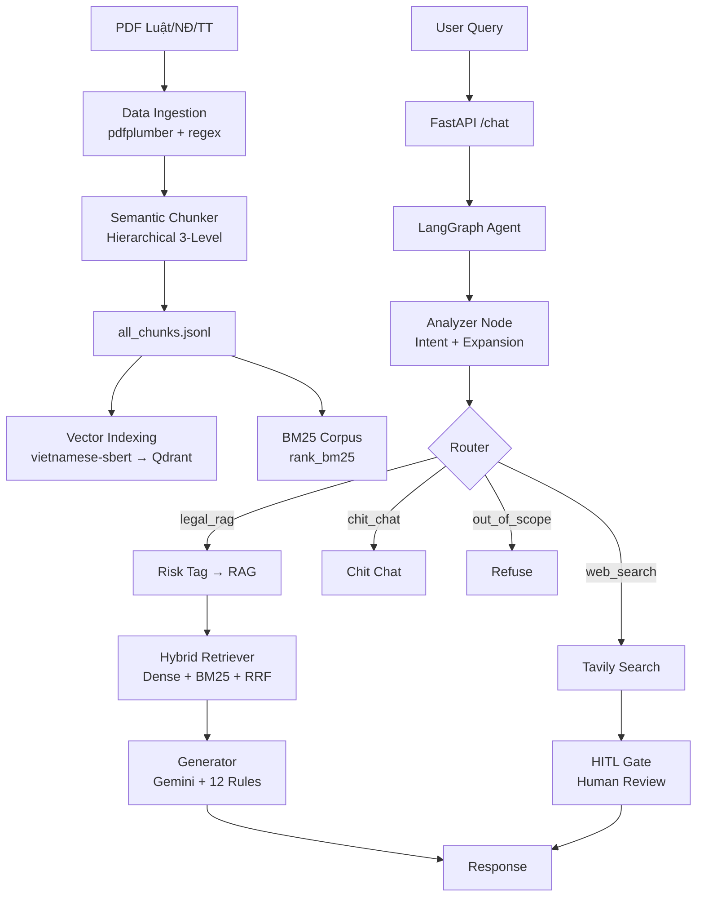
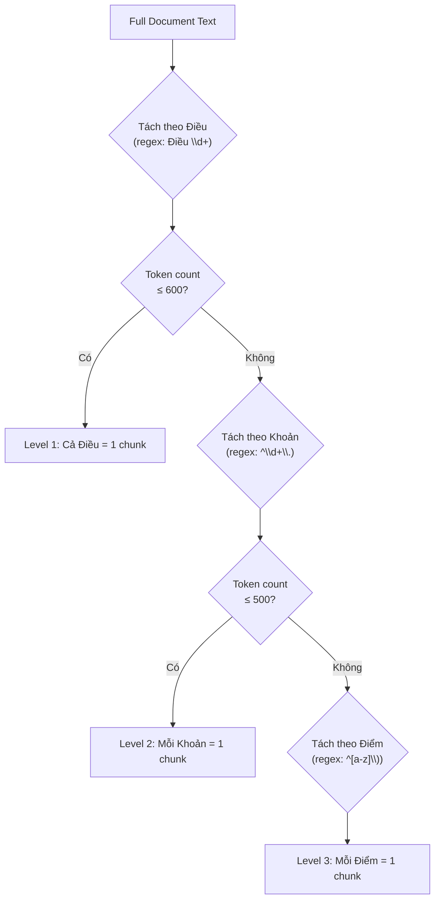
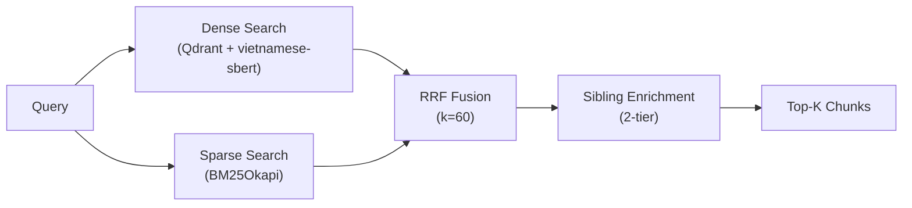
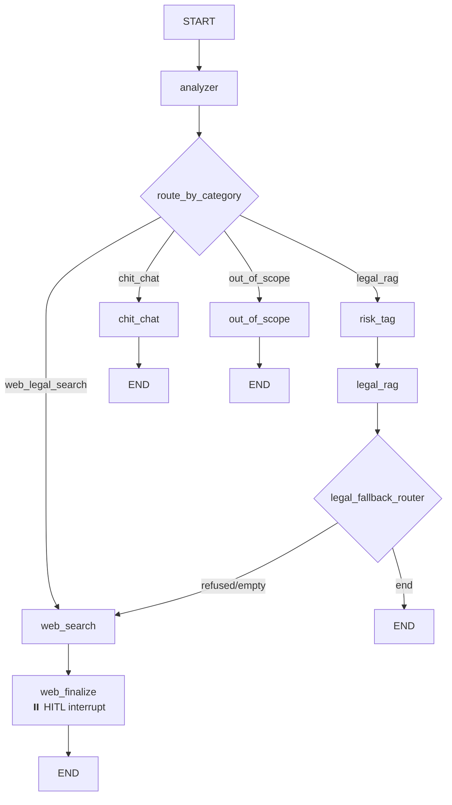

# BÁO CÁO KỸ THUẬT HỆ THỐNG
# Agentic RAG — Trợ lý Pháp lý Giao thông Việt Nam

> **Phiên bản:** v5.5 Final · **Ngày:** 22/04/2026  
> **Công nghệ lõi:** LangGraph · Qdrant · Sentence-BERT · Google Gemini · FastAPI  
> **Repository:** [MacPhuPhong/TRAFFIC_LAW_LLM_RAG_AGENTIC](https://github.com/MacPhuPhong/TRAFFIC_LAW_LLM_RAG_AGENTIC)

---

## Mục lục

1. [Tổng quan kiến trúc hệ thống](#1-tổng-quan-kiến-trúc-hệ-thống)
2. [Giai đoạn 1: Xử lý dữ liệu (Data Ingestion)](#2-giai-đoạn-1-xử-lý-dữ-liệu-data-ingestion)
3. [Giai đoạn 2: Phân đoạn ngữ nghĩa (Semantic Chunking)](#3-giai-đoạn-2-phân-đoạn-ngữ-nghĩa-semantic-chunking)
4. [Giai đoạn 3: Vector Embedding & Indexing (Toán học chuyên sâu)](#4-giai-đoạn-3-vector-embedding--indexing)
5. [Giai đoạn 4: Hybrid Retrieval (Truy xuất lai)](#5-giai-đoạn-4-hybrid-retrieval)
6. [Giai đoạn 5: Grounded Generation (Sinh câu trả lời)](#6-giai-đoạn-5-grounded-generation)
7. [Giai đoạn 6: Agentic Workflow (LangGraph)](#7-giai-đoạn-6-agentic-workflow-langgraph)
8. [Giai đoạn 7: Deployment & API](#8-giai-đoạn-7-deployment--api)

---

## 1. Tổng quan kiến trúc hệ thống



### Công nghệ sử dụng

| Thành phần | Công nghệ | Vai trò |
|---|---|---|
| PDF Extraction | `pdfplumber` | Trích xuất text + bảng từ PDF pháp luật |
| Text Cleaning | `regex` + `unicodedata` | Khử nhiễu, chuẩn hóa Unicode NFC |
| Chunking | Custom [HierarchicalLegalSplitter](file:///media/pphong/D:/Do_An_Tot_Nghiep/GitHub1/traffic_rag/source/ingestion/semantic_chunker.py#435-676) | Phân đoạn 3 tầng: Điều → Khoản → Điểm |
| Embedding | `KeepItReal/vietnamese-sbert` | Sentence-BERT 768 chiều cho tiếng Việt |
| Vector DB | `Qdrant` (Docker) | Lưu trữ + tìm kiếm vector, payload filtering |
| Lexical Search | `rank_bm25` (BM25Okapi) | Tìm kiếm từ khóa chính xác |
| Fusion | Reciprocal Rank Fusion (RRF) | Kết hợp dense + sparse ranking |
| LLM | Google Gemini (Flash) | Phân tích query + sinh câu trả lời |
| Agent Framework | `LangGraph` (StateGraph) | Đồ thị trạng thái có điều kiện |
| Checkpointer | `AsyncSqliteSaver` | Lưu trạng thái hội thoại + HITL |
| Web Search | `Tavily API` | Fallback tra cứu Internet |
| API | `FastAPI` + `uvicorn` | REST API async |
| Frontend | `Streamlit` | Giao diện web tương tác |
| Container | `Docker Compose` | Đóng gói Qdrant |

---

## 2. Giai đoạn 1: Xử lý dữ liệu (Data Ingestion)

### 2.1 Tổng quan pipeline

```
Data/raw/{luat,nghidinh,thongtu}/*.pdf
    │
    ▼  pdfplumber + clean_*.py
Data/cleaned/{luat,nghidinh,thongtu}/*.md
```

Hệ thống có **3 script làm sạch** riêng biệt cho 3 loại văn bản:

| Script | Đối tượng | File nguồn |
|---|---|---|
| [clean_luat_pdfs.py](file:///media/pphong/D:/Do_An_Tot_Nghiep/GitHub1/traffic_rag/source/ingestion/clean_luat_pdfs.py) | Luật (QH) | Luật 35, 36, 23... |
| [clean_nghidinh_pdfs.py](file:///media/pphong/D:/Do_An_Tot_Nghiep/GitHub1/traffic_rag/source/ingestion/clean_nghidinh_pdfs.py) | Nghị định (CP) | NĐ 168, 336, 100, 123... |
| [clean_thongtu_pdfs.py](file:///media/pphong/D:/Do_An_Tot_Nghiep/GitHub1/traffic_rag/source/ingestion/clean_thongtu_pdfs.py) | Thông tư (BCA/BGTVT/BTC) | TT 79, 51, 30, 46... |

### 2.2 Quy trình xử lý chi tiết

**Bước 1 — Trích xuất (Extraction):**
```python
# Sử dụng pdfplumber để mở từng trang PDF
with pdfplumber.open(pdf_path) as pdf:
    for page in pdf.pages:
        # Loại trừ vùng bảng (bbox-based exclusion)
        bboxes = get_table_bboxes(page)
        if bboxes:
            filtered_page = page.filter(
                lambda o: not is_inside_table(o, bboxes)
            )
            page_text = filtered_page.extract_text()
        
        # Trích xuất bảng riêng → Markdown
        for table in page.extract_tables(table_settings=strict):
            md = table_to_markdown(table)
```

> [!IMPORTANT]
> **Bbox-based Exclusion**: Khi trích xuất text, thuật toán sử dụng tọa độ bounding box của các bảng (`page.find_tables()`) để **loại trừ text nằm trong vùng bảng**, tránh việc text bị trùng lặp (vừa xuất hiện dạng text thuần, vừa nằm trong bảng Markdown).

**Bước 2 — Làm sạch (Cleaning):**
```python
# Chuẩn hóa Unicode NFC
text = unicodedata.normalize("NFC", raw_text)

# Loại bỏ nhiễu (Header/Footer của công cụ trích xuất)
RE_HEADER_NOISE = r"^\d{1,2}/\d{1,2}/\d{2,4},.*about:blank$"
RE_FOOTER_NOISE = r"about:blank\s+\d+/\d+|Thư viện pháp luật"
RE_PAGE_NUM     = r"^(Trang\s+)?\d+(\s*/\s*\d+)?$"

# Định dạng phân cấp pháp lý (Markdown headings)
"Chương I..."  → "# Chương I..."
"Điều 5: ..." → "## Điều 5: ..."

# Bôi đậm ngày tháng quan trọng
"ngày 15 tháng 3 năm 2024" → "**ngày 15 tháng 3 năm 2024**"
```

**Bước 3 — Nối dòng thông minh (Line Merging):**
```python
# CHỈ nối dòng khi:
#  1. Dòng trước kết thúc bằng chữ cái/dấu phẩy/chấm phẩy
#  2. Dòng sau bắt đầu bằng chữ thường
#  3. Dòng sau KHÔNG phải tiêu đề (Điều/Khoản/Chương)
if (RE_MERGE_END.search(prev[-1:]) 
    and line[0].islower() 
    and not RE_IS_HEADING.match(line)):
    merged_lines[-1] = prev + " " + line
```

**Bước 4 — Per-file Strategy (Chiến lược theo file):**

Một số Nghị định bị bãi bỏ một phần. Hệ thống áp dụng chiến lược riêng cho từng file:

```python
FILE_STRATEGIES = {
    "nd168_2024_...": {"keep_all": True},   # Giữ toàn bộ
    "nd100_2019_...": {                      # Chỉ giữ mảng đường sắt
        "keep_all": False,
        "include_section_keywords": ["đường sắt", "tàu hỏa"],
        "exclude_section_keywords": ["đường bộ", "xe ô tô"],
        "prepend_warning": "⚠️ Mảng đường bộ đã bị thay thế..."
    },
}
```

**Bước 5 — Chuyển bảng sang Markdown:**
```python
def table_to_markdown(table_data, annotate_diem_tru=False):
    # Fill merged cells (bảng PDF thường có ô trống do merge)
    for row in table_data:
        for j, cell in enumerate(row):
            if not cell_str and last_seen[j]:
                cell_str = last_seen[j]  # Kế thừa từ ô trên
    # Render dạng Markdown pipe table
    # | Header1 | Header2 | → |---|---| → | Data | Data |
```

### 2.3 Danh sách văn bản pháp luật đã thu thập

| STT | Văn bản | Mã số | Trạng thái |
|---|---|---|---|
| 1 | Luật Đường bộ 2024 | 35/2024/QH15 | ✅ Có hiệu lực |
| 2 | Luật Trật tự ATGT 2024 | 36/2024/QH15 | ✅ Có hiệu lực |
| 3 | NĐ Xử phạt VPHC đường bộ | 168/2024/NĐ-CP | ✅ Có hiệu lực |
| 4 | NĐ Xử phạt vận tải | 336/2025/NĐ-CP | ✅ Có hiệu lực |
| 5 | NĐ Kinh doanh vận tải | 10/2020/NĐ-CP | ✅ Có hiệu lực |
| 6 | TT Đăng ký xe | 79/2024/TT-BCA | ✅ Có hiệu lực |
| 7 | TT Sửa đổi đăng ký xe | 51/2025/TT-BCA | ✅ Có hiệu lực |
| 8 | TT Đăng kiểm ô tô | 30/2024/TT-BGTVT | ✅ Có hiệu lực |
| 9 | TT Đào tạo sát hạch GPLX | 35/2024/TT-BGTVT | ✅ Có hiệu lực |
| 10+ | ...và 10+ văn bản khác | | |

---

## 3. Giai đoạn 2: Phân đoạn ngữ nghĩa (Semantic Chunking)

### 3.1 Kiến trúc HierarchicalLegalSplitter

File: [semantic_chunker.py](file:///media/pphong/D:/Do_An_Tot_Nghiep/GitHub1/traffic_rag/source/ingestion/semantic_chunker.py)

Văn bản pháp luật Việt Nam có cấu trúc phân cấp rõ ràng:

```
Chương → Điều → Khoản → Điểm
```

Hệ thống tách văn bản theo **3 tầng phân cấp** dựa trên ngưỡng token:



### 3.2 Regex phát hiện cấu trúc pháp lý

```python
# Điều: "Điều 5." / "## Điều 5:"
RE_DIEU  = re.compile(r"(?:##\s*)?Điều\s+(\d+)[.:]\s*(.*)")

# Khoản: "1. Người điều khiển..." (số + chấm + chữ hoa)
RE_KHOAN = re.compile(
    r"^(\d+)\.(?=\s+[A-ZĐÀÁẠ...])",
    re.MULTILINE
)

# Điểm: "a) ..." (chữ thường + ngoặc đơn)
RE_DIEM  = re.compile(r"^([a-z])\)(?=\s+)", re.MULTILINE)
```

### 3.3 Ngưỡng split (Thresholds)

| Tham số | Giá trị | Ý nghĩa |
|---|---|---|
| `THRESH_DIEU` | 600 token | Nếu Điều > 600 token → split xuống Khoản |
| `THRESH_KHOAN` | 500 token | Nếu Khoản > 500 token → split xuống Điểm |
| `MIN_CHUNK` | 30 token | Chunk < 30 token → loại bỏ (quá ngắn) |

### 3.4 Token Counting

```python
def count_tokens(text: str) -> int:
    """Ước tính token: 1 từ tiếng Việt ≈ 1.3 token (subword tokenization)."""
    words = len(text.split())
    return int(words * 1.3)
```

> [!NOTE]
> Hệ số 1.3× là ước lượng cho tiếng Việt vì các mô hình ngôn ngữ sử dụng subword tokenization (BPE/WordPiece), trong đó mỗi từ tiếng Việt thường được tách thành 1-2 subword tokens.

### 3.5 Post-processing

**Regex Refinement** — Sửa lỗi ngắt dòng từ PDF:
```python
def refine_content(text):
    # 1. Nối từ bị ngắt bởi dấu gạch nối + xuống dòng
    text = re.sub(r'(\s*-\s*)\n\s*', r'\1', text)
    
    # 2. Nối dòng bị ngắt giữa câu (chữ thường → chữ thường)
    text = re.sub(r'(?<=[a-z...])\n(?=[a-z...])', ' ', text)
    
    # 3. Xóa dòng kẻ trang trí (-------)
    # 4. Gộp dòng trống liên tiếp
```

**Legal Styling** — Highlight thông tin quan trọng:
```python
def apply_legal_styling(text):
    # Bold mức phạt tiền
    "phạt tiền từ 18.000.000 đồng đến 20.000.000 đồng"
    → "**phạt tiền từ 18.000.000 đồng đến 20.000.000 đồng**"
    
    # Bold tước quyền sử dụng GPLX
    "tước quyền sử dụng GPLX từ 02 tháng đến 04 tháng"
    → "**tước quyền sử dụng GPLX từ 02 tháng đến 04 tháng**"
```

**Context Enrichment** — Chèn ngữ cảnh vào đầu chunk:
```python
# Mỗi chunk được chèn dòng tiêu đề để LLM hiểu ngữ cảnh
content = f"Văn bản: {tên_văn_bản} | Điều {số}: {tiêu_đề}\n{content}"

# Chunk từ văn bản đã hết hiệu lực được thêm cảnh báo
content = f"> ⚠️ {warning}\n\n{content}"
```

### 3.6 Deduplication & Noise Filtering

```python
# 1. Loại bỏ biểu mẫu nội bộ (sổ theo dõi, biên bản...)
FORM_NOISE_KEYWORDS = ['sổ theo dõi', 'biên bản phân công', ...]

# 2. Deduplication bằng MD5 hash
h = hashlib.md5(chunk['content'].encode()).hexdigest()
if h not in seen_hashes:
    seen_hashes.add(h)
    unique_chunks.append(chunk)
```

### 3.7 Metadata Schema

Mỗi chunk được gắn metadata đầy đủ:

```yaml
chunk_id:       "168_2024_ND_CP_dieu6_khoan9_diemc"
doc_id:         "168/2024/NĐ-CP"
ten_van_ban:    "Nghị định 168/2024/NĐ-CP (Xử phạt VPHC đường bộ)"
issuer:         "Chính phủ"
document_type:  "nghidinh"
status:         "active"
effective_date: "2025-01-01"
topic:          "Xử phạt vi phạm giao thông"
dieu:           6
dieu_title:     "Xử phạt ô tô"
khoan:          9
diem:           "c"
level:          3
token_estimate: 245
```

### 3.8 Output

- **Markdown files**: Mỗi chunk → 1 file [.md](file:///media/pphong/D:/Do_An_Tot_Nghiep/GitHub1/doc/agentic_rag_pipeline_v3.md) với YAML frontmatter
- **JSONL export**: Toàn bộ chunks → [all_chunks.jsonl](file:///media/pphong/D:/Do_An_Tot_Nghiep/GitHub1/traffic_rag/Data/all_chunks.jsonl) (dùng cho Qdrant indexing)

---

## 4. Giai đoạn 3: Vector Embedding & Indexing

### 4.1 Mô hình Embedding: vietnamese-sbert

**Mô hình:** `KeepItReal/vietnamese-sbert`  
**Kiến trúc:** Sentence-BERT (SBERT)  
**Số chiều:** 768  
**Ngôn ngữ:** Tiếng Việt (được fine-tune từ PhoBERT)

#### 4.1.1 Kiến trúc SBERT — Nền tảng toán học

SBERT (Sentence-BERT) là một biến thể của BERT được thiết kế để tạo ra **sentence embeddings** có ngữ nghĩa. Kiến trúc gồm:

```
Input Text → [CLS] token₁ token₂ ... tokenₙ [SEP]
                    │
            BERT Encoder (12 layers, 768 hidden)
                    │
             Hidden States: h₁, h₂, ..., hₙ ∈ ℝ⁷⁶⁸
                    │
            Mean Pooling (trung bình tất cả hidden states)
                    │
             Sentence Embedding: e ∈ ℝ⁷⁶⁸
```

**Mean Pooling:**

$$\mathbf{e} = \frac{1}{n} \sum_{i=1}^{n} \mathbf{h}_i$$

trong đó $\mathbf{h}_i \in \mathbb{R}^{768}$ là hidden state của token thứ $i$, và $n$ là số token trong câu.

#### 4.1.2 Siamese Network — Huấn luyện SBERT

SBERT sử dụng kiến trúc **Siamese Network** (mạng song sinh) để huấn luyện:

```
Sentence A → BERT → eₐ ─┐
                         ├─ Cosine Similarity → Loss
Sentence B → BERT → e_b ─┘
       (shared weights)
```

**Hàm mất mát (Contrastive Loss):**

Với cặp câu $(A, B)$ và nhãn $y \in \{0, 1\}$ (giống/khác nghĩa):

$$\mathcal{L} = y \cdot \max(0, \epsilon^{+} - \cos(\mathbf{e}_A, \mathbf{e}_B)) + (1-y) \cdot \max(0, \cos(\mathbf{e}_A, \mathbf{e}_B) - \epsilon^{-})$$

#### 4.1.3 PhoBERT → Vietnamese-SBERT

Mô hình `vietnamese-sbert` được xây dựng trên nền:

1. **PhoBERT** (VinAI, 2020): Pre-trained BERT cho tiếng Việt trên 20GB text
2. **Fine-tuning SBERT**: Huấn luyện thêm trên các cặp câu tiếng Việt tương đồng/khác biệt
3. **Output**: Mỗi câu/đoạn văn → vector 768 chiều trong **không gian ngữ nghĩa**

### 4.2 Cosine Similarity — Đo lường tương đồng ngữ nghĩa

Khoảng cách giữa 2 embedding được đo bằng **Cosine Similarity**:

$$\text{sim}(\mathbf{q}, \mathbf{d}) = \cos(\theta) = \frac{\mathbf{q} \cdot \mathbf{d}}{||\mathbf{q}|| \cdot ||\mathbf{d}||} = \frac{\sum_{i=1}^{768} q_i \cdot d_i}{\sqrt{\sum_{i=1}^{768} q_i^2} \cdot \sqrt{\sum_{i=1}^{768} d_i^2}}$$

Trong đó:
- $\mathbf{q} \in \mathbb{R}^{768}$: vector embedding của câu hỏi (query)
- $\mathbf{d} \in \mathbb{R}^{768}$: vector embedding của chunk tài liệu (document)
- Giá trị: $[-1, 1]$, với $1$ = hoàn toàn giống, $0$ = không liên quan

> [!TIP]
> **Tại sao dùng Cosine thay vì Euclidean?** Cosine Similarity đo **hướng** của vector, không phải **độ lớn**. Hai câu cùng nghĩa nhưng khác độ dài sẽ có cùng hướng vector → cosine cao. Euclidean Distance bị ảnh hưởng bởi độ lớn vector, không phù hợp cho text embeddings.

**Normalized Embeddings:** Hệ thống sử dụng `normalize_embeddings=True`:

$$\hat{\mathbf{e}} = \frac{\mathbf{e}}{||\mathbf{e}||_2}$$

Khi vector đã được chuẩn hóa ($||\hat{\mathbf{e}}|| = 1$), Cosine Similarity đơn giản hóa thành **dot product**:

$$\text{sim}(\hat{\mathbf{q}}, \hat{\mathbf{d}}) = \hat{\mathbf{q}} \cdot \hat{\mathbf{d}} = \sum_{i=1}^{768} \hat{q}_i \cdot \hat{d}_i$$

→ Giảm chi phí tính toán từ $O(3d)$ xuống $O(d)$ tại thời điểm truy vấn.

### 4.3 Qdrant Vector Database

File: [indexer.py](file:///media/pphong/D:/Do_An_Tot_Nghiep/GitHub1/traffic_rag/source/indexing/indexer.py)

**Cấu hình Collection:**
```python
client.create_collection(
    collection_name="traffic_law_v2",
    vectors_config=VectorParams(
        size=768,                 # Số chiều = vietnamese-sbert output
        distance=Distance.COSINE  # Khoảng cách Cosine
    ),
)
```

**Payload Indexes** (cho metadata filtering):
```python
# Tạo index cho 4 trường metadata → lọc nhanh khi search
for field in ["doc_id", "status", "effective_date", "topic"]:
    client.create_payload_index(
        collection_name="traffic_law_v2",
        field_name=field,
        field_schema=PayloadSchemaType.KEYWORD,
    )
```

### 4.4 Quy trình Indexing

```python
# 1. Đọc all_chunks.jsonl
chunks = [json.loads(line) for line in open(JSONL_PATH)]

# 2. Batch Embedding (64 texts/batch)
for i in range(0, total, BATCH_EMBED):
    batch_texts = texts[i : i + BATCH_EMBED]
    vectors = model.encode(batch_texts, normalize_embeddings=True)
    all_vectors.extend(vectors.tolist())

# 3. Batch Upsert vào Qdrant (100 points/batch)
for i in range(0, total, BATCH_UPSERT):
    batch_points = [
        PointStruct(
            id=j,
            vector=all_vectors[j],
            payload={...metadata + content...}
        )
        for j in range(i, min(i + BATCH_UPSERT, total))
    ]
    client.upsert(collection_name="traffic_law_v2", points=batch_points)
```

> [!NOTE]
> **Tại sao lưu [content](file:///media/pphong/D:/Do_An_Tot_Nghiep/GitHub1/traffic_rag/source/ingestion/semantic_chunker.py#335-381) trong payload?** Qdrant hỗ trợ stored payload. Lưu content trực tiếp trong payload giúp giảm 1 lượt I/O khi đã tìm được điểm tương đồng — không cần truy vấn lại JSONL.

---

## 5. Giai đoạn 4: Hybrid Retrieval

File: [retriever.py](file:///media/pphong/D:/Do_An_Tot_Nghiep/GitHub1/traffic_rag/source/rag_core/retriever.py)

### 5.1 Kiến trúc Hybrid Retriever



### 5.2 Dense Retrieval (Semantic Search)

```python
# Encode query thành vector 768 chiều
query_vector = model.encode(query, normalize_embeddings=True).tolist()

# Tìm kiếm trên Qdrant (lấy 30 candidates)
dense_hits = client.search(
    collection_name="traffic_law_v2",
    query_vector=query_vector,
    query_filter=qdrant_filter,  # Filter theo status, topic...
    limit=30,                    # candidates_per_retriever
    with_payload=True,
)
```

### 5.3 Sparse Retrieval (BM25Okapi)

#### 5.3.1 Toán học BM25

BM25 (Best Matching 25) là hàm xếp hạng xác suất. Điểm BM25 của document $D$ với query $Q = \{q_1, q_2, ..., q_n\}$:

$$\text{BM25}(D, Q) = \sum_{i=1}^{n} \text{IDF}(q_i) \cdot \frac{f(q_i, D) \cdot (k_1 + 1)}{f(q_i, D) + k_1 \cdot \left(1 - b + b \cdot \frac{|D|}{\text{avgdl}}\right)}$$

Trong đó:
- $f(q_i, D)$: tần suất xuất hiện của từ $q_i$ trong document $D$
- $|D|$: độ dài document (số từ)
- $\text{avgdl}$: độ dài trung bình của tất cả documents
- $k_1 = 1.5$: tham số điều chỉnh ảnh hưởng của tần suất từ
- $b = 0.75$: tham số điều chỉnh ảnh hưởng của độ dài document

**IDF (Inverse Document Frequency):**

$$\text{IDF}(q_i) = \ln\left(\frac{N - n(q_i) + 0.5}{n(q_i) + 0.5} + 1\right)$$

- $N$: tổng số documents trong corpus
- $n(q_i)$: số documents chứa từ $q_i$

> [!TIP]
> **Tại sao cần BM25 bên cạnh Dense?** Dense retrieval (SBERT) giỏi bắt **ngữ nghĩa** ("vượt đèn đỏ" ≈ "không chấp hành tín hiệu đèn giao thông"). BM25 giỏi bắt **từ khóa chính xác** ("Điều 6 Khoản 9" → match chính xác cụm từ). Kết hợp cả hai cho **recall + precision** tối ưu.

#### 5.3.2 Tokenization tiếng Việt

```python
VI_STOPWORDS = {"là", "và", "của", "cho", "các", "có", "được", ...}

def _tokenize_vi(text: str) -> list[str]:
    text = text.lower()
    text = re.sub(r"[^\w\s]", " ", text)  # Xóa dấu câu
    return [t for t in text.split() if t not in VI_STOPWORDS and len(t) > 1]
```

### 5.4 Reciprocal Rank Fusion (RRF)

RRF kết hợp kết quả từ 2 hệ thống retrieval không cùng thang điểm:

$$\text{RRF}(d) = \sum_{r \in \{dense, bm25\}} \frac{1}{k + \text{rank}_r(d)}$$

Trong đó:
- $k = 60$ (hằng số smoothing, giá trị chuẩn trong nghiên cứu)
- $\text{rank}_r(d)$: thứ hạng của document $d$ trong retriever $r$ (bắt đầu từ 1)

```python
def _rrf_fuse(self, dense_hits, bm25_hits, top_k):
    k = self.rrf_k  # 60
    scores = {}
    
    # Dense: tính RRF score
    for rank, h in enumerate(dense_hits, start=1):
        scores[h.id] = scores.get(h.id, 0.0) + 1.0 / (k + rank)
    
    # BM25: cộng dồn RRF score
    for rank, (pid, _) in enumerate(bm25_hits, start=1):
        scores[pid] = scores.get(pid, 0.0) + 1.0 / (k + rank)
    
    # Sắp xếp theo tổng RRF score
    fused = sorted(scores.items(), key=lambda kv: kv[1], reverse=True)[:top_k]
```

**Ví dụ tính toán:**

| Document | Dense Rank | BM25 Rank | RRF Score |
|---|---|---|---|
| Chunk A | 1 | 3 | 1/(60+1) + 1/(60+3) = 0.01639 + 0.01587 = **0.03226** |
| Chunk B | 5 | 1 | 1/(60+5) + 1/(60+1) = 0.01538 + 0.01639 = **0.03177** |
| Chunk C | 2 | - | 1/(60+2) = **0.01613** |

→ Chunk A xếp nhất vì xuất hiện ở cả 2 retriever với rank cao.

### 5.5 Sibling Enrichment (Bổ sung chunk anh em)

Đây là cơ chế **độc đáo** của hệ thống, giải quyết vấn đề: _Mức phạt tiền nằm ở Khoản 9, nhưng số điểm trừ GPLX nằm ở Khoản 16 cùng Điều._ Nếu chỉ trả về chunks có điểm cao nhất, sẽ thiếu thông tin.

**Tier (a) — Completion Clauses (Ưu tiên cao):**
```python
# Tự động đính kèm ALL chunks chứa thông tin "hoàn chỉnh" cho mỗi Điều
_SIBLING_PRIORITY_PATTERNS = (
    "còn bị trừ điểm giấy phép",
    "hình thức xử phạt bổ sung",
    "tước quyền sử dụng giấy phép",
    "tịch thu phương tiện",
)
```

**Tier (b) — Adjacent Khoản (Khoản liền kề):**
```python
# Đính kèm Khoản K-1 và K+1 cho mỗi Khoản trong kết quả chính
# Ví dụ: Retriever trả về K8 (0.25–0.4 mg/l)
# → Tự động đính kèm K9 (>0.4 mg/l) để phủ đầy khoảng
for rid in self._dieu_to_ids.get((did, dieu_int), []):
    if 0 < abs(k_int - khoan_int) <= max_neighbors:  # max_neighbors=2
        _emit(rid)
```

### 5.6 Auto-Exclude (Tự động loại trừ)

```python
# Khi query chứa "không kinh doanh vận tải"
# → Tự động loại trừ NĐ 10/2020 (chỉ cho xe kinh doanh)
def _auto_exclude_from_query(query):
    if "không kinh doanh vận tải" in q:
        exclude_topics.append("Kinh doanh vận tải")
        exclude_doc_ids.append("10/2020/NĐ-CP")
```

---

## 6. Giai đoạn 5: Grounded Generation

File: [generator.py](file:///media/pphong/D:/Do_An_Tot_Nghiep/GitHub1/traffic_rag/source/rag_core/generator.py)

### 6.1 Kiến trúc Generator

```
Retrieved Chunks → Format Context → [System Prompt + User Prompt] → Gemini LLM → Answer + Sources
```

### 6.2 System Prompt — 12 Quy tắc Bắt buộc

```
SYSTEM PROMPT (LegalAnswerGenerator):

1. Trả lời HOÀN TOÀN bằng tiếng Việt.
2. Chỉ sử dụng thông tin trong NGỮ CẢNH. KHÔNG dùng kiến thức bên ngoài.
3. Trích dẫn: [Điều X, Khoản Y — {tên văn bản} ({doc_id})].
4. Nếu không đủ thông tin → trả lời: "Thông tin này không có trong tài liệu..."
5. Không lời dẫn, đi thẳng vào câu trả lời.
6. Nhiều quy định → liệt kê (1., 2., 3.).
7. Phân biệt xe KINH DOANH vận tải vs. cá nhân.
8. Phân biệt loại phương tiện: Điều 6 (ô tô), Điều 7 (mô tô), Điều 8 (chuyên dùng).
9. Sử dụng chunk bổ sung (sibling) để hoàn chỉnh câu trả lời.
10. CROSS-REFERENCE: Quy trình 3 bước (Phạt tiền → Bảng trừ điểm → Ghép).
11. KHÔNG từ chối nếu có ÍT NHẤT một phần thông tin liên quan.
12. TỔNG HỢP: Rà soát TOÀN BỘ ngữ cảnh để trích xuất danh sách đầy đủ nhất.
```

### 6.3 Context Formatting

```python
def _format_chunk(i, chunk):
    # "[Nguồn 1] NĐ 168/2024 (168/2024/NĐ-CP) · Điều 6 · Khoản 9 · Điểm c"
    # Xử phạt ô tô
    # {nội dung chunk}
    
    # Chunk sibling được đánh dấu riêng:
    # "[Ngữ cảnh bổ sung — cùng Điều] ..."
```

### 6.4 Source Extraction

```python
# Trích xuất doc_id từ câu trả lời bằng regex
# Nhận diện 3 dạng trích dẫn:
#   (168/2024/NĐ-CP)   — ngoặc tròn
#   [168/2024/NĐ-CP]   — ngoặc vuông
#   168/2024/NĐ-CP     — plain text
bracketed = re.findall(r"[\(\[]\s*([^()\[\]]+?/[^()\[\]]+?)\s*[\)\]]", answer)
naked = re.finditer(r"\b(\d+/\d{4}/[A-ZĐ\-]+)\b", answer)
```

---

## 7. Giai đoạn 6: Agentic Workflow (LangGraph)

### 7.1 Kiến trúc Agent

File: [graph.py](file:///media/pphong/D:/Do_An_Tot_Nghiep/GitHub1/traffic_rag/source/agent/graph.py)



### 7.2 Agent State Schema

```python
class AgentState(TypedDict, total=False):
    query: str              # Câu hỏi đã chuẩn hóa
    raw_query: str          # Câu hỏi gốc
    expanded_query: str     # Câu hỏi mở rộng thuật ngữ
    chat_history: list      # Lịch sử hội thoại
    category: Category      # legal_rag | chit_chat | web_legal_search | out_of_scope
    chunks: list            # Chunks đã truy xuất
    answer: str             # Câu trả lời cuối cùng
    draft_answer: str       # Bản nháp (chờ duyệt)
    sources: list           # Nguồn trích dẫn
    refused: bool           # Generator từ chối?
    risk_flag: bool         # Cảnh báo chế tài nặng?
    requires_approval: bool # Cần HITL duyệt?
    model_info: str         # Tên model đã dùng
    error: str              # Lỗi hệ thống (nếu có)
```

### 7.3 Chi tiết từng Node

#### Node 1: Analyzer (Phân tích + Phân loại + Mở rộng)

File: [nodes.py](file:///media/pphong/D:/Do_An_Tot_Nghiep/GitHub1/traffic_rag/source/agent/nodes.py)

**System Prompt:**
```
Bạn là chuyên gia phân tích truy vấn Luật Giao thông Việt Nam.
Nhiệm vụ: 3 bước trong 1:

1. PHÂN LOẠI (Category):
   - 'legal_rag': Luật, mức phạt, đăng kiểm, đăng ký xe, quy định giao thông VN.
   - 'chit_chat': Xã giao, xin chào, hỏi thăm.
   - 'web_legal_search': Luật nước ngoài hoặc tin tức cực kỳ mới.
   - 'out_of_scope': KHÔNG liên quan giao thông (nấu ăn, âm nhạc...).
     BẮT BUỘC xếp vào đây nếu không tìm thấy yếu tố "xe", "luật", "đường bộ"...

2. CHUẨN HOÁ (Standalone): Viết lại câu hỏi thành câu ĐỘC LẬP.

3. MỞ RỘNG (Expanded): Chuyển đổi ngôn ngữ dân dã sang thuật ngữ chuyên môn.
   CHIẾN LƯỢC:
   * 'Mức phạt/Bị gì': → "{Hành vi} + mức xử phạt + NĐ 168/2024"
   * 'Khi nào/Trường hợp nào': → "{Chủ đề} + các hành vi + xử phạt bổ sung"
   * 'Thủ tục/Đâu': → "{Thủ tục} + trình tự + thẩm quyền + hồ sơ"
```

**Output format:** Pydantic [AnalyzerOutput(category, standalone_query, expanded_query)](file:///media/pphong/D:/Do_An_Tot_Nghiep/GitHub1/traffic_rag/source/agent/nodes.py#78-83)

#### Node 2: Router (Điều phối)

File: [router.py](file:///media/pphong/D:/Do_An_Tot_Nghiep/GitHub1/traffic_rag/source/agent/router.py)

```python
def route_by_category(state: AgentState) -> str:
    return state.get("category", "legal_rag")
    # → "legal_rag" | "chit_chat" | "web_legal_search" | "out_of_scope"
```

#### Node 3: Risk Tag (Đánh dấu rủi ro)

```python
RISK_PATTERNS = (
    r"tịch thu",
    r"hình sự",
    r"truy cứu trách nhiệm",
    r"tạm giữ phương tiện",
    r"tước quyền sử dụng",
)

def risk_tag_node(state):
    q = state.get("query", "").lower()
    flagged = any(re.search(p, q) for p in RISK_PATTERNS)
    return {"risk_flag": flagged}
    # NON-BLOCKING: chỉ set flag cho UI warning, không chặn pipeline
```

#### Node 4: Legal RAG (Truy xuất + Sinh câu trả lời)

```python
def legal_rag_node(state):
    # 1. Truy xuất chunks (top_k=20 cho broad queries)
    chunks = retriever.get_relevant_chunks(expanded_query, top_k=20)
    
    # 2. Sinh câu trả lời grounded
    result = generator.generate(query, chunk_dicts)
    
    # 3. Trả về answer + sources + refused flag
    return {"answer": ..., "sources": ..., "refused": ...}
```

#### Node 5: Legal Fallback Router

```python
def legal_fallback_router(state):
    if state.get("error"):
        return "end"          # Lỗi infra → không fallback web
    if state.get("refused") or not state.get("chunks"):
        return "web_search"   # Corpus không có → tra web
    return "end"              # Có câu trả lời → kết thúc
```

#### Node 6: Web Search (Tavily)

File: [tools.py](file:///media/pphong/D:/Do_An_Tot_Nghiep/GitHub1/traffic_rag/source/agent/tools.py)

```python
# Chỉ tìm kiếm trên các trang luật uy tín VN
VN_LEGAL_DOMAINS = (
    "thuvienphapluat.vn",
    "luatvietnam.vn",
    "chinhphu.vn",
    "csgt.vn",
    "quochoi.vn",
    ...
)

# Retry logic cho transient errors (timeout, connection reset)
# Linear backoff: 1s, 2s...
```

#### Node 7: Web Finalize (HITL Gate)

```python
# Compiled with: interrupt_before=["web_finalize"]
# → Graph DỪNG tại đây, chờ con người duyệt draft_answer

def web_finalize_node(state):
    draft = state.get("draft_answer", "")
    return {"answer": draft, "requires_approval": False}
```

> [!CAUTION]
> **Human-in-the-Loop (HITL)**: Mọi câu trả lời từ Internet đều phải qua sự phê duyệt của chuyên gia trước khi hiển thị cho người dùng. Đây là cơ chế an toàn quan trọng để đảm bảo tính chính xác pháp lý.

### 7.4 Graph Compilation

```python
workflow = StateGraph(AgentState)

# Add 7 nodes
workflow.add_node("analyzer", make_analyzer_node(llm))
workflow.add_node("risk_tag", risk_tag_node)
workflow.add_node("legal_rag", make_legal_rag_node(retriever, generator))
workflow.add_node("chit_chat", make_chit_chat_node(llm))
workflow.add_node("out_of_scope", out_of_scope_node)
workflow.add_node("web_search", make_web_search_node(tavily, llm))
workflow.add_node("web_finalize", web_finalize_node)

# Add edges
workflow.add_edge(START, "analyzer")
workflow.add_conditional_edges("analyzer", route_by_category, {
    "legal_rag": "risk_tag",
    "chit_chat": "chit_chat",
    "web_legal_search": "web_search",
    "out_of_scope": "out_of_scope",
})
workflow.add_edge("risk_tag", "legal_rag")
workflow.add_conditional_edges("legal_rag", legal_fallback_router, {
    "web_search": "web_search",
    "end": END,
})
workflow.add_edge("web_search", "web_finalize")
workflow.add_edge("web_finalize", END)

# Compile with HITL interrupt + checkpointer
graph = workflow.compile(
    checkpointer=AsyncSqliteSaver(conn),
    interrupt_before=["web_finalize"],
)
```

---

## 8. Giai đoạn 7: Deployment & API

### 8.1 FastAPI Backend

File: [api/main.py](file:///media/pphong/D:/Do_An_Tot_Nghiep/GitHub1/traffic_rag/api/main.py)

**Endpoints:**

| Method | Path | Chức năng |
|---|---|---|
| `POST` | `/chat` | Gửi câu hỏi mới |
| `POST` | `/resume/{thread_id}` | Duyệt/Từ chối bản nháp web |
| `GET` | `/pending/{thread_id}` | Kiểm tra trạng thái thread |
| `GET` | `/health` | Health check |

**Lifecycle:**
```python
@asynccontextmanager
async def lifespan(app):
    # 1. Load .env (GOOGLE_API_KEY, TAVILY_API_KEY)
    # 2. Khởi tạo TrafficHybridRetriever (Qdrant + BM25)
    # 3. Khởi tạo LegalAnswerGenerator (Gemini)
    # 4. Khởi tạo ChatGoogleGenerativeAI (cho Analyzer)
    # 5. Khởi tạo TavilySearchTool
    # 6. Tạo AsyncSqliteSaver (checkpointer cho hội thoại)
    # 7. Build LangGraph
    yield
    # Cleanup: đóng SQLite connection
```

### 8.2 Docker Compose

```yaml
services:
  qdrant:
    image: qdrant/qdrant:latest
    ports:
      - "6334:6333"        # gRPC port mapping
    volumes:
      - ./qdrant_storage:/qdrant/storage

  traffic_rag_app:
    build: .
    ports:
      - "8003:8000"
    env_file:
      - ../.env
    depends_on:
      - qdrant
```

### 8.3 Streamlit Frontend

File: [ui/app.py](file:///media/pphong/D:/Do_An_Tot_Nghiep/GitHub1/traffic_rag/ui/app.py)

**Tính năng:**
- Chat interface với `st.chat_message`
- Hiển thị phân loại (Legal RAG / Chit Chat / Web Search / Out of Scope)
- HITL review form (Duyệt / Từ chối / Chỉnh sửa)
- Nguồn trích dẫn trong `st.expander`
- Cảnh báo rủi ro (Risk Flag → `st.warning`)
- Quản lý thread ID qua sidebar

### 8.4 Quy trình triển khai đầy đủ

```bash
# Bước 1: Khởi động Qdrant
docker compose up -d qdrant

# Bước 2: Cài đặt Python dependencies
pip install -r requirements.txt

# Bước 3: Chạy Data Ingestion (chỉ lần đầu)
python -m source.ingestion.clean_luat_pdfs
python -m source.ingestion.clean_nghidinh_pdfs
python -m source.ingestion.clean_thongtu_pdfs

# Bước 4: Chạy Semantic Chunking (chỉ lần đầu)
python -m source.ingestion.semantic_chunker

# Bước 5: Indexing vào Qdrant (chỉ lần đầu)
python -m source.indexing.indexer --recreate

# Bước 6: Khởi động FastAPI Backend
uvicorn api.main:app --host 0.0.0.0 --port 8000

# Bước 7: Khởi động Streamlit Frontend
streamlit run ui/app.py --server.port 8501
```

### 8.5 Biến môi trường

```env
GOOGLE_API_KEY=...          # Google Gemini API key
TAVILY_API_KEY=...          # Tavily Search API key
GENERATOR_MODEL=gemini-3.1-flash-lite-preview
CHECKPOINT_DB=traffic_rag/checkpoints/graph.db
```

---

## Phụ lục: Tổng kết kỹ thuật

| Chỉ số | Giá trị |
|---|---|
| Tổng văn bản pháp luật | 20+ (Luật, NĐ, TT) |
| Tổng chunks sau xử lý | ~2,000+ |
| Embedding dimension | 768 |
| Retrieval top-k | 20 (mặc định cho broad queries) |
| RRF k | 60 |
| Sibling max_neighbors | 2 |
| Generator temperature | 0.1 |
| HITL gate | `interrupt_before=["web_finalize"]` |
| Checkpointer | AsyncSqliteSaver |
| Web domains (Tavily) | 12 trang luật uy tín VN |

---

*Báo cáo được tạo tự động từ phân tích mã nguồn hệ thống. Phiên bản: v5.5 Final.*
