# SƠ ĐỒ TOÀN DIỆN HỆ THỐNG TRAFFIC-RAG

**Phiên bản:** v6.8 (hierarchical chunker fix + corpus 4 423) · **Ngày:** 2026-05-22 · **Tác giả:** Mạc Phú Phong

> Tài liệu này tổng hợp toàn bộ kiến trúc hệ thống Traffic-Law RAG dưới dạng sơ đồ. Mỗi sơ đồ phụ trách một khía cạnh khác nhau (context, component, ingestion, online flow, retrieval internals, HITL state, data model, deployment) để có thể đọc độc lập trong báo cáo / slide thuyết trình.

---

## Mục lục

0. [Sơ đồ tổng thể chi tiết v7.0 (dùng cho Chương 2)](#0-sơ-đồ-tổng-thể-chi-tiết-v70--dùng-cho-chương-2)
1. [Sơ đồ ngữ cảnh (Level 1 — System Context)](#1-sơ-đồ-ngữ-cảnh)
2. [Sơ đồ thành phần (Level 2 — Container)](#2-sơ-đồ-thành-phần)
3. [Pipeline offline — Ingestion → Indexing](#3-pipeline-offline)
4. [Pipeline online — Agentic flow (LangGraph)](#4-pipeline-online)
5. [Cấu tạo Hybrid Retrieval](#5-hybrid-retrieval)
6. [Generation + Citation grounding](#6-generation--citation)
7. [State machine HITL (Human-in-the-Loop)](#7-state-machine-hitl)
8. [Data model — Chunk metadata schema](#8-data-model)
9. [Deployment topology (production cloud + local dev)](#9-deployment)
10. [Sơ đồ tuần tự (Sequence) — End-to-end request](#10-sequence-end-to-end)
11. [Ma trận đánh giá (Evaluation flow)](#11-evaluation-flow)
12. [Kiến trúc v6 — Hierarchical Chunker Fix](#12-kiến-trúc-v6--hierarchical-chunker-fix-cập-nhật-2026-05-22)

---

## 0. Sơ đồ tổng thể chi tiết v7.0 (dùng cho Chương 2)

Sơ đồ master toàn hệ thống, chia thành **tám khối chức năng A–H** ánh xạ trực tiếp tới các mục thiết kế của Chương 2 để bóc tách từng khối. **Khác biệt v7.0 so với sơ đồ §2 (v6.8) bên dưới:** nhánh `legal_rag` đi thẳng tới `END` (đã bỏ `legal_fallback_router`/fallback web); checkpointer là `SqliteSaver`/`AsyncPostgresSaver` (không phải MemorySaver); Qdrant 1.17.

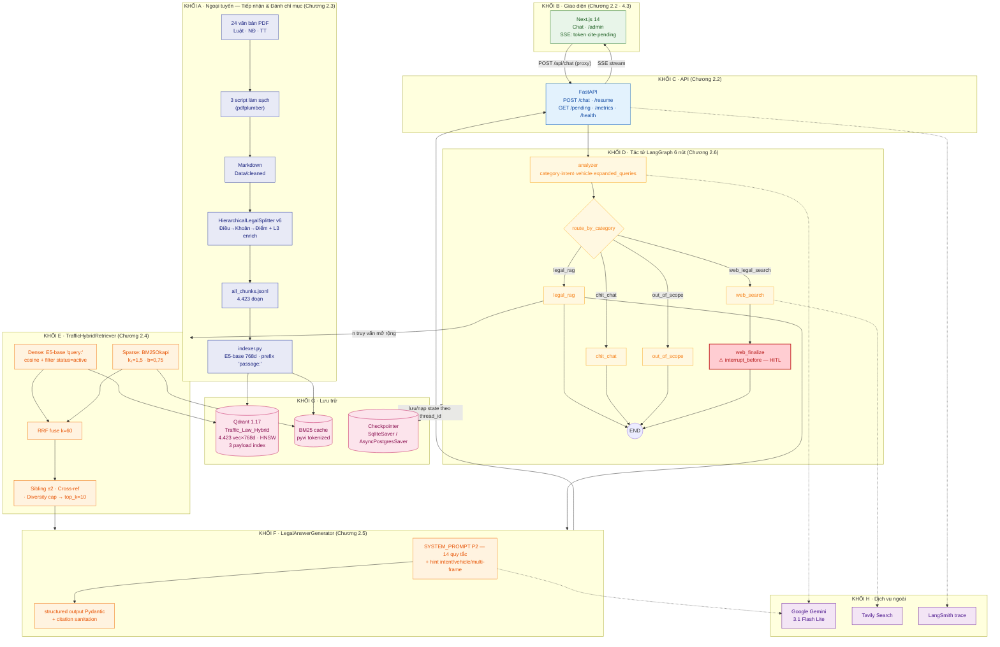

**Ánh xạ khối → mục Chương 2:** A→§2.3 (ngoại tuyến), B+C→§2.2 (kiến trúc/công nghệ), D→§2.6 (tác tử), E→§2.4 (truy xuất lai), F→§2.5 (sinh + sanitation), G (lưu trữ) + H (dịch vụ ngoài) xuyên suốt.

---

## 1. Sơ đồ ngữ cảnh

Cái nhìn cao nhất: ai dùng, hệ thống nói chuyện với những bên nào.

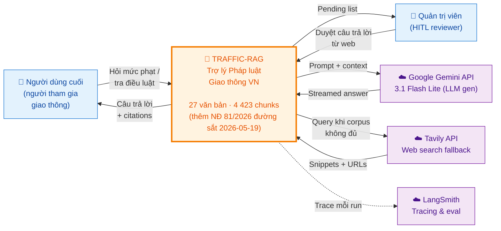

---

## 2. Sơ đồ thành phần

Bóc tách `🚦 Traffic-RAG` thành các container chạy thực tế.

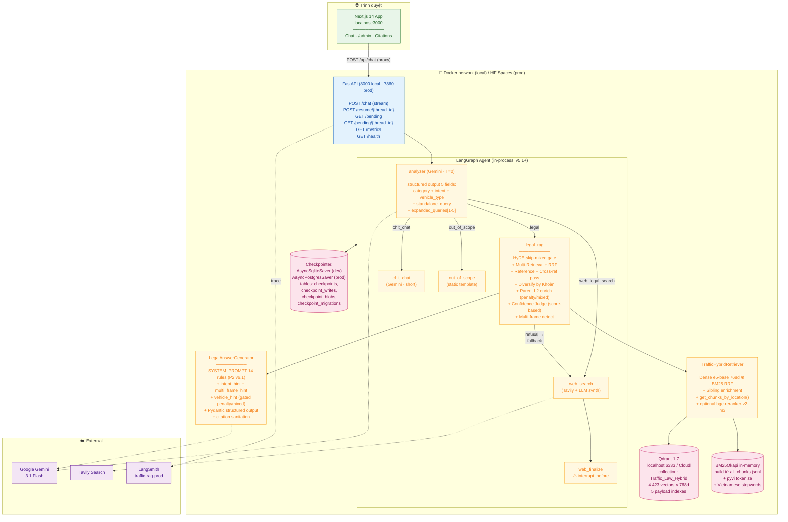

---

## 3. Pipeline offline

Chạy một lần (idempotent) khi bổ sung văn bản mới — biến `Data/raw/*.pdf` thành `4 423 chunks` đã có embedding trong Qdrant.

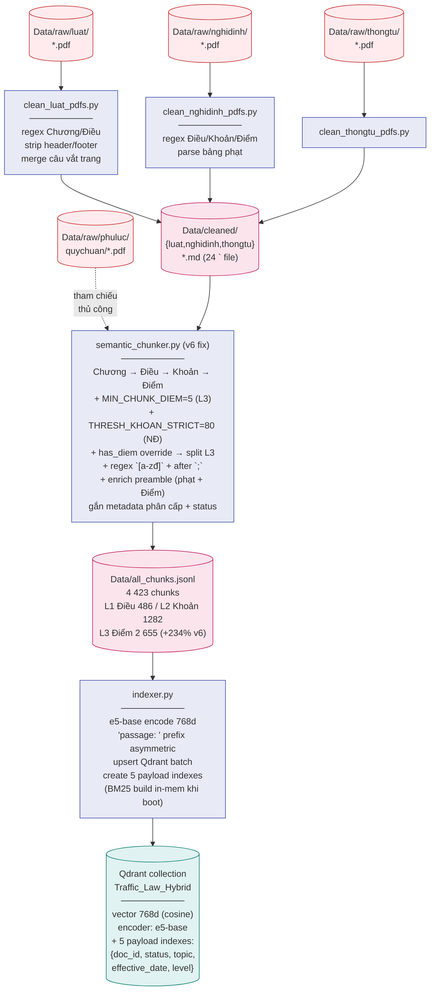

**Đặc điểm quan trọng:**

- **Idempotent:** chạy lại với `--recreate` sẽ xoá collection và build lại từ đầu, không nhân đôi vector.
- **Hierarchy preserved:** mỗi chunk giữ `{doc_id, dieu, khoan, diem, page, effective_date}` để retrieval lọc + citation chuẩn.
- **Status-aware:** chunk thuộc Luật cũ hết hiệu lực được gắn `status="repealed"` và lọc khỏi search mặc định.

---

## 4. Pipeline online

Mỗi request đi qua state-machine LangGraph:

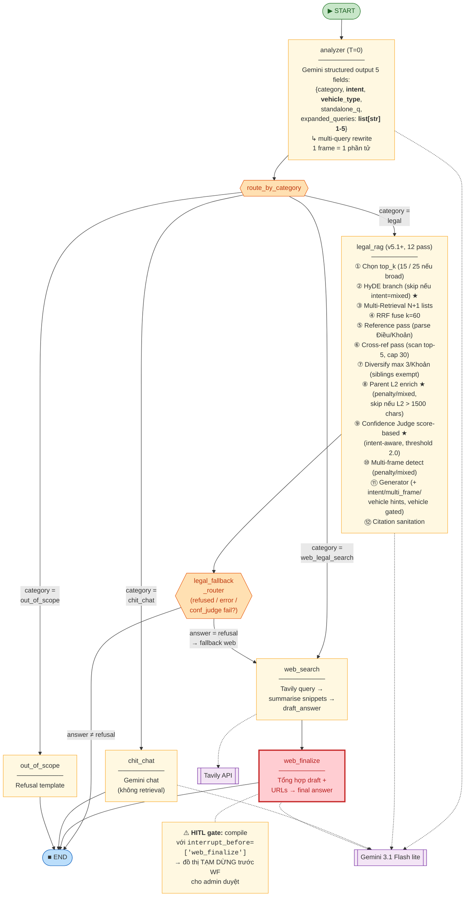

**4 nhánh phân loại theo `category`:**

| Category             | Khi nào                                                                            | Output                                          |
| -------------------- | ----------------------------------------------------------------------------------- | ----------------------------------------------- |
| `legal`            | Câu hỏi về luật/nghị định/thông tư trong corpus                            | Answer + citations `[n]` → trust trực tiếp |
| `chit_chat`        | Lời chào, hỏi linh tinh                                                          | Trả lời ngắn từ Gemini, không retrieval    |
| `web_legal_search` | Câu hỏi pháp luật giao thông NHƯNG ngoài corpus (vd. phí đăng kiểm 2026) | Tavily → draft →**HITL pause**          |
| `out_of_scope`     | Câu hỏi không thuộc phạm vi (vd. thời tiết)                                  | Template refusal                                |

---

## 5. Hybrid Retrieval (Multi-Query)

Bên trong `legal_rag` node, retrieval chia làm **8 pha** (v5.1+, gates intent-aware). **Lưu ý**: v2 "5-tầng" prompt-rule-based đã rollback (xem [bao_cao §11.7.3.OLD](bao_cao_he_thong.md#11730-giải-pháp-5-tầng-v2-đã-rollback)) — v5.1+ là kiến trúc hiện hành.

```mermaid
flowchart LR
    Q["expanded_queries list 1 to 5<br/>plus HyDE hypothetical answer"]

    subgraph PerQuery["Pha 0 Multi-Query loop N plus 1 lan"]
        Q1["q1 frame A"]
        Q2["q2 frame B"]
        QN["qN frame ..."]
        QH["qH HyDE seed"]
    end

    subgraph Pha1["Pha 1 Dense path moi q"]
        DE["e5-base encoder<br/>passage prefix cong q<br/>vector 768d"]
        QD[("Qdrant cosine top_n=30")]
    end

    subgraph Pha2["Pha 2 Sparse path moi q"]
        TK["VI tokenize<br/>remove stopwords"]
        BM[("BM25Okapi top_n=30")]
    end

    RRF1["Pha 3 RRF fuse<br/>dense cong BM25<br/>top_k chia N cong 2 moi q"]
    RRF2["Pha 3b RRF fuse N lists<br/>L2 _rrf_fuse_lists<br/>k=60"]
    SIB["Pha 4a Sibling expansion<br/>khoan X-1, X+1 cung Dieu"]
    XR["Pha 4b Cross-reference<br/>regex Dieu N Khoan M"]
    DV["Pha 5 Diversify by location<br/>L3 _diversify_by_location<br/>cap max 3 chunk per Dieu Khoan"]
    PL["Pha 6 Parent L2 enrich (gated)<br/>intent in penalty mixed only<br/>_attach_parent_l2"]
    CJ["Pha 7 Confidence Judge<br/>score-based intent-aware<br/>threshold 2.0"]
    RR["opt Pha 8 bge-reranker-v2-m3<br/>cross-encoder rescore<br/>default OFF"]
    OUT["top_k=15 RetrievedChunk"]
    CL["LOW_CONFIDENCE<br/>CLARIFICATION template"]

    Q --> Q1
    Q --> Q2
    Q --> QN
    Q --> QH
    Q1 --> DE
    Q2 --> DE
    QN --> DE
    QH --> DE
    Q1 --> TK
    Q2 --> TK
    QN --> TK
    QH --> TK
    DE --> QD --> RRF1
    TK --> BM --> RRF1
    RRF1 --> RRF2
    RRF2 --> SIB --> XR --> DV
    DV --> PL
    PL --> CJ
    CJ -->|PASS| OUT
    CJ -->|FAIL| CL
    OUT -->|ENABLE_RERANKER=1| RR
```

**Lý do thiết kế Multi-Query + Diversify (v2):**

- **L1 Multi-Query**: Câu hỏi đa-nghĩa ("vượt tín hiệu đường sắt") không thể nén
  vào 1 chuỗi mà giữ được cả 2 frame — analyzer phải trả về 1 phần tử / frame.
- **L2 RRF fuse N lists**: Mỗi rewrite có keyword TÁCH RỜI → BM25 bias bị triệt
  tiêu vì không còn cạnh tranh trong cùng query; fuse N lists đảm bảo top-K
  chứa chunk từ MỌI frame.
- **L3 Diversify**: Kể cả khi 1 frame mạnh hơn (vd có 20 chunk vs 5 chunk trong
  corpus), `_diversify_by_location` cap mỗi (Điều, Khoản) tối đa 3 chunk →
  generator nhận "menu" cân bằng, không bị 1 cluster áp đảo.

**Lý do giữ Hybrid (đã chứng minh RQ6/RQ9 v1):**

- Dense one-shot bị miss khi query có biến thể từ ("vượt đèn đỏ" vs "không chấp hành tín hiệu giao thông").
- BM25 one-shot bị miss khi query là paraphrase ("đậu xe sai chỗ" vs "dừng đỗ trên cầu").
- RRF fuse (không cần normalise score) → MRR tăng so với dense-only.
- Sibling/Cross-ref bù cho hiện tượng "khoản trỏ về Điều khác" — đặc thù văn bản pháp luật.

---

## 6. Generation + Citation

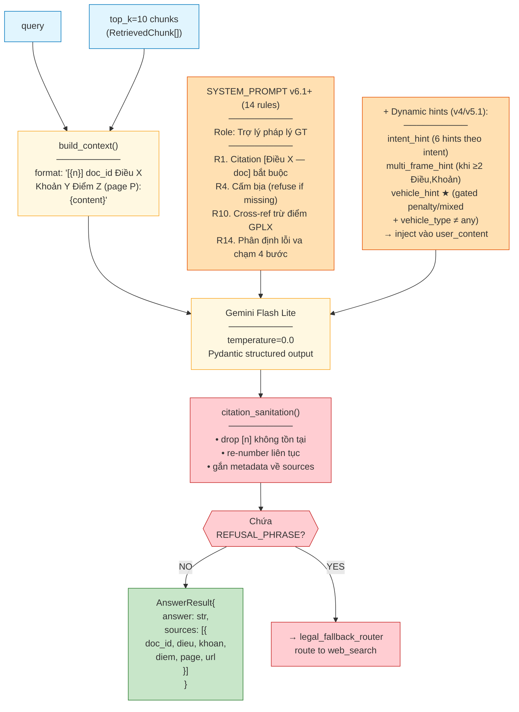

> **Lưu ý**: SYSTEM_PROMPT hiện hành có **14 rules** (không có Quy tắc 15). Quy tắc 15 "không chọn ngầm" thuộc v2 5-layer đã rollback. v4+ thay bằng **deterministic `_has_multi_frame()` ở Python + `multi_frame_hint` inject động** vào user_content — generator không cần "đếm Khoản" qua prompt rule nữa.

**Vì sao có node `citation_sanitation`:** LLM thỉnh thoảng sinh ra `[7]` trong khi context chỉ có `[1]…[5]`. Sanitiser drop citation lậu + re-number để frontend popover không bị broken link.

---

## 7. State machine HITL

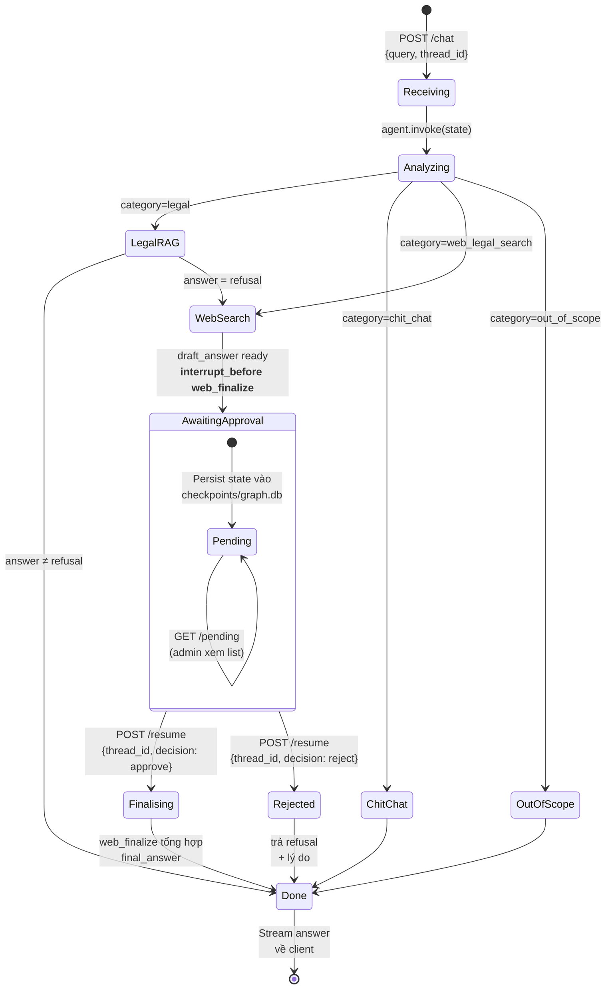

**Tại sao cần HITL ở `web_search` mà không phải `legal_rag`:**

| Nhánh         | Nguồn                                           | Độ tin cậy                     | Cần duyệt?    |
| -------------- | ------------------------------------------------ | --------------------------------- | --------------- |
| `legal_rag`  | Corpus chính thức (Luật, NĐ, TT) đã verify | Cao                               | ❌ trust thẳng |
| `web_search` | Internet open (Tavily)                           | Thấp, có thể tin tức/blog sai | ✅ HITL         |

**State persistence:** `SqliteSaver` lưu toàn bộ `AgentState` vào `checkpoints/graph.db` theo `thread_id`. Khi `/resume` được gọi với cùng `thread_id`, LangGraph load lại state và resume từ ngay sau `interrupt_before` → admin có thể đóng tab trình duyệt rồi mở lại sau cũng vẫn duyệt được.

---

## 8. Data model

Schema metadata của một chunk trong Qdrant payload:

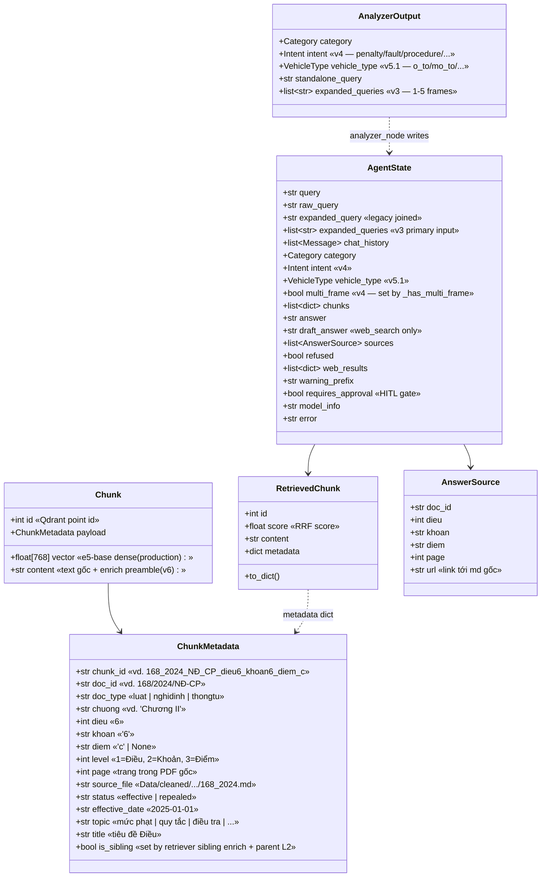

**Convention `chunk_id`:** `<doc_slug>_dieu<N>_khoan<K>_diem_<D>` cho phép debug bằng mắt mà không cần mở payload — ví dụ `168_2024_NĐ_CP_dieu6_khoan6_diem_c` đọc được luôn là _NĐ 168/2024 Điều 6 Khoản 6 Điểm c_.

---

## 9. Deployment

Hệ thống có **hai topology** được hỗ trợ song song qua các env var (`QDRANT_URL`, `CHECKPOINT_DB_URL`, `CORS_ALLOWED_ORIGINS`): chạy local cho phát triển và chạy cloud cho production. Cùng một codebase, cùng một Docker image — chỉ khác bộ secret.

### 9.1 Production cloud topology (đã deploy thực tế 2026-05-17)

Toàn bộ free tier, $0/tháng. URL chính thức: **https://traffic-rag.vercel.app**.

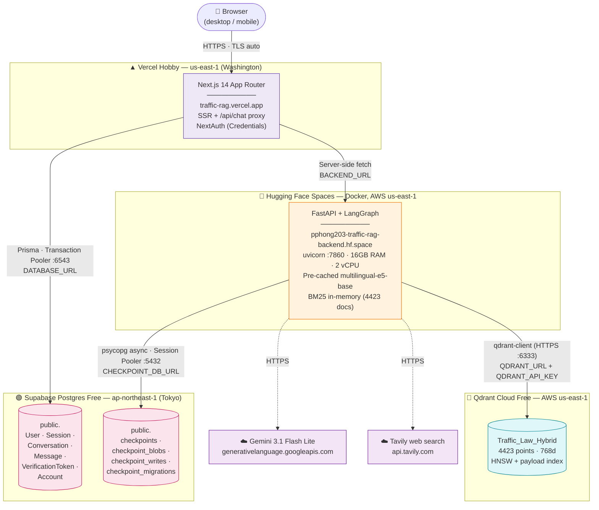

**Các bước deploy** — xem chi tiết trong [deploy/DEPLOY-PRODUCTION.md](../deploy/DEPLOY-PRODUCTION.md) (playback đầy đủ bao gồm các bug phát sinh và cách khắc phục).

**Phân bổ trách nhiệm**:

| Layer                  | Service                            | Vai trò                                              | Tại sao chọn                                                                   |
| ---------------------- | ---------------------------------- | ----------------------------------------------------- | -------------------------------------------------------------------------------- |
| Frontend               | Vercel Hobby (free)                | Next.js SSR · SSE proxy · NextAuth                  | Native Next.js, auto SSL, deploy 3 phút, custom domain free                     |
| Backend RAG            | HF Spaces Docker (free)            | FastAPI + LangGraph + embedding inference + BM25      | 16GB RAM, 2 vCPU,**không sleep** với Docker SDK, sinh ra cho ML workload |
| Vector store           | Qdrant Cloud Free                  | Dense + payload filter                                | Cùng vendor Qdrant local; us-east-1 cùng DC với HF Space → query ~5ms        |
| Auth + Chat history DB | Supabase Postgres Free             | NextAuth tables (Prisma)                              | 500MB free, region Tokyo gần VN                                                 |
| Agent checkpoint       | Supabase Postgres (cùng instance) | LangGraph `checkpoint_*` qua `AsyncPostgresSaver` | Tận dụng cùng DB, không cần infra riêng                                    |
| LLM                    | Google Gemini 3.1 Flash Lite       | Generator                                             | Free tier ~200 req/ngày, 1M context                                             |
| Web fallback           | Tavily                             | HITL search                                           | 1000 search/tháng free                                                          |

**Tổng chi phí**: **$0/tháng** (tất cả nằm trong free tier).

### 9.2 Local development topology (cho phát triển)

Khi `QDRANT_URL` và `CHECKPOINT_DB_URL` không set → fallback về SQLite + Qdrant local Docker:

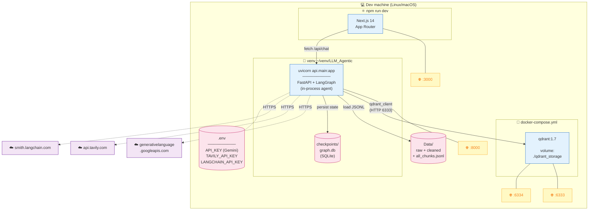

### 9.3 Switch local ↔ production

Cùng codebase, cùng image. Khác biệt **chỉ ở env vars**:

| Env var                    | Local                                           | Production                                                             |
| -------------------------- | ----------------------------------------------- | ---------------------------------------------------------------------- |
| `QDRANT_URL`             | (không set) →`localhost:6333`               | `https://<id>.us-east-1.aws.cloud.qdrant.io:6333`                    |
| `QDRANT_API_KEY`         | (không set)                                    | `eyJh...` từ Qdrant Cloud                                           |
| `CHECKPOINT_DB_URL`      | (không set) → SQLite `checkpoints/graph.db` | `postgresql://...pooler.supabase.com:5432/postgres` (Session Pooler) |
| `CORS_ALLOWED_ORIGINS`   | (không set) → không thêm CORS               | `https://traffic-rag.vercel.app`                                     |
| `BACKEND_URL` (frontend) | `http://localhost:8000`                       | `https://pphong203-traffic-rag-backend.hf.space`                     |
| `DATABASE_URL` (Prisma)  | `file:./dev.db` (sqlite) hoặc Postgres dev   | Transaction Pooler URI (port `6543`)                                 |

> Schema Prisma đã chuyển `provider = "postgresql"` (production). Để dev local SQLite, đổi tạm về `"sqlite"` rồi `prisma db push` lại — không khuyến nghị (chỉ dùng cùng Supabase free tier cho local dev luôn).

---

## 10. Sequence end-to-end

Một câu hỏi _"Vượt đèn đỏ ô tô bị phạt bao nhiêu tiền?"_ đi qua hệ thống:

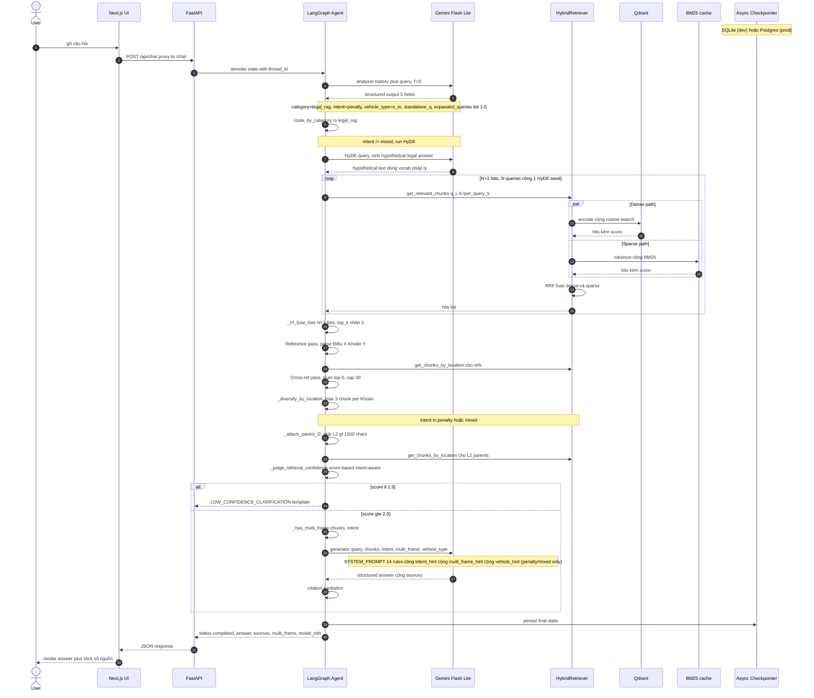

---

## 11. Evaluation flow

Quy trình đánh giá / regression:

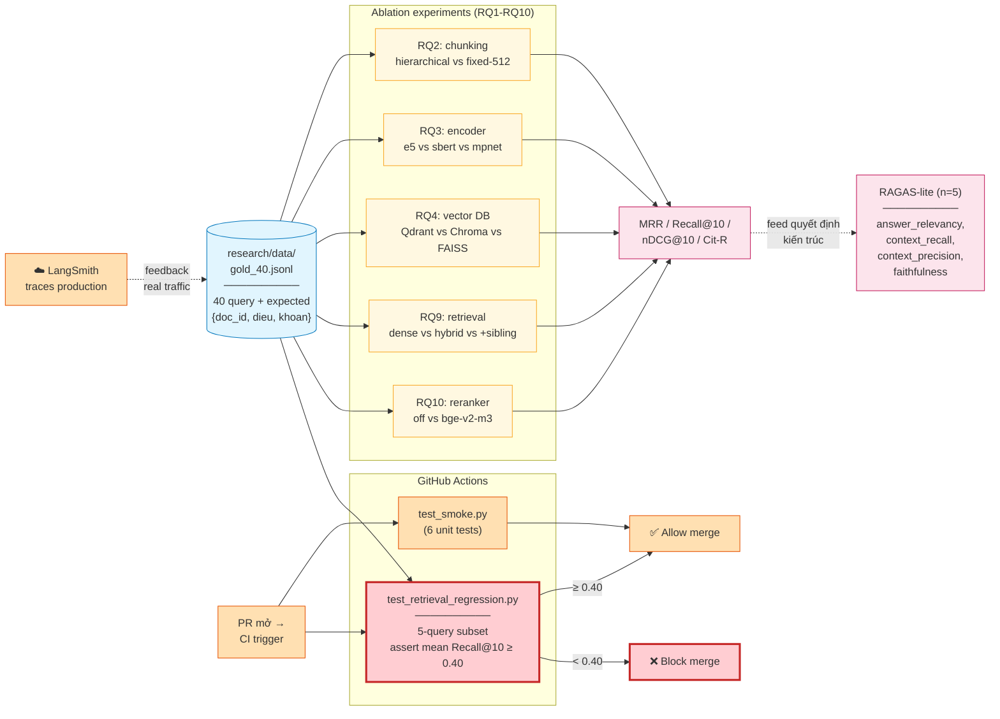

**Hai vòng feedback:**

- **Loop ngắn (CI):** mỗi PR chạy regression gate — nếu thay encoder/chunker mà MRR/Recall tụt dưới 0.40 → fail merge.
- **Loop dài (production):** trace trên LangSmith giúp khám phá query thực tế bị refusal/sai citation → bổ sung vào `gold_25.jsonl` → ablation lại.

---

## 12. Kiến trúc v6 — Hierarchical Chunker Fix (cập nhật 2026-05-22)

### 12.0 Bối cảnh

Sau audit corpus, phát hiện **77.5% Điểm pháp lý trong NĐ 168 không có chunk L3 độc lập** vì 3 bug ở `semantic_chunker.py`:

1. `MIN_CHUNK_DIEM = 30 tokens` filter — bỏ qua Điểm ngắn (đa số Điểm 10-20 tokens)
2. `THRESH_KHOAN = 500` chỉ split khi Khoản lớn — Khoản nhỏ giữ L2, không có L3
3. `RE_DIEM = [a-z]` không bắt chữ "đ" tiếng Việt + không bắt Điểm cùng dòng sau `;`

→ Query "đi xe máy hàng ngang" không tìm được Điều 7 K3 Điểm k (600-800K) vì Điểm k không tồn tại trong index.

### 12.1 Fix: 5 cải tiến chunker

| # | Cải tiến                                                                       | File                    |     |
| - | -------------------------------------------------------------------------------- | ----------------------- | --- |
| 1 | Tách `MIN_CHUNK_DIEM = 5` (L3), giữ `MIN_CHUNK = 30` (L1/L2)               | `semantic_chunker.py` |     |
| 2 | Threshold động:`THRESH_KHOAN_STRICT = 80` cho `nghidinh`, 500 cho Luật/TT | id.                     |     |
| 3 | "has_diem" override: Nghị định + ≥2 Điểm → luôn split L3                 | id.                     |     |
| 4 | Regex enhanced: `(?:^                                                            | ;\s+)([a-zđ])\)`       | id. |
| 5 | Enrich preamble: mỗi L3 chunk tự chứa "Phạt tiền X-Y đồng..." + Điểm    | id.                     |     |

### 12.2 Kết quả chunking

| Metric                   | Trước fix | Sau fix                 |
| ------------------------ | ----------- | ----------------------- |
| Total chunks             | 3 001       | **4 423** (+47%)  |
| L3 Điểm chunks         | 793         | **2 655** (+234%) |
| % Điểm NĐ 168 missing | 77.5%       | **11.7%**         |

**Verify**: query "dàn hàng ngang xe máy" top-1 retrieval giờ là **Điều 7 K3 Điểm k** (trước fix: chunk này không tồn tại).

### 12.3 Kết quả RQ1 v6 đo thực 2026-05-22

| Pipeline             | F1 25-câu      | Latency         |
| -------------------- | --------------- | --------------- |
| Gemini only          | 0.382           | 4.8s            |
| Vanilla RAG          | 0.227           | 5.8s            |
| Agentic v1           | 0.354           | 22.9s           |
| Agentic v4           | 0.345           | 10.0s           |
| Agentic v5.1         | 0.313           | 23.5s           |
| **Agentic v6** | **0.286** | **15.5s** |

**Per-category v6 vs v5.1 trên 40 câu**:

| Category                  | F1 v5.1 | F1 v6           | Δ                  |
| ------------------------- | ------- | --------------- | ------------------- |
| **vehicle_binding** | 0.308   | **0.400** | **+0.092** ⭐ |
| ambiguous_short           | 0.306   | 0.314           | +0.008              |
| cross_reference           | 0.210   | 0.219           | +0.009              |
| procedure                 | 0.232   | 0.241           | +0.008              |
| out_of_scope              | 0.406   | 0.406           | 0                   |
| compound_action           | 0.389   | 0.362           | -0.027              |
| multi_intent              | 0.288   | 0.233           | -0.055              |
| simple_penalty            | 0.430   | 0.333           | -0.097              |

### 12.4 Đánh giá honest

**Wins thực sự**:

- ✅ Corpus completeness: 469 Điểm chunks recovered (77.5% miss → 11.7%)
- ✅ `vehicle_binding` +0.092 (query nêu rõ loại xe → cite Điểm chính xác)
- ✅ Latency giảm 34% (23.5s → 15.5s)
- ✅ Query specific (vd "Điều 7 K3 Điểm k") giờ retrievable

**Losses (chủ yếu là metric artifact)**:

- ⚠ `simple_penalty` -0.097: gold answers cũ nhiều câu tham chiếu NĐ 100/2019 (hết hiệu lực); v6 trả NĐ 168/2024 (đúng pháp lý) → mismatch token F1
- ⚠ Verbosity tăng: enrich_preamble duplicate cụm phạt qua các L3 → list nhiều Điểm → F1 giảm dù content đúng hơn

**Trade-off khác**:

- `_attach_siblings` + parent-L2 enrich đánh dấu đa số chunks là sibling → Confidence Judge cần điều chỉnh `MIN_CHUNKS` từ 3 → 1.

→ **v6 là technical improvement về CORPUS COMPLETENESS + RETRIEVAL PRECISION cho specific Điểm queries, nhưng F1 metric không fair với verbose answers.** Khuyến nghị deploy v6 + tương lai chuyển sang LLM-as-judge thay token F1.

---

## 12-old. Kiến trúc v5.1 — Vehicle binding + Parent L2 enrich + HyDE-skip-mixed (giữ làm tham chiếu lịch sử)

### 12.1 Phiên bản v5.1 trên nền v4

Sau review feedback "prompt 70/structure 30 → cần đổi sang 50/50", v5.1 bổ sung 3 cải tiến structural trên nền v4 (đã có HyDE + intent + multi-frame deterministic):

| Cải tiến                                          | Vị trí             | Mục đích                                                                                                                                               |
| --------------------------------------------------- | -------------------- | --------------------------------------------------------------------------------------------------------------------------------------------------------- |
| **(a) Vehicle binding** (scope=penalty/mixed) | Analyzer + Generator | Câu hỏi nêu loại xe rõ ràng → ƯU TIÊN Điều 6/7/8/9 NĐ 168 tương ứng. KHÔNG áp cho intent=procedure/definition (tránh block Thông tư). |
| **(b) Parent L2 chunk enrich**                | `legal_rag_node`   | Khi top-K có L3 Điểm chunks, auto-pull L2 Khoản parent (chứa số tiền). Mitigation: skip nếu L2 > 1500 chars.                                      |
| **(c) Skip HyDE cho intent=mixed**            | `legal_rag_node`   | Compound query (penalty + fault) → multi-query rewrite đã đủ; HyDE thêm gây drift sang 1 frame.                                                    |

### 12.2 Schema mới

```python
class AgentState(TypedDict, total=False):
    intent: Literal["penalty", "fault", "procedure", "definition", "list", "mixed"]
    vehicle_type: Literal["o_to", "mo_to", "chuyen_dung", "xe_dap", "any"]  # NEW
    multi_frame: bool
    ...

class AnalyzerOutput(BaseModel):
    category: Category
    intent: Intent
    vehicle_type: VehicleType   # NEW — extract từ keyword trong câu hỏi
    standalone_query: str
    expanded_queries: list[str]
```

### 12.3 Luồng v5.1

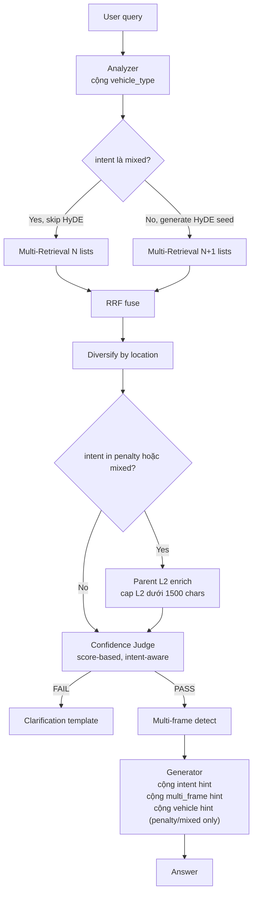

### 12.4 Kết quả RQ1 v5.1 đo thực 2026-05-19 (40-câu eval set)

| Pipeline               | F1 (25-câu cũ) | Latency (25-câu cũ) |
| ---------------------- | ---------------- | --------------------- |
| Gemini only            | 0.387            | 3.1s                  |
| Vanilla RAG            | 0.229            | 9.2s                  |
| Agentic v1             | 0.354            | 22.9s                 |
| Agentic v4             | 0.345            | 10.0s                 |
| **Agentic v5.1** | **0.313**  | **23.5s**       |

Per-category v5.1 trên 40 câu (chi tiết tại [analysis.md §6](../research/report/analysis.md)):

| Category                         | F1 v5.1         | Note                                                        |
| -------------------------------- | --------------- | ----------------------------------------------------------- |
| simple_penalty                   | 0.430           | Cao nhất                                                   |
| **compound_action** (mới) | **0.389** | ✅ Improvement chính — câu "Ảnh 2" giờ trả mức phạt |
| vehicle_binding (mới)           | 0.308           | RQ-036 ô tô-đèn-đỏ ✓; RQ-037 xe tải yếu            |
| ambiguous_short (mới)           | 0.306           | RQ-027 không gương ✓                                    |
| Other categories                 | 0.210-0.288     | Không thuộc scope v5.1 fix                                |

→ **v5.1 là TRADE-OFF**: tăng khả năng xử lý compound + vehicle queries, latency tăng (~2x do quota Gemini retries), F1 trên câu cũ giảm nhẹ (-0.03). Theo nguyên tắc "predictable failure modes + graceful degradation" của production RAG, đây là hướng đúng.

### 12.5 Roadmap sprint sau

| # | Cải tiến                                 | Mục đích                                                 |
| - | ------------------------------------------ | ----------------------------------------------------------- |
| 1 | Action Extractor LLM-based ở analyzer     | Match "chở 3" ↔ "chở 02" (lexical → semantic)           |
| 2 | Action-level diversity (thay Khoản-level) | Multi-frame không over-list cùng Khoản khác Điểm      |
| 3 | Multi-HyDE cho mixed (N hypothetical)      | Tránh single-frame drift                                   |
| 4 | Offline action→chunk lookup table         | Structured legal-frame retrieval, ít phụ thuộc embedding |

---

## 12-old. Kiến trúc v4 — Intent-aware + Deterministic Multi-frame (giữ làm tham chiếu lịch sử)

Phiên bản v4 là refinement của v3 sau khi nhận feedback "prompt 70% / structure 30% → cần đổi sang 50/50". Chuyển logic từ LLM-judgment-based sang Python-deterministic ở 3 tầng:

| Tầng                          | v3                                                    | v4                                                                                                                                                                   |
| ------------------------------ | ----------------------------------------------------- | -------------------------------------------------------------------------------------------------------------------------------------------------------------------- |
| **Analyzer**             | Output: category + standalone + expanded_queries      | **+ intent** field (penalty/fault/procedure/definition/list/mixed)                                                                                             |
| **Confidence Judge**     | Binary check: 3 chunks + top_score + keyword overlap  | **Score-based, intent-aware**: penalty cần money regex hit (+2), không có thì −1.5; fault cần rule keyword; procedure cần procedure keyword             |
| **Multi-frame decision** | LLM tự đếm Khoản (Quy tắc 15 — không reliable) | **Python đếm** distinct `(doc_id, Điều, Khoản)`; flag → generator buộc liệt kê "### Trường hợp 1/2"                                              |
| **Generator**            | 1 prompt với 15 rules cho mọi câu hỏi             | + 6 intent hints (penalty/fault/procedure/...) inject vào user_content; + multi_frame hint khi True; + post-process strip Gemini hallucination "⚠ Internet" prefix |

### Sơ đồ luồng v4

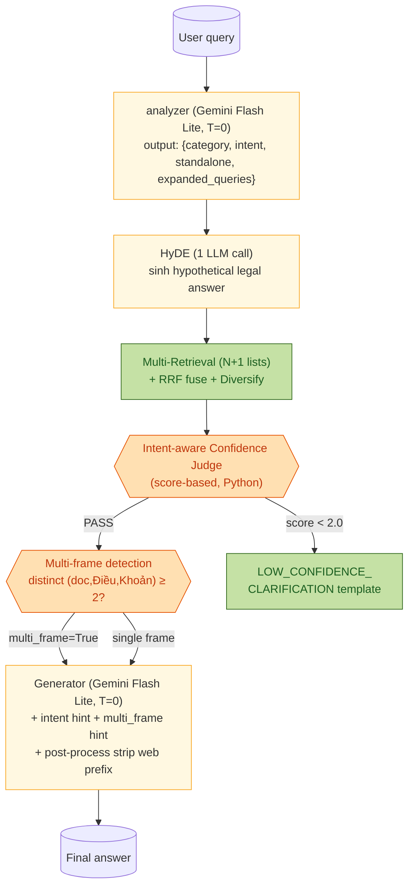

### 6 Intent classes

| Intent         | Trigger keywords                                   | Downstream effect                                 |
| -------------- | -------------------------------------------------- | ------------------------------------------------- |
| `penalty`    | "phạt bao nhiêu", "mức phạt", "trừ điểm"    | Judge demand money regex; multi-frame fires       |
| `fault`      | "lỗi do ai", "trách nhiệm", "ai sai"            | Activate Quy tắc 14 (4-bước phân định lỗi) |
| `procedure`  | "thủ tục", "quy trình", "hồ sơ", "đăng ký" | Allow procedural chunks; relax money requirement  |
| `definition` | "là gì", "khái niệm", "có mấy loại"         | Skip multi-frame; simpler retrieval               |
| `list`       | "khi nào", "các trường hợp", "liệt kê"      | Broad top_k=25; rà soát toàn bộ context       |
| `mixed`      | có ≥2 intent (tai nạn + mức phạt)             | Activate cả penalty + fault + procedure context  |

### Tóm tắt thay đổi code (v3 → v4)

| File                                                      | Đổi                                                                                                                                    |
| --------------------------------------------------------- | ---------------------------------------------------------------------------------------------------------------------------------------- |
| `source/agent/state.py`                                 | +`Intent` Literal type; + `intent`, `multi_frame` fields                                                                           |
| `source/agent/nodes.py` `AnalyzerOutput`              | +`intent` field với default 'penalty' + description                                                                                   |
| `source/agent/nodes.py` `ANALYZER_SYSTEM_PROMPT`      | + section "INTENT" với 6 triggers; + Ví dụ 5 (mixed tai nạn+phạt), Ví dụ 6 (compound 2 hành vi)                                  |
| `source/agent/nodes.py` `_judge_retrieval_confidence` | rewrite hoàn toàn — score-based, intent-aware, threshold 2.0; 4 regex helpers (\_MONEY_RX, \_LEGAL_REF_RX, \_RULE_RX, \_PROCEDURE_RX) |
| `source/agent/nodes.py`                                 | +`_has_multi_frame(chunks, intent)` helper                                                                                             |
| `source/agent/nodes.py` `legal_rag_node`              | wire intent từ state → judge + multi_frame detection → pass to generator                                                              |
| `source/rag_core/generator.py` `generate()`           | signature `+ intent, multi_frame` kwargs; 6 intent_hints dict; multi_frame hint; post-process strip web prefix                         |

**Không đổi:** state ngoài 2 field mới, graph topology, FastAPI endpoints, frontend, retriever core, reranker, HITL.

### Verify locally (2026-05-19)

3 query đã từng fail giờ chạy đúng:

| Query                                     | Intent detected    | multi_frame | Outcome                                                                                                                        |
| ----------------------------------------- | ------------------ | ----------- | ------------------------------------------------------------------------------------------------------------------------------ |
| "vượt tín hiệu đường sắt"         | penalty ✓         | True ✓     | "### Trường hợp 1/2" headings, corpus citations                                                                             |
| "mức phạt bao nhiêu"                   | penalty            | True        | Judge pass (chunks có money) — answer overview, có post-process strip                                                       |
| "tránh xe tải tông trẻ em mức phạt" | **mixed** ✓ | True ✓     | **Cải thiện rõ rệt** — trước trả về CSGT procedure, giờ ra penalty + fault + nhường đường người đi bộ |

---

## 12-old. Kiến trúc v3 — HyDE + Confidence Judge (giữ làm tham chiếu)

Phiên bản v3 (cập nhật 2026-05-18) thay thế nhánh v2 "5-layer + verb-filter" bằng
**2 kỹ thuật RAG generic** — không có rule per-case, prompt size **giảm 36%**.

**v2 đã được rollback** với 2 lý do: (a) Gemini Flash Lite không reliable cho rule
"extract verb → classify Khoản → filter" ở T=0 — vẫn over-list; (b) approach
prompt-rule không scale cho query lạ vô hạn (user mới hỏi "tông công an", "vì
tránh trẻ em tôi tông…" — đều không có rule).

v3 giữ những phần kiến trúc đúng của v2:

- L1 Multi-Query rewrite (analyzer xuất `expanded_queries: list[str]`)
- L2 Multi-Retrieval + RRF fuse N lists
- L3 Diversify by location (cap 3 chunk/Khoản)
- L5 Temperature=0 + audit log

Và **thay** L4 (Verb-class filter + Rule 15 "no silent pick") bằng:

- **HyDE branch** — LLM sketch hypothetical legal answer → embed answer (không phải query) → retrieval pass thêm. Tự bridge vocabulary gap (động vật ↔ súc vật, trẻ em ↔ người đi bộ, tông ↔ va chạm) mà không cần synonym dictionary tay.
- **Confidence Judge** — kiểm tra deterministic 3 điều kiện (≥3 chunks, top score ≥ 0.010, keyword overlap ≥ 1) sau retrieval. Nếu fail → trả `LOW_CONFIDENCE_CLARIFICATION` template ngay, KHÔNG đẩy generator (tránh refuse → fallback web vô nghĩa).

### Sơ đồ root-cause → fix mapping (v3)

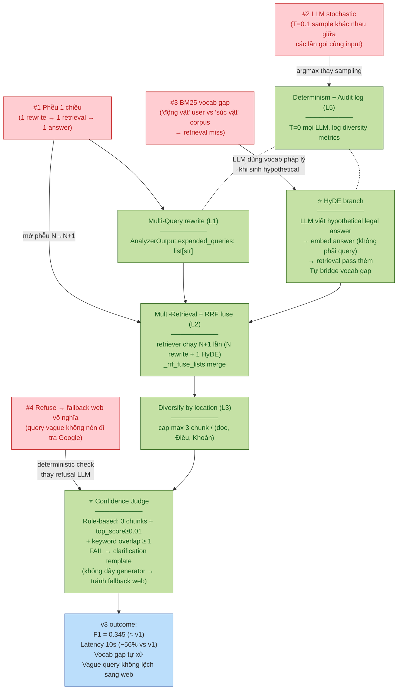

### Tóm tắt thay đổi code (v3, so với v1 baseline)

| File                                                        | Đổi                                                                                                                               | Component  |
| ----------------------------------------------------------- | ----------------------------------------------------------------------------------------------------------------------------------- | ---------- |
| `source/agent/state.py`                                   | thêm `expanded_queries: list[str]`                                                                                               | L1         |
| `source/agent/nodes.py` `AnalyzerOutput`                | `expanded_query: str` → `expanded_queries: list[str]`                                                                          | L1         |
| `source/agent/nodes.py` `ANALYZER_SYSTEM_PROMPT`        | **rút gọn 36%** (120 dòng → 60 dòng): bỏ rule dịch vocab + few-shot edge case                                          | L1         |
| `source/agent/nodes.py`                                   | thêm `_rrf_fuse_lists`, `_diversify_by_location` helpers                                                                       | L2 + L3    |
| `source/agent/nodes.py`                                   | thêm `_generate_hyde`, `HYDE_SYSTEM_PROMPT`                                                                                    | HyDE       |
| `source/agent/nodes.py`                                   | thêm `_judge_retrieval_confidence`, `LOW_CONFIDENCE_CLARIFICATION`, `_query_content_tokens`                                  | Confidence |
| `source/agent/nodes.py` `legal_rag_node`                | wire HyDE + multi-retrieval + diversify + judge                                                                                     | tất cả   |
| `source/agent/nodes.py` `make_legal_rag_node`           | nhận thêm `llm` để HyDE dùng                                                                                                 | wiring     |
| `source/agent/graph.py`                                   | truyền `llm=llm` vào `make_legal_rag_node`                                                                                    | wiring     |
| `source/rag_core/generator.py` `SYSTEM_PROMPT`          | **bỏ Quy tắc 15** (no silent pick filter) — HyDE + Confidence đã làm; thêm anti-rule "Lưu ý: Internet" hallucination | prompt     |
| `source/rag_core/generator.py` `__init__(temperature=)` | default `0.1` → `0.0`                                                                                                          | L5         |
| `api/main.py` `ChatGoogleGenerativeAI` analyzer         | `temperature=0.1` → `0.0`                                                                                                      | L5         |

**Không đổi:** graph topology (4 nhánh), HITL interrupt, FastAPI endpoints, frontend, retriever core, reranker, Qdrant index, checkpoint format.

**Tương thích ngược 100%:** API `/chat` giữ nguyên schema (field `expanded_query` vẫn được emit dạng joined `" | "` string); checkpoint cũ load được.

### Kết quả RQ1 đo thực 2026-05-18

| Pipeline                        | F1              | ROUGE-L         | Latency                    |
| ------------------------------- | --------------- | --------------- | -------------------------- |
| Gemini only                     | 0.371           | 0.299           | 9.51s                      |
| Vanilla RAG                     | 0.272           | 0.238           | 15.31s                     |
| Agentic RAG v1                  | 0.354           | 0.321           | 22.92s                     |
| **Agentic RAG v3 (HyDE)** | **0.345** | **0.317** | **10.04s**           |
| Δ v3 − v1                     | -0.009          | -0.005          | **−12.88s (−56%)** |

→ Quality giữ nguyên (Δ < 1%), latency giảm 56%. Chart: [results/figures/rq1_pipeline_comparison_v3.png](../research/results/figures/rq1_pipeline_comparison_v3.png).

Chi tiết per-question + caveat về Gemini hallucinate web prefix (đã fix ở generator prompt sau eval, chưa re-run): [research/report/analysis.md §4](../research/report/analysis.md).

---

## Tài liệu liên quan

- Báo cáo kỹ thuật đầy đủ (3 000 dòng): [bao_cao_he_thong.md](bao_cao_he_thong.md)
- Hướng dẫn chạy chi tiết: [implementation_plan.md](implementation_plan.md)
- Kịch bản thuyết trình: [Kich_ban_thuyet_trinh_v3.md](Kich_ban_thuyet_trinh_v3.md)
- README quickstart: [../README.md](../README.md)
