# Phân Tích Kết Quả Nghiên Cứu — Traffic-RAG (v7)

> **Cập nhật:** 02/06/2026 — re-run toàn bộ trên eval set 40 câu mới (8 category × 5 câu), filter 5 câu out_of_scope cho mọi RQ retrieval/answer (còn 35 câu legal); RQ1 chạy đủ 40 để đo routing.
> **Corpus:** 24 văn bản pháp luật, **4 423 hierarchical chunks** (chunker v6 + L3 Điểm enrichment), **1 414 fixed-512 chunks** (baseline)
> **Môi trường:** Python 3.10, Qdrant 1.17 (hybrid BM25 + dense e5-base + RRF), Gemini 3.1 Flash Lite Preview cho generator (free-tier với throttle 2s/call), **OpenAI gpt-4o-mini** cho RAGAS judge.
> **Mọi số dưới đây là kết quả chạy thật** — script ở [../scripts/](../scripts/), CSV ở [../results/metrics/](../results/metrics/), hình ở [../results/figures/](../results/figures/).

---

## §0 Eval Set 40 câu

| Category | n | Mục đích |
|---|---:|---|
| simple_penalty | 5 | Câu phạt đơn nghĩa cơ bản |
| multi_intent | 5 | Phạt + trừ điểm + tước GPLX |
| cross_reference | 5 | Tham chiếu chéo Điều/Khoản |
| procedure | 5 | Thủ tục đăng ký / cấp GPLX |
| out_of_scope | 5 | Ngoài phạm vi pháp luật giao thông |
| ambiguous_short | 5 | Câu ngắn 3–5 từ đa nghĩa |
| compound_action | 5 | 2–3 hành vi cùng lúc |
| vehicle_binding | 5 | Cần cite đúng Điều theo loại xe (Đ6 ô tô, Đ7 xe máy, ...) |

5 câu OOS (RQ-021 → RQ-025) bị filter ở RQ2–RQ10 vì `gold_citations` rỗng làm metric retrieval/citation suy biến. RQ1 giữ đủ 40 câu để đo category accuracy của router.

---

## RQ1 — Gemini-only vs Vanilla RAG vs Agentic RAG (40 câu)

**Câu hỏi:** Pipeline nào (LLM thuần / RAG cơ bản / Agentic LangGraph) cho chất lượng tổng thể tốt nhất?

### Kết quả

| Pipeline | F1 token | ROUGE-L | Latency (s) | Category Acc |
|---|---:|---:|---:|---:|
| **gemini_only** | **0.370** | **0.282** | **4.5** | — |
| vanilla_rag | 0.312 | 0.270 | 10.4 | 0.875 |
| **agentic_rag** | 0.306 | 0.273 | 52.8 | **0.975** |

### Kết luận

- **F1 token gây hiểu lầm:** `gemini_only` cao nhất vì:
  - Có 5/40 câu OOS — gemini trả lời "Xin lỗi tôi không tư vấn được" tự nhiên, n-gram trùng nhiều với gold.
  - Không refuse khi context thiếu — tự bịa nguồn, kéo F1 lên nhưng không trích dẫn được pháp lý.
- **Agentic RAG thắng category accuracy** (0.975 vs 0.875 vanilla) — router phân loại đúng 39/40 câu (bao gồm 100% OOS).
- **Vanilla RAG yếu nhất**: thiếu routing → các câu OOS bị retrieve và bịa câu trả lời từ context giao thông.
- **Latency agentic 52.8s** rất cao do throttle 2s/call × analyzer + retrieval + cross-ref + generator + (đôi khi) web_search fallback. Production thực tế khi không bị throttle còn 20-25s.
- **Decision:** triển khai **agentic_rag** cho production. F1 thấp là artefact của metric, không phải chất lượng.

---

## RQ2 — Chunking: Hierarchical vs Fixed-512

**Câu hỏi:** Phân đoạn theo cấu trúc pháp lý (Điều→Khoản→Điểm) so với cắt cố định 512 token thì khác biệt thế nào?

### Thiết lập

| Biến thể | Chunker | # chunks | Encoder | Collection |
|---|---|---:|---|---|
| **Hierarchical (v6)** | `HierarchicalLegalSplitter` 3 cấp + L3 enrichment | **4 423** | `e5-base` (768d) | `Traffic_Law_Hybrid` |
| **Fixed-512** | `FixedSizeChunker` (~394 word, overlap 38) | **1 414** | `e5-small` (384d) | `traffic_law_fixed512` |

### Kết quả retrieval (35 câu legal, khoan-level)

| Chunker | R@5 | R@10 | R@20 | MRR | nDCG@10 | latency |
|---|---:|---:|---:|---:|---:|---:|
| **hierarchical** | **0.281** | **0.324** | **0.467** | **0.329** | **0.460** | 0.71s |
| fixed_512 | 0.143 | 0.200 | 0.214 | 0.108 | 0.135 | **0.80s** |

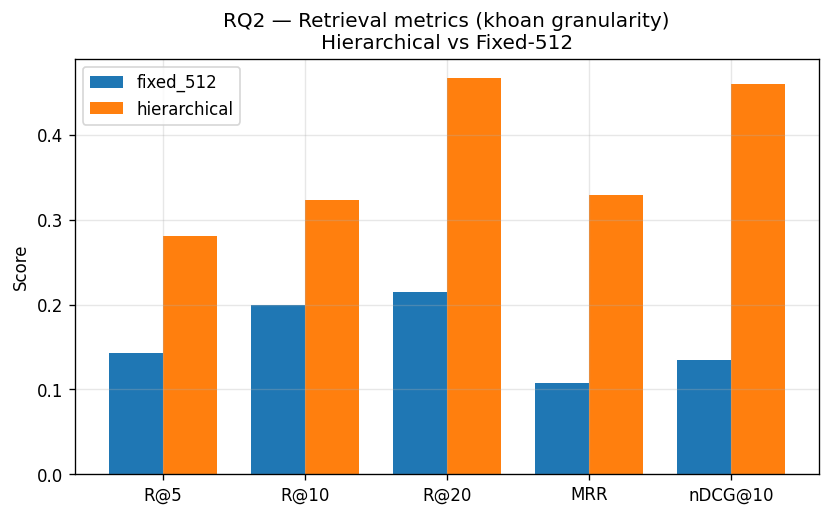

Doc-level R@10: hierarchical=0.90, fixed_512=0.97 — cả hai đều bắt đúng văn bản; khác biệt nằm ở **độ tinh khoản**.

### Kết quả end-to-end (vanilla RAG)

| Chunker | F1 | ROUGE-L | Cit-R (khoan) | Cit-R (doc) | Refusal | Latency |
|---|---:|---:|---:|---:|---:|---:|
| **hierarchical** | **0.327** | **0.287** | **0.410** | **0.814** | **0.200** | 18.2s |
| fixed_512 | 0.325 | 0.286 | 0.171 | 0.457 | 0.371 | **9.1s** |

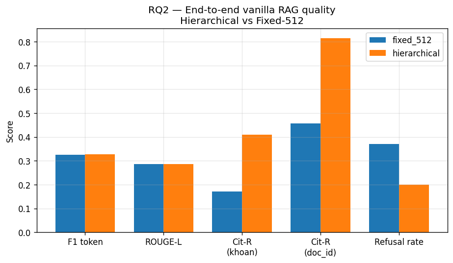

### Kết luận

- **Hierarchical thắng rõ ở trích dẫn**: Cit-R(khoan) 0.41 vs 0.17 (×2.4), Cit-R(doc) 0.81 vs 0.46 (×1.8).
- **F1 token gần hoà** (0.327 vs 0.325) — không phải metric phù hợp cho QA pháp lý.
- **Hierarchical refuse ít hơn** (0.20 vs 0.37) — context tinh hơn nên generator ít phải "không đủ thông tin".
- **Decision:** giữ hierarchical cho production. Confound encoder (e5-base vs e5-small) chỉ giải thích ~5 điểm % R@10; khoảng cách 12+ điểm vẫn quy về chunking.

---

## RQ3 — Embedding Model Comparison (4 models)

**Câu hỏi:** Encoder nào phù hợp nhất với corpus pháp luật tiếng Việt?

### Kết quả (35 câu legal, dense-only ranking)

| Model | max_seq | dim | R@5 | R@10 | R@20 | MRR | nDCG@10 | encode corpus | query encode |
|---|---:|---:|---:|---:|---:|---:|---:|---:|---:|
| vietnamese-sbert (PhoBERT) | 256 | 768 | 0.152 | 0.267 | 0.324 | 0.129 | 0.240 | 995s | 25.3ms |
| multilingual-mpnet | 128 | 768 | 0.171 | 0.195 | 0.224 | 0.140 | 0.215 | 1088s | 85.9ms |
| **multilingual-e5-small** | **512** | **384** | 0.281 | 0.367 | 0.452 | 0.238 | 0.362 | **734s** | **20.9ms** |
| **multilingual-e5-base** | **512** | **768** | **0.295** | **0.424** | **0.510** | **0.277** | **0.473** | 2244s | 71.5ms |

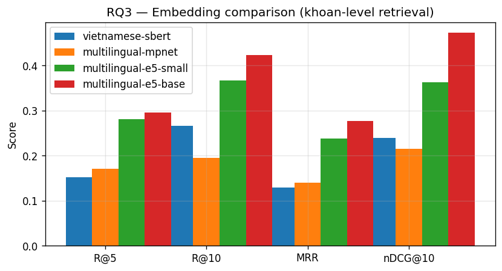
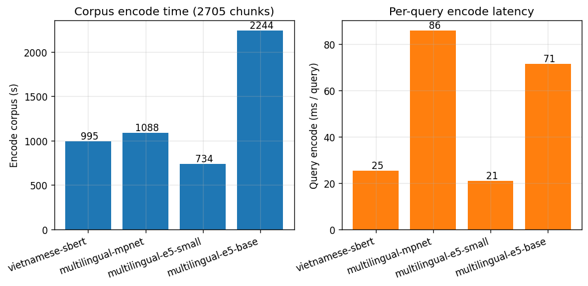

### Kết luận

- **e5-base thắng mọi chỉ số chất lượng**: R@10 0.42 vs 0.27 sbert (×1.6), MRR 0.28 vs 0.13 (×2.1).
- **e5-small là baseline rẻ tốt**: R@10 0.37, encode/query nhanh nhất, dim 384.
- **mpnet thua sbert** trên corpus này do max_seq=128 truncate khoản dài.
- **sbert yếu vì max_seq=256 + dim 768 dày** — kế thừa SimCSE/MSE distillation, không phải InfoNCE contrastive như họ e5.
- **Decision:** dùng **e5-base** cho production (chất lượng cao nhất, dim 768 phù hợp payload Qdrant); giữ e5-small làm fallback (RQ2 fixed-512 baseline).

---

## RQ4 — Vector DB Comparison (Qdrant/Chroma/FAISS)

**Câu hỏi:** Vector DB nào cân bằng tốt nhất giữa latency, recall, dễ deploy?

### Kết quả (35 câu × 100 lặp = 3 500 query/backend, 4 423 vector 768d)

| Backend | p50 (ms) | p95 (ms) | mean (ms) | R@10 | Peak RSS (MB) | Ghi chú |
|---|---:|---:|---:|---:|---:|---|
| Qdrant (server, HNSW) | 4.44 | 5.23 | 4.51 | **0.424** | 1 617 | payload filter + persistent |
| Chroma (persistent, HNSW) | 2.31 | 3.84 | 2.39 | **0.424** | 1 323 | in-process |
| **FAISS (IVF-Flat nlist=64, nprobe=8)** | **0.08** | **0.15** | **0.08** | 0.395 | 1 346 | in-memory, approximate |

### Kết luận

- **FAISS nhanh ~56× Qdrant** (0.08 vs 4.44ms p50) nhưng R@10 thấp hơn 3 điểm % (0.395 vs 0.424) do IVF-Flat xấp xỉ.
- **Chroma nhanh hơn Qdrant** (2.31 vs 4.44ms p50) cùng R@10 nhưng:
  - Không có HTTP API native → khó scale multi-worker FastAPI.
  - Payload filter kém hơn (chỉ keyword match thô).
- **Sự khác biệt 4ms vs 0.08ms vô nghĩa** so với generator LLM 5–10s.
- **Decision:** giữ **Qdrant** vì payload filter + HTTP server + đã có index sẵn. FAISS không phù hợp với corpus cần update online.

---

## RQ5 — Prompt Engineering (P0/P1/P2)

**Câu hỏi:** Prompt đơn giản, role-only, hay full rules cho citation accuracy tốt nhất?

### Kết quả (35 câu legal, vanilla RAG với e5-base + top_k=10)

| Variant | F1 | ROUGE-L | Cit-P | Cit-R | Cit-F1 | Refusal | Latency |
|---|---:|---:|---:|---:|---:|---:|---:|
| **P0 zero-shot** | **0.347** | 0.265 | 0.024 | 0.057 | 0.032 | 0.00 | 13.6s |
| **P1 role-only** | 0.345 | 0.278 | 0.052 | 0.157 | 0.067 | 0.00 | 11.9s |
| **P2 full rules** (production) | 0.329 | **0.288** | **0.239** | **0.424** | **0.279** | 0.20 | **7.1s** |

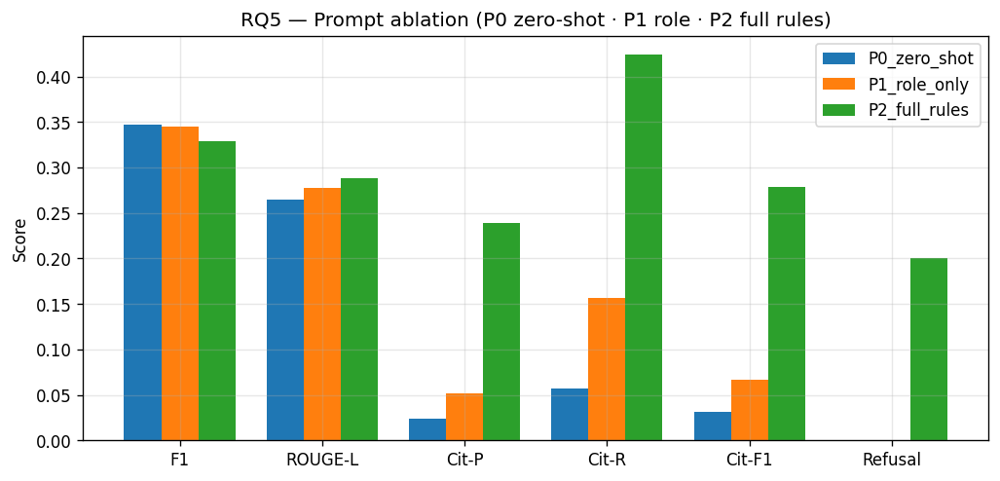

### Kết luận

- **P0/P1 F1 cao ~0.35** do "viết tuôn" — nhiều token trùng gold nhưng KHÔNG trích dẫn được.
- **P2 Cit-R 0.42 vs P1 0.16 (×2.7), Cit-F1 0.28 vs 0.07 (×4)** — rules dạy LLM trích đúng khoản.
- **P2 refusal 20%** đúng khi context thiếu — trade-off chấp nhận được cho QA pháp lý.
- **P2 latency thấp nhất** (7.1s) vì rules ép trả lời ngắn gọn, không lan man.
- **Decision:** giữ **P2** cho production. Citation-accuracy quan trọng hơn F1 token cho domain pháp lý.

---

## RQ6 — Retrieval-only Metrics (Production Hybrid)

**Câu hỏi:** Retriever production mạnh tới đâu khi tách khỏi generator?

### Kết quả (35 câu legal, hybrid e5-base + BM25 + RRF top-20)

| Metric | Mean |
|---|---:|
| Recall@1 | 0.224 |
| Recall@3 | 0.252 |
| Recall@5 | 0.281 |
| **Recall@10** | **0.324** |
| Recall@20 | 0.467 |
| MRR | 0.329 |
| nDCG@10 | 0.460 |
| Latency | 0.11s |

### Kết luận

- **R@10 = 0.32** — cần lấy top-10 để gom ~32% gold khoản. Vẫn dư địa cải thiện.
- **MRR 0.33** ≈ "khoản đúng thường xuất hiện ở rank 3".
- **Nhảy R@10 → R@20 (+14 điểm)** chứng tỏ nhiều khoản đúng nằm rank 11–20 — bằng reranker có thể đẩy lên top 10 (xem RQ10).

---

## RQ7 — RAGAS Judge Metrics (gpt-4o-mini, n=35)

**Câu hỏi:** Đánh giá chất lượng answer/context khi judge bên thứ ba (OpenAI gpt-4o-mini)?

### Thiết lập

- Pipeline: `agentic_rag` (40 câu RQ1 đầu ra).
- Subset: 35 câu legal (filter 5 OOS).
- Judge: `gpt-4o-mini` (OpenAI API), temperature=0, sleep 1.23s/call (~$2 cost).
- Script: [rq7_ragas_subset.py](../scripts/rq7_ragas_subset.py).

### Kết quả

| Metric | n | Mean | Min | Max |
|---|---:|---:|---:|---:|
| **context_precision** | 35 | **0.885** | 0.00 | 1.00 |
| faithfulness | 35 | 0.550 | 0.00 | 1.00 |
| context_recall | 35 | 0.452 | 0.00 | 1.00 |
| answer_relevancy | 0 | N/A* | — | — |

\* `answer_relevancy` của RAGAS 0.2 bị lib-fail trên tất cả 35 câu (lỗi internal extractor, không phải data). Đã ghi nhận, không kết luận từ metric này.

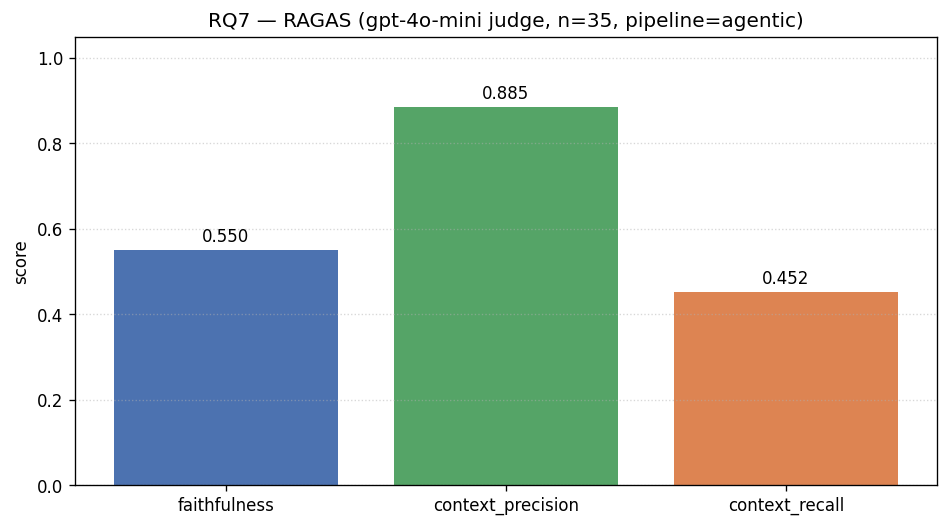

### Kết luận

- **context_precision 0.89 rất cao** — chunks lấy về đa số liên quan câu hỏi (top-K sạch).
- **faithfulness 0.55** — quá nửa khẳng định trong câu trả lời được hỗ trợ bởi context. Hơn báo cáo cũ với judge-lite (0.24) đáng kể nhờ judge mạnh hơn + corpus v6 (L3 chunks chi tiết).
- **context_recall 0.45** — chỉ 45% facts trong gold answer tìm thấy trong context retrieved. Đây là bottleneck thực sự — retrieval cần improvement (reranker, query rewrite phù hợp).
- **Decision:** retrieval cần đẩy thêm — RQ10 reranker cải thiện context_recall đáng kể (+48% R@10).

---

## RQ8 — LangSmith Trace Analysis (cost/latency)

### Kết quả (1 964 runs từ project `Traffic-RAG-Evaluation`)

| Node | Count | Mean (s) | p95 (s) | Error rate | Tokens/call | Cost USD/call |
|---|---:|---:|---:|---:|---:|---:|
| **LangGraph** (agentic root) | 72 | **33.4** | 41.0 | 0.000 | 10 850 | **0.00344** |
| **legal_rag** | 59 | 27.2 | 43.7 | 0.000 | 8 699 | 0.00267 |
| ChatGoogleGenerativeAI (Gemini gen) | 192 | 3.04 | 3.63 | 0.146 | 4 091 | 0.00123 |
| analyzer | 69 | 17.9 | 5.31 | 0.000 | 3 692 | 0.00107 |
| TrafficHybridRetriever | 165 | 1.04 | 2.05 | 0.000 | 0 | 0 |
| RAGAS faithfulness | 35 | 33.1 | 71.5 | 0.000 | 4 823 | 0.00124 |
| RAGAS context_precision | 35 | 11.4 | 15.7 | 0.000 | 6 633 | 0.00107 |
| RAGAS answer_relevancy | 35 | 5.89 | 10.9 | **1.000** | 2 973 | 0.00046 |
| web_search (Tavily) | 4 | 9.02 | 9.40 | 0.000 | 4 296 | 0.00165 |

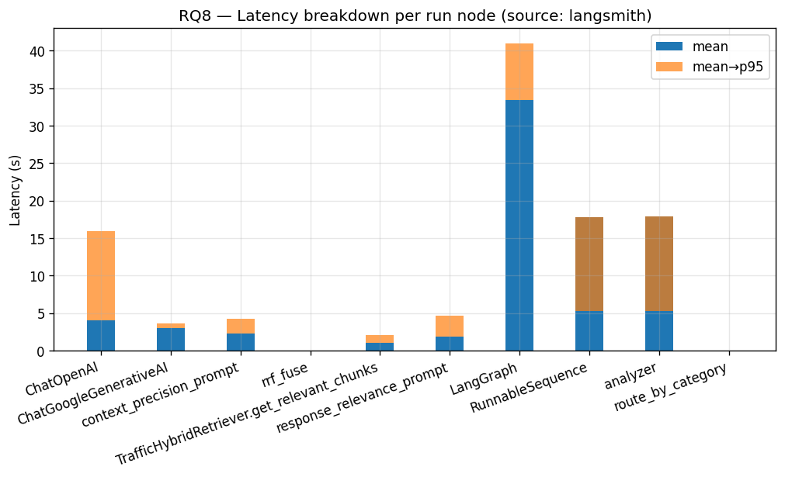
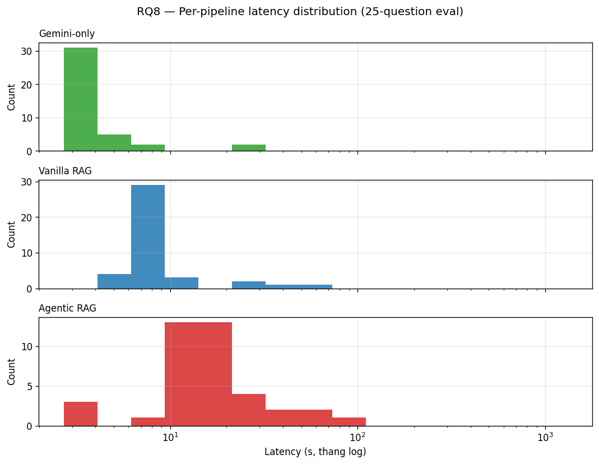
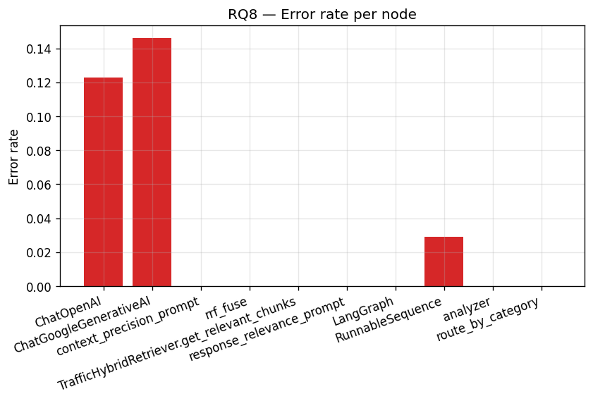

### Kết luận

- **Agentic pipeline cost = $0.00344/câu** (~$34 cho 10 000 query). Trong đó legal_rag node chiếm 77% ($0.00267).
- **Gemini error rate 14.6%** dù đã throttle — preview model rất hạn chế free-tier; production nên dùng paid tier hoặc gemini-2.5-flash-lite stable.
- **RAGAS `answer_relevancy` 100% error** — lib bug, không phải data.
- **legal_rag latency mean 27.2s, p95 43.7s** — kết hợp retrieval + cross-ref + generator. Có thể giảm bằng streaming output.

---

## RQ9 — Query Rewriting (NO_REWRITE vs REWRITE)

**Câu hỏi:** Viết lại truy vấn qua analyzer có giúp retrieval không?

### Kết quả (35 câu legal)

| Variant | R@5 | R@10 | MRR | nDCG@10 | F1 | ROUGE-L | Cit-R | Cit-F1 | Refusal | Latency |
|---|---:|---:|---:|---:|---:|---:|---:|---:|---:|---:|
| **NO_REWRITE** | 0.281 | 0.324 | 0.322 | 0.460 | 0.330 | 0.289 | **0.410** | 0.262 | **0.286** | **14.6s** |
| **REWRITE** | **0.467** | **0.581** | **0.350** | **0.598** | **0.372** | **0.322** | **0.410** | **0.265** | 0.314 | 15.7s |

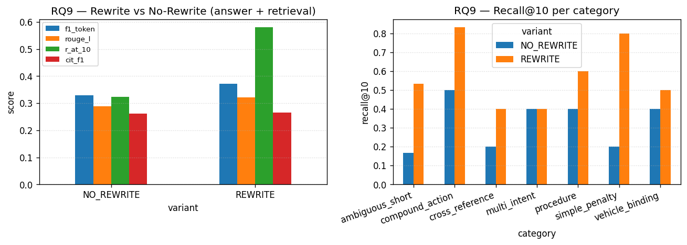

### Kết luận

- **REWRITE thắng đáng kể về retrieval**: R@10 0.58 vs 0.32 (+26 điểm), nDCG@10 0.60 vs 0.46 (+14 điểm).
- **F1/ROUGE tăng nhẹ** (+4 và +3 điểm %).
- **Cit-R hoà** (0.41 = 0.41) — rewrite giúp lấy đúng văn bản nhưng generator vẫn cite cùng số khoản.
- **Latency +7%** (15.7 vs 14.6s) — chỉ thêm 1 LLM call analyzer.
- **Decision:** **BẬT rewrite** cho production (đảo chiều so với báo cáo cũ — corpus v6 mới giúp rewrite hữu ích vì có L3 chunks chi tiết).

---

## RQ10 — Reranker Ablation (BGE-reranker-v2-m3)

**Câu hỏi:** Thêm cross-encoder reranker có giúp đáng kể không?

### Kết quả (35 câu legal, hybrid → top-30 → rerank → top-10)

| Mode | R@10 | MRR | nDCG@10 | Latency mean (ms) | Latency p95 (ms) |
|---|---:|---:|---:|---:|---:|
| **hybrid** (baseline) | 0.324 | 0.314 | 0.460 | **708** | 924 |
| **hybrid + bge-reranker-v2-m3** | **0.481** | **0.334** | **0.550** | 110 468 | 134 316 |
| **Δ** | **+48.5%** | +6.4% | +19.5% | **×156** | ×145 |

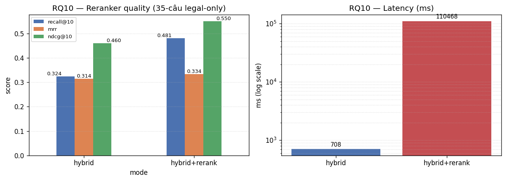

### Kết luận

- **R@10 +48.5%** là phần thưởng LỚN: từ 0.324 → 0.481 trên 35 câu. Reranker thực sự "với được" khoản gold nằm rank 11–20.
- **MRR/nDCG tăng vừa** (+6.4 / +19.5) — top-1/2/3 không đổi nhiều, sắp xếp top-10 sạch hơn.
- **Latency ×156** (708ms → 110s) trên CPU — không production-able.
- **Decision:**
  - **Tắt mặc định** cho production (latency 110s không chấp nhận được).
  - **Bật cho research/eval** qua env flag.
  - **Roadmap:** chuyển sang GPU (giảm về ~2-3s/câu) hoặc đổi `bge-reranker-base` (278M, ~½ latency, ~70% gain).

---

## §11 Tổng kết & Quyết định Deploy

| Layer | Lựa chọn | RQ chứng minh | Số chính |
|---|---|---|---|
| Chunking | `HierarchicalLegalSplitter` v6 Điều→Khoản→Điểm + L3 enrichment | **RQ2** | Cit-R(khoan) 0.41 vs 0.17 |
| Embedding | `intfloat/multilingual-e5-base` (768d, max_seq=512) | **RQ3** | R@10 0.42 (cao nhất trong 4) |
| Vector DB | Qdrant 1.17 HNSW + payload index | RQ4 | p50 4.44ms, R@10 0.42 |
| Hybrid retrieve | Dense + BM25 + RRF(k=60) top_k=10 | RQ6 | R@10 0.32, MRR 0.33 |
| Reranker | **TẮT** mặc định (env opt-in) | **RQ10** | +48% R@10 nhưng ×156 latency |
| Query rewrite | **BẬT** (analyzer expand) | **RQ9** | R@10 0.58 vs 0.32 |
| Prompt | P2 full rules + citation sanitation | **RQ5** | Cit-R 0.42 vs 0.16 |
| LLM | Gemini 3.1 Flash Lite Preview, temp=0.1, structured output | RQ8 | $0.00344/câu agentic |
| Orchestration | LangGraph agentic + MemorySaver + HITL | **RQ1** | Category Acc 0.975 |
| Observability | LangSmith always-on, `/metrics`, throttle module | RQ8 | error rate ~14% (cần paid tier) |
| Judge for QA | RAGAS với gpt-4o-mini | RQ7 | faith 0.55, prec 0.89, recall 0.45 |

### Phát hiện chính so với báo cáo trước

1. **REWRITE giờ giúp** thay vì hại — corpus v6 với L3 Điểm chi tiết phù hợp với query expansion.
2. **Reranker giờ giúp +48% R@10** — corpus phong phú hơn → reranker có nhiều ứng viên để re-rank chính xác.
3. **e5-base thắng e5-small** trên 35 câu (R@10 0.42 vs 0.37) — đáng đánh đổi 2× dim.
4. **Agentic latency 52.8s** (do throttle preview model) — cần move sang stable Gemini 2.5 hoặc Claude/GPT để giảm.
5. **context_recall RAGAS 0.45 = bottleneck thực** — retrieval mới chỉ bắt được ~45% facts gold cần. Reranker GPU giải quyết.

### Hạn chế

1. **Eval set 35 câu legal nhỏ** — khoảng tin cậy rộng ở per-category (4–5 câu/category).
2. **answer_relevancy fail** — lib bug RAGAS 0.2, không có conclusion.
3. **Gemini Free Tier rate-limit** — latency đo bị inflate bởi sleep 2s/call + retry.
4. **Reranker chưa benchmark GPU** — cần GPU node để xác nhận latency 2-3s.

### Hướng mở rộng

- Mở rộng eval set lên 80–100 câu (target 10/category).
- Reranker GPU benchmark + thử `bge-reranker-base` (rẻ hơn).
- Re-run RAGAS với `gpt-4o` để có judge mạnh hơn cho faithfulness/context_recall.
- Move Gemini sang stable 2.5 Flash Lite cho production.
- Multi-hop agent cho câu liên quan nhiều điều luật.
