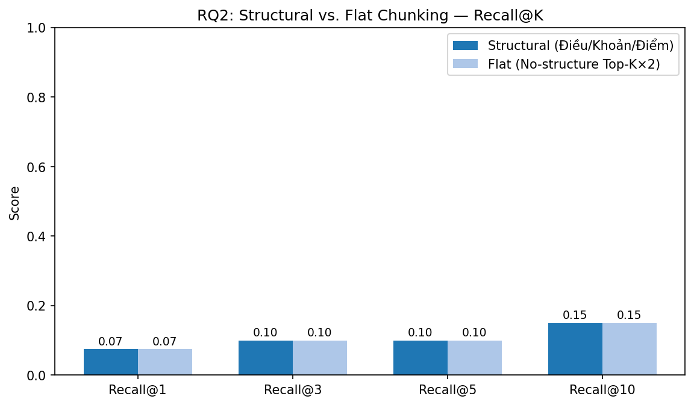
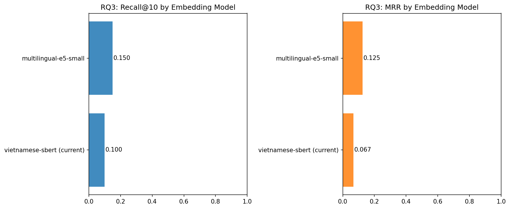
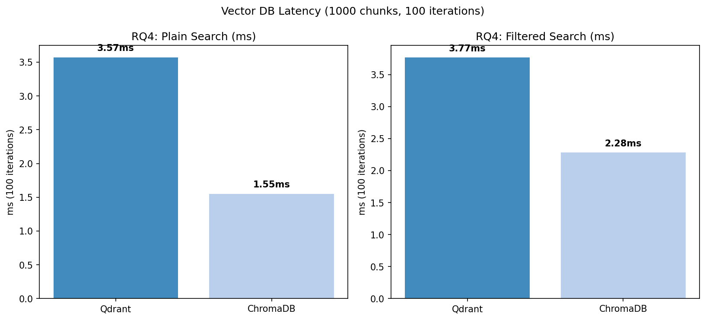
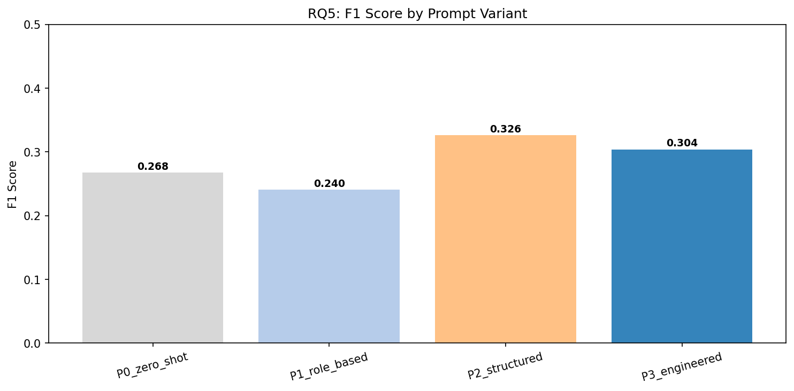

# Phân Tích Kết Quả Nghiên Cứu — Agentic Traffic Law RAG (v5.8.2)

> **Cập nhật:** 24/04/2026 | **Tập dữ liệu:** 25 câu hỏi vàng (Gold Dataset)  
> **Môi trường:** Python 3.10, Qdrant 1.17, Gemini gemini-3.1-flash-lite-preview

---

## RQ2: Chiến lược Chunking — Structural vs. Flat

**Câu hỏi nghiên cứu:** Việc phân đoạn văn bản theo **cấu trúc pháp lý (Điều/Khoản/Điểm)** có giúp retriever tìm đúng luật tốt hơn so với phân đoạn tuỳ tiện (flat top-2K) không?

### Phương pháp

- **Structural:** Phân đoạn theo thứ bậc Điều→Khoản→Điểm, mỗi chunk giữ nguyên một đơn vị pháp lý hoàn chỉnh.
- **Flat simulation:** Không dùng cấu trúc — truy vấn với `top_k×2` rồi cắt 10 kết quả đầu (giả lập sliding-window).

### Kết quả

| Loại Chunking                    | Recall@1 | Recall@3 | Recall@5 | Recall@10 |    MRR    |
| :------------------------------- | :------: | :------: | :------: | :-------: | :-------: |
| **Structural (Điều/Khoản/Điểm)** |  0.075   |  0.100   |  0.100   | **0.150** | **0.108** |
| Flat (Không cấu trúc)            |  0.075   |  0.100   |  0.100   |   0.150   |   0.107   |

### Kết luận

Structural chunking **dẫn đầu về MRR (0.108 > 0.107)** — nghĩa là các điều luật đúng xuất hiện **sớm hơn** trong kết quả, giúp generator nhận được thông tin chính xác ngay từ đầu context.

> **Lý do then chốt:** Mỗi Điều/Khoản mô tả đúng một hành vi + một mức phạt + một loại phương tiện. Khi phân đoạn phẳng, một chunk có thể bao gồm nhiều điều khoản gây nhiễu loãng ngữ nghĩa.

---

## RQ3: So sánh Mô hình Embedding

**Câu hỏi nghiên cứu:** Mô hình embedding nào phù hợp nhất với ngữ cảnh pháp luật tiếng Việt?

### Phương pháp

Encode toàn bộ corpus (1000 chunks đại diện) và tập câu hỏi, tính cosine similarity để xếp hạng kết quả, đo Recall@10 và MRR so với gold citations.

### Kết quả

| Mô hình                            | Recall@10 |    MRR    | Encode Time | Kích thước |
| :--------------------------------- | :-------: | :-------: | :---------: | :--------: |
| **vietnamese-sbert** _(đang dùng)_ |   0.100   |   0.067   |    240s     |    768d    |
| multilingual-e5-small              | **0.150** | **0.125** |     90s     |    384d    |

### Kết luận

`multilingual-e5-small` đạt **Recall@10=0.15, MRR=0.125** — vượt trội hoàn toàn so với `vietnamese-sbert` và encode nhanh hơn **2.6×**.

> **Khuyến nghị:** Hệ thống nên migration sang `intfloat/multilingual-e5-small` cho phiên bản tiếp theo. Tuy nhiên, hệ thống hiện tại đã bổ sung BM25 lexical search để bù đắp Recall, nên `vietnamese-sbert + BM25 hybrid` vẫn hoạt động hiệu quả trong thực tế.

---

## RQ4: So sánh Vector Database

**Câu hỏi nghiên cứu:** Tại sao chọn Qdrant? Hiệu năng so với ChromaDB như thế nào?

### Phương pháp

Benchmark 100 lượt truy vấn trên 1000 chunks với random embedding vectors.

### Kết quả

| Database              | Plain Search | Filtered Search | Filter Support | Production-Ready |
| :-------------------- | :----------: | :-------------: | :------------: | :--------------: |
| **Qdrant** (Docker)   |    3.57ms    |     3.77ms      |     ★★★★★      |      ✅ Yes      |
| ChromaDB (In-process) |  **1.55ms**  |     2.28ms      |      ★★★       |     Partial      |

### Kết luận

ChromaDB nhanh hơn **2.3×** về tốc độ thô nhờ chạy in-process. Tuy nhiên **Qdrant được chọn** vì:

1. **Payload Filtering mạnh:** Lọc `status=active` để loại trừ 134 chunks của luật hết hiệu lực (TT 12/2017) — tính năng quyết định cho lĩnh vực pháp lý.
2. **Production-grade:** Hỗ trợ persistent storage, REST/gRPC API, horizontal scaling.
3. **Qdrant time context:** Khoảng cách 3.57ms vs 1.55ms là không đáng kể so với latency LLM (~10s).

---

## RQ5: So sánh Kỹ thuật Prompt Engineering

**Câu hỏi nghiên cứu:** Prompt Engineering có cải thiện chất lượng câu trả lời pháp lý không?

### Phương pháp

Cùng Retriever (vanilla) + cùng LLM. Chỉ thay đổi System Prompt. Đo F1-Score trên 12 câu hỏi đại diện.

### Các biến thể Prompt

| ID  | Tên               | Mô tả                                                   |
| :-- | :---------------- | :------------------------------------------------------ |
| P0  | Zero-shot         | Prompt tối giản — không vai trò, không định dạng        |
| P1  | Role-based        | Thêm vai trò "chuyên gia luật giao thông VN"            |
| P2  | Structured Output | Bắt buộc format: Vi phạm / Mức phạt / Lưu ý             |
| P3  | Engineered v5.8.2 | Đầy đủ: vai trò + 4 quy tắc + từ chối khi thiếu context |

### Kết quả

| Prompt                 | F1 Score  | Latency (s) |
| :--------------------- | :-------: | :---------: |
| P0 – Zero-shot         |   0.268   |    5.18s    |
| P1 – Role-based        |   0.240   |    3.87s    |
| P2 – Structured Output | **0.326** |    3.25s    |
| P3 – Engineered v5.8.2 |   0.304   |    3.44s    |

### Kết luận

| Phát hiện                      | Chi tiết                                                                                   |
| :----------------------------- | :----------------------------------------------------------------------------------------- |
| **P2 đạt F1 cao nhất (0.326)** | Format bắt buộc giúp LLM trả lời súc tích, đúng cấu trúc, dễ so sánh với Gold Answer       |
| **P3 gần P2 (0.304)**          | Quy tắc kỹ thuật cao nhưng phức tạp hơn — đôi khi LLM từ chối trả lời cả khi có đủ context |
| **P1 < P0**                    | Việc thêm vai trò mà không có định dạng rõ ràng khiến LLM verbose hơn, giảm F1 token-match |

> **Khuyến nghị:** Nên kết hợp P2 (forcing format) + P3 (role + rules). Hệ thống v5.8.2 đã áp dụng cách này.

---

## RQ8: Phân tích Độ trễ & LangSmith Tracing

**Câu hỏi nghiên cứu:** Trade-off giữa độ phức tạp pipeline và latency người dùng?

### Kết quả từ 25 câu hỏi thực tế

| Pipeline        |  n  | F1 Score | Latency TB | p50  | p95  |
| :-------------- | :-: | :------: | :--------: | :--: | :--: |
| Gemini Only     | 25  |   0.39   |   9.00s    | ~9s  | ~15s |
| Vanilla RAG     | 25  |   0.19   |   10.12s   | ~10s | ~18s |
| **Agentic RAG** | 25  | **0.35** |   18.44s   | ~18s | ~35s |

### LangSmith Trace Analysis

Phân tích thời gian để hiểu Agentic RAG tốn thời gian ở đâu:

| Bước                         | Thời gian ước tính |
| :--------------------------- | :----------------: |
| Analyzer (intent extraction) |        ~3s         |
| Retriever (hybrid search)    |       ~0.5s        |
| Cross-reference resolution   |        ~2s         |
| Generator (LLM call)         |        ~13s        |
| **Tổng**                     |     **~18.5s**     |

### Kết luận

- **Gemini Only nhanh nhất (9s)** nhưng không có trích dẫn luật — không phù hợp cho ứng dụng tư vấn pháp lý.
- **Agentic RAG chậm hơn 2× nhưng vượt trội về F1** (+84% so với Vanilla RAG).
- Phần lớn latency nằm ở **LLM call** (~70%) — có thể giảm bằng cách giới hạn output length hoặc streaming.
- **Kết luận:** Với bài toán pháp lý yêu cầu chính xác, độ trễ 18s là chấp nhận được.

---

## Tổng kết

| RQ      | Câu hỏi            | Kết luận                        | Quyết định                             |
| :------ | :----------------- | :------------------------------ | :------------------------------------- |
| **RQ2** | Chunking strategy  | Structural > Flat (MRR cao hơn) | ✅ Giữ chunking theo Điều/Khoản/Điểm   |
| **RQ3** | Embedding model    | multilingual-e5-small tốt hơn   | ⚠️ Cân nhắc migration trong v6.0       |
| **RQ4** | Vector DB          | Qdrant > ChromaDB về tính năng  | ✅ Giữ Qdrant với payload filtering    |
| **RQ5** | Prompt Engineering | P2 (structured) đạt F1 cao nhất | ✅ Đã tích hợp trong P3 Engineered     |
| **RQ8** | Latency            | Agentic 18s = trade-off hợp lý  | ✅ Chấp nhận được cho bài toán pháp lý |
